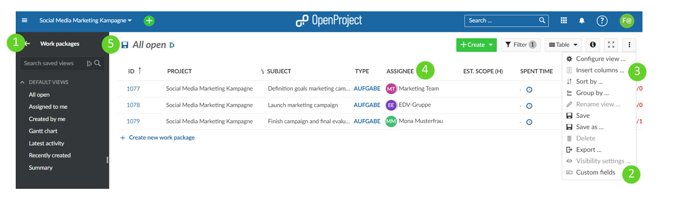
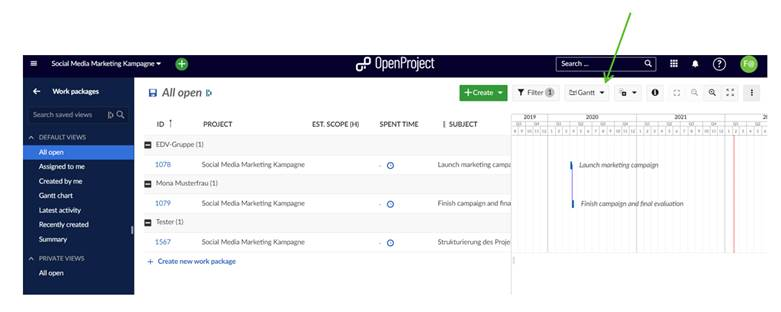
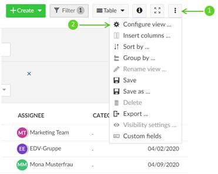
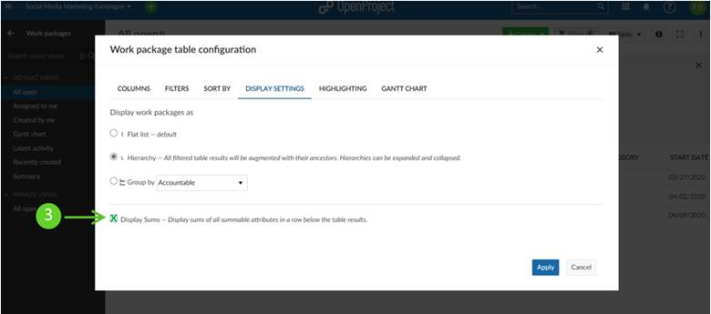

---
sidebar_navigation:
  title: Resource Management
  priority: 990
description: Step-by-step instruction about resource management
robots: index, follow
keywords: use-case, resource management
---

# Use Case: Resource Management

**Note:** This is a workaround. OpenProject does not have the automated functionality to provide detailed resource management or employee work capacity calculations.

Step 1: Select a project and go to the work package overview. 

Step 2: Either use existing fields, **Estimated time** and **Spent time**, or create custom fields (i.e. **Est. Scope (h)** and **Time spent (h)**)

Step 3: Either insert the standard fields to the view, or insert the custom fields if created in Step 2

Step 4: Then sort and filter all work packages and group by assignee. 

Step 5: Save your view

You could also add the Gantt view to add an additional dimension to your overview

This will provide a rough overview of the various tasks assigned to a specific person or team. Using the Gantt view in addition provides additional overview of how these tasks happen in terms of timelines. It’s a visual way of looking at roughly how many tasks are assigned to an individual and gives you an estimate about the timeline, allowing for adjustments in assignments and timing to be made to balance your resources a little bit. Using filters and the (+) zoom function will help to focus the Gantt view to only tasks that are scheduled in let’s say the next 30 days. These functions can help focus in on showing relevant results only. 

You can also use the sum function inside of **[⋮]** -> ***Configure view*** -> ***Display settings*** -> check ***Display Sums*** box:

 

**Limitations:** This workaround can provide an overview of who works on what and when, but it is unfortunately not a solid capacity management tool. It just provides a quick visual estimate.
