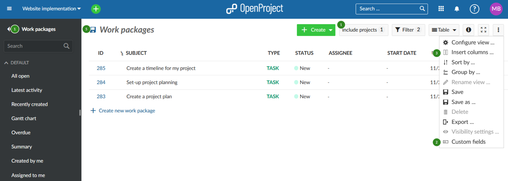
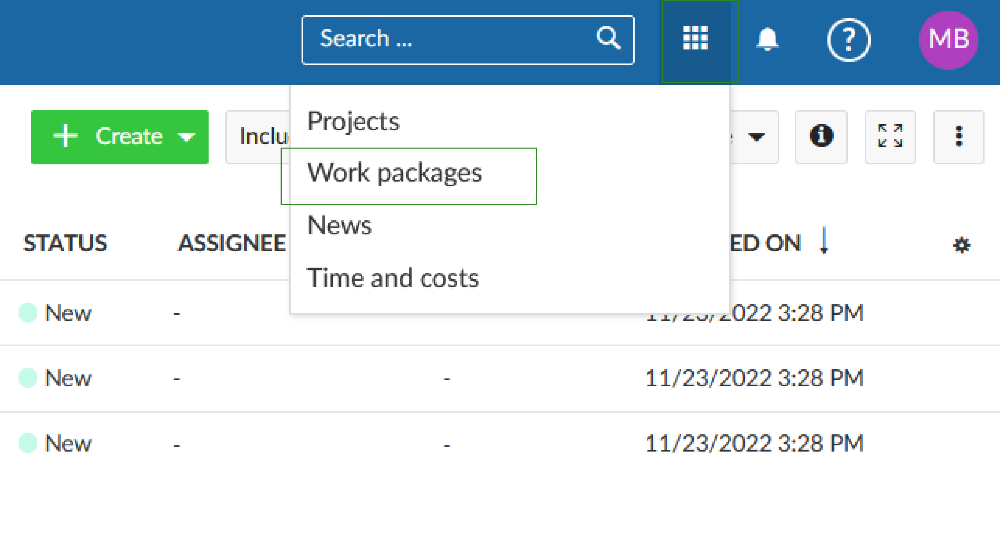
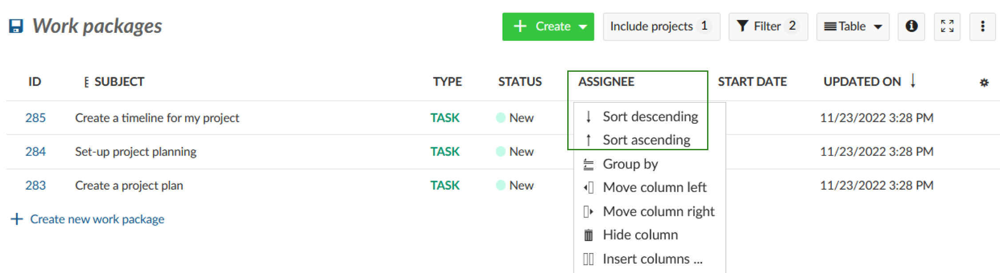
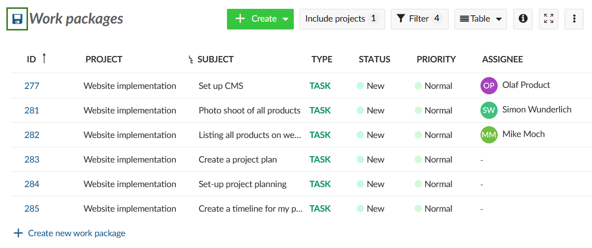
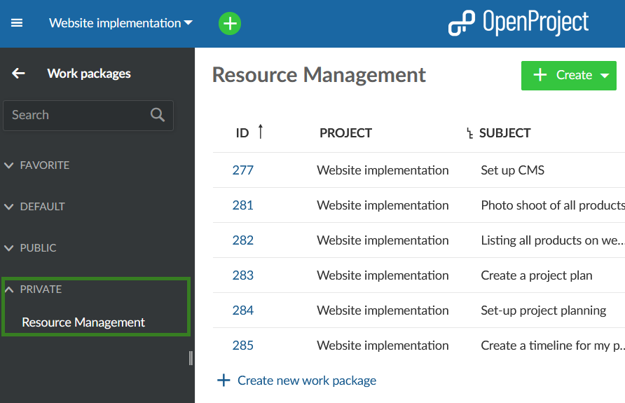
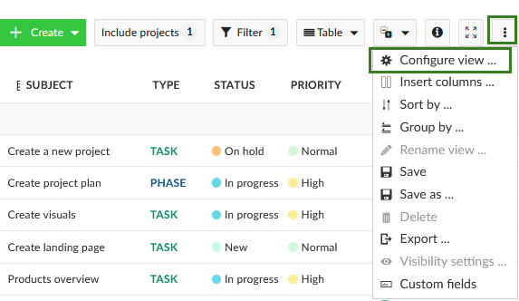
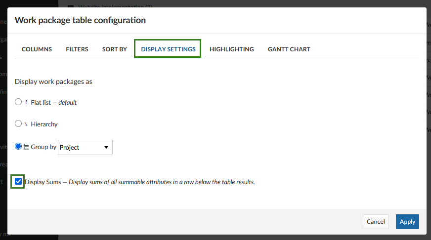
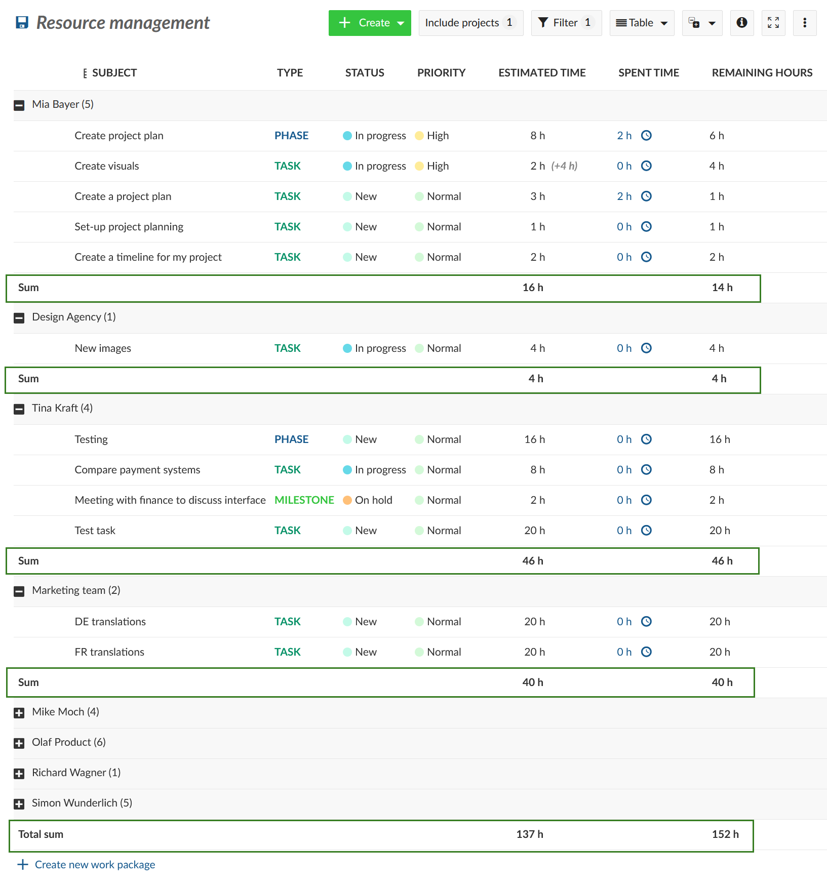
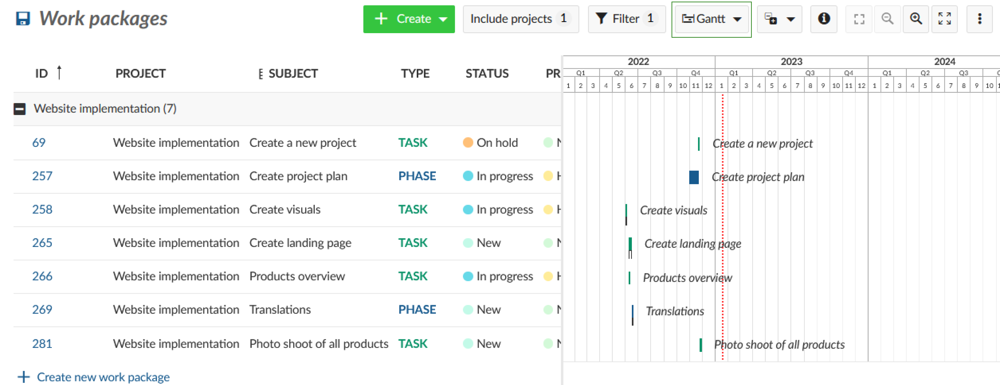

---
sidebar_navigation:
  title: Resource Management
  priority: 990
description: Step-by-step instruction about resource management
keywords: use-case, resource management
---

# Use Case: Resource management

**Note:**  OpenProject does not have the automated functionality to provide detailed resource management or employee work capacity calculations. However, there is a workaround that you can use to configure a visual estimate of task distribution and plan accordingly.

## Work packages view

These are the steps you can follow to adjust a work package overview to suit your goals.

Step 1: Select a project and go to the work package overview by clicking **Work packages** in the project menu on the left. If you would like to create an overview over multiple projects, select the respective projects and/or subprojects in the **Include projects** menu between the **+ Create** and the **Filter** buttons.

Alternatively, you can also chose the **Global work package overview** by selecting the **Waffle icon** in the top right corner:

Step 2: You can add existing fields, such as **Work** (earlier called **Estimated time**), **Spent time** and **Remaining work** (earlier called **Remaining hours**) to your work packages list. Also, you can [create additional custom fields](../../system-admin-guide/custom-fields/), e.g. **Scope (h)**, to get an overview of the team capacity.

Step 3: You can add these fields via the **Insert columns** option on the drop-down menu.

Step 4: You can add any filters necessary and sort or group the work packages by assignee.

Step 5: Save your adjusted view by clicking on the **Save** icon on the left (you can name this view before saving or re-name it later). 

This view will be saved and shown under your private work package filters (you can make it public and share with other team members).

## Adding sums to the work packages view

You can also use the sum function. Select **\[⋮\]** -> ***Configure view*** -> ***Display settings*** -> and check the ***Display Sums*** box:

You will see the **Work** (previously called estimated time), **Spent time** and **Remaining work** (called remaining hours) summed up by user, as well as the overall sum.

## Gantt chart view

You could also add the Gantt view to add an additional dimension to your overview.

This will provide a rough overview of the various tasks assigned to a specific person or team. Adding the Gantt view provides a supplementary overview of when these tasks are scheduled. It is a visual way of looking at approximately how many tasks are assigned to an individual. This view gives you an estimate about the timeline, allowing for adjustments in assignments and timing to be made to balance your resources.

To get a more in-depth overview about who does which tasks and when, you can also switch to the [team planner view](../../user-guide/team-planner/).
