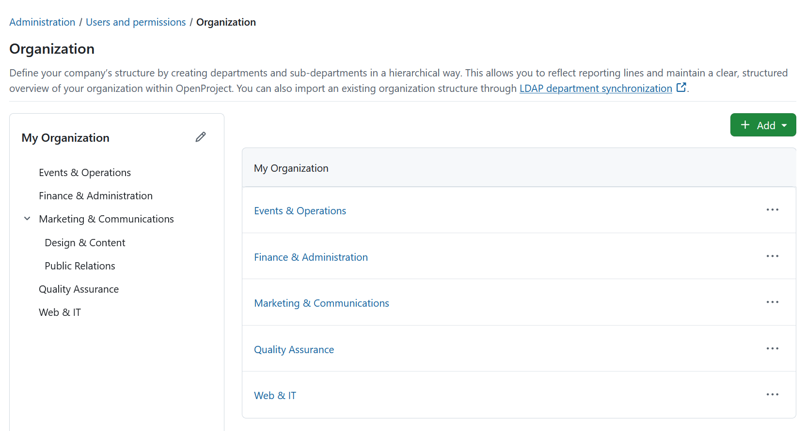
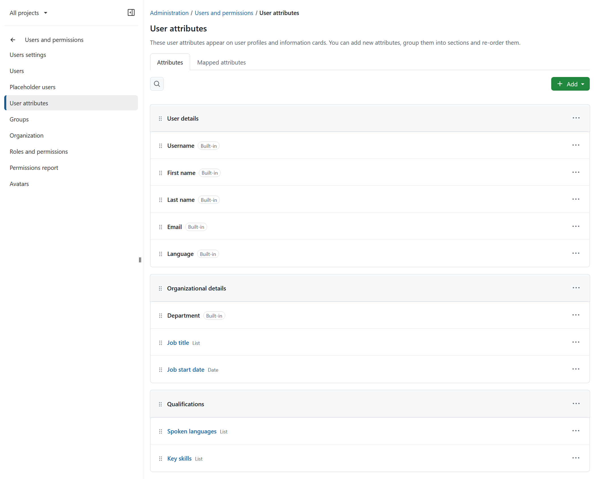
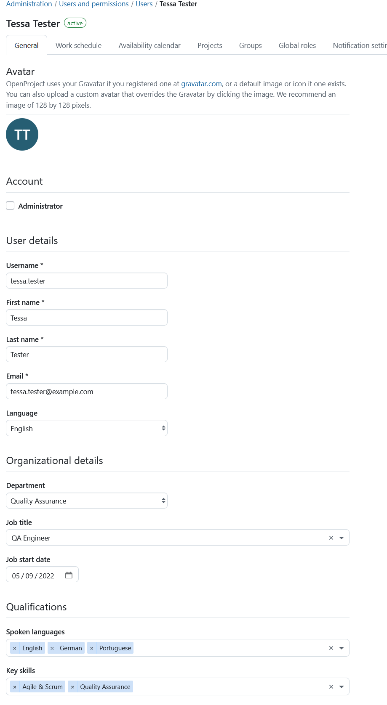
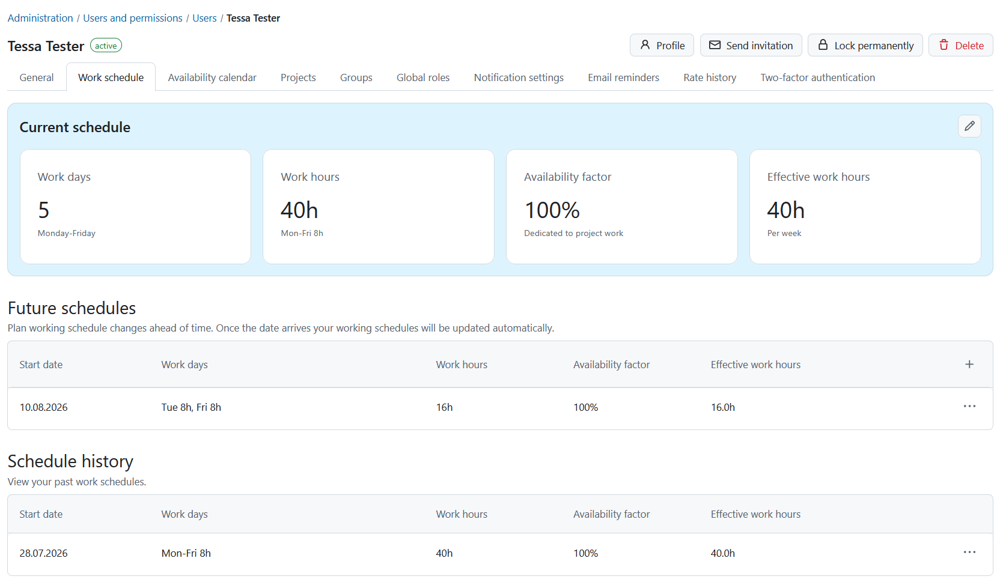
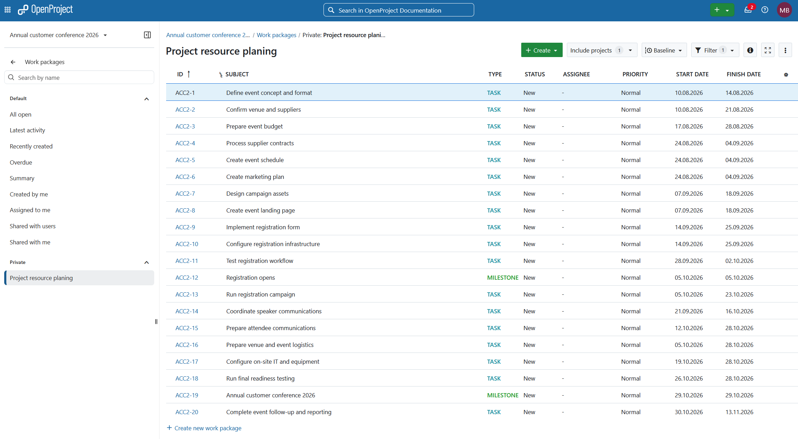
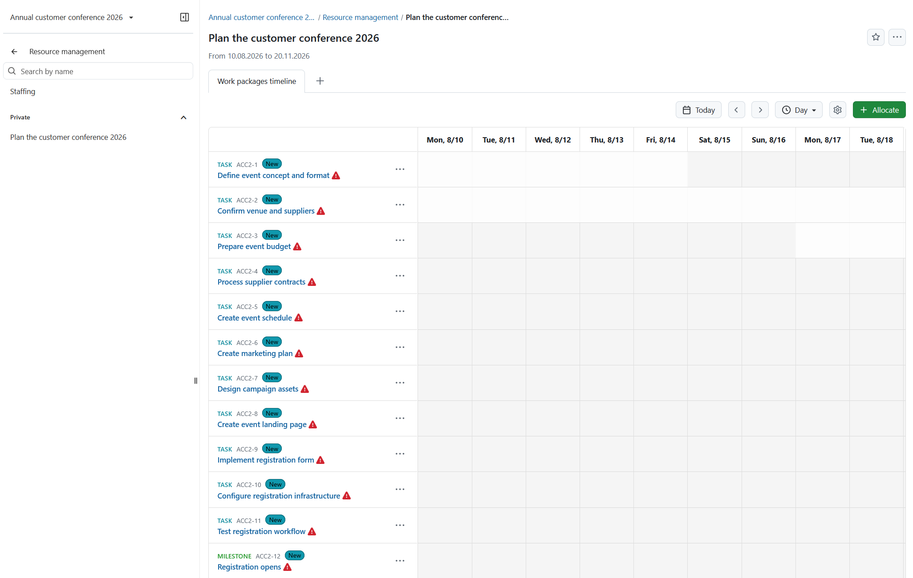
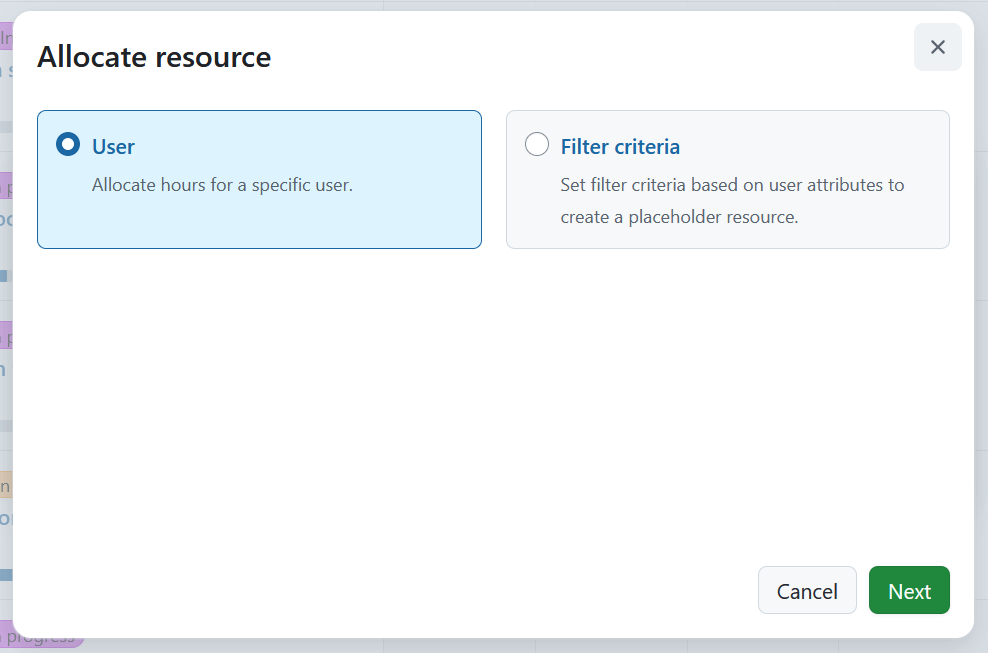

---
sidebar_navigation:
  title: Resource management
  priority: 989
description: Resource management in OpenProject
keywords: resource management, resources, staff, capacity, capacity planning, key skills, user management 
---

# Resource management with OpenProject

## Introduction

Projects succeed when the right people are available at the right time. Resource management helps organizations understand available capacity, match work with the right skills, and balance workloads across teams and projects.

OpenProject brings resource planning together with project planning and execution in a single platform. Instead of maintaining separate spreadsheets or planning tools, project managers and resource managers can plan capacity, assign work, track progress, and adjust plans as priorities evolve.

If your organization manages many projects simultaneously, **[Portfolio management](../portfolio-management)** provides a strategic overview of projects and initiatives. This use case focuses on the operational side: planning and allocating the people who deliver that work.

## Before you start

Successful resource planning depends on accurate organizational information.

Before creating resource plans, configure:

- Departments and organizational structure
- User attributes such as skills, certifications, languages, locations, or areas of expertise
- Working schedules and availability
- Appropriate roles and permissions for project managers, resource managers, and team leads

Keeping this information up to date ensures capacity planning reflects reality rather than assumptions.

> [!TIP]
> Before introducing Resource management, decide who is responsible for maintaining organizational data, creating resource plans, and staffing projects. Clear ownership helps keep your planning accurate and up to date.

## 1. Build the foundation

Resource management starts with understanding who is available, what they can contribute, and how much capacity they have.

### Organize your people

#### Specify roles and permissions

Before you start planning resources, make sure that appropriate **[roles and permissions](../../system-admin-guide/users-permissions/)** are set up in OpenProject.

Consider who should plan and manage resource allocations, who is responsible for staffing projects, and who needs visibility into capacity across teams and projects. Depending on your organization, these responsibilities might belong to project managers, team leads, resource managers, or other existing roles.

Ensure that each role has the permissions needed for its responsibilities and access to the relevant projects and resource planning features.

> [!TIP]
> Keep responsibilities clear. Decide who can create and adjust resource allocations and who only needs to view capacity and availability.

#### Specify organizational structure

Create departments that reflect your organization, such as Engineering, Marketing, Customer Success, or Professional Services.

Navigate to **[System administration → Users and permissions → Organization](../../system-admin-guide/users-permissions/organization/)** to create departments and define your organizational structure.

Departments can also be added directly to projects and assigned global roles, making it easier to manage access for groups of users.

#### Define user attributes and key user skills

Navigate to **[System administration → Users and permissions → User attributes](../../system-admin-guide/users-permissions/user-attributes/)** to create and group attributes that describe your users and help identify suitable people when staffing projects.

For example, you can define attributes for:

- Specific skills
- Certifications
- Languages
- Job titles
- Areas of expertise

Add the relevant attributes to individual users and keep this information up to date. Resource managers can then use these attributes as criteria when looking for people who match the requirements of upcoming work.

### Configure working schedules and availability

Define each user's working schedule so that resource planning reflects their actual capacity.

Depending on the user's situation, this can include:

- Weekly working hours
- Availability factor
- Planned time off
- Future changes to the working schedule

Planning against effective availability helps create realistic resource plans and identify potential capacity problems before work is assigned.

> [!TIP]
> A person's working hours are not necessarily fully available for project work. Use the availability factor to account for recurring meetings, support duties, administrative work, or other commitments.

## 2. Set up  your project

Before allocating resources, define the work that needs to be done.

Use OpenProject's **[Work packages](../../user-guide/work-packages/)** to break the project down into tasks and plan the desired timeline. At this stage, you can define the work and target dates without necessarily knowing who will perform each task.

For example, imagine you are organizing the **Annual Customer Conference 2026**. Create a project for the conference and add the required activities as work packages, such as defining the event concept, preparing the venue, creating the event website, running the registration campaign, and testing the registration workflow.

Set the planned start and finish dates for these work packages so that the resource requirements can later be evaluated against people's availability.

Finally, make sure the **Resource management** module is activated under the project settings.

 

## 3. Plan your team's capacity

Once the work and timeline are defined, open the **Resource management** module.

Click **+ Resource planner** to create a planner. Resource planners let you bring together upcoming work, resource requirements, and people's availability so that you can find suitable resources and identify capacity constraints.

For this example, create a **Work packages timeline** planner. Set the time range to cover the relevant project period and filter the planner to show open work packages.

The initial planner displays the work packages and their planned dates, but no resource allocations are shown yet. Warning indicators next to the work packages make it easy to identify work for which resources still need to be planned.

### Create a resource allocation

Create an allocation for upcoming work by clicking **+ Allocate** or by selecting the timeline next to a specific work package.

You can allocate:

- A specific user
- A resource based on filter criteria such as role, job title, skills, qualifications, or other user attributes

Using filter criteria is useful when you know **what capabilities you need**, but have not yet decided who should perform the work.

### Define the resource requirements

For example, the work package **Define event concept and format** requires 12 hours of work between August 10 and August 14.

If you cannot immediately assign a specific person, define the requirements for the resource:

- **Skill:** Event planning
- **Language:** English
- **Language:** French
- **Required capacity:** 12 hours
- **Period:** August 10–14

OpenProject can use these criteria together with user availability to help identify suitable people for the work.

![Resource request for Define event concept and format requiring event planning skills, English and French language skills, and 12 hours of capacity]resource-management-planner-allocation-form-options-filters.png)

### Review open resource requests

After saving the allocation, the requirement appears in the Resource planner as an open resource request.

This allows you to plan the required capacity before deciding on a specific assignee. The request remains connected to the work package and its planned time period, making outstanding staffing needs visible alongside already allocated work.

As you add allocations and staff resource requests, the Resource planner compares planned work with each person's effective availability. This helps you identify:

- People who are overallocated
- Remaining capacity
- Resource conflicts
- Work that still needs to be staffed
- Opportunities to redistribute work

## 4. Staff your projects

Project planning often begins before every team member has been identified.

Instead of assigning work immediately, create resource requests describing the required qualifications or role. Resource managers can then review these requests and match them with suitable people based on their availability and user attributes.

This separates project planning from staffing decisions while providing visibility into future resource needs.

As priorities change, allocations can be adjusted, reassigned, or redistributed to maintain balanced workloads across projects.

## 5. Turn plans into scheduled work

Once resources have been allocated, translate the plan into executable work.

Use the **Resource planners** to schedule work packages, coordinate assignments, and balance workloads over time. This gives team leads and project managers a clear view of who is working on what and when.

Work packages remain the central place for managing project execution, including:

- Assigning responsibilities
- Planning dates
- Managing dependencies
- Tracking estimates and remaining work

Because planning and execution happen in the same platform, changes to schedules or priorities can easily be reflected in resource planning.

## 6. Monitor progress and actual effort

Resource planning is an ongoing process rather than a one-time activity.

As work progresses, team members update their work packages, report progress, and record spent time where applicable.

Project managers can monitor delivery using OpenProject's progress tracking capabilities and compare planned work with actual effort. Time tracking and reporting provide additional insights into resource utilization, helping teams identify trends and improve future planning.

## 7. Continuously optimize your plans

Projects, priorities, and team availability change over time.

Review your Resource planners regularly to:

- Rebalance workloads
- Resolve overallocation
- Reflect changes in availability
- Staff newly approved work
- Adapt to changing project priorities

Because resource planning, project execution, and reporting are connected, adjustments can be made throughout the project lifecycle without maintaining separate planning tools.

## Outcome

By combining organizational data, capacity planning, project execution, and reporting in one platform, OpenProject helps organizations make informed staffing decisions and deliver projects with greater confidence.

Project managers gain realistic insight into available capacity before committing work. Resource managers can coordinate staffing across teams, while team members benefit from balanced workloads and transparent planning.

## Related features

Resource management works together with several other OpenProject capabilities:

- **Portfolio management** for strategic oversight across projects and initiatives.
- **Team planner** for scheduling and coordinating day-to-day work.
- **Work packages** for managing project execution.
- **Time tracking and costs** for analyzing actual effort and utilization.
- **Progress tracking** for monitoring project delivery.

Together, these capabilities support the complete lifecycle from planning capacity to delivering successful projects.

## Summary

Resource management helps organizations match available capacity with project demand. By organizing users, defining availability, planning allocations, staffing projects, scheduling work, and reviewing actual effort, teams can make more informed planning decisions and adapt as priorities evolve.

OpenProject connects these activities in a single platform, reducing manual coordination and providing a shared, up-to-date view of people, projects, and capacity. While **Portfolio management** supports strategic decision-making across projects, **Resource management** focuses on ensuring the right people are available to deliver the work successfully.