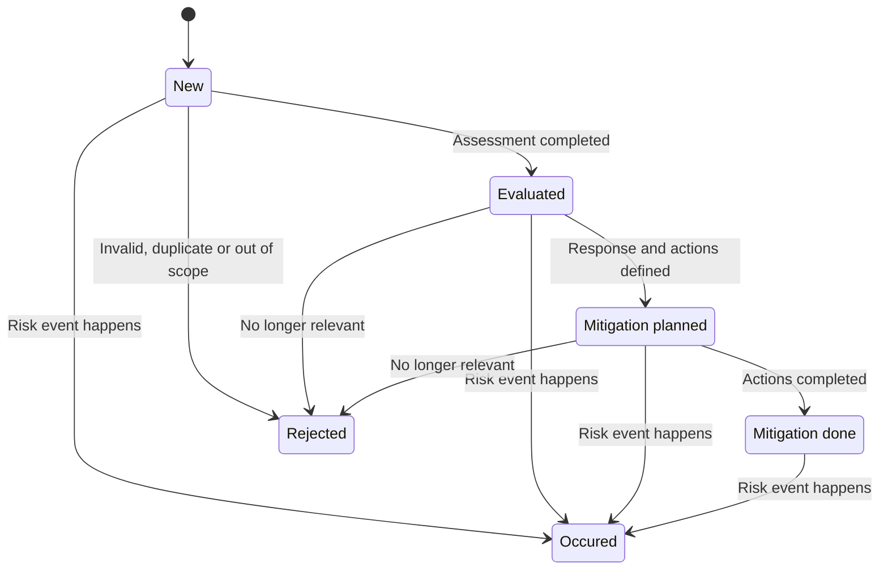

---
sidebar_navigation:
  title: Risk management
  priority: 975
description: Learn how to configure and use OpenProject for transparent, repeatable project risk management based on work packages and PM² guidance.
keywords: risk management, risk register, PM², PM2

---

# Risk management with OpenProject

## Purpose

Risk management helps a project team identify uncertain events early, assess their possible effect on project objectives, agree on responses and review whether those responses work. A shared risk register makes ownership and decisions transparent and helps the team act before a risk becomes an issue.

OpenProject can support this process with existing features such as work package types, custom fields, workflows, saved work package views, relations and project templates. In this setup, each risk is a work package and the filtered work package table is the project's risk register.

This guide separates the system-wide configuration maintained by administrators from the recurring work performed by project members.

> [!NOTE]
>
> OpenProject does not yet provide a dedicated risk module with automatically calculated inherent and residual risk scores. The setup described here uses currently available configuration options. Planned product improvements are linked in [Continuous product improvements](#continuous-product-improvements).

## How risk management looks in OpenProject

| Risk management concept | OpenProject entity |
| --- | --- |
| Risk Register | A saved and shared [work package table](../../user-guide/work-packages/work-package-views/) filtered by type `Risk`; see the [demo Risk Register](https://pm2.openproject.com/projects/pm2-test/work_packages?query_id=91) |
| Individual risk | A [work package](../../user-guide/work-packages/) of type `Risk`; see an [example risk](https://pm2.openproject.com/projects/pm2-test/work_packages/517/activity?query_id=91) |
| Risk owner | Assignee or a user custom field |
| Response action | A separate related work package with its own assignee, due date and status, displayed in the embedded `Risk response` table |
| Review trail | Work package activity, comments and status history |
| Standard setup | A reusable [project template](../../user-guide/projects/project-templates/) |


## 1. Risk lifecycle

The following lifecycle maps the project activities to the configured risk statuses. A status change records the outcome of an activity; reviews and updates can take place at any point in the lifecycle.



### 1.1 Record a new risk: `New`

Create an item of type `Risk` as soon as an uncertain event is identified. Write the subject as a concise cause, event and effect statement, for example: “Because the supplier has not confirmed capacity, hardware delivery may be delayed, which could move the pilot date.”

Complete the `Cause`, `Risk event`, `Impact` and `Early warning indicators` sections in the description. Select a category and assign a risk owner. Keep the status as `New` until the initial assessment is complete. The [create work package guide](../../user-guide/work-packages/create-work-package/) describes the available creation flows.

### 1.2 Evaluate the risk: `Evaluated`

The risk owner and relevant specialists assess likelihood and impact using the scale defined in the Risk Management Plan. Add the supporting evidence, confirm ownership and change the status to `Evaluated` when the assessment is complete.

Prioritize risks consistently. If a high assessment requires authority beyond the project team, escalate the required decision and responsibility to the project manager, Project Owner or steering body.

### 1.3 Plan the mitigation: `Mitigation planned`

Choose the response strategy and define the intended outcome. Record every concrete mitigation as a separate work package and link it to the risk. Use one work package for each independently assignable action and give it an assignee, due date and status.

The embedded `Risk response` table in the risk details displays these related work packages. It keeps the risk assessment separate from the execution of preventive and contingency actions while preserving traceability. Preventive actions reduce likelihood or impact before the event; contingency actions define what to do if it occurs.

Change the risk status to `Mitigation planned` once the response has been agreed and all required mitigation work packages have been created and assigned. See [work package relations and hierarchies](../../user-guide/work-packages/work-package-relations-hierarchies/) for more information about linking items.


### 1.4 Complete the mitigation: `Mitigation done`

Monitor the mitigation work packages in the embedded `Risk response` table and document their progress through their own statuses and comments. When all planned actions have been completed, reassess likelihood and impact and record whether the response achieved its intended effect.

Change the risk status to `Mitigation done` only after the actions and their effectiveness have been reviewed. This status records completion of the planned response; it does not mean that the risk event occurred.

### 1.5 Handle an occurred risk: `Occured`

When the uncertain event happens, change the risk status to `Occured`. Create or link a separate issue for resolution, carry over the relevant owner, actual impact, contingency actions and due dates, and keep the relation to the original risk for traceability.

The issue is managed through its own workflow while the original risk retains the assessment and response history.

### 1.6 Reject an entry: `Rejected`

Use `Rejected` when the entry is a duplicate, outside the project scope or does not represent a relevant project risk. Document the reason in a comment before changing the status so that the decision remains understandable.

Do not use `Rejected` merely because mitigation has been completed; use `Mitigation done` for that outcome.

### 1.7 Review and report

Review risks in `New`, `Evaluated` and `Mitigation planned` regularly. Check assumptions and early warning indicators, update likelihood and impact when evidence changes, follow up overdue actions and update the next review date.

Use comments for review notes and decisions. The activity history provides a chronological audit trail. For status reporting and lessons learned, include risks in `Mitigation done`, `Occured` and `Rejected` as separate outcome groups.

## 2. System-wide configuration

The following configuration is normally created once and then reused across projects. Administrators should agree the terminology, scales and workflow with the organization's project management office before configuring them.

### 2.1 Create and activate the `Risk` work package type

Create a work package type named `Risk` under **Administration → Work packages → Types**. Add the fields needed for assessment, response and review to its form. See [work package types](../../system-admin-guide/manage-work-packages/work-package-types/) for configuration details.


Add a form section named `Risk response` and place a **Related work packages table** in it. The embedded table displays the separate work packages used to implement the risk mitigation. Each action can therefore have its own type, assignee, dates and workflow while remaining visible from the risk.

Configure the following default description for the `Risk` type so every new risk uses the same structure:

```markdown
## Cause

Describe the existing condition, dependency, assumption or external influence that gives rise to the risk.

## Risk event

Describe the uncertain event that may occur. Do not describe an event that has already happened.

## Impact

Describe which project objectives, deliverables, costs, dates, benefits or quality criteria would be affected if the event occurred.

## Early warning indicators

List observable signs or thresholds indicating that the risk is becoming more likely or more urgent.
```

Activate the type for the relevant projects under **Project settings → Work packages → Types**. The same project settings also control which custom fields are active in a project; see [project work package settings](../../user-guide/projects/project-settings/work-packages/).

### 2.2 Define risk fields

Create the required fields under **Administration → Custom fields → Work packages**. The following baseline works well for many teams:

| Field | Suggested type | Purpose |
| --- | --- | --- |
| Risk category | List | Groups risks such as schedule, cost, scope, quality, security or external dependency |
| Probability | List | Records likelihood on a shared scale, for example 1 to 5 |
| Impact | List | Records the effect on project objectives on the same 1 to 5 scale |
| Risk owner | User | Makes one person responsible for monitoring and coordinating the response |
| Response strategy | List | Records the chosen approach, for example avoid, reduce, transfer/share or accept |
| Response description | Long text | Summarizes the intended response; concrete mitigation actions are managed as separate related work packages in the `Risk response` table |
| Next review date | Date | Ensures that the risk is reconsidered at an agreed time |
| Escalation required | Boolean | Flags risks that require a governance decision |

See [custom fields](../../system-admin-guide/custom-fields/) for the available field types and configuration options.

Use one consistent scale across projects. If the organization uses a 1 to 5 scale, define in the Risk Management Plan what each probability and impact value means. Until calculated fields are available, record the score explicitly or group/filter the register by probability and impact; do not imply that OpenProject calculates `probability × impact` automatically.

### 2.3 Configure statuses and workflows

The example configuration uses the following statuses:

1. `New`: the risk has been recorded and awaits an initial assessment.
2. `Evaluated`: likelihood, impact and ownership have been assessed and documented.
3. `Mitigation planned`: the response strategy and concrete mitigation actions have been defined and assigned.
4. `Mitigation done`: the planned mitigation actions have been completed and their effectiveness has been reviewed.
5. `Occured`: the uncertain event has happened; create or link an issue for resolution and execute the applicable contingency actions.
6. `Rejected`: the entry is a duplicate, is outside the project scope or was determined not to represent a relevant project risk.

Configure these statuses under [work package statuses](../../system-admin-guide/manage-work-packages/work-package-status/) and the permitted transitions under [work package workflows](../../system-admin-guide/manage-work-packages/work-package-workflows/).


Restrict sensitive transitions where appropriate. For example, only the project manager or risk manager may mark a risk as `Mitigation done`, `Occured` or `Rejected`. Configure the corresponding rights under [roles and permissions](../../system-admin-guide/users-permissions/roles-permissions/).

### 2.4 Prepare reusable views and a project template

Create and save at least these shared work package views:

- **Active Risk Register**: type is `Risk`; status is `New`, `Evaluated` or `Mitigation planned`; show owner, probability, impact, response strategy and next review date.
- **Risks requiring attention**: active risks with a high probability or impact, overdue review date or escalation flag.
- **Completed and inactive risks**: type is `Risk`; status is `Mitigation done`, `Occured` or `Rejected`; use this view for lessons learned and audits.

The [work package table configuration](../../user-guide/work-packages/work-package-table-configuration/) explains how to add columns, filters, grouping and sorting. A [work package table widget](../../user-guide/projects/project-home/project-widgets/#work-package-table-widget) can also place the active risk register on the project overview.

Finally, include the type, fields, permissions and saved views in a [project template](../../user-guide/projects/project-templates/) so new projects start with the same risk management structure.

## 3. Governance checklist

### Administrator or project management office

- Define probability, impact and escalation scales.
- Configure the `Risk` type, fields, form, statuses and workflows.
- Configure roles and permissions.
- Provide shared views and project templates.
- Review the setup periodically and keep terminology consistent.

### Project manager and project members

- Record risks early and assign one owner.
- Assess risks using the agreed scale and evidence.
- Create assignable, dated response actions.
- Review active risks on a defined cadence.
- Escalate according to thresholds and document decisions.
- Create a traceable issue when a risk reaches `Occured`.
- Use `Mitigation done` and `Rejected` deliberately and capture lessons learned.

## Continuous product improvements

OpenProject already provides the building blocks for transparent and repeatable risk management. Product development continues to make this experience more integrated, efficient and intuitive. The following roadmap items show potential next steps; their scope and delivery dates may evolve as the solutions are refined:

| Planned enhancement | Expected benefit |
| --- | --- |
| [Risk management module](https://community.openproject.org/work_packages/38012) | Brings assessment, scoring, treatments, permissions and auditability together in a dedicated and integrated risk management experience. |
| [Calculated custom fields](https://community.openproject.org/projects/FND/work_packages/FND-2/activity) | Derives risk scores automatically from likelihood and impact, improving consistency and reducing manual effort. |
| [Dynamic and status-based field validation](https://community.openproject.org/work_packages/68886) | Guides users through the lifecycle by requesting the right information for each status and transition. |
| [Workflow automation](https://community.openproject.org/work_packages/37473) | Automates recurring reminders, assignments, follow-up changes and notifications when defined conditions are met. |
| [Two-dimensional boards with configurable axes](https://community.openproject.org/work_packages/75445) | Enables an interactive likelihood and impact matrix in which visual planning remains connected to the underlying risk assessment. |
| [Built-in types](https://community.openproject.org/wp/OP-17679) | Supports consistent standard types that can be identified across installations and protected from accidental deletion. |

