---
sidebar_navigation:
  title: Scaled Agile Framework (SAFe)
  priority: 930
description: Learn how to set up and configure OpenProject to support the Scaled Agile Framework (SAFe) to successfully deliver value to customers using agile practices at scale.
keywords: safe, scaled agile, release train, program increment, ART backlog, roadmap, portfolio backlog, solution train, kanban, enabler, capability, scrum, roadmap

---

# Implementing Scaled Agile Framework (SAFe) in OpenProject

OpenProject is a powerful project management tool that can adapt to a number of different frameworks and methodologies. Larger organizations who choose to implement the **Scaled Agile Framework (SAFe)** methodology can leverage the wide range of features and customizability that OpenProject offers to define, plan organize to deliver value to their end customers.

This guide contains the following sections:

| Section                                     | Description                                                  |
| -------------------------------------------- | ------------------------------------------------------------ |
| [Structure and terminology](#structure-and-terminology)   | What concepts in SAFe translate to in OpenProject and how to structure them  |
| [Setting up Agile Release Trains](#setting-up-agile-release-trains) | Configuring projects and using project templates to create and administer Agile Release Trains |
| [Using versions to set Program Increments](#using-versions-to-set-program-increments) | Using versions in OpenProject to define Program Increments (PIs) and Iterations |
| [Working with epics, features and stories](#working-with-epics-features-and-stories) | Configuring and using work packages for Epics, Capabilities, Enablers, Features and User Stories |
| [Organizing work using table view, Gantt view](#organizing-work-using-table-view-gantt-view) | Using table and Gantt views to visualize, sort, filter and group work packages and save custom views at all levels (agile team, Agile Release Train or Solution Train) |
| [Backlogs, Kanban and Team planner](#backlogs-kanban-and-team-planner) | Organizing work and facilitating planning using Backlogs, Kanban boards and Team planner  |

## Structure and terminology

Preparing OpenProject for SAFe involves configuration and access at two levels:

- **Individual projects** are self-contained and consist of a set of modules, members, work packages and project-level settings. Each can further contain sub-projects for additional hierarchy. They represent **Agile Release Trains** in SAFe.
- **Global modules** encompass content from all projects (and sub-projects) and instance-level settings that affect all modules for all users; these settings can sometimes be overridden at a project-level. The global level serves as a **Solution Train-level** view in SAFe.

Individual users will generally work within one or a set of different projects to deliver value.

It is important to note that OpenProject terminology can vary somewhat form SAFe terminology:

| **SAFe terminology** | **OpenProject terminology** |
| --- | --- |
| Agile Release Train | Project |
| Solution train | Project portfolio (in development) |
| Program increment (PI) | Version |
| Iteration | Version |
| Capability/Epic | Epic (work package type) |
| Feature | Feature (work package type) |
| Enabler | Enabler (custom work package type) |
| User Story | User story (work package type) |
| Kanban | Boards |
| Roadmap | Roadmap |
| Backlog | Backlog |

## Setting up Agile Release Trains

In OpenProject, each **Agile Release Train** (ART) is set up as an individual project.

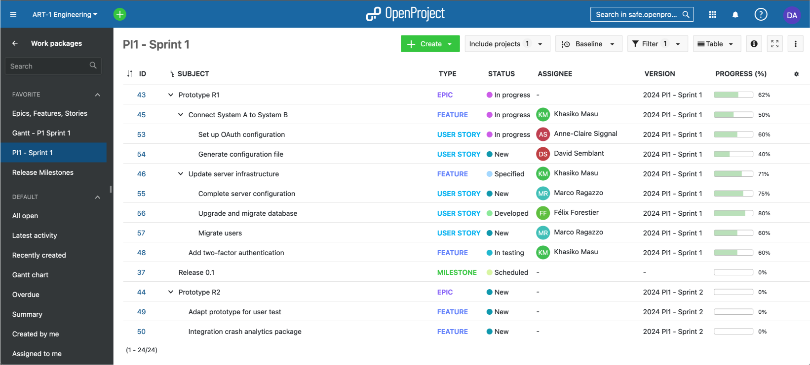

A project consists of a number of different elements:

- **Members**: individual members can be created at an instance-level and then added to individual projects, or external users
- can directly be "invited" to a project. Each member can have different roles in different projects.
- **Modules** like Work packages, Gantt, Backlog, Team planner, Wiki, Forums, Meetings.
- **Work packages** that can be of different types, including epics, features, enablers, user stories, and bugs.
- **Integrations** like external file storages.

Different [members groups](../../system-admin-guide/users-permissions/groups/) can also be created at an instance level and entire groups added to projects as members.

To learn how to use the Work packages module to configure epics, features and user stories, see: [Organizing work using table view, Gantt view](#organizing-work-using-table-view-gantt-view)

> **Demo:** View an [overview of an ART set up as a project](https://safe.openproject.com/projects/art-2-design/work_packages?query_id=58).

### Project templates

You can also use [project templates](../../user-guide/projects/project-templates/) and to make it easier to create news ARTs with the same structure, set of enabled modules, project structure or work package templates. Once a new ART is created using a template, it can then be modified in any way.

**Agile teams** *within* an Agile Release Train (ART) can either be organized as sub-projects of an ART or simply as saved custom views in a Team planner or Assignee-based Kanban board. To learn more, read [Backlogs, Kanban and Team planner](#backlogs-kanban-and-team-planner) below.

### Solution Trains

Project portfolios allow you to view, organize, sort and filter through all projects and their hierarchies. Since individual projects represent Agile Release trains, project portfolios can be used to access information at a **Solution train**-level.

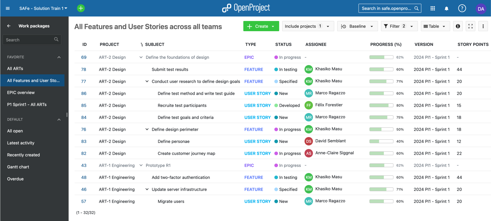

> In a near future release, OpenProject will have dedicated project portfolio features. [View mockups.](https://www.figma.com/file/YCCMdJWkrtP9YSmf49Od0i/Project-lists?type=design&node-id=470%3A13037&mode=design&t=g1EZesuy0Jj0VZFD-1)
>
> For the moment, [global modules](../../user-guide/home/global-modules/) give you an overview of content from all projects, including the ability to view and filter though a **project list**, and view, sort and filter **work packages at a global level**.

> **Demo:** [Solution train (project list)](https://safe.openproject.com/projects)
>
> **Demo:** [Global work package view (epics, features and stories from all ARTs)](https://safe.openproject.com/projects/safe-solution-train-1/work_packages?query_id=120)

## Using versions to set Program Increments

In OpenProject, a **program increment (PI)** or **iteration** corresponds to a version.

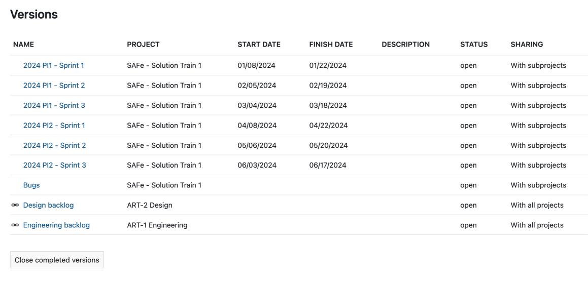

Like most things in OpenProject, a version is technically contained within a project. As such, a PI or iteration can be contained within an ART. However, it is possible to *share* versions with sub-projects, other projects or even with the entire instance.

Shared versions are especially useful when you need PIs to be shared between multiple ARTs.

> **Demo:** [Versions set up as PIs shared with all ARTs](https://safe.openproject.com/projects/safe-solution-train-1/settings/versions)

Versions are also tied to the Backlog module. To learn more, read [Backlogs, Kanban and Team planner](#backlogs-kanban-and-team-planner) below.

## Working with epics, features and stories

Once the instance, individual ARTs and versions are set up, you are ready to move on to the configuration of individual work initiatives.

In OpenProject, all work is expressed as work packages of various types. For SAFe, it already comes with **Epic**, **Feature**, **User story** and **Milestone** types out of the box. Depending on your needs, **Capability** and **Enabler** types can be easily created and configured.

Apart from milestones (which have the particularity of having a single date), all other types can be freely configured and new ones created.

A work package type is a set of configurations:

- A set of fields (including custom fields)
- Workflows (statuses and available status transitions)
- Settings (which projects/ARTs have access to the type)

In the context of SAFe, it's best to pre-configure the set of types that are required for your project. Since types can be shared between projects, a type can share the same structure between different ARTs if needed.

### Type template

A [type template (or default text for description)](../../system-admin-guide/manage-work-packages/work-package-types/) can defined for each type. A **Feature**, for example, can be pre-configured to include:

- A short description
- Capability
- Hypothesis
- Acceptance criteria

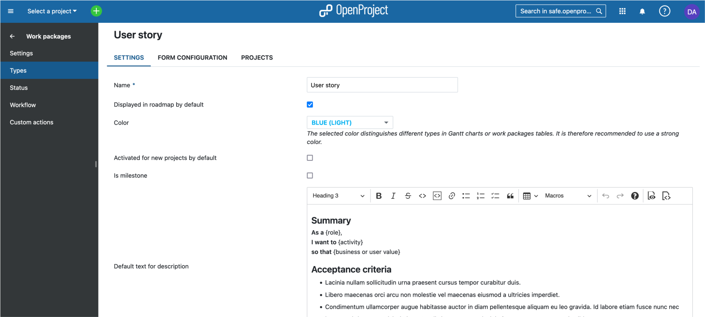

> **Demo**: Defining a [type template for features](https://safe.openproject.com/types/4/edit/settings) (requires admin privileges).

Similarly, a template can be defined for **User stories** so that they can be expressed in a SAFe-compatible manner, like so:

> **As a** *{role}*
>
> **I want to** *{activity}*
>
> **so that** *{business or user value}*

> **Demo**: Defining a [type template for user stories](https://safe.openproject.com/types/6/edit/settings) (requires admin privileges).

### Custom fields

[Custom fields](../../system-admin-guide/custom-fields/) can be added to each type to add additional structured information. The benefit of a custom field over headings in a type template is that custom fields can be used to later filter, search or group work packages. This can be immensely useful for creating dashboards or highly-specific queries.

For example, **Benefit hypothesis** can be expressed as a long-text custom field for Features.

Similarly, **Business outcome hypothesis**, **Non-functional requirements** and **Target KPIs** can be expressed as custom fields for Epics.

> **Demo:** [Defining custom fields for different work unit types](https://safe.openproject.com/custom_fields)

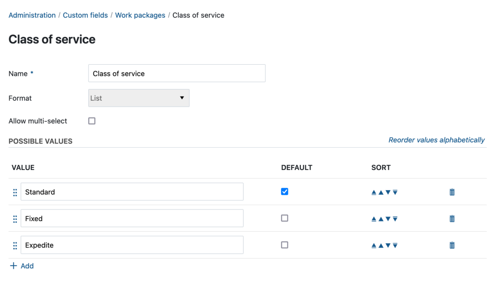

Custom fields can also hold different *types* of values, like lists, booleans, dates and even users. If you are using Kanban class of service for example, you can create a **Class of service** custom field of type multi-select with these options: *Standard*, *Fixed*, *Expedite*.

> **Demo**: [Class of service custom field](https://safe.openproject.com/custom_fields/5/edit)

### Story points

**Story points** can be added to **User Stories** (or even to **Features**).

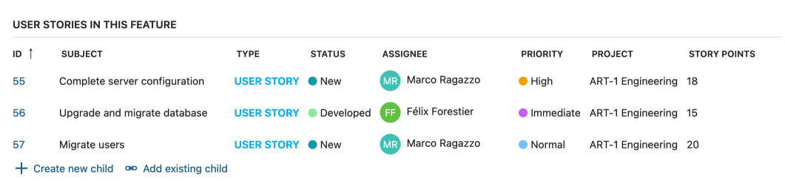

> **Demo:** [Adding story points as a field in a Feature](https://safe.openproject.com/types/4/edit/form_configuration).

Story points are particularly powerful as they are also visible in the Backlog. To learn more, read the [Backlogs, Kanban and Team planner](#backlogs-kanban-and-team-planner) section below.

### Progress

OpenProject allows you to track the progress of each work package (or a set of work packages in a parent-child hierarchy) using the **Progress** field. Progress can either be manually entered or based on set values tied to statuses. For more information, read the [documentation on progress tracking](../../user-guide/time-and-costs/progress-tracking/).

Progress can be viewed at a team label, at an ART-level or at a solution train level by creating filtered views showing only the information you need.

> **Demo:** [Progress overview at a PI level](https://safe.openproject.com/projects/safe-demo/work_packages?query_id=78)

## Organizing work using table view, Gantt view

OpenProject is a powerful tool that allows you to view work packages in a variety of different ways.

### Work package table view

The work package table view lets you view and edit work packages of all types (Epic, Capability, Feature, Enabler, User Story) in a tabular format, with one line per work package and different attributes as columns.

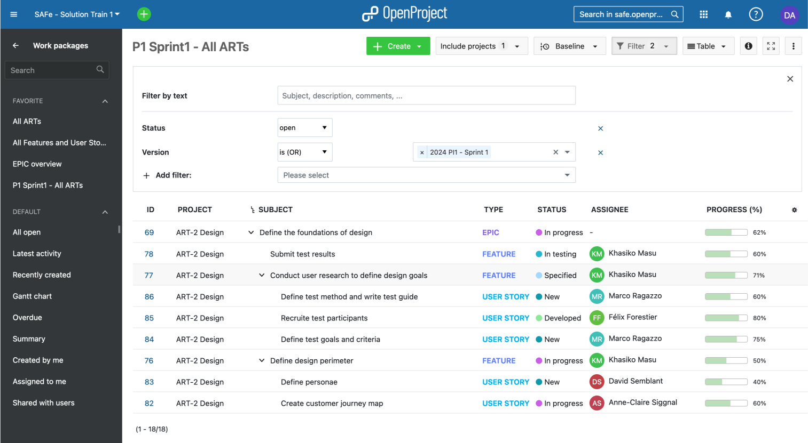

These tables are highly customizable and can be [configured](../../user-guide/work-packages/work-package-table-configuration/) to show precisely the information you need. Tables can also be **sorted** (for example by id, name, start dates, project, assignee, priority), **grouped** and **filtered** to create highly precise views. They can also show nested parent-children relations in **hierarchy view**.

> **Demo**: [A table view of all epics, features and stories in an ART](https://safe.openproject.com/projects/art-0-test-release-train/work_packages?query_id=29)

Configured tables can be saved as private (for you only) or public views (for all project members) to easily access them later and share them with other team members.

Additionally, the [Baseline comparison](../../user-guide/work-packages/baseline-comparison/) feature allow lets you visualize changes to a table (in relation to the filter criteria) over a period of time, affording you yet another way to monitor progress and changes within your ART or agile team.

### Gantt view

The [Gantt chart](../../user-guide/gantt-chart/) module allows you to quickly visualize planning at any level (Solution, ART or agile team) in a calendar view that also displays [work package relations](../../user-guide/work-packages/work-package-relations-hierarchies/). Like table view, it can be filtered to create custom views that can be saved.

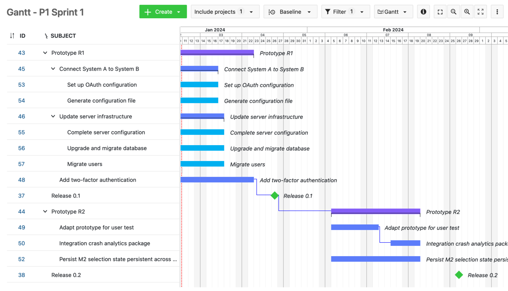

> **Demo:** [A Gantt view of a sprint within an ART](https://safe.openproject.com/projects/art-0-test-release-train/work_packages?query_id=39)

## Backlogs, Kanban and Team planner

The **Backlog** and **Kanban** are key tools in a scaled agile environment, not only during PI Planning but during the course of the entire project.

### Backlog

The [Backlog module](../../user-guide/backlogs-scrum/work-with-backlogs/) displays all versions available to a particular project or ART in a two-column format. For each version (representing a Product increment, Iteration or a Feature or Story backlog), the module displays:

- Version name
- Start and end dates
- Total story points

It also displays the *id*, *name*, *status* and *story points* for each work package contained in a version.

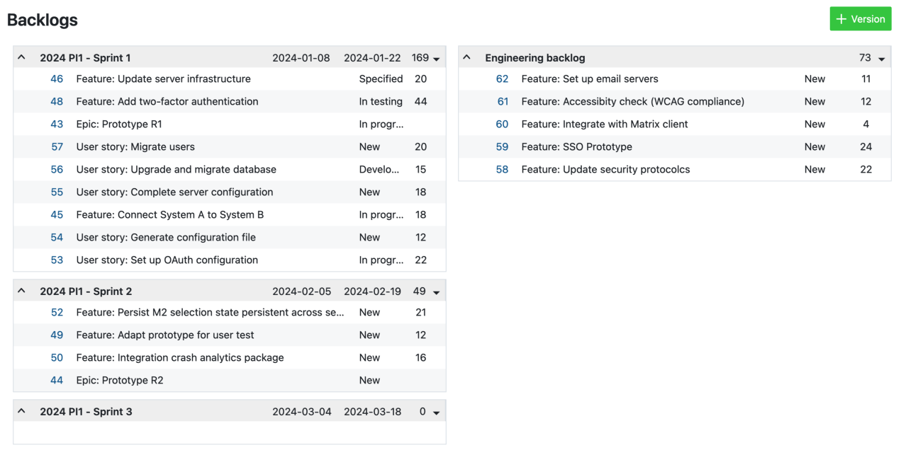

We recommend organizing all relevant sprints on the left column and the backlog on the right column. Any epic, feature, story, enabler or capability can easier be dragged and dropped between versions or to and from the backlog.

> **Demo**: [Backlog of an ART showing planned Sprints and a feature backlog](https://safe.openproject.com/projects/art-0-test-release-train/backlogs)

### Kanban

[Kanban boards](../../user-guide/agile-boards/) allow you to clearly visualize work items in a number of different ways. In OpenProject, dynamic boards can easily be created for a number of different fields.

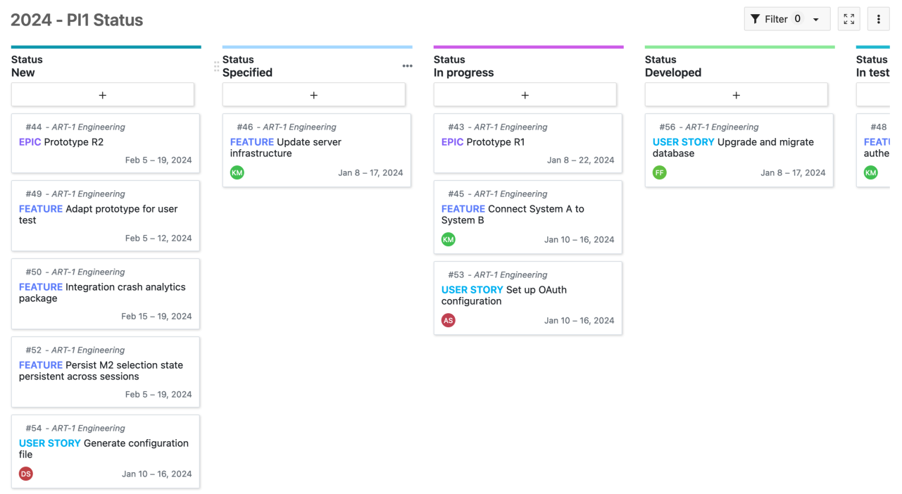

For each ART, we recommend creating these dynamic Kanban boards:

- Sprints (or PIs, [see demo](https://safe.openproject.com/projects/art-0-test-release-train/boards/9))
- Assignees ([see demo](https://safe.openproject.com/projects/art-0-test-release-train/boards/10))
- Status ([see demo](https://safe.openproject.com/projects/art-0-test-release-train/boards/11))

OpenProject boards are powerful and can be filtered for more control over what is displayed.

> **Note**: Swimlanes are already in our roadmap will soon be added to OpenProject.

### Team planner

The [Team planner module](../../user-guide/team-planner/) allows you to visualize work packages assigned to particular team members in a week or two-week calendar view. It is a powerful tool to monitor work at a day-to-day level.

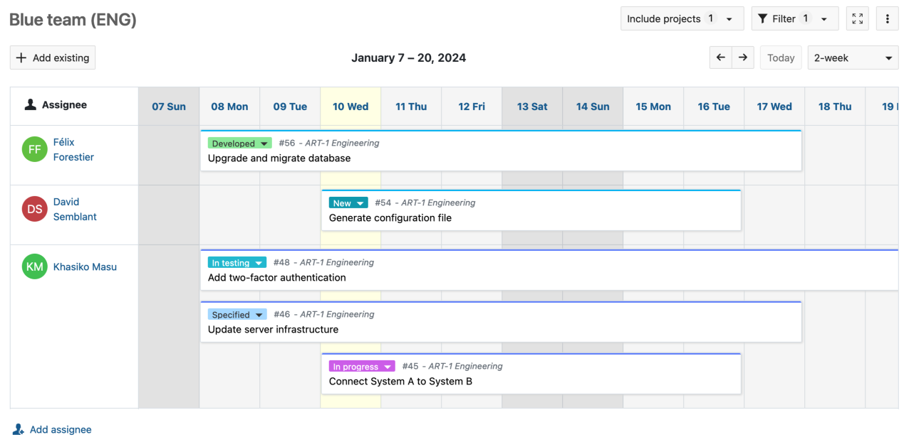

If you have multiple agile teams under a single ART, you can create and save custom Team planner views for each team.

> **Demo**: [Team planner for an agile team within an ART](https://safe.openproject.com/projects/art-0-test-release-train/team_planners/75?cdate=2024-01-07&cview=resourceTimelineWorkWeek)

At a Solution train level, it also allows you to view the work of members across multiple ARTs.

## Here for you

OpenProject is a powerful and highly-configurable tool that can be customized to fit the needs of your particular scaled agile implementation. Beyond the basics covered in this guide, OpenProject has many additional features and modules (such as [budgets](../../user-guide/budgets/), [time and cost tracking](../../user-guide/time-and-costs/), [wiki](../../user-guide/wiki/), [meetings](../../user-guide/meetings/) and [file storage integrations](../../development/file-storage-integration/)) that further enable your agile teams to work efficiently and deliver value.

If you have questions about how to [use](../../getting-started/) and [configure](../../system-admin-guide/) OpenProject to work for you, please [get in touch](https://www.openproject.org/contact/) or [start a free trial](https://start.openproject.com/) to see for yourself.
