---
sidebar_navigation:
  title: Scaled Agile Framework (SAFe)
  priority: 975
description: Learn how to set up and configure OpenProject to support the Scaled Agile Framework (SAFe) to successfully deliver value to customers using agile practices at scale.
keywords: safe, scaled agile, release train, program increment, PI planning, ART backlog, roadmap, portfolio backlog, solution train, kanban, enabler, capability, scrum, sprint, risk management, dependencies

---

# Implementing Scaled Agile Framework (SAFe) in OpenProject

OpenProject is a powerful project management tool that can adapt to a number of different frameworks and methodologies. Larger organizations that choose to implement the **Scaled Agile Framework (SAFe)** methodology can leverage the wide range of features and customizability that OpenProject offers to define, plan, organize and deliver value to their end customers.

This guide contains the following sections:

| Section | Description |
| --- | --- |
| [Structure and terminology](#structure-and-terminology) | What concepts in SAFe translate to in OpenProject and how to structure them |
| [Setting up a SAFe portfolio and solution train](#setting-up-a-safe-portfolio-and-solution-train) | Configuring the portfolio level to organize Solution Trains, Agile Release Trains and teams |
| [Setting up Agile Release Trains](#setting-up-agile-release-trains) | Configuring programs and team spaces to represent Agile Release Trains and agile teams |
| [Project templates](#project-templates) | Using templates to create consistent SAFe portfolio, ART and team setups |
| [Planning Program Increments](#planning-program-increments) | Using a hierarchy custom field to define Program Increments (PIs) and assign work to PI cycles |
| [Working with epics, features and stories](#working-with-epics-features-and-stories) | Configuring and using work packages for Strategic Themes, Epics, Capabilities, Enablers, Features, User Stories and Spikes |
| [Organizing work using table view, Gantt view](#organizing-work-using-table-view-gantt-view) | Using table and Gantt views to visualize, sort, filter and group work packages, dependencies and PI scope |
| [Backlogs, Kanban boards, Sprint boards and Team planner](#backlogs-kanban-boards-sprint-boards-and-team-planner) | Organizing work using Backlogs, Kanban boards, Sprint boards and Team planner |
| [Managing risks](#managing-risks) | Tracking risks with dedicated work packages, probability and impact fields, and saved risk views |

## Structure and terminology

Preparing OpenProject for SAFe involves configuration and access at several levels:

- A **portfolio** represents a **SAFe Portfolio** and can optionally also represent a **Solution Train** where an additional hierarchy level is required.
- A **program** represents an **Agile Release Train (ART)**.
- A **project** represents an **agile team space**.

In very large SAFe implementations, a Solution Train can sit between the SAFe Portfolio and individual ARTs. In OpenProject, Solution Trains can be represented at the portfolio level, providing a higher-level structure for coordinating multiple ARTs.

Global modules and cross-project views can additionally combine information from multiple team spaces, ARTs or portfolios.

Individual users will generally work within one or more team spaces while portfolio and ART views provide the broader context needed for planning and coordination.

It is important to note that OpenProject terminology can vary somewhat from SAFe terminology:

| **SAFe terminology** | **OpenProject terminology** |
| --- | --- |
| SAFe Portfolio / Solution Train | Portfolio |
| Agile Release Train | Program |
| Agile team | Project |
| Program Increment (PI) | Hierarchy custom field |
| Sprint / Iteration | Sprint |
| Strategic Theme | Strategic Theme (custom work package type) |
| Epic | Epic (work package type) |
| Capability | Capability (custom work package type) |
| Feature | Feature (work package type) |
| Enabler | Enabler (custom work package type) |
| User Story | User story (work package type) |
| Spike | Spike (custom work package type) |
| Objective | Objective (custom work package type) |
| Risk | Risk (custom work package type) |
| Kanban boards | Kanban boards |
| Roadmap | Gantt chart / saved work package views |
| Backlog | Backlog |

In the example configuration used throughout this guide, a **SAFe Portfolio** contains two **Agile Release Trains**, represented as programs. Each ART contains a number of **agile team spaces**, represented as projects such as **Team Atlas** and **Team Hermes**.

This structure keeps the SAFe hierarchy visible while allowing teams to manage their own work and providing consolidated planning views at ART and portfolio level.

## Setting up a SAFe portfolio and solution train

Start at the highest level of the hierarchy by setting up the SAFe Portfolio.

In OpenProject, a **portfolio** can represent a SAFe Portfolio and, where required, also a Solution Train. It provides an entry point for organizing the programs representing ARTs and the team spaces belonging to them.

Portfolios allow you to view, organize, sort and filter spaces and their hierarchies.

OpenProject offers a **portfolio overview** and project list that can be used to understand the structure and current state of the portfolio at a glance.

Custom project lists can be created and saved using your own filter criteria and can display custom project attributes. Individual spaces can also be favorited for easier access.

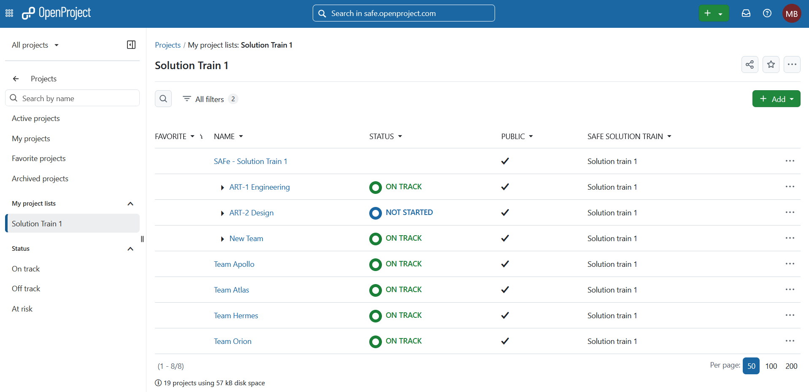

A typical portfolio could contain two ARTs:

- SAFe Portfolio
  - ART 1
    - Team Atlas
    - Team Hermes
  - ART 2
    - Team Orion
    - Team Apollo

At the portfolio level, consolidated work package views can combine information from multiple ARTs and teams.

These views can be filtered and customized to show particular attributes and custom fields as columns and can be grouped and sorted to provide portfolio-level information about Epics, Capabilities, Features, Objectives, Risks or other work package types.

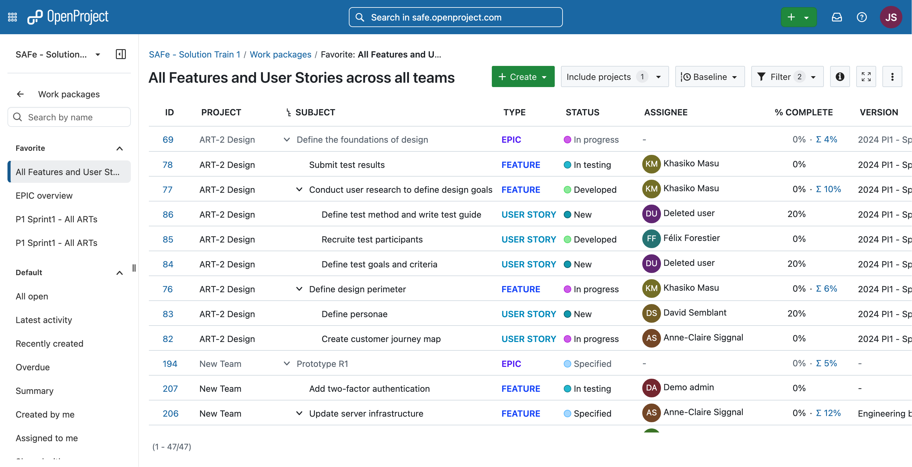

A Solution Train can be represented in the same way at portfolio level when the organization's SAFe implementation requires coordination across multiple ARTs.

## Setting up Agile Release Trains

In OpenProject, an **Agile Release Train (ART)** is represented by a **program**.

The program contains the projects representing the agile team spaces belonging to that ART.

This provides an explicit ART level between the SAFe Portfolio and individual team spaces and makes it possible to coordinate work across teams within the ART.

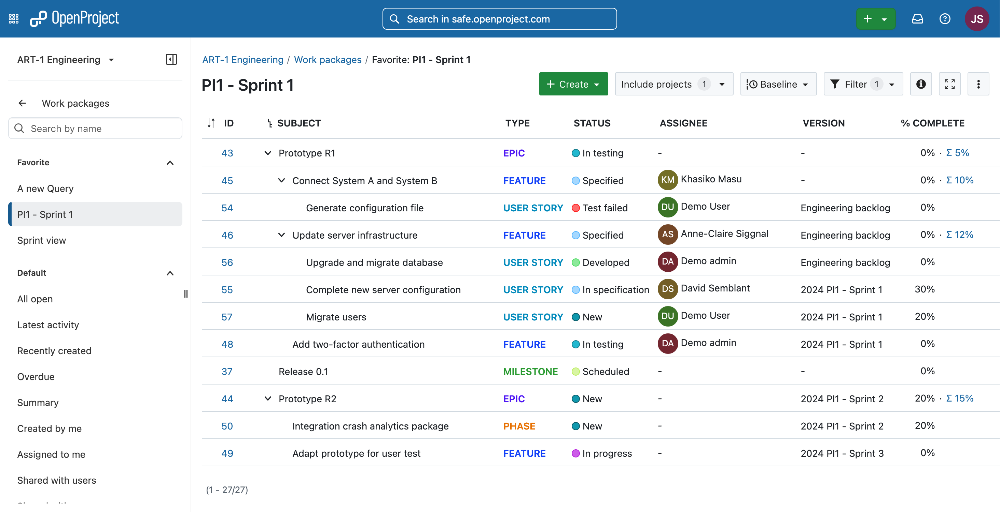

Portfolios, programs and projects can each be configured with a number of different elements:

- **Members**: individual members can be created at the instance level and then added to individual spaces, or external users can directly be invited. Each member can have different roles in different spaces.
- **Roles and workflows**: each role can have a specific workflow in each space. This is particularly useful for SAFe approval processes and other role-specific status transitions.
- **Modules** like Work packages, Gantt chart, Backlogs, Team planner, Wiki, Documents and Meetings.
- **Work packages** of SAFe-relevant types such as Strategic Theme, Epic, Capability, Feature, Enabler, User Story, Spike, Objective and Risk, as well as other types such as Bug or Milestone.
- **Integrations** like external file storages.

Different [member groups](../../system-admin-guide/users-permissions/groups/) can also be created at an instance level and entire groups added to spaces as members.

Cross-project views at the program level can then show work from all teams within the ART.

To learn how to configure and work with SAFe-specific work package types, including Strategic Themes, Epics, Capabilities, Enablers, Features, User Stories, Spikes, Objectives and Risks, see [Organizing work using table view, Gantt view](#organizing-work-using-table-view-gantt-view).

## Project templates

You can use [project templates](../../user-guide/projects/project-templates/) to make it easier to create new SAFe portfolios, solution trains, ARTs or agile teams with the same set of enabled modules, project structure or work package templates. Once a new space is created using a template, it can then be modified in any way.

Templates can pre-configure:
- enabled modules
- roles and workflows
- work package types
- custom fields
- saved views
- work package templates
- other space-level configuration

This makes it easier to provide consistent ART and team setups across a larger organization.

Agile teams within an Agile Release Train can be organized as projects or sub-projects. Saved cross-project views can then provide a consolidated view across teams. To learn more, read the [Backlogs, Kanban boards, Sprint boards and Team planner](#backlogs-kanban-boards-sprint-boards-and-team-planner) section below.

## Planning Program Increments

A **Program Increment (PI)** is a planning cycle used to align the teams within an ART around a common set of objectives and planned work.

In OpenProject, we recommend representing PIs with a [custom field of type hierarchy](../../system-admin-guide/custom-fields/#hierarchy-custom-field-enterprise-add-on) rather than with versions.

This keeps Program Increments independent from versions so that versions remain available for release and product-versioning use cases.

> [!NOTE]
> OpenProject plans to provide a dedicated PI object in the future to support the PI planning cycle even more directly.

Create a hierarchy custom field named, for example, **Program Increment** and make it available on the relevant work package types. See the [custom fields documentation](../../system-admin-guide/custom-fields/) for information on creating hierarchy custom fields and assigning them to work package types and projects.

A typical organization using four PIs per year could use a structure such as:

- 2027
  - PI 2027.1 (01.01.2027 - 31.03.2027) #1
  - PI 2027.2 (01.04.2027 - 30.06.2027) #2
  - PI 2027.3 (01.07.2027 - 30.09.2027) #3
  - PI 2027.4 (01.10.2027 - 31.12.2027) #4

Including the start and finish dates in the hierarchy values makes the planning period immediately visible to users. The hierarchy can be extended over time with new years and PIs. Users with the appropriate permissions can maintain the hierarchy values as the planning structure evolves.

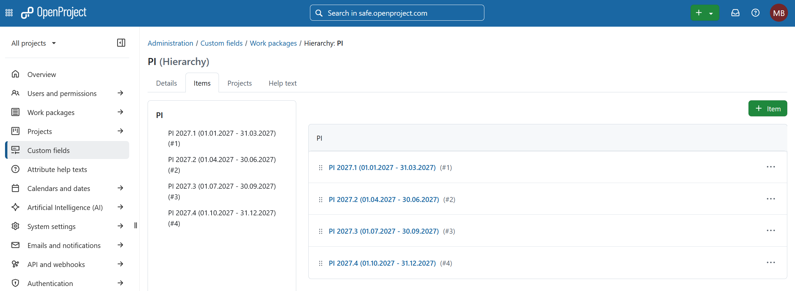

Work packages can then be assigned to the relevant PI using the **Program Increment** field. 

The field can be used by different work package types at the same time. Strategic Themes, Epics, Capabilities, Features, User Stories, Enablers, Spikes, Risks and Objectives can therefore all be associated with the same PI cycle and queried together.

### PI scope

During PI planning, saved work package views provide an efficient way to assign and review work.

A useful planning view can:

- include work packages from all teams within an ART
- display the **Program Increment** field
- group work packages by Program Increment
- include work that has not yet been assigned to a PI
- show the owning team
- include relevant dependencies and other planning attributes

This allows planners to see both existing PI buckets and an **unassigned** group. Work packages can then be moved from the unassigned group into the relevant PI as planning progresses. In the Work packages module, add the **Program Increment** column to the work package table and group the view by Program Increment. See [work package table configuration](../../user-guide/work-packages/work-package-table-configuration/) for information on adding columns, grouping work packages and saving custom views.

Useful columns to include are:

- Subject
- Type
- Team (Project column)
- Program Increment
- Sprint
- Status
- Assignee

The **Team** information is particularly useful in a cross-project view because it shows which agile team owns the work.

This makes it easy to see which work packages are already assigned to a PI and which remain unassigned.

You can assign individual work packages to a PI directly or use [bulk editing](../../user-guide/work-packages/edit-work-package/#bulk-edit-work-packages) to assign multiple work packages to the same PI at once.

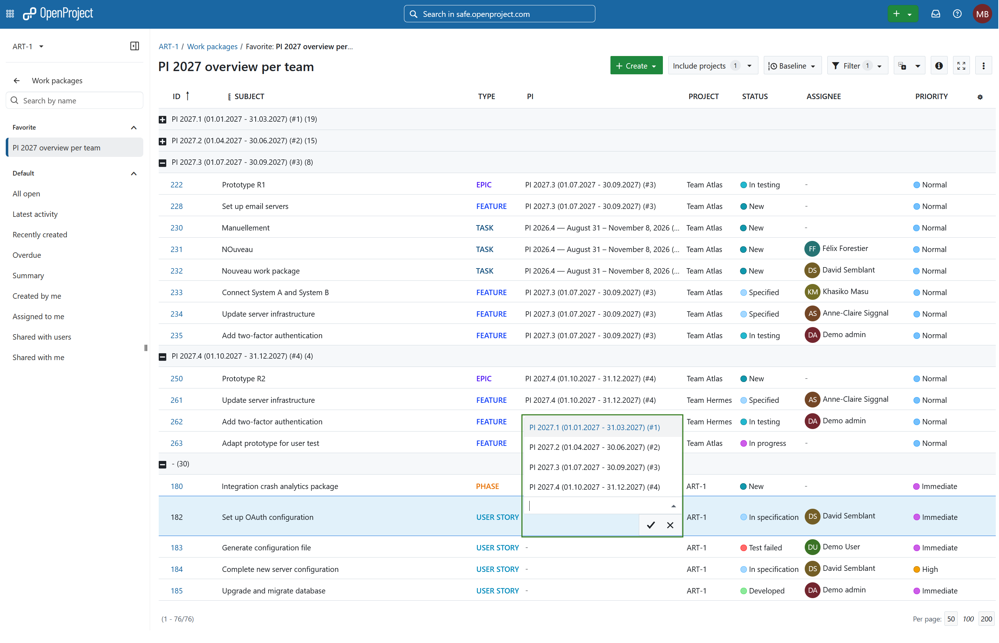

Configured views can be saved and favorited so that PI scope is easy to access throughout planning and execution. They can also be set to be public, so they are available across your organization. 

After PI planning is complete, another saved view can filter exclusively for the selected PI, for example **PI #2**.

Within that view, work can additionally be grouped by **Sprint**, providing the next iteration level within the Program Increment.

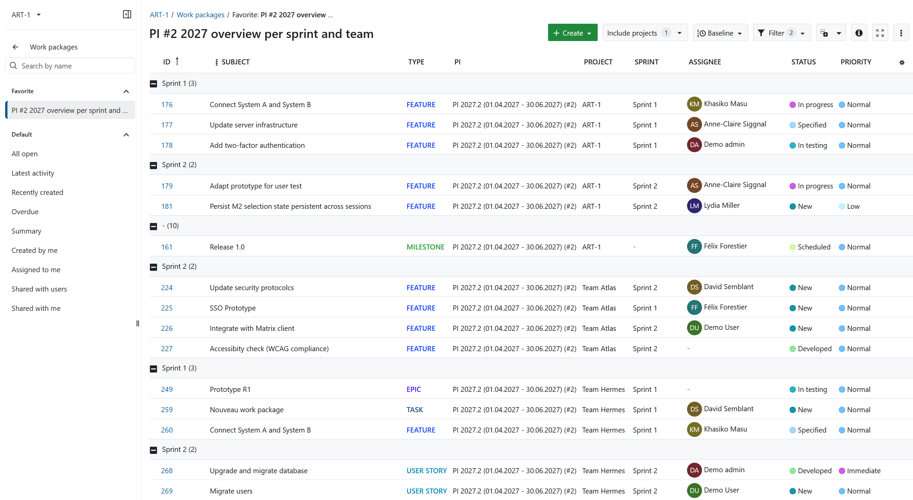

### Dependencies

Dependencies between work items are especially important during PI planning, particularly **cross-team dependencies within a single ART**.

[Work package relations](../../user-guide/work-packages/work-package-relations-hierarchies/) can be used to connect work that:

- blocks another work package
- is blocked by another work package
- requires another work package
- is required by another work package
- otherwise relates to planned work

Adding relation information to work package views makes dependencies visible alongside the owning team and Program Increment.

A saved cross-project dependency view can help teams identify:

- which Features in a PI depend on another team within the ART
- which work packages are blocking planned work
- which dependencies need to be resolved before planned milestones
- which teams need to coordinate during the PI

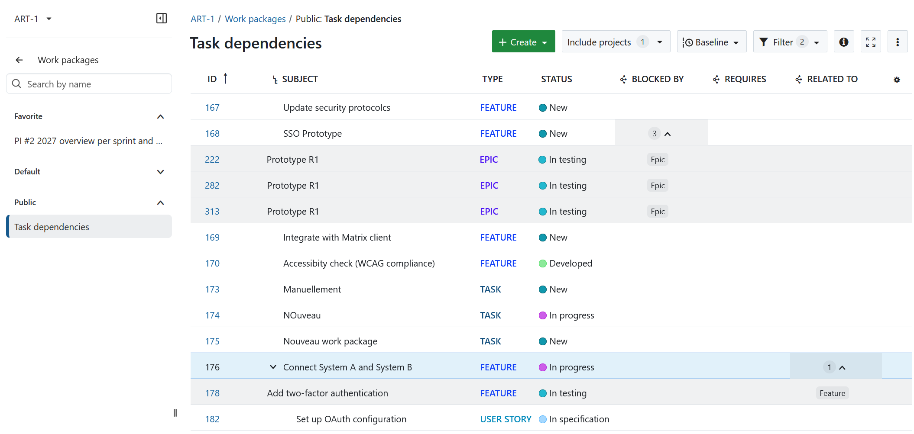

Dependencies can also be visualized in the Gantt chart, providing a timeline perspective on cross-team planning.

### PI objectives

PI Objectives can be represented as dedicated work packages and maintained at the appropriate **portfolio (SAFe Portfolio)** or **program (ART)** level.

This makes it possible to define objectives that span multiple teams and to relate planned Features, Capabilities or Epics to the outcomes they contribute to.

A saved **PI objectives** view can, for example, filter for:

- Type = Objective
- Program Increment = PI #2

Relations between Objectives and the contributing work packages make it possible to see directly which work supports each objective.

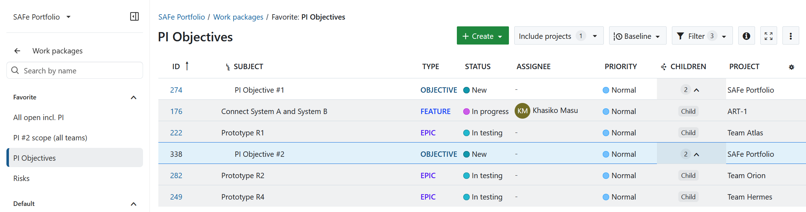

## Working with epics, features and stories

Once the instance, portfolio, ART and team-space structure and Program Increment hierarchy custom field are set up, you can configure the different kinds of work packages used by your SAFe implementation. 
In OpenProject, all work is expressed as work packages of various types.

For SAFe, OpenProject already comes with **Epic**, **Feature**, **User story** and **Milestone** types out of the box.

Depending on your needs, additional types can be created and configured, including:

- **Strategic Theme**
- **Capability**
- **Enabler**
- **Objective**
- **Spike**
- **Risk**

Apart from milestones, which have the particularity of having a single date, other types can be freely configured and new ones created.

A work package type is a set of configurations:

- a set of fields, including custom fields
- workflows, statuses and available status transitions
- settings defining which spaces have access to the type

In the context of SAFe, it is best to pre-configure the set of types required for your organization.

Types can be shared between spaces, allowing the same structure to be used consistently across multiple teams and ARTs.

### Type template

A [type template (or default text for description)](../../system-admin-guide/manage-work-packages/work-package-types/) can be defined for each work package type.

A **Feature**, for example, can be pre-configured to include:

- a short description
- Capability
- hypothesis
- acceptance criteria

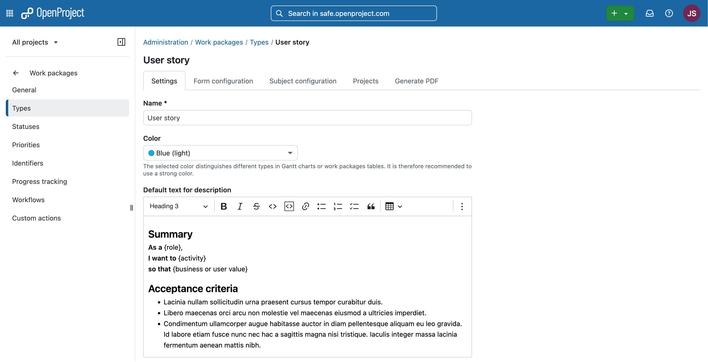

Similarly, a template can be defined for **User Stories** so that they can be expressed in a SAFe-compatible manner:

> **As a** _{role}_
> **I want to** _{activity}_
> **so that** _{business or user value}_

### Work package form and relationship tables

The work package form can be configured for each type to show the fields and custom fields relevant to that work package.

**Relationship tables** can also be added to the form to provide direct access to related work. For example, a Feature can display its related User Stories and dependencies, while an Objective can show the work packages that contribute to it.

This complements the dependency and PI Objective views described above by making the same relationships available directly from the individual work package.

### Custom fields

[Custom fields](../../system-admin-guide/custom-fields/) can be added to each type to add structured information.

The benefit of a custom field over headings in a type template is that custom fields can later be used to filter, search or group work packages. This is useful for dashboards and highly specific queries.

For example, **Benefit hypothesis** can be expressed as a long-text custom field for Features.

Similarly, **Business outcome hypothesis**, **Non-functional requirements** and **Target KPIs** can be expressed as custom fields for Epics.

The **Program Increment** custom field of type hierarchy is another example: it provides one consistent way to associate different work package types from multiple teams with the same PI.

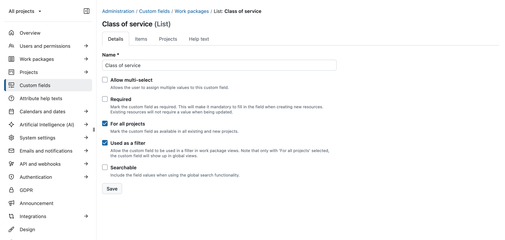

Custom fields can hold different types of values, including lists, booleans, dates, users and hierarchical values.

If you are using Kanban class of service, for example, you can create a **Class of service** custom field of type multi-select with these options: _Standard_, _Fixed_, _Expedite_.

### Story points

**Story points** can be added to **User Stories** or even to **Features**.

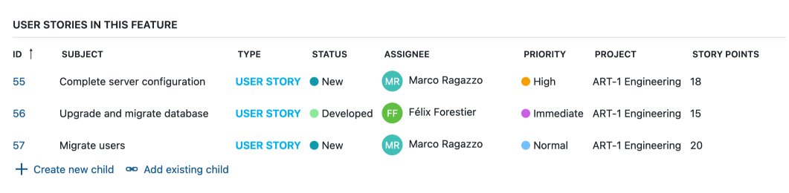

Story points are particularly useful for team-level agile planning and are also visible in the Backlogs module.

### Progress

OpenProject allows you to track the progress of each work package, or a set of work packages in a parent-child hierarchy, using the **% Complete** field.

Depending on the configured progress reporting mode, % Complete can be entered manually, calculated based on Work and Remaining work, or derived from the work package status.

For more information, read the [documentation on progress tracking](../../user-guide/time-and-costs/progress-tracking/).

Progress can be viewed at a team, ART, portfolio or PI level by creating filtered views that show only the information you need.

## Organizing work using table view, Gantt view

OpenProject allows you to view work packages in a variety of different ways.

### Work package table view

The work package table view lets you view and edit work packages of all types, including Epic, Capability, Feature, Enabler, User Story, Objective and Risk, in a tabular format, with one line per work package and different attributes as columns.

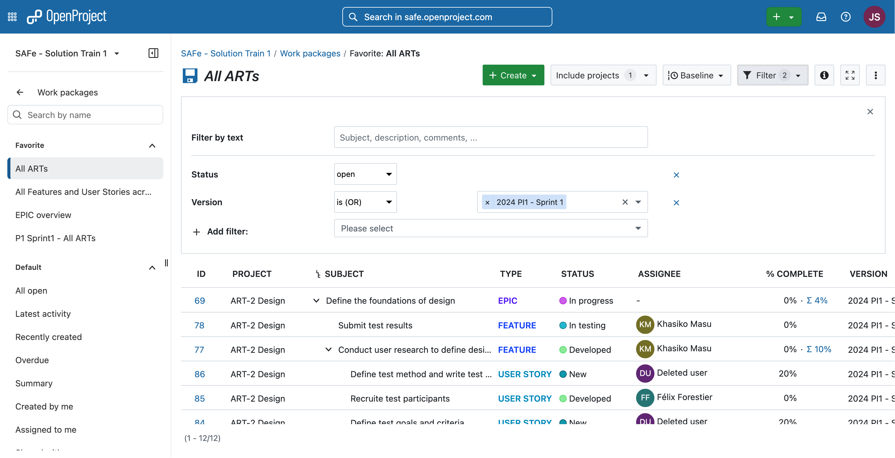

These tables are highly customizable and can be [configured](../../user-guide/work-packages/work-package-table-configuration/) to show precisely the information you need. Tables can be **sorted** by attributes such as ID, subject, start date, project, assignee or priority, **grouped** and **filtered** to create highly precise views. They can also show nested parent-child relations in **hierarchy view**.

The combination of the **Program Increment** and **Project** columns is particularly useful: it lets users see both the PI assignment and the team responsible for each work item.

Configured tables can be saved as private or public views and favorited for quick access.

Additionally, [Baseline comparison](../../user-guide/work-packages/baseline-comparison/) lets you visualize changes to a table in relation to its filter criteria over a period of time, providing another way to monitor changes to PI scope.

### Gantt view

The [Gantt chart](../../user-guide/gantt-chart/) module allows you to visualize planning at any level in a calendar view and can also display [work package relations](../../user-guide/work-packages/work-package-relations-hierarchies/).

Like the table view, it can be filtered and saved. For PI planning, a Gantt view can be filtered for **Program Increment = PI #2** and include work from Team Atlas and Team Hermes.

The Program Increment can also be displayed as a column alongside the Gantt chart, while work package relations make dependencies visible directly on the timeline.

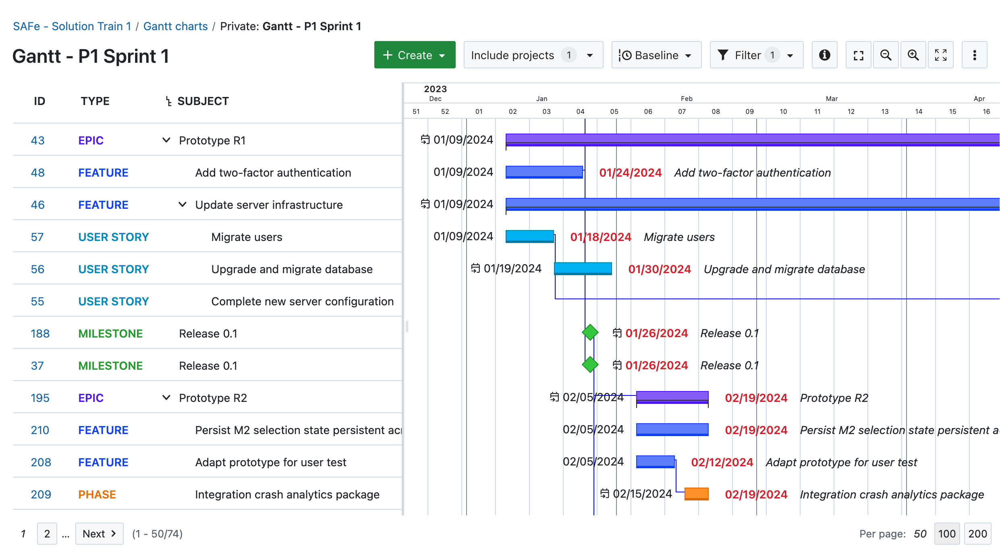

A saved **PI #2 timeline** view provides a useful overview of planned work, dates and dependencies throughout the PI.

## Backlogs, Kanban boards, Sprint boards and Team planner

The **Backlogs**, **Boards** and **Team planner** modules provide complementary views for agile teams. They can be used alongside the cross-project PI views described above.

### Backlogs

The [Backlogs module](../../user-guide/backlogs-scrum/) can be used for detailed backlog and sprint planning within an individual team.

Versions remain available in OpenProject for release and version-planning use cases. Program Increments, however, are represented independently using the **Program Increment** hierarchy custom field.

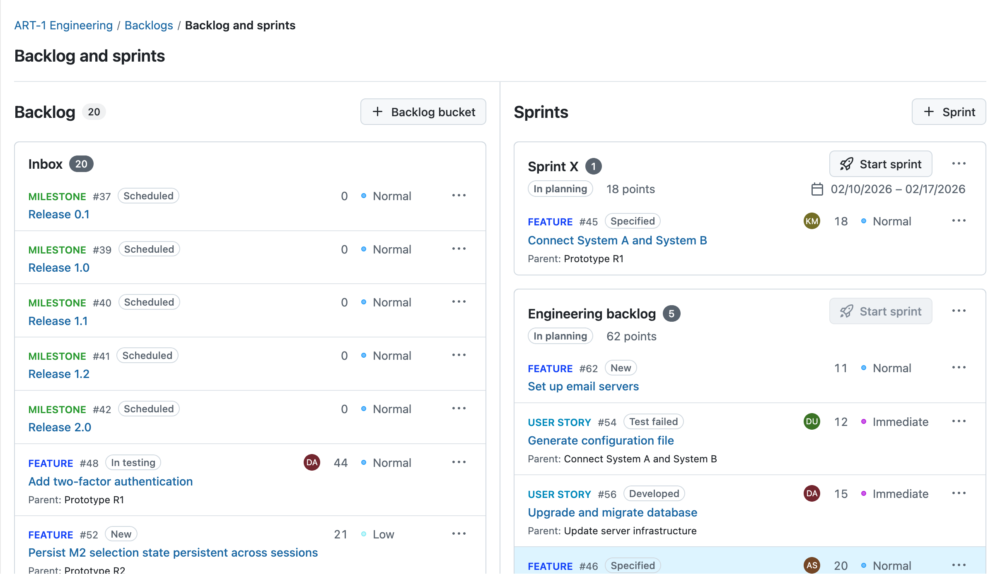

This separation allows teams to use their backlog and release structures without consuming the Version field for Program Increments.

### Kanban boards

[Kanban boards](../../user-guide/agile-boards/) allow you to clearly visualize work items in a number of different ways. Dynamic boards can be created based on fields such as status or assignee, and boards can be filtered to focus on the work relevant to a particular team or planning cycle.

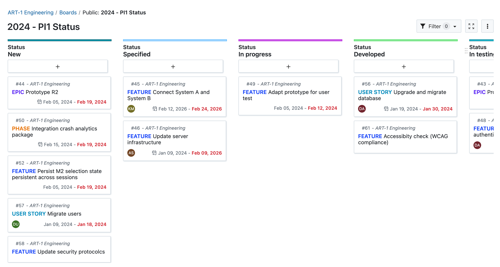

For an individual team, a pre-configured Kanban board provides a useful execution view of the currently planned work.

For PI planning, a **multi-project board** can provide a broader view. Create a sub-project board and show work from all or select teams together.

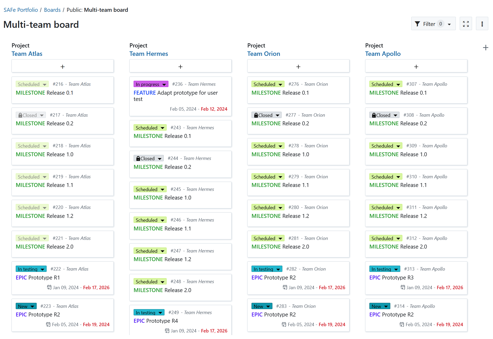

This makes it possible to see the complete PI scope while retaining information about which team each work package belongs to. Users can then zoom into an individual team by applying a project filter or opening a team-specific view.

### Sprint boards and Sprint planning

At team level, **Boards** provide a focused view of work planned for a Sprint.

Teams can use the Backlogs module to prepare and assign work to a Sprint and then use a Sprint board during execution. 

A Kanban board can, for example, show work grouped by status so that the team can follow User Stories, Spikes, Bugs and other work through the Sprint workflow.

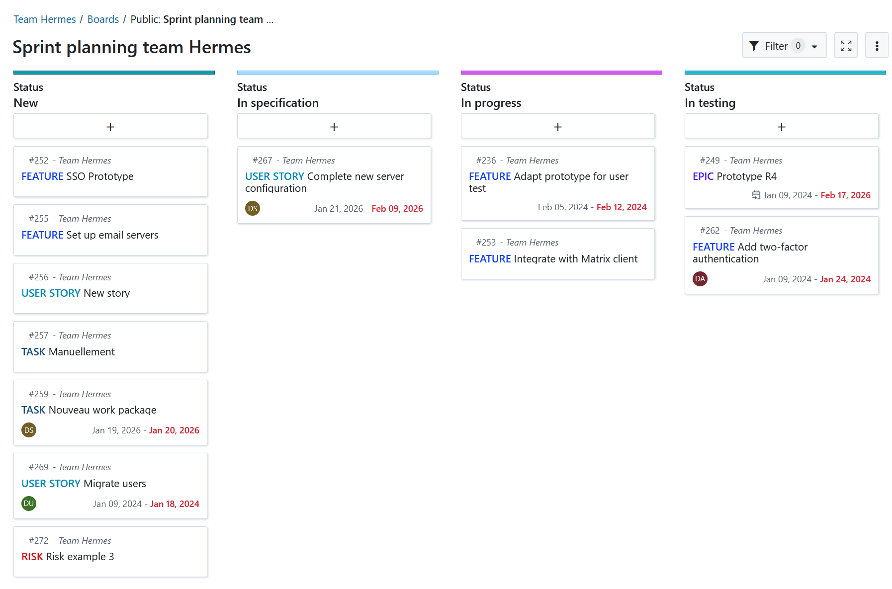

### Team planner

The [Team planner module](../../user-guide/team-planner/) allows you to visualize work packages assigned to particular team members in a week or two-week calendar view. It is a powerful tool to monitor work at a day-to-day level.

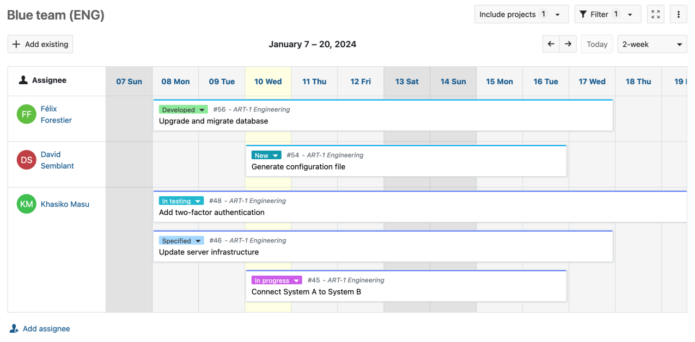

If you have multiple agile teams, you can create and save custom Team planner views for each team.

At a higher level, Team planner views can also be used to understand allocation across members working on different projects.

## Managing risks

Risk management is an important part of PI planning and execution.

In OpenProject, risks can be represented as dedicated work packages of type **Risk**.

This allows risks to use the same capabilities as other work packages: they can have owners, dates, custom fields, relations, comments, attachments and workflows.

A typical Risk type can include custom fields such as:

- **Probability**
- **Impact**
- **Risk owner**
- **Risk category**
- **Program Increment**

Probability and Impact should use consistent **qualitative risk-evaluation values** rather than a numeric scale. Adding these fields as columns creates a simple risk register that can be filtered, sorted and grouped.

A saved **PI #2 risks** view can filter for Risk impact and probability, while showing Team, Probability, Impact, Risk owner and Status as columns.

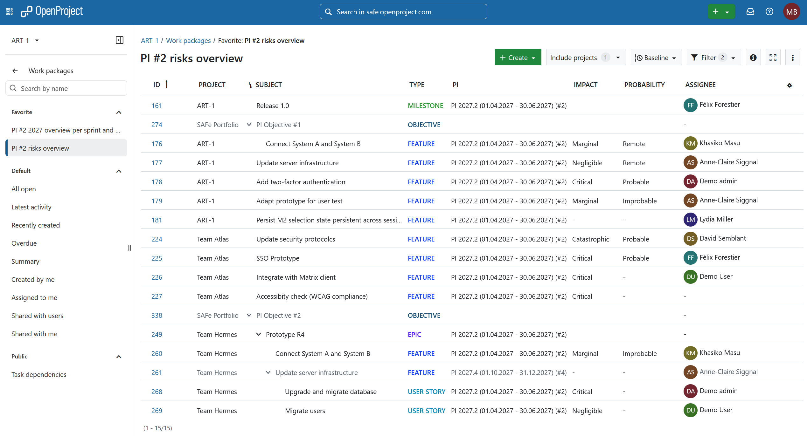

Risk work packages can also be related to the Features, Epics or other work they affect.

Mitigation actions can be tracked as separate work packages and related back to the risk so that ownership and progress remain clear.

### Risk overview on the portfolio

The portfolio home page can be configured with widgets that provide a higher-level view of PI execution.

Useful widgets and work package lists can highlight:

- current PI scope
- PI Objectives
- open Risks
- overdue work
- upcoming milestones
- project status and activity

This provides a concise portfolio-level view while detailed planning and execution remain available through the saved work package, Gantt and board views.

## What is next for agile planning in OpenProject

OpenProject continues to expand its support for agile and scaled agile ways of working.

Planned and ongoing improvements include:

- **Agile reporting** for Scrum, Kanban and SAFe, including cross-project reporting at ART and portfolio level. See [Agile reporting in OpenProject](https://www.openproject.org/blog/openproject-agile-reporting/).
- **Better support for Program Increments**, including plans for a dedicated PI object.
- **Boards for PI planning sessions**, enabling more collaborative visual PI planning workflows. More details [here](https://community.openproject.org/projects/AGILE/work_packages/AGILE-265/activity?query_id=7850) and [here](https://community.openproject.org/projects/AGILE/work_packages/AGILE-267/activity?query_id=7850).
- A **global Backlog module**.
- Further **board improvements**, such as swimlanes, filters, WIP limits and private and public views.
- **Global boards** for cross-project planning and visualization.
- Further Sprint reporting and iteration support.

We are also working on real-time collaborative visual planning functionality that will support use cases such as PI planning workshops, brainstorming and collaborative dependency mapping.

For risk management, a future **risk matrix** will make it possible to visualize risks on Probability and Impact axes and update their evaluation directly in the matrix.

These upcoming capabilities will complement the existing work package, Gantt, Backlog, Sprint, board and risk-management workflows described in this guide.

## Here for you

OpenProject is a powerful and highly configurable tool that can be customized to meet the needs of your particular scaled agile implementation. Beyond the basics covered in this guide, OpenProject has many additional features and modules, such as [budgets](../../user-guide/budgets/), [time and cost tracking](../../user-guide/time-and-costs/), [wiki](../../user-guide/wiki/), [meetings](../../user-guide/meetings/) and [file storage integrations](../../development/file-storage-integration/), that further enable your agile teams to work efficiently and deliver value.

If you have questions about how to [use](../../getting-started/) and [configure](../../system-admin-guide/) OpenProject to work for you, please [get in touch](https://www.openproject.org/contact/) or [start a free trial](https://start.openproject.com/) to see for yourself.