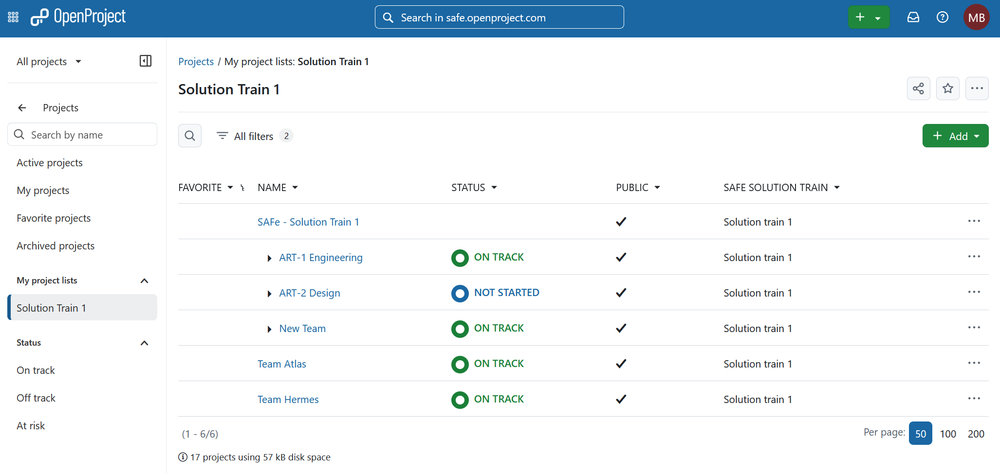

---
sidebar_navigation:
  title: Scaled Agile Framework (SAFe)
  priority: 975
description: Learn how to set up and configure OpenProject to support the Scaled Agile Framework (SAFe) to successfully deliver value to customers using agile practices at scale.
keywords: safe, scaled agile, release train, program increment, PI planning, ART backlog, roadmap, portfolio backlog, solution train, kanban, enabler, capability, scrum, risk management, dependencies

---

# Implementing Scaled Agile Framework (SAFe) in OpenProject

OpenProject is a powerful project management tool that can adapt to a number of different frameworks and methodologies. Larger organizations that choose to implement the **Scaled Agile Framework (SAFe)** methodology can leverage the wide range of features and customizability that OpenProject offers to define, plan, organize and deliver value to their end customers.

This guide contains the following sections:

| Section | Description |
| --- | --- |
| [Structure and terminology](#structure-and-terminology) | What concepts in SAFe translate to in OpenProject and how to structure them |
| [Setting up Agile Release Trains](#setting-up-agile-release-trains) | Configuring portfolios, projects and project templates to create and administer Agile Release Trains and teams |
| [Planning Program Increments](#planning-program-increments) | Using hierarchy custom fields in OpenProject to define Program Increments (PIs) and assign work to PI cycles |
| [Working with epics, features and stories](#working-with-epics-features-and-stories) | Configuring and using work packages for Epics, Capabilities, Enablers, Features and User Stories |
| [Organizing work using table view, Gantt view](#organizing-work-using-table-view-gantt-view) | Using table and Gantt views to visualize, sort, filter and group work packages, dependencies and PI scope |
| [Backlogs, Kanban and Team planner](#backlogs-kanban-and-team-planner) | Organizing work and facilitating planning using Backlogs, Kanban boards and Team planner |
| [Managing risks](#managing-risks) | Tracking risks with dedicated work packages, probability and impact fields, and saved risk views |

## Structure and terminology

Preparing OpenProject for SAFe involves configuration and access at several levels:

- **Portfolios and project hierarchies** can be used to represent the higher-level organizational structure and provide an overview across multiple Agile Release Trains and teams.
- **Individual projects** are self-contained and consist of a set of modules, members, work packages and project-level settings. Each can further contain sub-projects for additional hierarchy. Projects can represent **Agile Release Trains or agile teams**, depending on the structure of the organization.
- **Global modules** encompass content from multiple projects and provide cross-project views of work packages, boards, project information and other data.

Individual users will generally work within one or a set of different projects to deliver value.

It is important to note that OpenProject terminology can vary somewhat from SAFe terminology:

| **SAFe terminology** | **OpenProject terminology** |
| --- | --- |
| Portfolio | Portfolio / project hierarchy |
| Agile Release Train | Project / project hierarchy |
| Agile team | Project or sub-project |
| Program increment (PI) | Hierarchy custom field |
| Capability/Epic | Epic (work package type) |
| Feature | Feature (work package type) |
| Enabler | Enabler (custom work package type) |
| User Story | User story (work package type) |
| Risk | Risk (custom work package type) |
| Kanban | Boards |
| Roadmap | Gantt chart / saved work package views |
| Backlog | Backlog |

In the example configuration used throughout this guide, the structure consists of a **SAFe Portfolio** with teams such as **Team Atlas** and **Team Hermes**. This keeps the portfolio and program structure visible while using OpenProject projects to represent the teams that own and deliver work.

## Setting up Agile Release Trains

In OpenProject, Agile Release Trains and teams can be represented using projects and project hierarchies.

A project consists of a number of different elements:

- **Members**: individual members can be created at an instance level and then added to individual projects, or external users can directly be invited to a project. Each member can have different roles in different projects.
- **Modules** like Work packages, Gantt chart, Backlogs, Team planner, Wiki, Forums and Meetings.
- **Work packages** that can be of different types, including epics, features, enablers, user stories, risks and bugs.
- **Integrations** like external file storages.

Different [member groups](../../system-admin-guide/users-permissions/groups/) can also be created at an instance level and entire groups added to projects as members.

To learn how to use the Work packages module to configure epics, features and user stories, see [Organizing work using table view, Gantt view](#organizing-work-using-table-view-gantt-view).

### Project templates

You can use [project templates](../../user-guide/projects/project-templates/) to make it easier to create new ARTs or teams with the same set of enabled modules, project structure or work package templates. Once a new project is created using a template, it can then be modified in any way.

Agile teams within an Agile Release Train can be organized as projects or sub-projects. Saved cross-project views can then provide a consolidated view across teams. To learn more, read [Backlogs, Kanban and Team planner](#backlogs-kanban-and-team-planner) below.

### Solution Trains and portfolios

Project portfolios allow you to view, organize, sort and filter projects and their hierarchies. They can therefore be used to provide a higher-level overview across Agile Release Trains and teams.

OpenProject offers a **Project list** view that lets you create and save custom lists of projects using your own set of filter criteria. These lists can also display custom project attributes. Individual projects can also be favorited for easier access.

A parent project or portfolio can also contain multiple projects or sub-projects representing teams. A consolidated **work package table** view can then be filtered and customized to show particular attributes and custom fields as columns, grouped and sorted. It can display epics, features and user stories from multiple teams in one place.

## Planning Program Increments

A **Program Increment (PI)** is a planning cycle used to align teams around a common set of objectives and planned work. In OpenProject, we recommend representing PIs with a **hierarchy custom field** rather than with versions.

This keeps Program Increments independent from versions so that versions remain available for release and product versioning use cases.

Create a hierarchy custom field named, for example, **Program Increment** and make it available on the relevant work package types. A typical organization using four PIs per year could use a structure such as:

- 2027
  - PI #1
  - PI #2
  - PI #3
  - PI #4

The hierarchy can be extended over time with new years and PIs. Users with the appropriate permissions can maintain the hierarchy values as the planning structure evolves.

Work packages can then be assigned to the relevant PI using the **Program Increment** field. This allows Program Increment to be used consistently across different work package types and teams. Epics, Features, User Stories, Enablers, Risks and Objectives can all be associated with the same PI cycle and queried together.

### PI scope

During PI planning, teams can use saved work package views to see the planned scope for a Program Increment.

A saved view such as **PI #2 scope** can be filtered for Program Increment = PI #2 and the relevant work package types. Useful columns include Type, Subject, Project, Program Increment, Status, Assignee, Start date, Finish date and relevant work package relations.

The **Project** column is particularly useful in a cross-project view because it shows which team owns the work. In the example instance, the project names **Team Atlas** and **Team Hermes** therefore also identify the responsible team.

Configured views can be saved and favorited so that PI scope is easy to access throughout planning and execution.

### Dependencies

Dependencies between work items are especially important during PI planning. Work package relations can be used to connect work that **blocks**, **is blocked by**, **requires** or otherwise depends on other work.

Adding relevant relation columns to the work package table makes dependencies visible alongside the owning team and Program Increment.

A saved cross-project dependency view can help teams identify which Features in a PI depend on another team, which work packages are blocking planned work, and which dependencies need to be resolved before planned milestones.

Dependencies can also be visualized in the Gantt chart, providing an additional timeline perspective on cross-team planning.

### PI objectives

PI Objectives can be represented as dedicated work packages and maintained at the appropriate portfolio or program level.

This makes it possible to define objectives that span multiple teams and to relate planned Features or Epics to the outcomes they contribute to.

A saved **PI objectives** view can, for example, filter for Type = Objective and Program Increment = PI #2.

## Working with epics, features and stories

Once the instance, project structure and Program Increment hierarchy are set up, you are ready to move on to the configuration of individual work initiatives.

In OpenProject, all work is expressed as work packages of various types. For SAFe, OpenProject already comes with **Epic**, **Feature**, **User story** and **Milestone** types out of the box. Depending on your needs, **Capability**, **Enabler**, **Objective** and **Risk** types can be created and configured.

Apart from milestones, which have the particularity of having a single date, other types can be freely configured and new ones created.

A work package type is a set of configurations:

- A set of fields, including custom fields
- Workflows, statuses and available status transitions
- Settings defining which projects have access to the type

In the context of SAFe, it is best to pre-configure the set of types required for your organization. Since types can be shared between projects, a type can share the same structure between different teams if needed.

### Type template

A [type template (or default text for description)](../../system-admin-guide/manage-work-packages/work-package-types/) can be defined for each type. A **Feature**, for example, can be pre-configured to include:

- A short description
- Capability
- Hypothesis
- Acceptance criteria

Similarly, a template can be defined for **User stories** so that they can be expressed in a SAFe-compatible manner, like so:

> **As a** _{role}_
>
> **I want to** _{activity}_
>
> **so that** _{business or user value}_

### Custom fields

[Custom fields](../../system-admin-guide/custom-fields/) can be added to each type to add structured information. The benefit of a custom field over headings in a type template is that custom fields can later be used to filter, search or group work packages. This is useful for dashboards and highly specific queries.

For example, **Benefit hypothesis** can be expressed as a long-text custom field for Features.

Similarly, **Business outcome hypothesis**, **Non-functional requirements** and **Target KPIs** can be expressed as custom fields for Epics.

The **Program Increment** hierarchy custom field is another example: it provides one consistent way to associate different work package types from multiple teams with the same PI.

Custom fields can hold different types of values, including lists, booleans, dates, users and hierarchical values. If you are using Kanban class of service, for example, you can create a **Class of service** custom field of type multi-select with these options: _Standard_, _Fixed_, _Expedite_.

### Story points

**Story points** can be added to **User Stories** or even to **Features**.

Story points are particularly useful for team-level agile planning and are also visible in the Backlogs module.

### Progress

OpenProject allows you to track the progress of each work package, or a set of work packages in a parent-child hierarchy, using the **Progress** field. Progress can either be manually entered or based on set values tied to statuses. For more information, read the [documentation on progress tracking](../../user-guide/time-and-costs/progress-tracking/).

Progress can be viewed at a team, ART, portfolio or PI level by creating filtered views that show only the information you need.

## Organizing work using table view, Gantt view

OpenProject allows you to view work packages in a variety of different ways.

### Work package table view

The work package table view lets you view and edit work packages of all types, including Epic, Capability, Feature, Enabler, User Story, Objective and Risk, in a tabular format, with one line per work package and different attributes as columns.

These tables are highly customizable and can be [configured](../../user-guide/work-packages/work-package-table-configuration/) to show precisely the information you need. Tables can be **sorted** by attributes such as ID, subject, start date, project, assignee or priority, **grouped** and **filtered** to create highly precise views. They can also show nested parent-child relations in **hierarchy view**.

For SAFe, useful cross-project views include **PI #2 scope**, **PI objectives**, **Cross-team dependencies** and **PI #2 risks**.

The combination of the **Program Increment** and **Project** columns is particularly useful: it lets users see both the PI assignment and the team responsible for each work item.

Configured tables can be saved as private or public views and favorited for quick access.

Additionally, [Baseline comparison](../../user-guide/work-packages/baseline-comparison/) lets you visualize changes to a table in relation to its filter criteria over a period of time, providing another way to monitor changes to PI scope.

### Gantt view

The [Gantt chart](../../user-guide/gantt-chart/) module allows you to visualize planning at any level in a calendar view and can also display [work package relations](../../user-guide/work-packages/work-package-relations-hierarchies/).

Like the table view, it can be filtered and saved. For PI planning, a Gantt view can be filtered for **Program Increment = PI #2** and include work from Team Atlas and Team Hermes.

The Program Increment can also be displayed as a column alongside the Gantt chart, while work package relations make dependencies visible directly on the timeline.

A saved **PI #2 timeline** view provides a useful overview of planned work, dates and dependencies throughout the PI.

## Backlogs, Kanban and Team planner

The **Backlogs**, **Boards** and **Team planner** modules provide complementary views for agile teams. They can be used alongside the cross-project PI views described above.

### Backlogs

The [Backlogs module](../../user-guide/backlogs-scrum/) can be used for detailed backlog and sprint planning within an individual team.

Versions remain available in OpenProject for release and version-planning use cases. Program Increments, however, are represented independently using the **Program Increment** hierarchy custom field.

This separation allows teams to use their backlog and release structures without consuming the Version field for Program Increments.

### Kanban

[Kanban boards](../../user-guide/agile-boards/) allow you to clearly visualize work items in a number of different ways. Dynamic boards can be created based on fields such as status or assignee, and boards can be filtered to focus on the work relevant to a particular team or planning cycle.

For an individual team, a pre-configured Kanban board provides a useful execution view of the currently planned work.

For PI planning, a **multi-project board** can provide a broader view. A board filtered for **Program Increment = PI #2** can show work from Team Atlas and Team Hermes together.

This makes it possible to see the complete PI scope while retaining information about which team each work package belongs to. Users can then zoom into an individual team by applying a project filter or opening a team-specific view.

### Team planner

The [Team planner module](../../user-guide/team-planner/) allows you to visualize work packages assigned to particular team members in a week or two-week calendar view. It is a powerful tool to monitor work at a day-to-day level.

If you have multiple agile teams, you can create and save custom Team planner views for each team.

At a higher level, Team planner views can also be used to understand allocation across members working on different projects.

## Managing risks

Risk management is an important part of PI planning and execution. In OpenProject, risks can be represented as dedicated work packages of type **Risk**.

This allows risks to use the same capabilities as other work packages: they can have owners, dates, custom fields, relations, comments, attachments and workflows.

A typical Risk type can include custom fields such as:

- **Probability**
- **Impact**
- **Risk owner**
- **Risk category**
- **Program Increment**

Probability and Impact can use a consistent scale, for example from 1 to 5. Adding these fields as columns creates a simple risk register that can be filtered, sorted and grouped.

A saved **PI #2 risks** view can filter for Type = Risk and Program Increment = PI #2, while showing Project, Probability, Impact, Risk owner and Status as columns.

Risk work packages can also be related to the Features, Epics or other work they affect. Mitigation actions can be tracked as separate work packages and related back to the risk so that ownership and progress remain clear.

### Risk overview on the portfolio

The portfolio or parent project home page can be configured with widgets that provide a higher-level view of PI execution.

Useful widgets and work package lists can highlight:

- current PI scope
- PI Objectives
- open Risks
- overdue work
- upcoming milestones
- project status and activity

This provides a concise portfolio-level view while detailed planning and execution remain available through the saved work package, Gantt and board views.

## What is next for agile planning in OpenProject

OpenProject continues to expand its support for agile and scaled agile ways of working.

Upcoming improvements include **sprint reports** and further support for **iterations**, giving teams additional ways to review planned and completed work.

We are also working on real-time collaborative visual planning functionality that will support use cases such as PI planning workshops, brainstorming and collaborative dependency mapping.

For risk management, a future **risk matrix** will make it possible to visualize risks on Probability and Impact axes and update their evaluation directly in the matrix.

These upcoming capabilities will complement the existing work package, Gantt, board and risk-management workflows described in this guide.

## Here for you

OpenProject is a powerful and highly-configurable tool that can be customized to fit the needs of your particular scaled agile implementation. Beyond the basics covered in this guide, OpenProject has many additional features and modules, such as [budgets](../../user-guide/budgets/), [time and cost tracking](../../user-guide/time-and-costs/), [wiki](../../user-guide/wiki/), [meetings](../../user-guide/meetings/) and [file storage integrations](../../development/file-storage-integration/), that further enable your agile teams to work efficiently and deliver value.

If you have questions about how to [use](../../getting-started/) and [configure](../../system-admin-guide/) OpenProject to work for you, please [get in touch](https://www.openproject.org/contact/) or [start a free trial](https://start.openproject.com/) to see for yourself.
