---
sidebar_navigation:
  title: BCF
description: How to get started with BCF on OpenProject
robots: index, follow
keywords: BCF, IFC, BIM
---
# Using openproject bim

<iframe width="560" height="315" src="https://www.youtube.com/embed/ThA4_17yedg" frameborder="0" allow="accelerometer; autoplay; encrypted-media; gyroscope; picture-in-picture" allowfullscreen></iframe>

To manage your 3D models and IFC issues, please select your project on the top left select and then click on &#39;BCF&#39; to access to the BCF section.

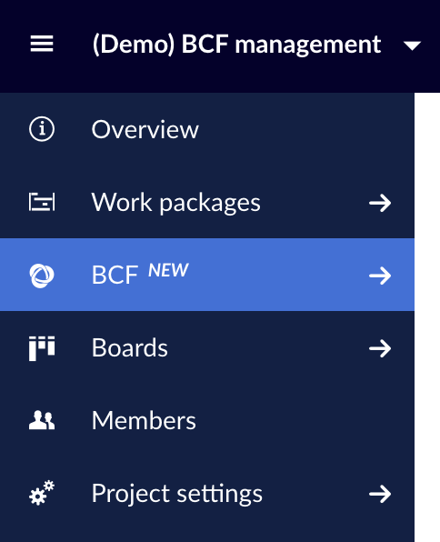

On the top of your OpenProject BCF page, you will find the actions menu where you can perform the most common BCF actions with a single click.

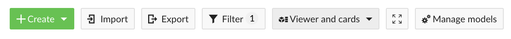
   

## Creating, editing and deleting bcf issues

First, create the type of work package you want to associate the BCF issue by clicking on the green **Create** button on top of the viewer. You can read all the details about how to create work packages [here](https://docs.openproject.org/user-guide/work-packages/create-work-package/#_ga=2.229992732.1840045846.1594806190-722332172.1586327332).

In the work package details form that will appear on the right side, you will be able to introduce all the work package details such as title, description, or assignee. In order **to attach IFC snapshots to the work package** you just have to focus the viewer on the point and perspective you want and click on the **\+ Viewpoint** button, right below the **title** input. This will add the snapshot to the gallery.

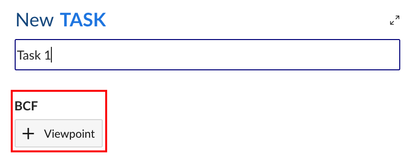

Once the snapshot has been created, you can click on it at any time to load the snapshot on Revit. You can also click on the rubbish icon to delete the snapshot from the gallery.

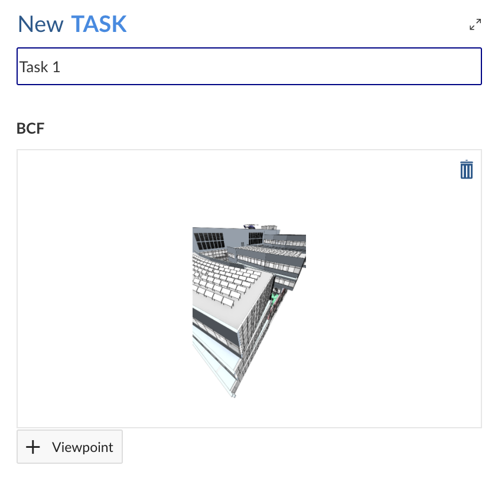

## Importing / exporting bcf issues

In order to **import BCF issues** to your project you just need to click on the **Import** button on top of the viewer. Then select the BCF file you want to upload (_BCF-XML v2.1_ format) and click on **Prepare import**. Once the BCF file has been prepared you will be able to examine its contents before performing the import.

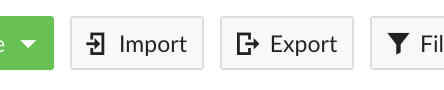

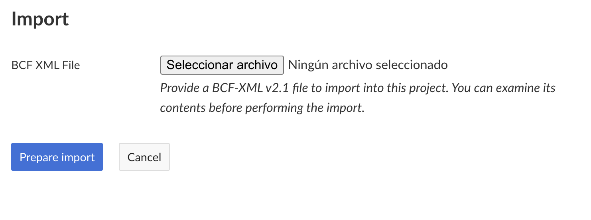

In order to **export your BCF issues**, just click on the **Export** button on top of the viewer button. This will prepare your BCF files and the download will start shortly after.

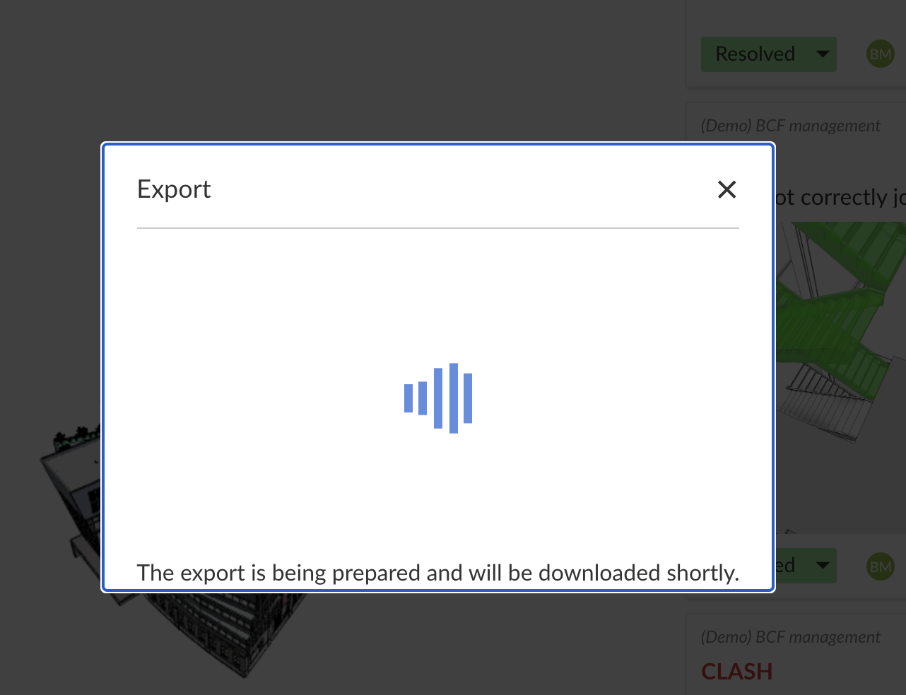

## Filtering bcf issues

Use the filter button to filter work your **BCF issues** by text, status, or any other filter. You can do really sophisticated things with filters, learn more [here](https://docs.openproject.org/api/filters/).

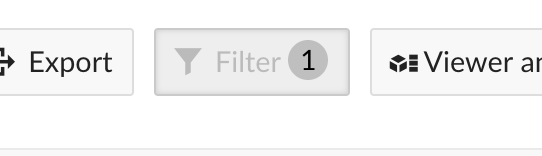

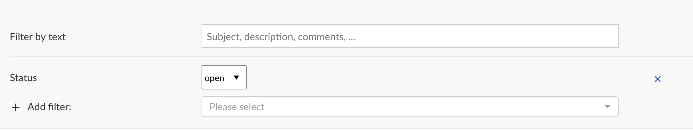

## Display modes

You can also change the **overall display mode** by choosing a different option on the display mode select on the top right corner. To switch to the full-screen mode, just click on the expand button beside the display mode select.

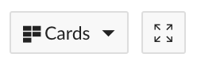
 

## Managing ifc models: adding, editing and removing ifc models

To manage your IFC models, click on the &#39;Manage models&#39; buttons, on the right side of the actions bar. Once on the models&#39; page, you&#39;ll be able to add, delete and edit your IFC models by clicking on the corresponding buttons.

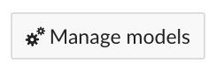

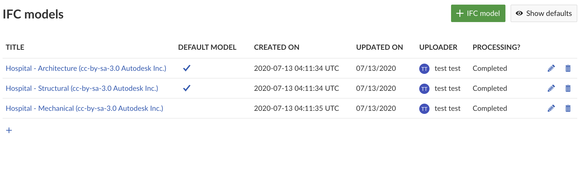

## Managing views

The viewer allows you to browse the IFC models through the keyboard arrows or by dragging the cube control placed on the bottom right corner. You can manage the zoom of the viewer with the mouse scroll.

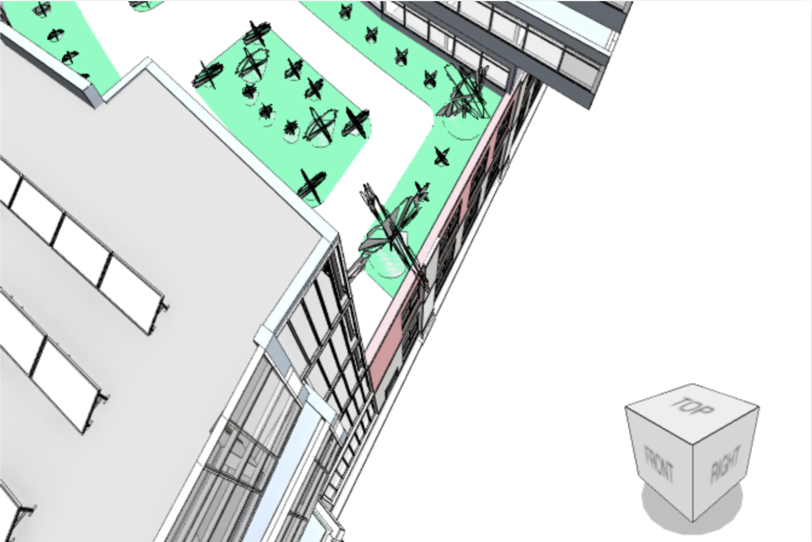

You can also **perform** **some actions on the viewer** through the toolbar placed on its top right corner. It contains buttons for actions that configure the view/perspective (reset, fit into view, toggle between 3D and 2D and first-person perspective) and for actions that configure the objects on display on the view (select, hide, query and slice).

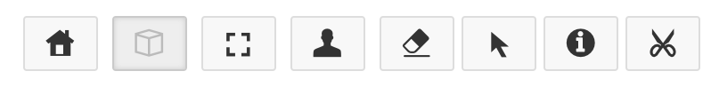

You can also configure the contents shown on the viewer through the BCF submenu on the left:

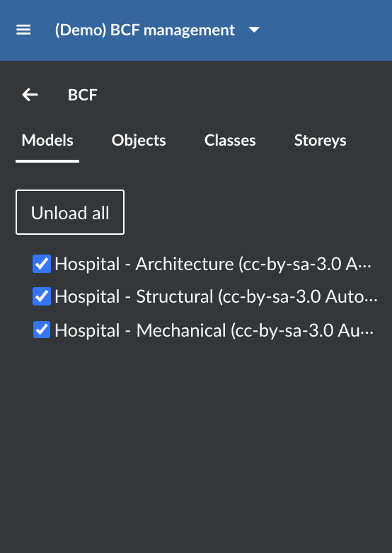

The BCF submenu allows you to choose which models, objects, classes, and storeys are displayed on the viewer just by checking or unchecking them.

The tab **models** shows the IFC models of the current project, the tab **objects** shows the tree structure of all elements in the IFC file, the tab **classes** shows all classes of all elements of the IFC file and, finally, the **storeys tab** shows all storeys/floors of the building.
