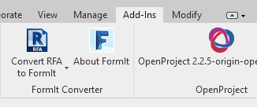
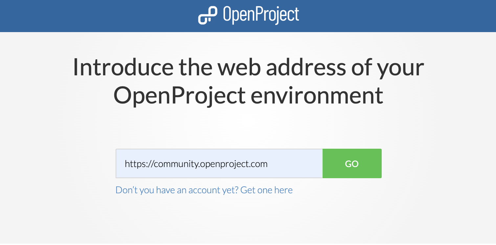

---
sidebar_navigation:
  title: Revit add-in
description: How to get started with the OpenProject Revit add-in
robots: index, follow
keywords: BCF, IFC, BIM, Revit
---

The _OpenProject Revit Add-In_ allows you to use the open source project management software _OpenProject BIM_ directly within your Revit environment. It lets you create, inspect and manage issues right in the moment when you can also solve them - when you have your Revit application fired up and the relevant BIM models open. Issues get stored as BCFs centrally and are available to every team member in real time - thanks to our browser based IFC viewer even to those team members without expensive Revit licenses. No BCF XML import/export is needed. However, you still can import and export BCF XML as you like and stay interoparable with any other BCF software.The _OpenProject Revit Add-In_ is released under the Open Source license GPL V3.

# Setting up openproject revit add-in

## Installation

Our Revit plugin is now in beta. If you would like to try it, please contact us at <bim@openproject.com>.

## Signing up

After installing the add-in please follow the steps below:

1\. Click on the **Add-Ins** tab of your _Revit_ and then click on the OpenProject add-in.

2\. Introduce the URL of your OP instance:  
For example, `http://**your-organization-name**.openproject.com` if you are using our SAAS edition. If you are using our Enterprise or Community edition, please ask your OpenProject admin for the correct URL.

If you don&#39;t have an _OpenProject BIM_ instance already, you can get one hosted in our cloud in just a few clicks. Please click on the &quot;Don&#39;t you have an account yet? Get one here&quot; link. On the OpenProject site, please introduce the name of your organization and follow the registration steps. Once the registration is done, please come back to the _OpenProject BIM Revit Add-In_ and introduce the URL of your OP instance, just as indicated above in step 2.

3\. Click on the &#39;GO&#39; button:  
This will load your OpenProject instance where you will be able to log in and access your work packages and BCF issues.

## Using Openproject Revit add-in

Once you selected or created your project you will find the _BCF_ module in the project&#39;s main menu on the left hand side and you are ready to go.

To learn how to manage BCF on OpenProject, please checkout our [separate guide](../).