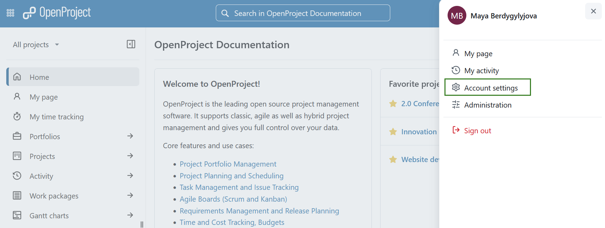

---
sidebar_navigation:
  title: Account settings
  priority: 999
description: Learn how to configure account settings.
keywords: my account, account settings, change language
---

# Account settings

Change your personal settings under Account settings (earlier called My account). Here you can adapt, e.g. the language, edit notifications, or add an avatar. Moreover you can manage access tokens and sessions.

| Topic                                                      | Content                                                      |
| ---------------------------------------------------------- | ------------------------------------------------------------ |
| [Open account settings](open-account-settings)            | How to open your personal settings in OpenProject            |
| [Edit your user information](account)                      | How to change the name, email address in OpenProject         |
| [See schedule and availability](schedule-and-availability) | How to see and manage your schedule and availability in OpenProject |
| [Language and region](language-and-region)                 | How to change the language and the time zone in OpenProject  |
| [Security](security)                                       | How to change your password and set up two factor authentication in OpenProject |
| [Access tokens](access-tokens)                             | How to set up access tokens in OpenProject                   |
| [Session management](session-management)                   | How to manage your OpenProject sessions                      |
| [Notification and email](notification-and-email)           | How to change in-app notifications and email reminders in OpenProject |
| [Set an Avatar](account#set-an-avatar)                     | How to set an avatar in OpenProject and change the profile picture |
| [Delete account](account#delete-account)                   | How to delete my own account                                 |

## Open account settings

To open your personal settings in OpenProject, click on your user icon in the top right corner in the header of the application.

Choose **Account settings**.

