---
sidebar_navigation:
  title: Access tokens
  priority: 400
description: Learn how to manage access tokens in OpenProject.
keywords: my account, account settings, change language
---

# Access tokens

To view and manage your OpenProject access tokens navigate to **Account settings** and choose **Access tokens** from the menu. Access tokens allow you to grant external applications access to resources in OpenProject. 

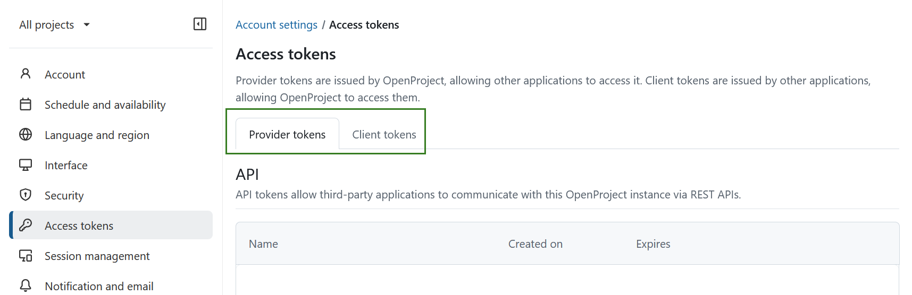

Access tokens are organized into two tabs: Provider tokens and Client tokens. Provider tokens are generated by OpenProject and enable other applications to connect to it. Client tokens are generated by external applications and allow OpenProject to connect to them.

## Provider tokens

Provider tokens are created in OpenProject and allow external applications to access OpenProject. They include API, iCalendar, iCalendar for meetings, OAuth, and RSS tokens.

### API

API tokens allow third-party applications to communicate with this OpenProject instance via REST APIs. If no API tokens were created yet, this list will be empty. You can enable API REST web service and CORS under [_Administration -> API and webhooks_](../../../system-admin-guide/api-and-webhooks/).

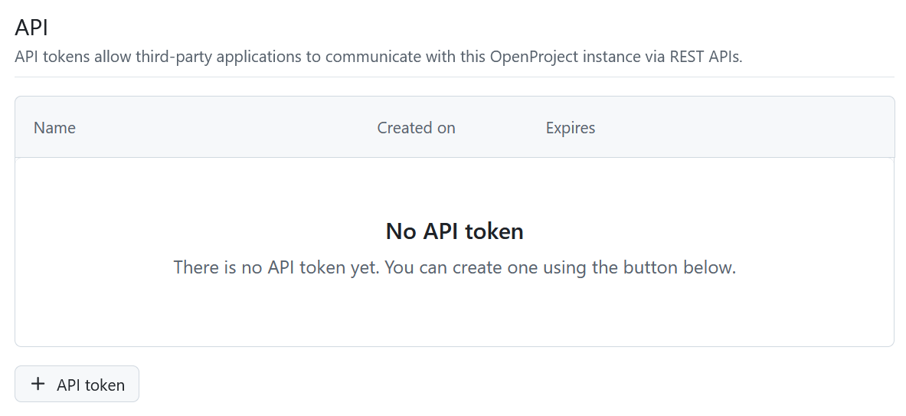

To create a new API Token, click the **+ API Token**, name the token in the form that opens and click _Create_ button. 

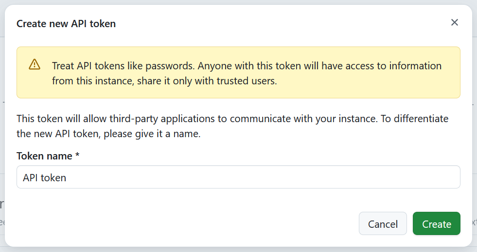

A new API token will be generated and displayed. Please keep in mind that each token will only be displayed once when it is created, so it's important to copy and safely save it. Should you lose this information, you CAN delete old tokens and generate new ones. 

> [!TIP]
> We recommend using each token only for one purpose (e.g. a single application), so that you know exactly what needs to be replaced, should you need to delete it. 

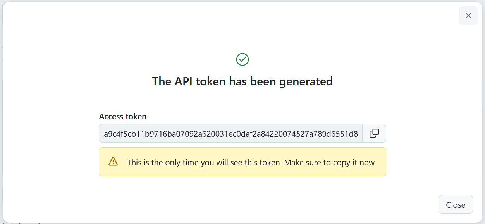

### iCalendar

iCalendar tokens allow users to subscribe to OpenProject calendars and view up-to-date work package information from external clients.
This list will be empty if you have no calendar subscriptions yet. 

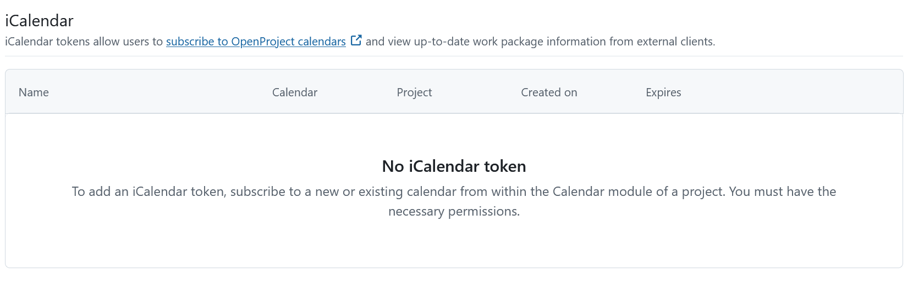

Once you [subscribe to a calendar](../../calendar/#subscribe-to-a-calendar), a list of all the calendars that you have subscribed to will appear here. The name of the calendar is clickable and will lead you directly to the respective calendar in OpenProject.

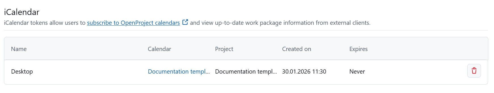

You can delete an entry in the iCalendar list by clicking on the **Delete** icon. This will trigger a warning message asking you to confirm the decision to delete.  By deleting this token you will no longer have access to OpenProject information in all the linked clients using this token.

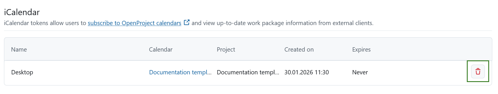

You will then see a message informing you that the the token und the iCal URL are now invalid.

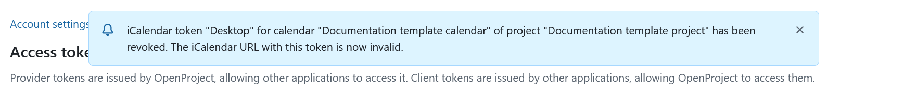

### iCalendar for meetings

iCalendar meeting tokens allow users to subscribe to all their meetings and view up-to-date meeting information in external clients. 

This list will be empty if you have no calendar subscriptions yet. Once you subscribe to a meetings calendar, a list of all the iCalendar meeting tokens will appear here. 

To subscribe click the **Subscribe to calendar** button directly in your account settings or in the [meetings module](../../meetings/#subscribe-to-meetings). 

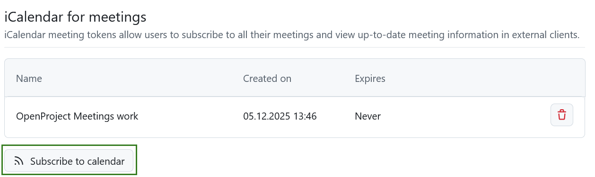

You can then name the subscription meeting token and click **Create subscription**.

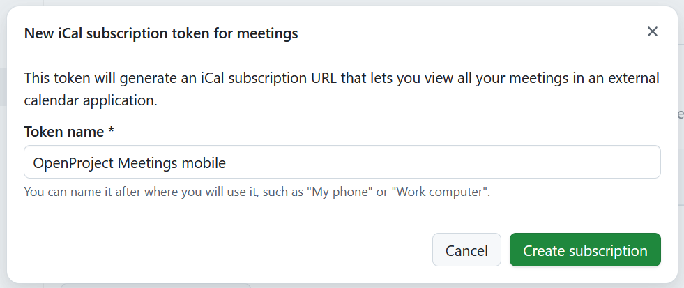

You will then see the newly generated token. 

> [!IMPORTANT]
> This is the only time that it will be displayed. Make sure that you copy it and safely save it. 

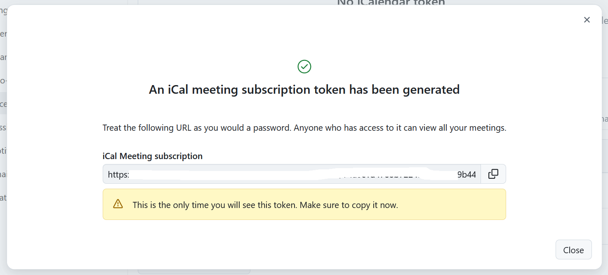

To delete an iCal meeting token under Account settings click the _Delete_ icon next to the respective token name. 

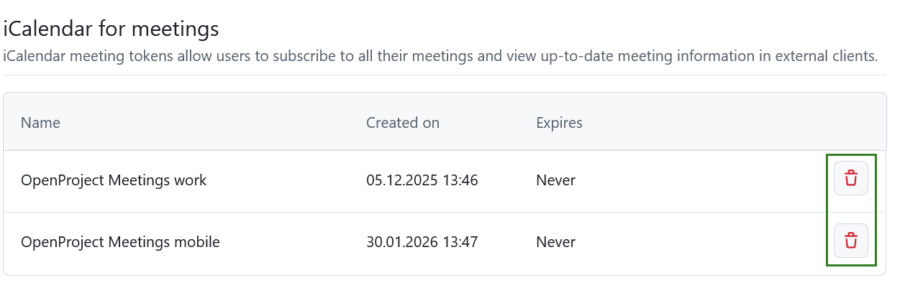

### OAuth

OAuth tokens allow third-party applications to connect with this OpenProject instance, for example Nextcloud (see [here](../../file-management/nextcloud-integration/) how to set up Nextcloud integration).  OAuth applications can be created under [_Administration-> Authentication_](../../../system-admin-guide/authentication/).

OAuth tokens are not created directly in OpenProject. Instead, the authorization process is started from the external application. During setup, you will be redirected to OpenProject to confirm access and then returned to the external application to complete the connection.

If no third-party application integration has been activated yet, this list will be empty. Please contact your administrator to help you set it up. 

Once integrations exist, their tokens will appear here. You can revoke access at any time by selecting the **Delete** icon. Removing a token immediately removes the external application’s permission to act on your behalf, meaning it can no longer make API calls in your name. If you want to use the integration again, you will need to authorize it again.

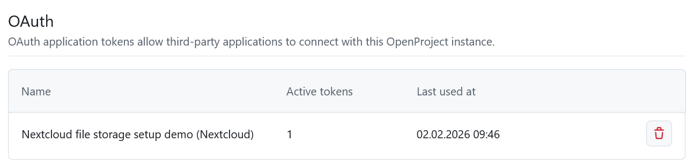

### RSS

RSS tokens allow users to keep up with the latest changes in this OpenProject instance via an external RSS reader.  You can only have one active RSS token.

Create a new token by clicking the **RSS token** button. 

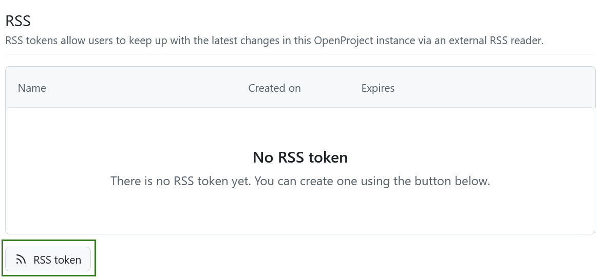
This will create your token and trigger a message showing you the access token.

> [!IMPORTANT]
> You will only be able to see the RSS access token once, directly after you create it. Make sure to copy it.

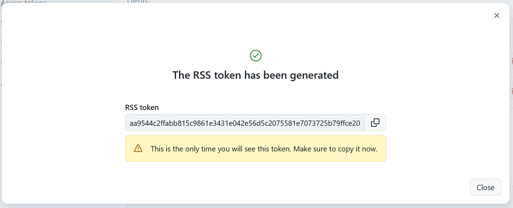

Once an  RSS token was created, you will see the details here and will be able to delete it by clicking the **Delete** icon.

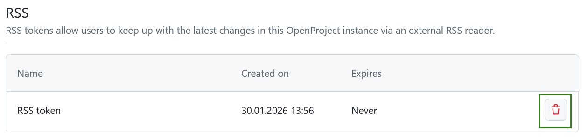

## Client tokens 

Client tokens are generated by external applications and enable OpenProject to connect to them.

### OAuth

OAuth client tokens allow this OpenProject instance to connect with external applications.

If you have not yet linked your account to any of the integrations activated for your instance, this list will be empty. You can delete tokens by clicking the **Delete** icon.

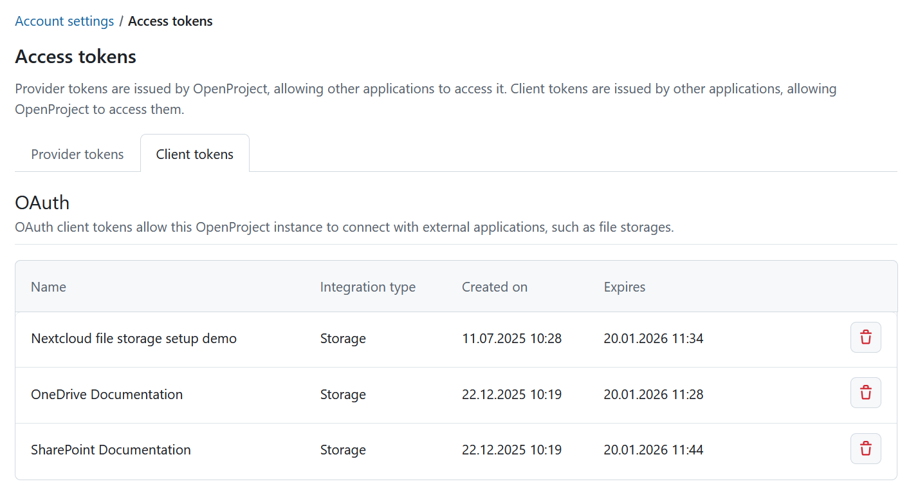
