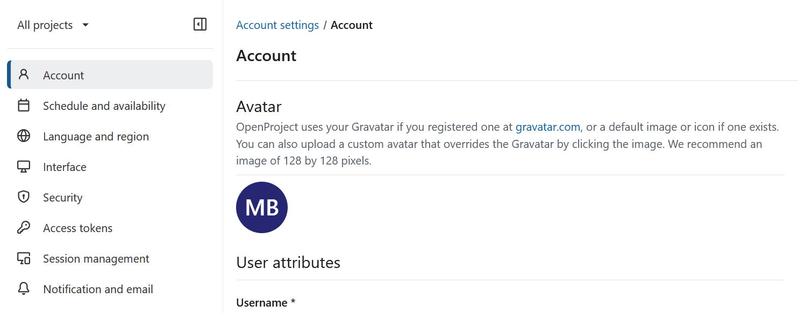
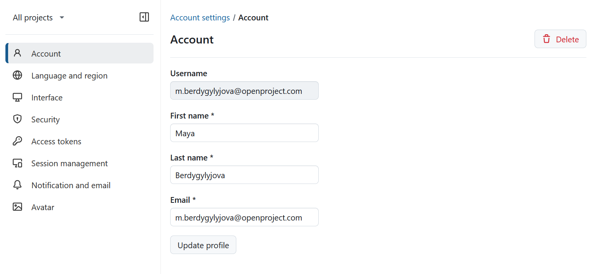
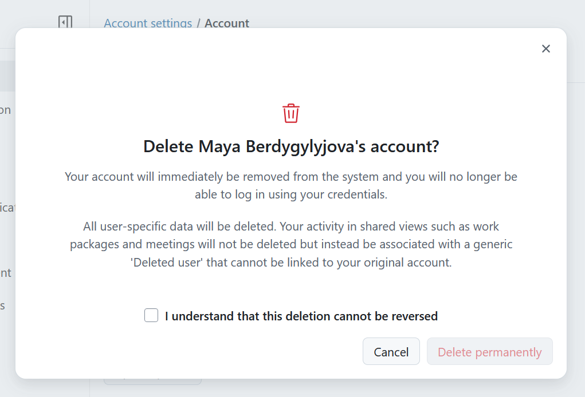

---
sidebar_navigation:
  title: Account settings
  priority: 900
description: Learn how to configure user attributes and avatar in OpenProject.
keywords: my account, account settings, avatar
---

# Account

## Set an avatar

To change your profile picture in OpenProject, navigate to **Account settings** and select **Account** from the left-hand menu.

If your OpenProject administrator has enabled Gravatar, OpenProject can display your Gravatar if you have registered one with the same email address at [gravatar.com](https://documentation.openproject-edge.com/external_redirect?url=https%3A%2F%2Fgravatar.com%2F). If no Gravatar image is available, Gravatar displays its configured default avatar.

To use a different profile picture, click your current avatar to upload a custom image. A custom avatar overrides your Gravatar.

> [!TIP]
> For the best results, use an image that is 128 × 128 pixels. Larger images will be cropped automatically.

## User attributes

To change your email address or your name, navigate to **Account** on the left side menu of **Account settings** page and scroll to **User attributes** section.

Here you can **update** or delete your profile. If you're changing the email address of your account, you will be requested to confirm your account password before you can continue. 

> [!NOTE] 
> This applies only to internal accounts where OpenProject can verify the password.

> [!TIP]
> Please note that 'Hide my email' checkbox was removed from account settings with OpenProject 15.0.  The function was replaced by [the new Standard global role](../../../system-admin-guide/users-permissions/roles-permissions/#standard), which regulates this permission on an instance level. 

## Delete account

You can delete your own account in **Account settings**.

To delete your account, navigate to _Account settings_ -> _Account_ and click the **Delete** button in the top right corner.  You will be asked to confirm that you understand that this deletion is permanent. 

> [!WARNING]
> Deleting a user account is permanent and cannot be reversed.

If you cannot see the entry **Delete** button under your **Account settings**, make sure the option "Users allowed to delete their account" is [activated in the administration](../../../system-admin-guide/users-permissions/settings/#user-deletion).
