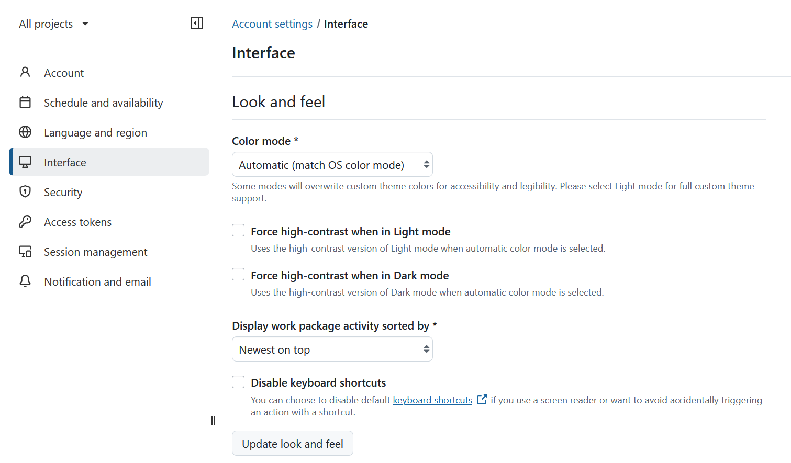
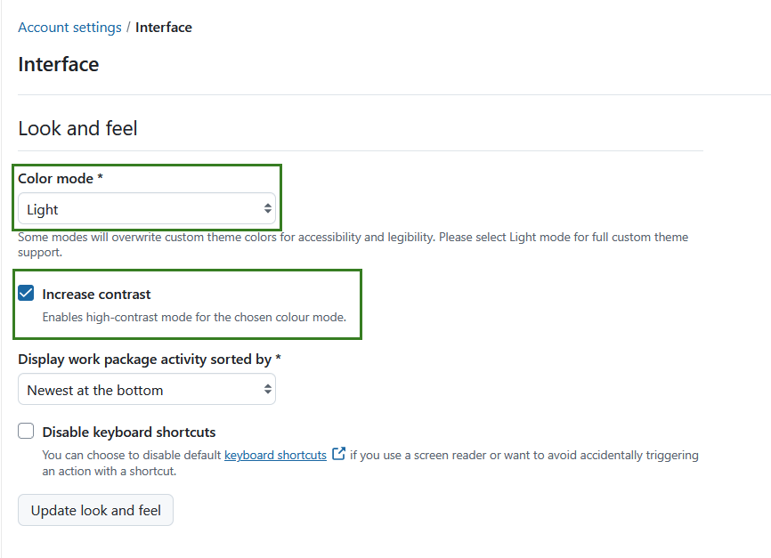
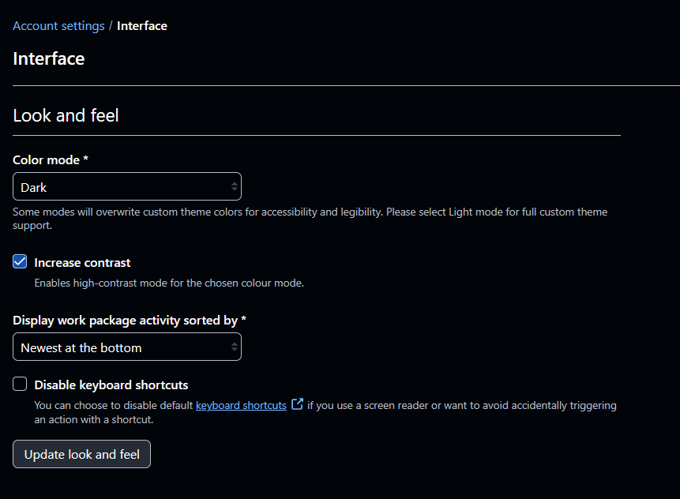
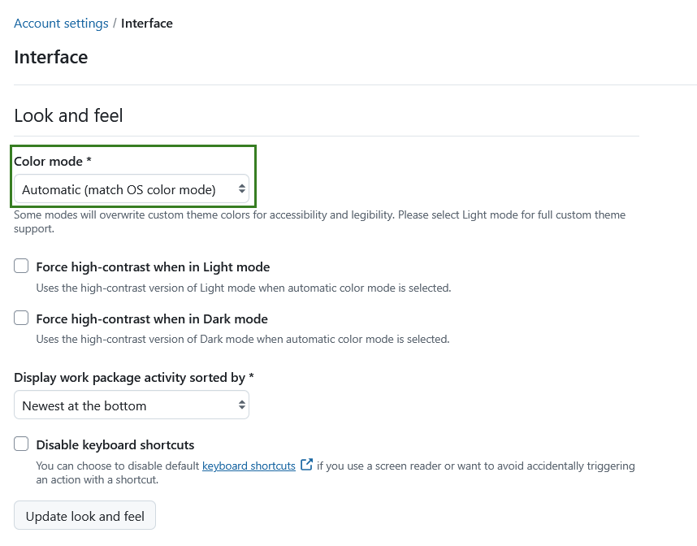
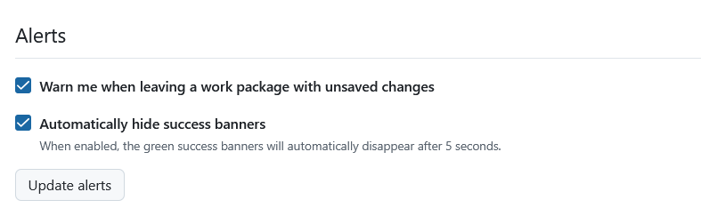

---
sidebar_navigation:
  title: Interface
  priority: 600
description: Learn how to configure user interface in OpenProject.
keywords: my account, account settings, change language
---

# Interface

Under the **Interface** section of project settings you can adjust the color mode, activate alerts and adjust backlog settings. Settings here are grouped into two sections: _Look and feel_ and _Alerts_.

## Look and feel

In the **Look and feel** section under **Interface** in your profile settings (accessible via the left-hand menu), you can select your preferred display color mode and adjust the order in which comments appear in the **Activity list** for work packages.

You can also **disable keyboard shortcuts** . This is useful if you rely on a screen reader or want to avoid triggering actions by accident.

Click **Update look and feel** to save your changes.

### Select the high contrast color mode

In the dropdown menu **Color mode** you can pick the color mode. The default setting is the **Light mode**. You can increase the contrast by activating the **Increase contrast** setting, which will significantly increase the contrast and override the color theme of the OpenProject instance for you.

This mode is recommended for users with visuals impairment.

### Select the dark mode

In the dropdown menu **Color mode** you can pick the color mode. The default setting is **Light mode**. You can also alternatively select **Dark** mode and activate the **Increase contrast** setting for the **Dark high contrast** mode.

> [!NOTE]
> Custom colors and themes are only supported in Light mode and changing color modes may override most or all custom configuration. Only some colors (accent and primary button color) are kept but adapted for appropriate contrast in certain modes like dark mode.

### Select automatic color mode

In the dropdown menu Color mode, you can now also select the **Automatic option, which will match the color mode of your operating system**. 

If this option is selected, OpenProject will automatically match your operating system’s light or dark theme, including the system's contrast settings. You will also see additional settings to force high-contrast when Light or Dark mode is selected — this would ensure that OpenProject always increases contrast in automatic mode, regardless of the system contrast settings.

If your operating system is set to high contrast mode, OpenProject will also automatically switch to the corresponding high contrast mode (light or dark).

> [!NOTE]
> This is a user-specific preference and only affects your own account.

### Change the order to display comments

You can select the order of the comments (for example of the comments for a work package which appear in the Activity tab). You can select the **newest at the bottom** or **newest on top** to display the comments.

If you choose newest on top, the latest comment will appear on top in the Activity list.

### Disable keyboard shortcuts

If you use a screen reader or want to avoid accidentally triggering an action with a  shortcut, you can choose to disable default [keyboard shortcuts](../../keyboard-shortcuts-access-keys/) by selecting the respective option.

## Alerts

Under **Alerts** section you can activate a **warning if you are leaving a work package with unsaved changes**.

Additionally, you can activate to **auto-hide success notifications** from the system. This (only) means that the green pop-up success notifications will be removed automatically after five seconds.
> [!TIP]
> Even if auto-hide is enabled, banners remain visible while you hover over them or move your mouse pointer over them. This gives you more time to read the message before it disappears.
