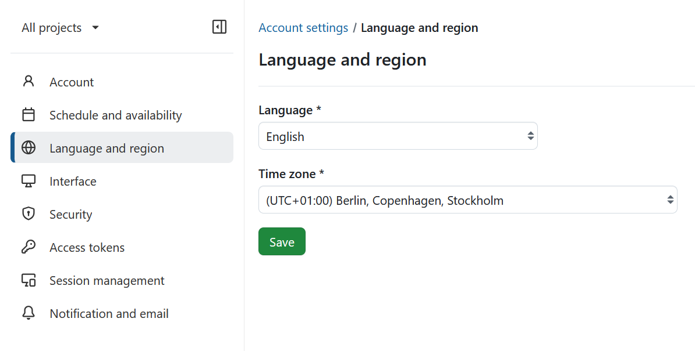

---
sidebar_navigation:
  title: Language and region
  priority: 700
description: Learn how to configure language and region settings in OpenProject.
keywords: my account, account settings, change language, region settings, time zone
---

# Language and region settings

Within the **Language and region** section of **Account settings** page you can change the language of OpenProject and adapt the time zone.

## Change your language

To change the language in OpenProject, navigate to the **Account settings** and choose the menu point **Language and region**.

Here you can choose between multiple languages.

OpenProject is translated to more than 30 languages, like German, Chinese, French, Italian, Korean, Latvian, Lithuanian, Polish, Portuguese, Russian, Spanish, Turkish and many more. If you do not see your preferred language in your account settings, the language needs to be activated by your system administrator in the [system's settings](../../../system-admin-guide/system-settings/languages/).

Pressing the **Save** button will save your changes.

If you want to help us to add further languages or to add the translations in your language, you can contribute to the Crowdin translations project [here](https://crowdin.com/project/openproject).

## Change your time zone

You can choose a time zone in which you work from the dropdown menu of the respective field.

Pressing the **Save** button will save your changes.
