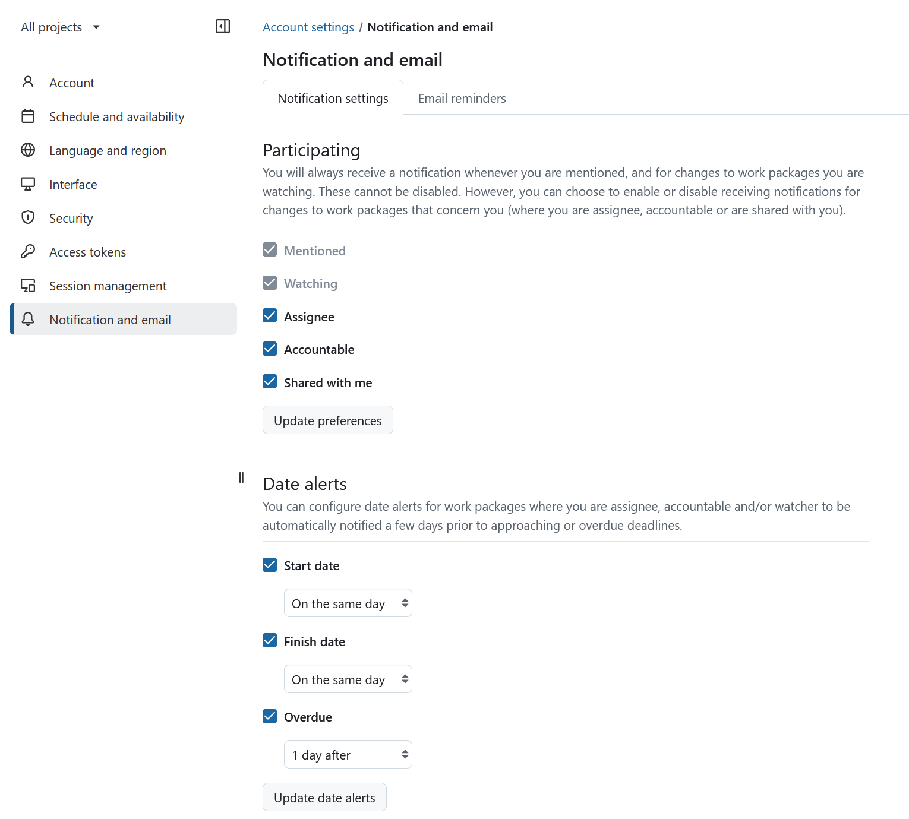
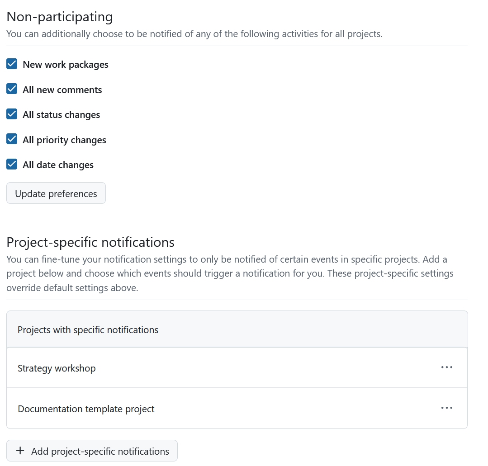
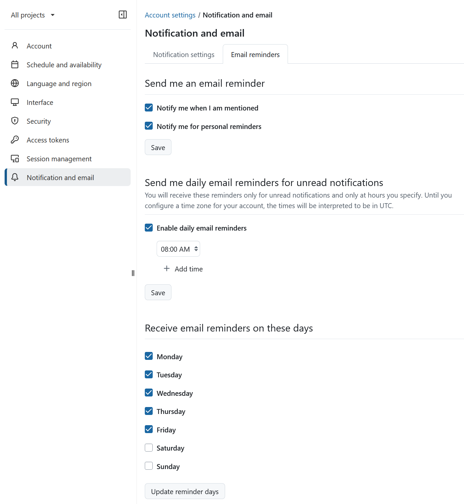
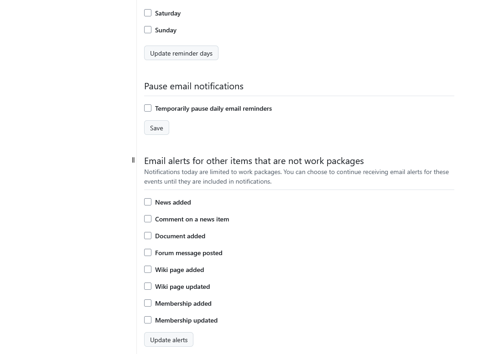

---
sidebar_navigation:
  title: Notification and email
  priority: 200
description: Learn how to configure notifications and email alerts in OpenProject.
keywords: my account, account settings, notifications, email, alert, update, reminder, email reminder
---

# Notification and email

To configure the notifications and email reminders you receive from OpenProject, open **Account settings** and choose **Notification and email**.

## Notification settings

To learn how the Notification center works, see [In-app notifications](../../notifications/). To choose which events notify you, see [Notification settings](../../notifications/notification-settings/).

## Email reminders

To configure email reminders, switch to the **Email reminders** tab. Your system administrator can also configure these settings for you or change the global defaults.

You can choose between several email reminders.

By default, daily email reminders are enabled at 2:00 a.m., Monday through Friday.

You can choose to receive emails immediately, or only on certain days and times, temporarily pause reminder emails, or opt for no reminders at all.

> [!IMPORTANT]
> If you have selected the _immediately when someone mentions me_ option, you will only be notified once, i.e. this reminder will not be duplicated in a daily reminder.

You can also opt-in to receive **email alerts for other items (that are not work packages)** whenever one of your project members:

- **News added** - ...adds or updates news in the [News Page](../../news/)
- **Comment on a news item** - ...adds a comment on a news item
- **Documents added** - ...adds a document to the project
- **New forum message** - ...sends a new message into the [Forum](../../forums/)
- **Wiki page added** - ...adds a new [Wiki page](../../wiki/)
- **Wiki page updated** - ...updates a [Wiki page](../../wiki/)
- **Membership added** - ...adds you as a [member of a project](../../members/)
- **Membership updated** - ...updates your project membership
