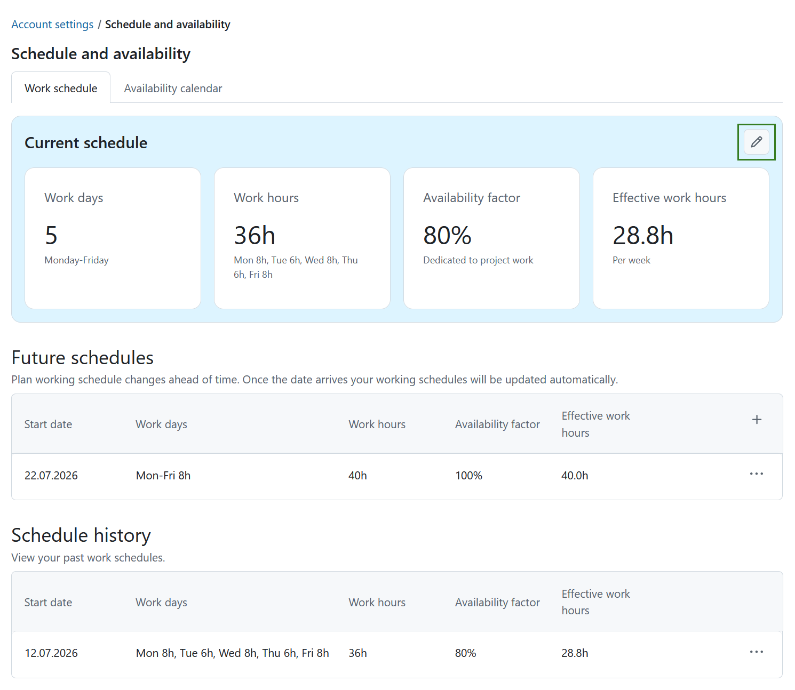
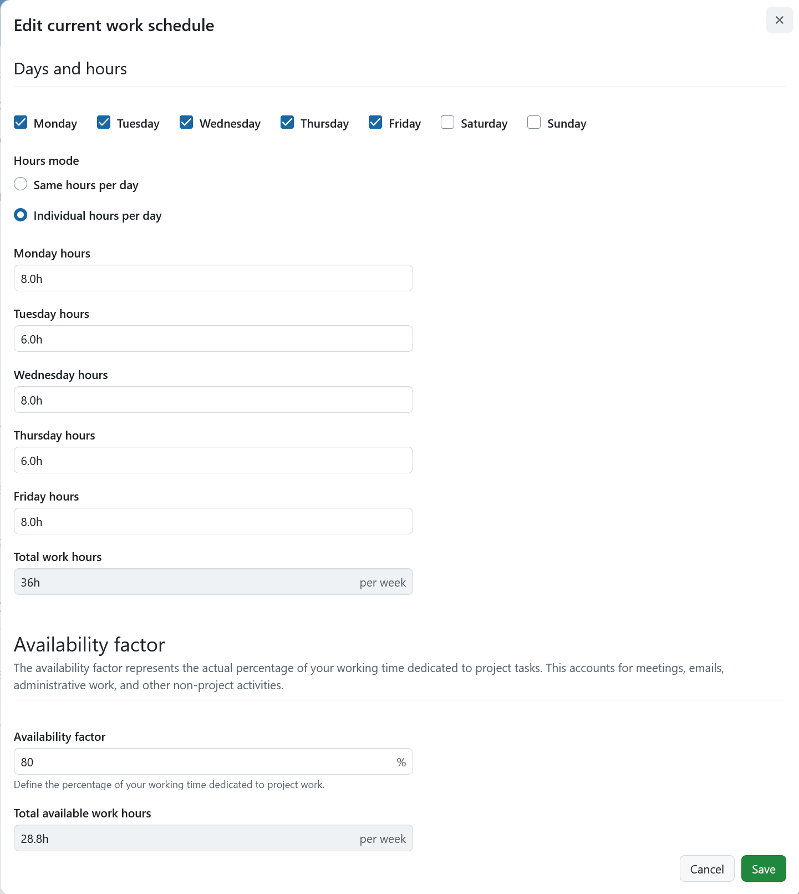
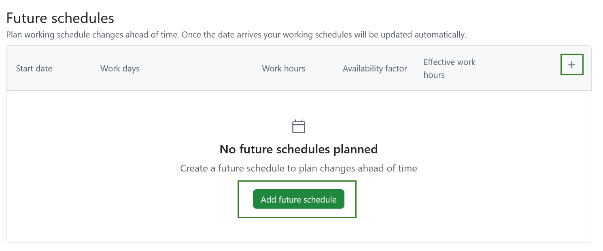
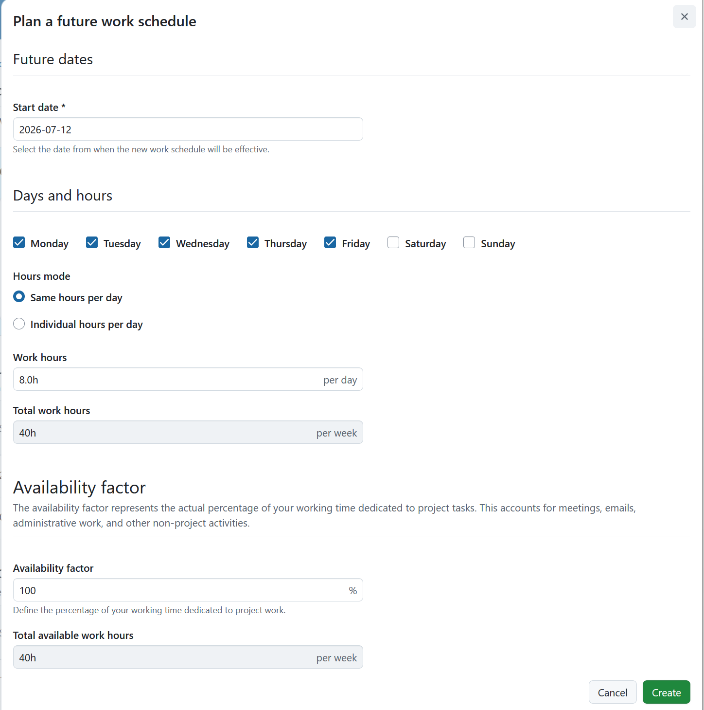
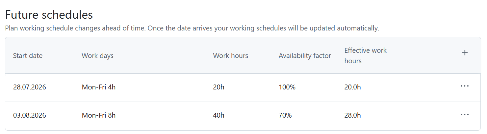
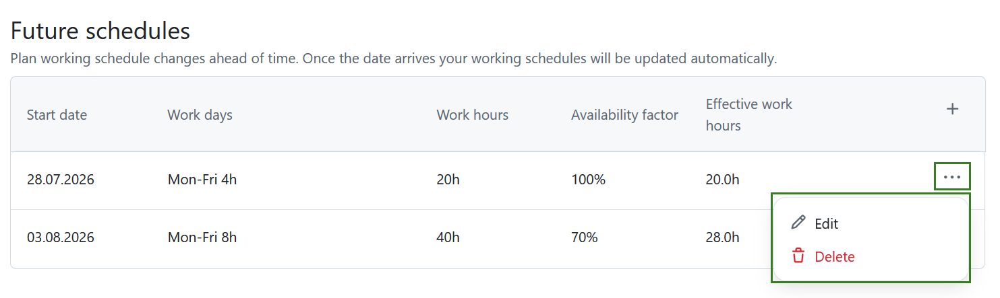
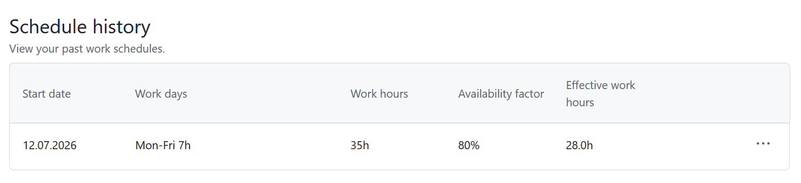
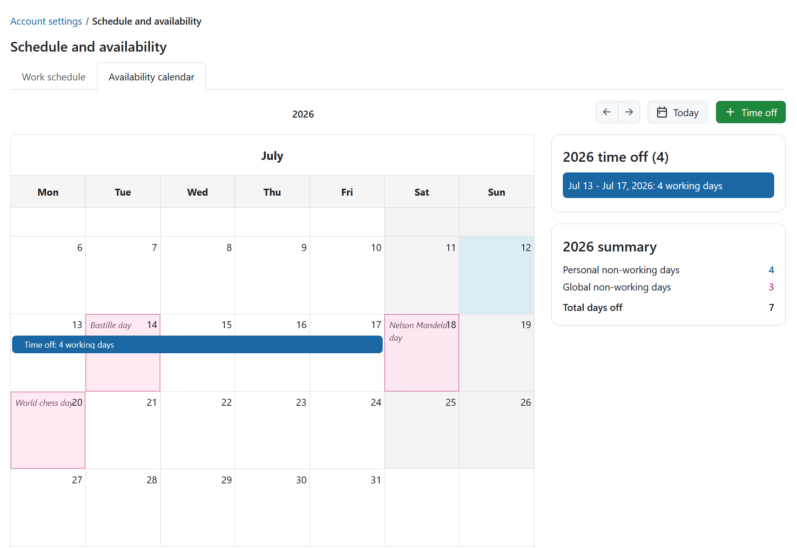
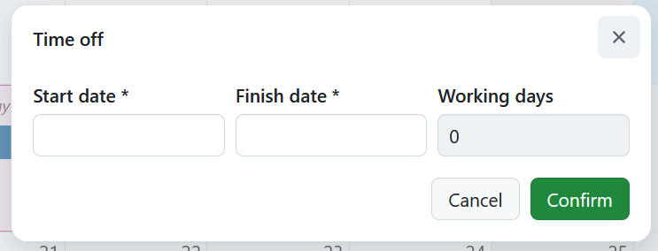

---
sidebar_navigation:
  title: Schedule and availability
  priority: 800
description: Learn how to configure your work schedule, availability, and time off in OpenProject.
keywords: schedule, availability, working hours, work schedule, working time, calendar, capacity, resources, time off
---

# Schedule and availability

The **Schedule and availability** page allows you to define your working schedule, plan future schedule changes, and manage your time off.

To access your schedule settings, navigate to **Account settings** → **Schedule and availability**.
> [!NOTE]
> Depending on your organization's configuration and your permissions, you may only be able to view your schedule and availability. If your working schedule is managed externally or you do not have permission to edit it, the editing options described on this page are not available.
The page consists of two tabs:

- **Work schedule**
- **Availability calendar**

## Work schedule

On the **Work schedule** tab, you can manage your current working schedule, plan future schedule changes, and review your schedule history.

This page is divided into three sections:

- Current schedule
- Future schedules
- Schedule history

### Current schedule

The **Current schedule** section summarizes your active working schedule in four cards:

- **Work days** – Your configured working days.
- **Work hours** – The number of hours you work per day.
- **Availability factor** – The percentage of your working time dedicated to project work.
- **Effective work hours** – Your available project hours after applying the availability factor.

To edit your current schedule, click the **Edit** icon.

The **Edit current work schedule** dialog opens.

Configure the following settings:

- **Days and hours** – Select the days of the week that are considered working days.
- **Hours mode** – Choose how your working hours are defined:
  - **Same hours per day** – Apply the same number of working hours to every working day.
  - **Individual hours per day** – Define different working hours for each working day.
- **Availability factor** – Represents the percentage of your working time that is available for project work. This accounts for meetings, emails, administrative tasks, and other non-project activities.

The total weekly working hours are calculated automatically.

Enter the desired percentage in the **Availability factor** field.

The **Total available work hours** value is updated automatically based on your working hours and availability factor.

Click **Save** to apply your changes or **Cancel** to discard them.

### Future schedules

The **Future schedules** section allows you to plan changes to your working schedule in advance.

> [!TIP]
> Plan your working schedule changes ahead of time. Once the date arrives, your working schedule will be updated automatically.

The table displays the following information:

- Start date
- Work days
- Work hours
- Availability factor
- Effective work hours

To create a future schedule:

- Click **+ Add future schedule** when no future schedules have been created yet.
- Once at least one future schedule exists, click the **+** icon in the table header.

The **Plan a future work schedule** dialog opens.

Select a **Start date** from which the new work schedule should take effect.

Then configure your working days, working hours, and availability factor in the same way as for your current schedule.

Click **Create** to schedule the change or **Cancel** to close the dialog without saving. 

Once saved, the future schedule appears in the table.

Click the **More** (**⋯**) menu at the end of a row and select **Edit** or **Delete** to modify or remove a planned schedule.

### Schedule history

The **Schedule history** section provides a record of all previous working schedules.

The table includes:

- Start date
- Work days
- Work hours
- Availability factor
- Effective work hours

Each entry represents a previous schedule that was active.

Click the **More** (**⋯**) menu at the end of a row and select **Edit** or **Delete**.

## Availability calendar

The **Availability calendar** provides a yearly overview of your non-working days, including your personal time off and company-wide non-working days, such as public holidays.

Above the calendar, you can:

- View the selected year.
- Navigate to the previous or next year using the arrow buttons.
- Click **Today** to return to the current year.
- Click **+ Time off** to add personal time off.

On the right side of the calendar, two summary panels display your yearly totals:

- **Time off** – The total number of personal time off days for the selected year.
- **Summary** – An overview of:
  - Personal non-working days
  - Global non-working days
  - Total days off

### Add time off

To add personal time off, click **+ Time off**. 

In the form that opens, specify the following information:

- **Start date**
- **Finish date**

The number of affected working days is calculated automatically.

Click **Confirm** to add the time off or **Cancel** to close the dialog without saving.

After saving, the time off entry appears in the calendar and the summary panels are updated automatically.

To modify or remove an existing time off entry, click it in the calendar and edit or delete it as needed.