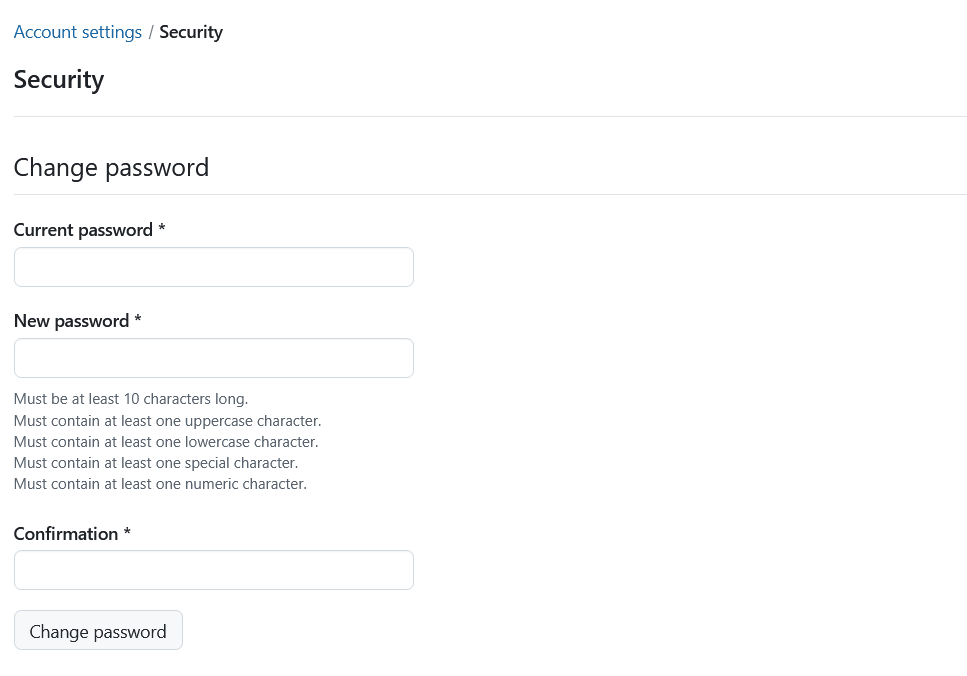
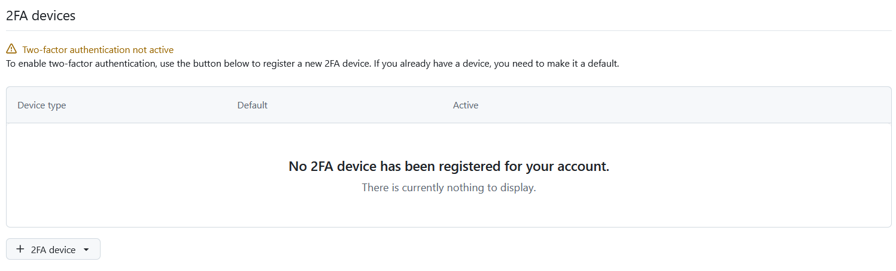
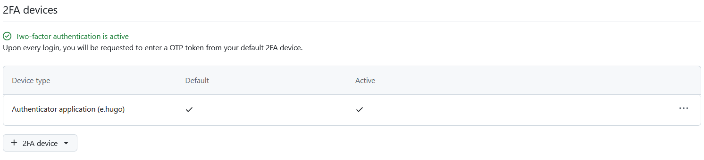
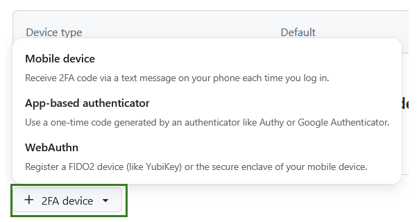
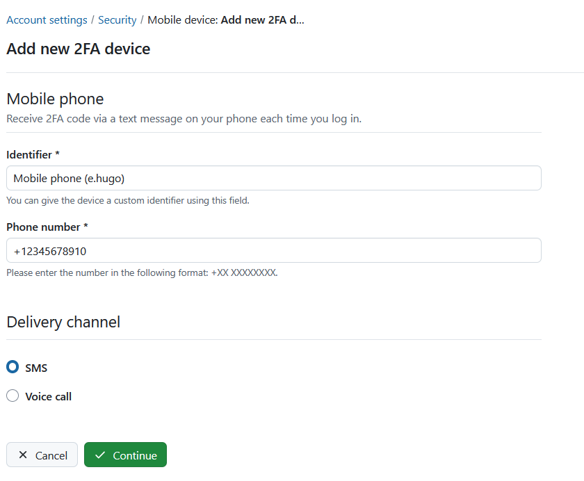
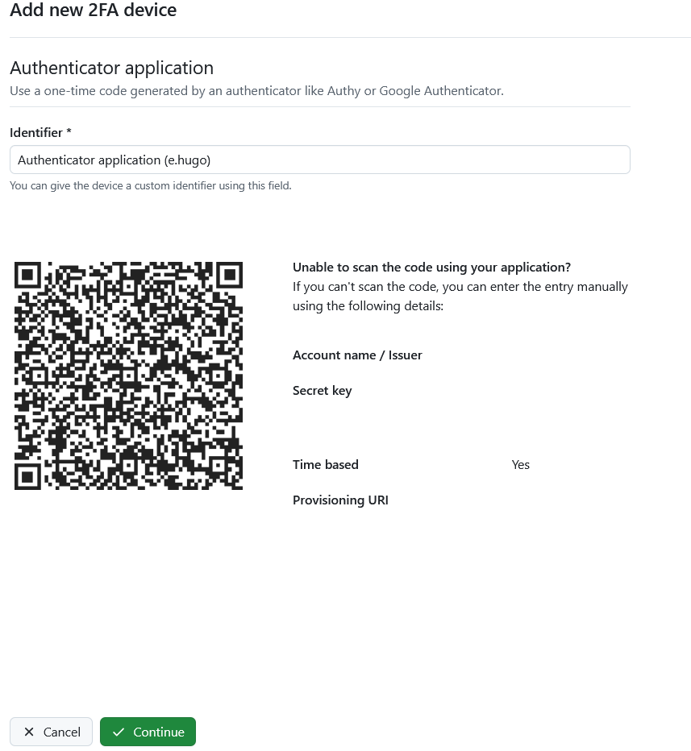
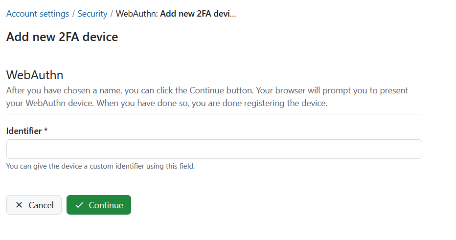
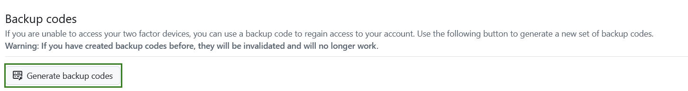

---
sidebar_navigation:
  title: Security
  priority: 500
description: Learn how to change your password and manage two-factor authentication.
keywords: my account, account settings,security, password, 2fa, two factor, two-factor authentication, backup
---

# Security

To reset your password, add a two-factor authentication and generate backup codes, navigate to  **Account settings** and choose **Security** in the menu.

## Change password

Enter your current password.

Enter your new password and ensure all password requirements are met.

Confirm it a second time.

Press the **Change password** button in order to confirm the password changes.

> [!NOTE]
> You cannot reset your Google password in OpenProject. If you authenticate with a Google/Gmail account, please go to your Google account administration in order to change your password.

## Two-factor authentication devices

In order to activate the two-factor authentication for your OpenProject installation, click the  **+2FA device** button.  If you have not added any device yet, this list will be empty.

If you have already registered one or multiple 2FA devices, you will see the list of all activated 2FA devices here. You can change, which of them you prefer to have set as a default option.

In order to register a new device for two-factor authentication, click the **+ 2FA device** button and select one of the options. The options you see will depend on what your system administrator has [activated for your instance](../../../system-admin-guide/authentication/two-factor-authentication/):

- Mobile phone
- App-based authenticator
- WebAuthn

You can remove or approve 2FA applications by confirming your password. Note that this applies only to internally authenticated users.

### Use your mobile phone

You can use your mobile phone as a 2FA device. The field _Identifier_ will be pre-filled out, you will need to add your phone number, choose a preferred delivery channel and click the green **Continue** button.

### Use your app-based authenticator

Register an application authenticator for use with OpenProject using the time-based one-time password authentication standard. Common examples are Google Authenticator or Authy. 

Open your app and follow the instructions to add a new application. The easiest way is to scan the QR code. Otherwise, you can register the application manually by entering the displayed details.

Click the green **Continue** button to finish the registration.

### Use the WebAuthn authentication

Use Web Authentication to register a FIDO2 device (like a YubiKey) or  the secure enclave of your mobile device as a second factor. After you have chosen a name, you can click the green **Continue**  button.

Your browser will prompt you to present your WebAuthn device (depending on your operational system and your browser, your options may vary). When you have  done so, you are done registering the device.

## Backup codes

If you are unable to access your two-factor devices, you can use a backup code to regain access to your account. Click the **Generate backup codes** button to generate a new set of backup codes.

If you have created backup codes before, they will be invalidated and will no longer work.

