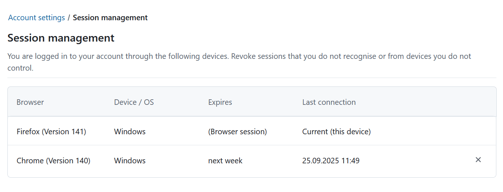

---
sidebar_navigation:
  title: Session management
  priority: 300
description: Learn how to manage your sessions in OpenProject.
keywords: my account, account settings, sessions
---

# Session management

To view and manage your OpenProject sessions navigate to **Account settings** and choose **Sessions management** from the menu.

Here you can view and manage all of your active and remembered sessions in one place. Each row shows the browser, device, expiration date and last connection timestamp. For your current session the “Last connection” column displays **“Current (this device)”**.

You can revoke a session at any time by clicking the **×** icon at the end of the row. Hover over the icon to see the **“Revoke”** tooltip. When you click, a confirmation message appears.

Sessions expire automatically according to your instance’s authentication settings. Remembered sessions show their expiration in relative time (for example “in 5 days”).

> [!NOTE]
> Closing a browser does not necessarily terminate the session. It might still be displayed in the list and will be reactivated if you open the browser. This depends on both your browser's and the OpenProject instance's settings.
