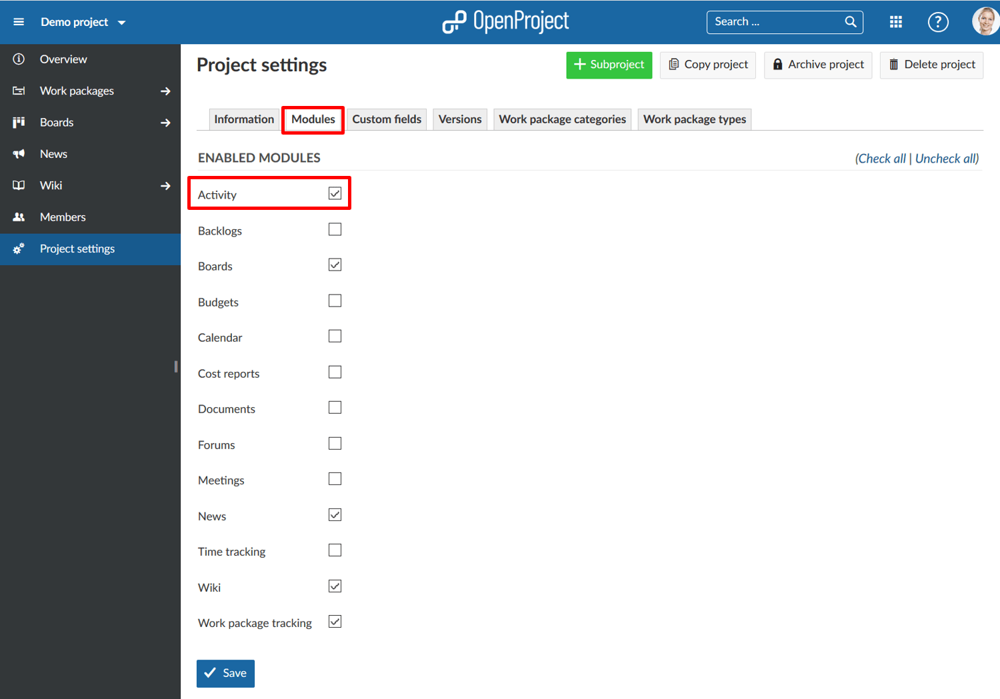
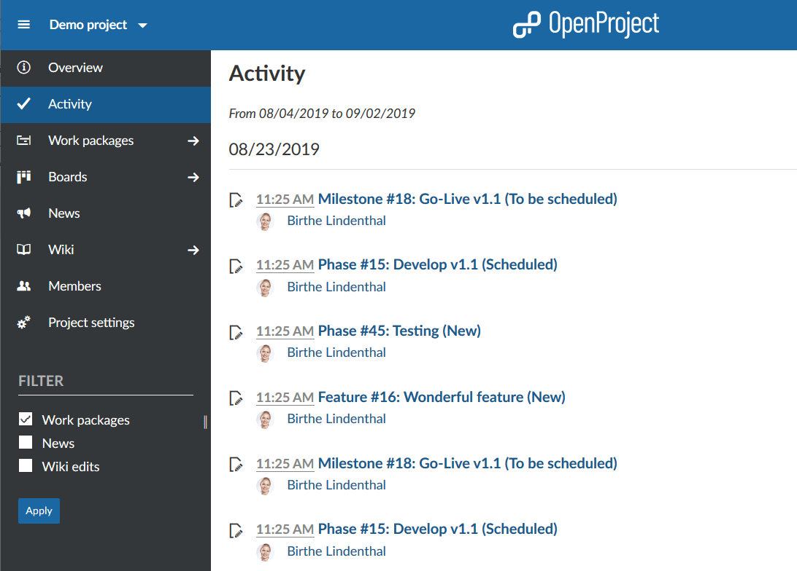

---
sidebar_navigation:
  title: Activity
  priority: 890
description: Find out about the Activity within a project
robots: index, follow
keywords: activity
---

# Activity

In OpenProject you can display the activities in a project to gain a quick overview about the current status and changes. The activity page lists the newest developments in your project.

**Activity** is defined as a module that displays the actions performed in a project over a certain period of time.

The changes are listed in reverse chronological order, with the latest changes appearing on top. Apply a filter (located below the project navigation on the left), to select which attributes are included in the activity.

The activity includes changes to work packages, repository changes, new, wiki entries or forum messages.

## Activate Activity in a project

To activate the Activity module in a project, select the arrow next to Project Settings in the Project menu on the left hand side.

Then choose the sub menu entry **Modules**.

Enable the **Activity** module and click the blue **Save** button.

### How to display the Activities of a project?

The Activities from a project are displayed in the Activity module.

You can filter for different activities, e.g. for Work packages, News, or Wiki in the Filter section below the project menu.

### How far back can I trace the project activities?

The retrospective for the project activities is not limited. You can  therefore trace all the project activities back to the beginning of the  project.
You can [configure in the admin settings](../../system-admin-guide/)  how many days are shown on each activity page. Due to performance  reasons, the days displayed should be set at a low level (e.g. 7 days).

