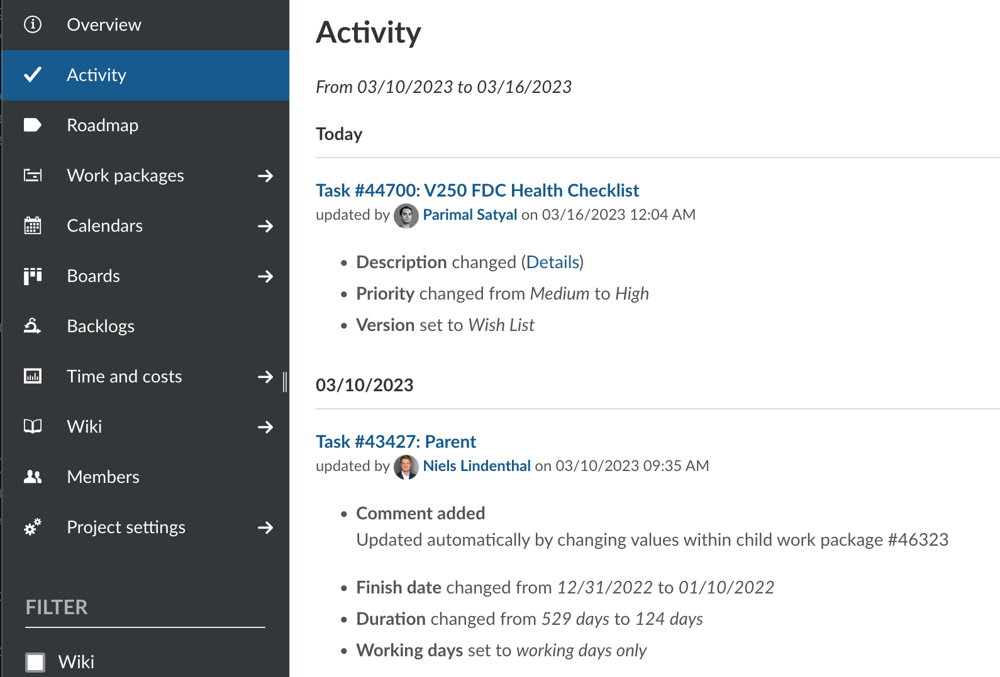
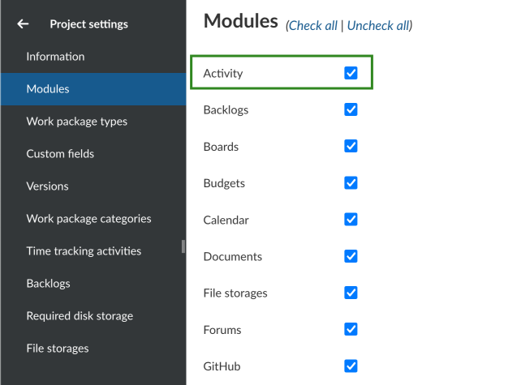
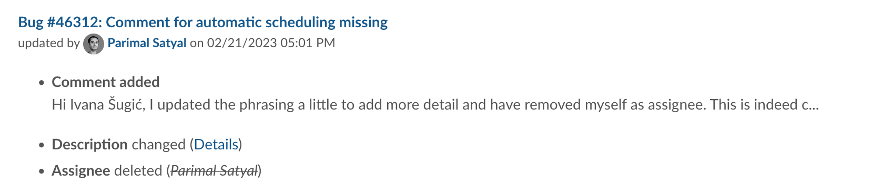
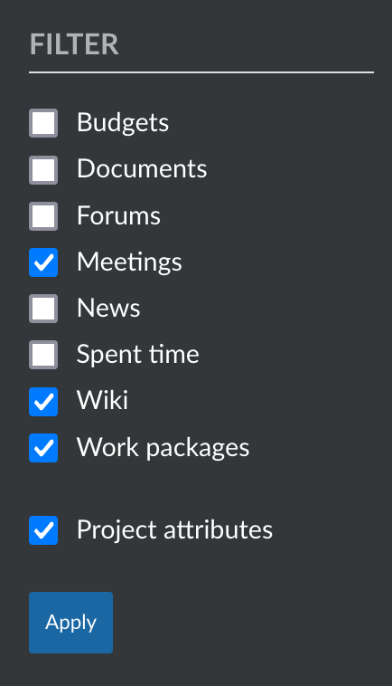
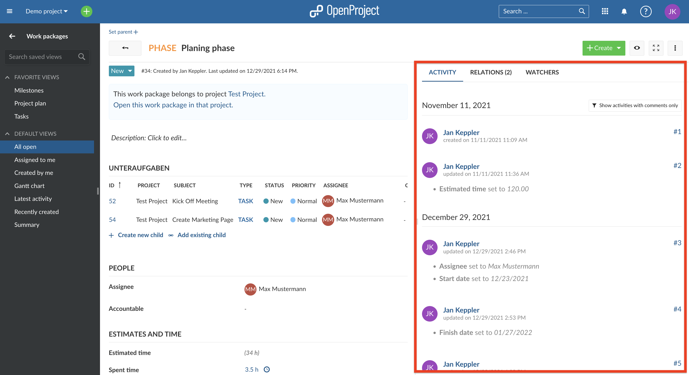
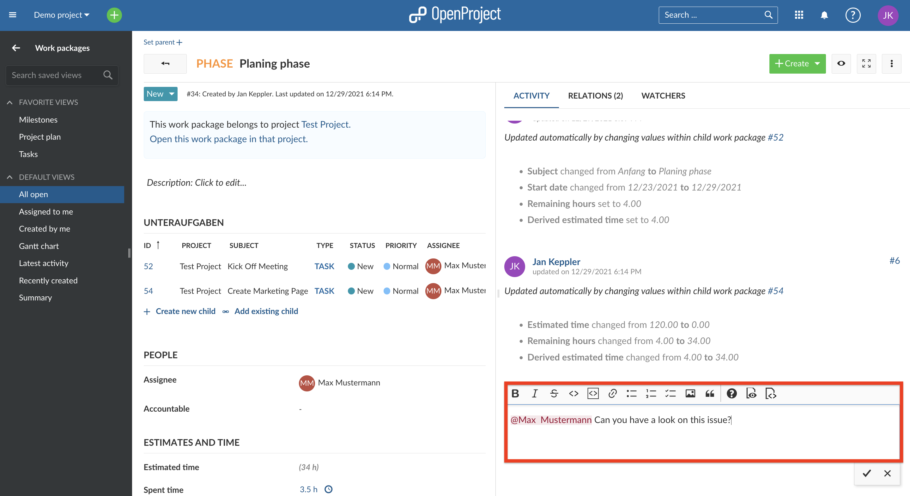

---
sidebar_navigation:
  title: Activity
  priority: 890
description: Find out about the Activity within a project
keywords: activity
---

# Activity

OpenProject lets you view an overview of all recent changes within a project. These include changes to:

- work packages (new work packages, new comments, changes to status, assignee, dates, custom fields...)
- project attributes (name, description, custom fields..)
- other modules (news, budget, wiki edits, forum messages, logged time...)

To view project activity, the **Activity** module must first be enabled.

## Activate Activity in a project

Within a project, navigate to the **Project settings > Modules** page. Make sure the **Activity** module is enabled and click on the **Save** button at the bottom of the page.

### View project activity

Click on the **Activity** option that is now visible in the sidebar of a project. This will show you recent activity in the project, with the most recent changes at the top.

For each update concerning a work package, you will see:

- the work package id and title
- the name of the project or sub-project that work package belongs to (in brackets)
- the user who was responsible for the change
- the date and time of the (aggregated) changes
- a list of attributes that were changed

Starting with version 12.5, the Activity module also lists changes to project attributes, including project custom fields. For each update, you will see:

- the name of the project or sub-project
- the user who was responsible for the change
- the date and time of the (aggregated) changes
- a list of attributes that were changed

### Filter project activity

To filter the project activity list, use the filters on the sidebar. You may filter to show only one or a combination of changes concerning:

- Budgets
- News
- Spent time
- Wiki edits
- Work packages
- Project attributes

Additionally, you can choose to include or exclude updates concerning sub-projects.

### How far back can I trace the project activities?

The retrospective for the project activities is not limited. You can therefore trace all the project activities back to the beginning of the project.
You can [configure in the admin settings](../../system-admin-guide/) how many days are shown on each activity page. Due to performance reasons, the days displayed should be set at a low level (e.g. 7 days).

> **Note:** The project activity list is paginated. You can click on the "Previous" or "Next" links at the bottom of the page (where applicable) to navigate between pages.

### Work package Activity

When you open a work package, e.g. by clicking on the ID of the work package in the work package table, you have the Activity area next to the Work package information area on the right side.

There, all changes and activities concerning the work package are documented, e.g. if a user changes the status of the work package, this activity is recorded with the information who, when and what in the Activity area and is visible for other users who have the corresponding authorization.

You can also use the Activity area as a chat portal and share messages with other team members there.

If you want to notify a specific user about something in the Activity section, you can also flag them with an "@" symbol in front of their username so that they receive a notification within OpenProject.
