---
sidebar_navigation:
  title: Activity
  priority: 890
description: Get an overview of changes and comments within a single work package or the latest activity within a project. The activity tab in work packages also lets you mention and notify other users.
keywords: activity, comment, mention, emoji, reaction
---

# Project and work package activity

OpenProject makes it easy to keep track of what's going on in [specific work packages](#work-package-activity) and in your [projects](#project-activity).

## Work package activity

The Activity tab within a work package maintains a history of all updates and changes, along with all conversations concerning that work package. This tab is accessible both in full work packages view and in split screen mode.

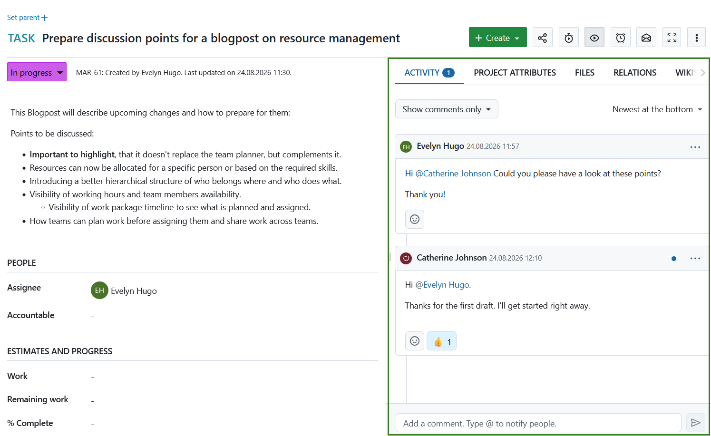

When you first access this tab, you will see the comments and list of changes in a timeline. This timeline can be sorted in either chronological (the newest comments at the bottom) or anti-chronological order (the newest comments on top):

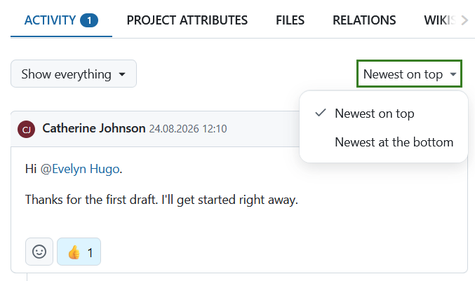

You can scroll up and down to go forwards or backwards in time.

By default, the Activity tab shows comments, changes, and meeting updates, but you can filter these to only show specific types of activity.

Meeting updates include changes related to one-time and recurring meetings. For example, an activity entry is created when a work package is added to, removed from, or moved between meetings, when it is discussed or added as a meeting outcome, and when it is added to or removed from meeting templates, including recurring meeting series templates.

For recurring meetings, an activity entry is also added on creation of each occurrence when the work package is in the series template.

> [!NOTE]
> Meeting-related work package updates appear in the Activity tab only for users who have access to both the work package and the meeting.

To hide these entries, select **Hide meetings updates** from the Activity tab filter.

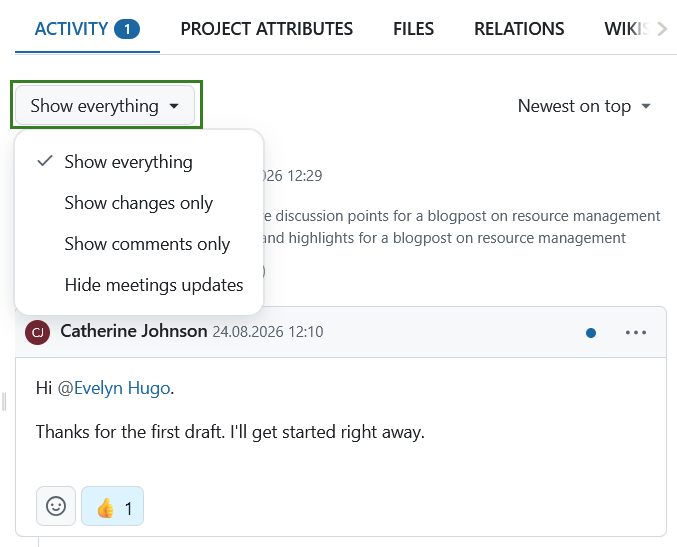

### Change sets

When you or another user makes changes to the work package, the updates are listed below the name of the author of those changes. All changes made within the aggregation period (defined by the administrator) are grouped together under one change set.

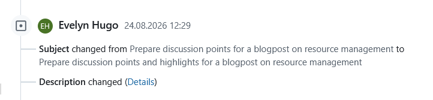

If a comment was also added, then the changes are listed below the associated comment.

### Comments

Comments allow you to have a conversation about the present work package with other project members, or comment changes you have made.

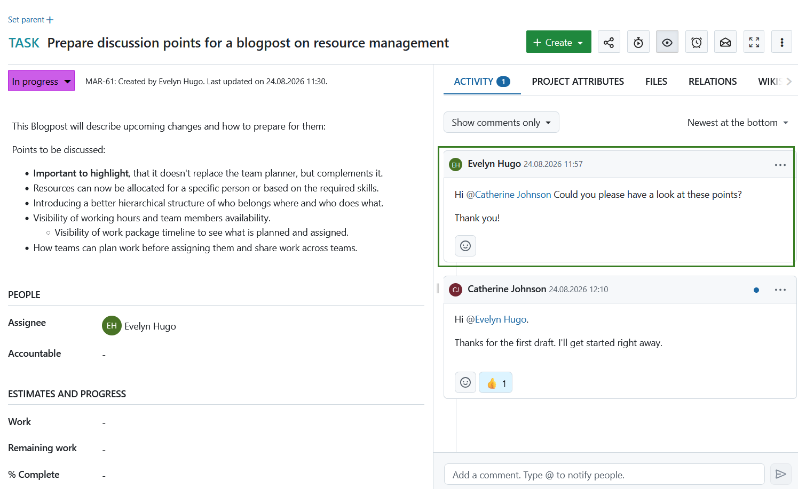

To add a new comment to a work package, click on the comment box at the bottom of the Activity tab. This will expand it and give you formatting options. Click on the post icon or press Command + Enter on your keyboard to publish your comment.

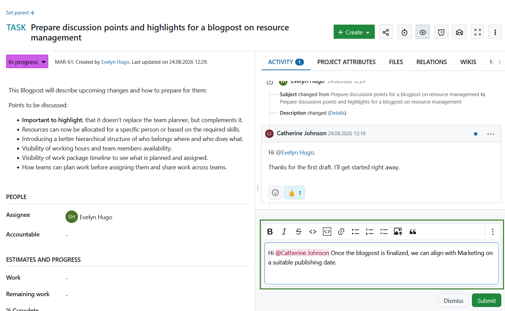

The more icon (⋯) next to a comment gives you a number of additional functions.

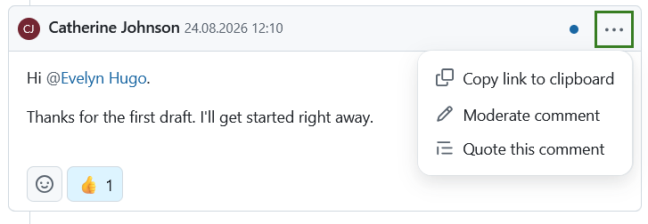

You can:

- Copy a link to the comment on your clipboard if you want to paste a link to it elsewhere.

> [!TIP]
> Following a deep link automatically scrolls the page so the linked comment appears near the top and is briefly highlighted with a blue border. After the next interaction, the highlight disappears and the URL reverts to its normal form.

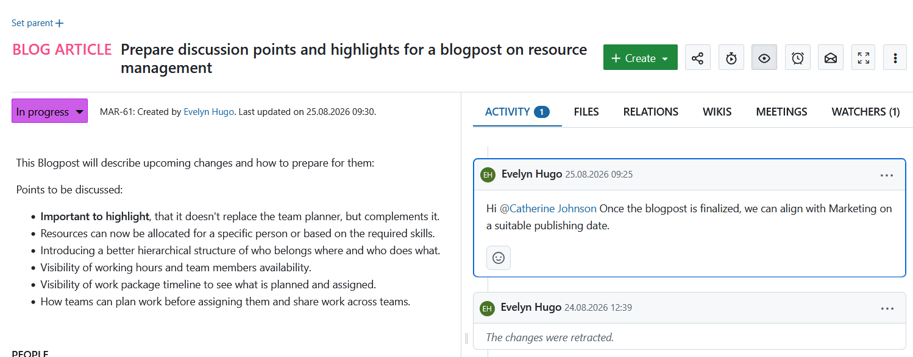

- You can edit the comment if you are the author. 

- You can quote someone else's comment in a new comment. This is useful if you want to respond to a certain part of a comment.

### Internal comments (Enterprise add-on)

> [!NOTE]
> Internal comments are an Enterprise add-on and can only be used with [Enterprise cloud](../../enterprise-guide/enterprise-cloud-guide/) or [Enterprise on-premises](../../enterprise-guide/enterprise-on-premises-guide/). An upgrade from the free Community edition is easily possible.

Projects may include external clients or suppliers, who can be invited to a project or individual work package with restricted roles. To keep sensitive discussions (for example rates, negotiations, or financial and contextual details) confined to the core team, internal comments can be used. These comments are only visible to authorized users and are not accessible to external participants. This allows teams to manage sensitive information directly within work packages and avoid using external tools, maintaining a single source of truth.

> [!TIP]
> To use the internal comments feature, a project admin must first enable it by navigating to [Project settings → Work packages → Internal comments tab](../projects/project-settings/work-packages/#work-package-internal-comments-enterprise-add-on). 
> By default, internal comments are only visible to the _Project admin_ role. However, for broader access, an instance administrator can grant permissions to view, write, and edit internal comments to any existing or new role.
> These permissions must be explicitly assigned for the feature to be usable. If the permissions are removed, the internal comments will no longer be visible to those roles.

Internal comments are distinguished from other comments via a different color scheme and a lock icon. 

To write an internal comment, proceed the same way you would when writing a regular comment but make sure to check **Internal comment** checkbox before submitting.

> [!IMPORTANT]
> Once published, a regular comment can no longer be marked as internal, and an internal comment can no longer be made public.

As is the case with public comments, you can:

- Copy a link to an internal comment to your clipboard,
- Edit an internal comment if you are the author or have sufficient rights to edit comments added by other users,
- Quote someone else's internal comment in a new comment. This new comment will be an internal one by default.

To use these options click the more (...) menu next to the lock icon on the right side of the comment.

> [!TIP]
> It is currently not possible to view a list of all other users in a project who are able to read and add internal comments. We understand this is an important feature and plan to add this functionality in a future release.

### Emoji reactions

Starting with version 15.0, you can respond to comments with emoji reactions to quickly communicate basic messages without having to add a comment.

To do so, click on the emoji icon next to each comment and pick from one of eight possible emojis.

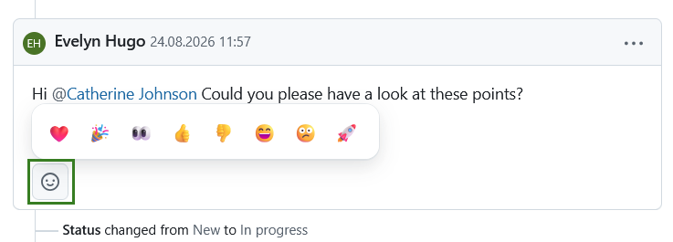

You can add multiple emojis, or simply click on an emoji that was already used by someone else to add to it.
> [!TIP]
> Please note that emoji reactions will not trigger notifications. If you need your colleague to be notified about your reaction, leave a regular comment.

### Mentions

If you would like to direct your comment to particular project members or get their attention, you can @mention them. To do this, type `@` and select the user whom you want to mention.

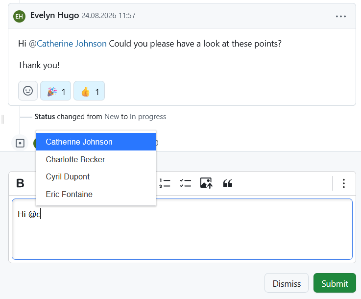

The user will then receive a notification, which allows them to easily see the comment in which they have been mentioned.

### Automatic updates 

Starting with OpenProject 15.0, changes other users make to the currently open work package are visible nearly immediately, in real-time. For example, if someone changes the assignee, edits the description and leaves a comment, all of these things will automatically be reflected in the open work package without any action on your part.

> [!TIP]
> If you are currently editing a work package and someone else edits it at the same time, you will receive a warning letting you know that you will not be able to save your changes till your refresh the page. This gives you the opportunity to copy your work elsewhere so that it isn't lost, and that your edit do not overwrite those of someone else.

## Project activity

OpenProject lets you view an overview of all recent changes within a project. These include changes to:

- work packages (new work packages, new comments, changes to status, assignee, dates, custom fields...)
- project details (name, description, custom fields..)
- other modules (news, budget, wiki edits, forum messages, logged time...)

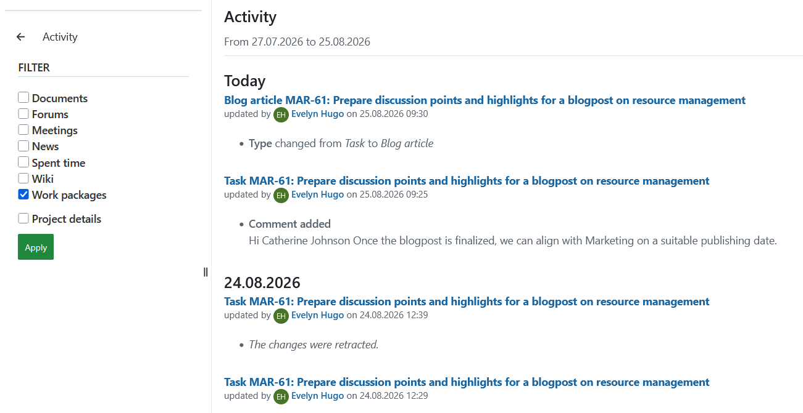

To view project activity, the **Activity** module must first be enabled.

### Activate project activity

Within a project, navigate to the **Project settings > Modules** page. Make sure the **Activity** module is enabled and click on the **Save** button at the bottom of the page.

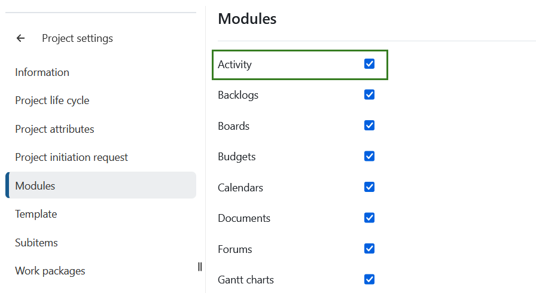

### View project activity

Click on the **Activity** option that is now visible in the sidebar of a project. This will show you recent activity in the project, with the most recent changes at the top.

For each update concerning a work package, you will see:

- the work package type, id and subject
- the name of the project or sub-project that work package belongs to (in brackets)
- the user who was responsible for the change or update
- the date and time of the (aggregated) changes
- a list of work package details that were changed

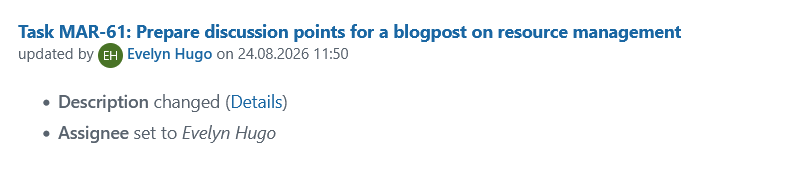

The Activity module also lists changes to project details, including project custom fields. For each update, you will see:

- the name of the project or sub-project
- the user who was responsible for the change
- the date and time of the (aggregated) changes
- a list of project details that were changed

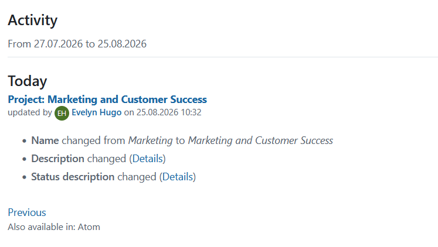

### Filter project activity

To filter the project activity list, use the filters on the sidebar. You may filter to show only one or a combination of changes concerning:

- Documents
- Forums
- Meetings
- News
- Spent time
- Wiki
- Work packages
- Project details

Additionally, you can choose to include or exclude updates concerning sub-projects.

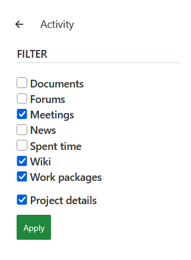

### How far back can I trace the project activities?

The retrospective for the project activities is not limited. You can therefore trace all the project activities back to the beginning of the project.
You can [configure in the admin settings](../../system-admin-guide/) how many days are shown on each activity page. Due to performance reasons, the days displayed should be set at a low level (e.g. 7 days).

> **Note:** The project activity list is paginated. You can click on the "Previous" or "Next" links at the bottom of the page (where applicable) to navigate between pages.
