---
sidebar_navigation:
  title: Backlogs (Scrum)
  priority: 850
description: Support your Scrum methodology with Backlogs
keywords: backlogs, scrum, backlog, agile, sprint, sprint bucket, backlog bucket
---

# Backlog and sprints

> [!NOTE]
> The **Backlogs module** is actively being improved. This documentation is updated regularly to reflect the latest changes.

Working in agile project teams is becoming increasingly important, and with OpenProject, it is easier than ever. OpenProject supports your work with the Agile and Scrum methodology by providing a variety of improved functionalities. You can now create and manage sprints, record and prioritize work packages in sprints and the backlog, use automated sprint boards or burndown-charts, and much more. For more information, please refer to the OpenProject [agile and scrum features](https://www.openproject.org/collaboration-software-features/agile-project-management/) page.

A **Backlog** is defined as a module that allows you to use the backlogs feature in OpenProject. In order to use backlogs in a project, the Backlogs module has to be activated in the project settings.

Please note that this user guide does not represent an introduction to Scrum methodology, but merely explains the Scrum-related functionalities and user instructions in OpenProject.

## Manage the backlog

The Backlogs module is divided into two sides: on the left, you'll find the **Backlog**, consisting of the **Inbox backlog** at the bottom and **Backlog buckets** above it (if created). On the right side, **Sprints** are displayed. If no backlog buckets have been created, only the Inbox backlog is shown on the left.

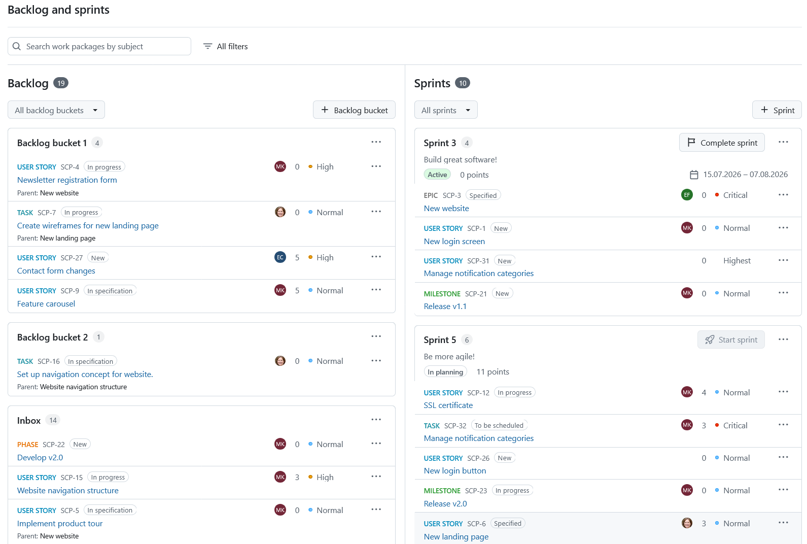

### Sprint containers

Each sprint is displayed in a dedicated container showing key planning information, including the sprint name, status, start and end dates, number of work packages, and total story points. 

If defined, the **Sprint goal** is displayed in the sprint header below the sprint name.

Depending on the sprint status, either a **Start sprint** (for sprints in planning) or **Complete sprint** (for active sprints) button will be displayed.

> [!NOTE]
> The **Start sprint** button is disabled by default if another sprint is already active or if no sprint dates have been defined. It might also not be available if you do not have the **Start/complete sprints** permission.
> By default, only one sprint can be active at a time. If your project is configured to allow multiple active sprints in the [project backlog settings](../projects/project-settings/backlogs-settings), the **Start sprint** button remains available for additional sprints.

### Backlog buckets

Backlog buckets help you organize and prioritize work packages within the backlog. A backlog bucket is a named list of work packages that can be refined independently from the Inbox backlog. The Backlog and sprints view displays all backlog buckets within the current project, including the bucket name and the number of contained work packages.

> [!NOTE]
> Backlog buckets are project-specific and are not shared across projects.

### Work packages in backlogs

Work packages displayed in the Backlog and sprints view show the following information:

- Type
- ID
- Status
- Assignee
- Story points
- Priority
- Subject
- Parent work package

On smaller screens, assignee names and priority names may be hidden to preserve space while remaining available through tooltips.

> [!NOTE]
> If a parent work package is not visible to a user due to permissions, **Undisclosed** is displayed instead.

A work package:

- can only belong to one backlog bucket at a time.
- cannot belong to a sprint and a backlog bucket at the same time.
- cannot belong to a backlog bucket and the Inbox backlog at the same time.

You can sort work packages within all containers (backlog bucket, inbox and sprints)  via drag and drop or by using the **Move** option from the work package menu. You can also add new and existing work packages within all containers (backlog bucket, inbox and sprints) by using the **More (three dots)** menu.

#### Create a backlog bucket

To create a backlog bucket, click the **+ Backlog bucket** button in the Backlog and sprints view. This will open a dialog where you can enter the bucket name. Click **Create** to proceed.

> [!NOTE]
> Creating and deleting backlog buckets requires the appropriate project permissions.

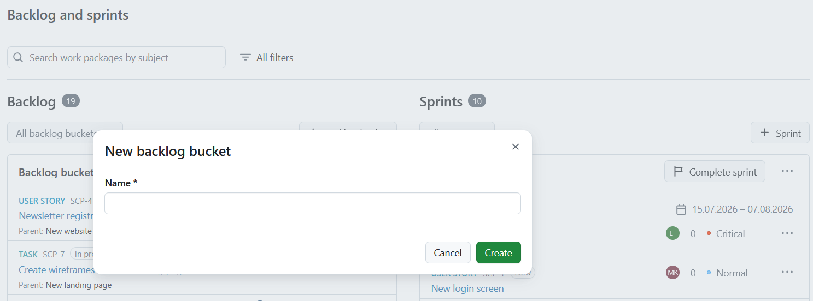

#### Edit or delete a backlog bucket

Open the **More (three dots)** menu of a backlog bucket to:

- Edit the backlog bucket
- Delete the backlog bucket

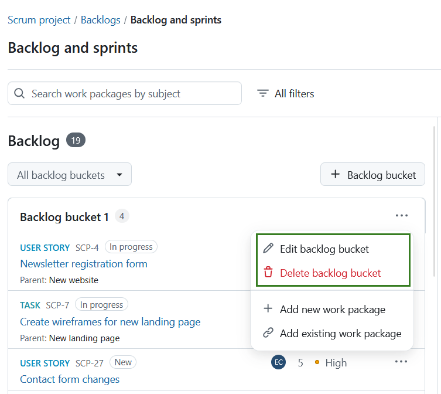

When deleting a backlog bucket, all contained work packages are automatically moved to the bottom of the Inbox backlog. 

Work packages can also be moved directly into a backlog bucket from the work packages More menu. If multiple backlog buckets exist, OpenProject lets you choose the target bucket. The work package is placed at the bottom of the selected bucket.

Changes to a work package's backlog bucket are recorded in the work package **Activity** tab. This allows you to see when a work package was moved into, out of or between backlog buckets.

> [!NOTE]
> Backlog bucket changes are only visible in the Activity tab if you have the required permissions to view sprint and backlog information.

#### All backlog buckets

The all backlog buckets button is a multi-select dropdown that allows you to filter for buckets within your backlog. Click on **All backlog buckets**. Select the specific backlog bucket(s) you want displayed or type in the search box to filter the list. Click **Apply** to save your changes. 

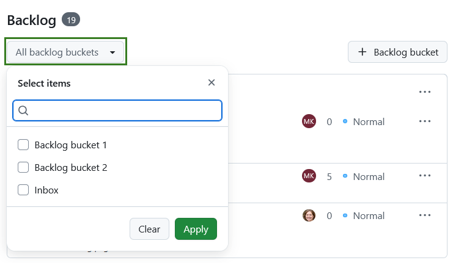

### Inbox backlog

The Inbox backlog is automatically populated with all work packages in a project that are not assigned to a sprint or backlog bucket and are not excluded by the project's backlog settings. When a work package is added to a sprint or bucket, or closed, it is removed from the Inbox.

> [!NOTE]
> Closed work packages are removed from the Inbox backlog and backlog buckets, but continue to be visible in sprints.

When there are too many items in the backlog, a **Show more items** link appears in the middle of the Inbox backlog. This collapses the middle section so that you always see the top and the bottom of the Inbox backlog.

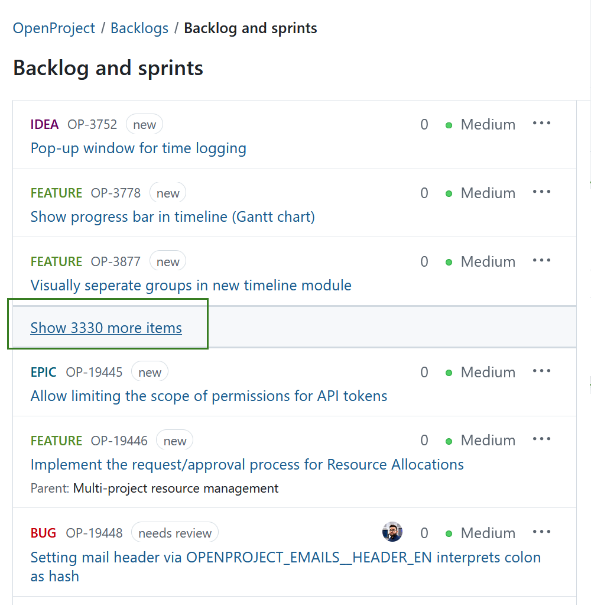

## Sort and move work packages

Next to every work package listed in the Inbox backlog, backlog bucket, or sprint, you can access the **More (three dots)** menu, including the following options:

- Open **details view** or **fullscreen view** of a work package. These options allow you to choose how much information (about the backlog item) you'd like to be displayed.
- **Copy** the work package URL or ID to the clipboard.
- **Move to backlog inbox**
- **Move to backlog bucket**
- **Move to sprint**
- **Move to position**. This option lets you change the ordering of a work package within its current container.

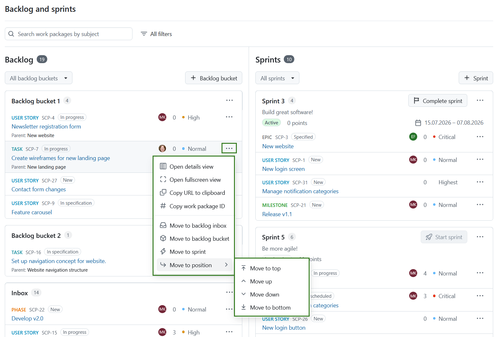

Details view opens the work package information on the right side, the same way as in the notifications center. You can open the details view with a single click on a work package card.

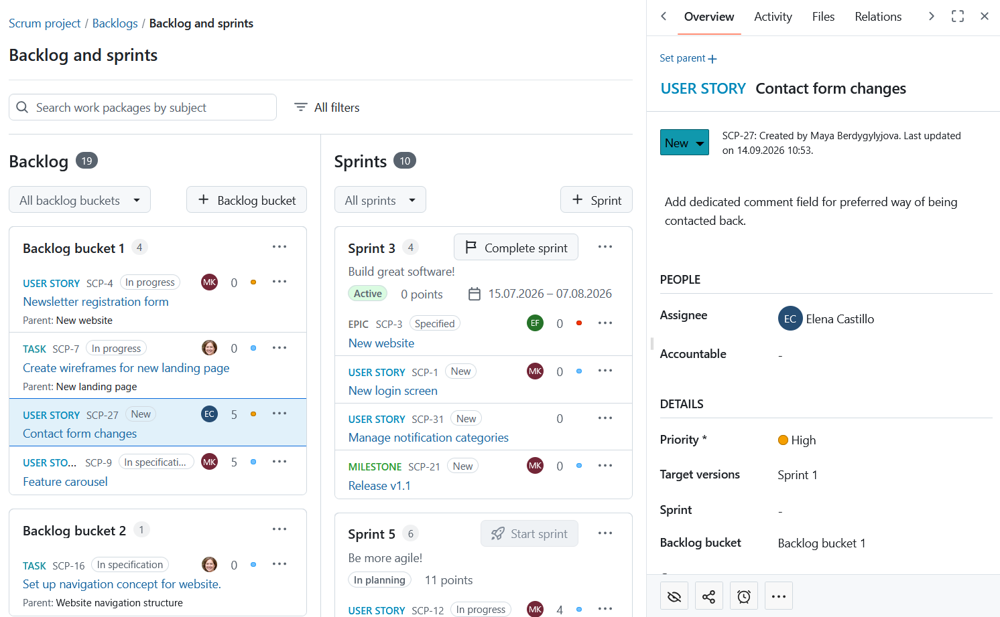

Opening the fullscreen view opens the work package in fullscreen.

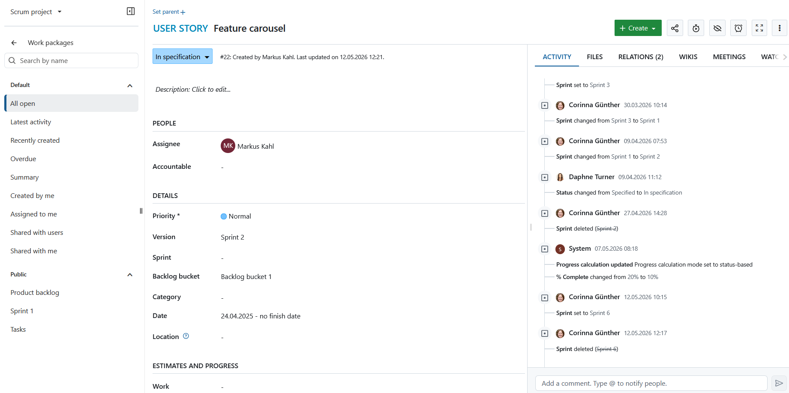

You can prioritize work packages within the Inbox backlog, a backlog bucket, or a sprint by dragging and dropping them or by using the move actions available from the **More** menu. The entire work package card can be used as a drag-and-drop area.

Depending on the current location of the work package, you can move it:

- into the Inbox backlog,
- into another backlog bucket,
- into another sprint,
- within the current backlog bucket or sprint

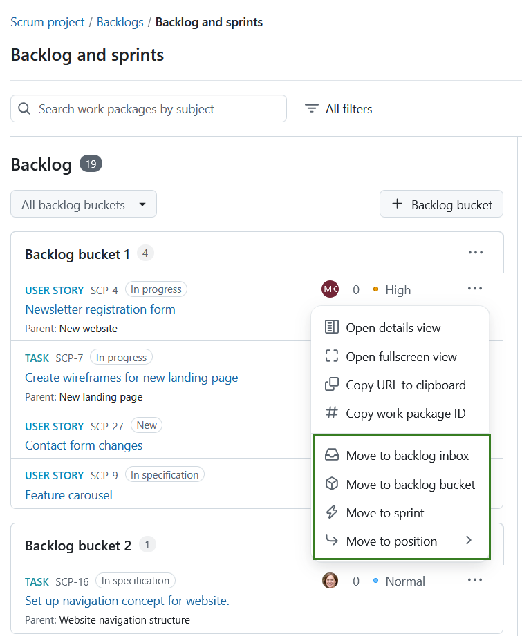

You can also drag a work package card out of OpenProject and drop it into an external application that supports browser drag and drop. Depending on the target application, this can:

- insert the work package URL as plain text,
- open the work package URL when dropped onto another browser window's address bar or tab strip,
- insert a hyperlink with the work package subject as link text when dropped into a rich-text editor.

The URL is the same URL available through **More (three dots) → Copy**.

> [!NOTE]
> How a dropped work package is handled and displayed depends on the target application, browser and operating system. Some applications may not accept drag and drop from all browsers.

### Excluded work package types and statuses

Depending on the project configuration, certain work package types and statuses can be excluded from the Inbox backlog and backlog buckets. This can be configured under [project backlog settings](../projects/project-settings/backlogs-settings).

Excluded work packages: 

- do not appear in the Inbox backlog.
- do not appear in backlog buckets.
- continue to appear in sprints.
- continue to appear on sprint boards.

If a work package is moved to the Inbox backlog or a backlog bucket and its type or status is excluded, the move is completed successfully. A confirmation message explains that the work package was moved successfully but is hidden because its type or status is excluded from backlog views.

## Create and manage sprints

> [!IMPORTANT]
> Starting with the OpenProject 17.3 release, Sprints are new objects no longer linked to versions (as was the case with previous OpenProject versions).

A **Sprint** is a planned and time-boxed period in which a Scrum team completes a defined set of tasks. They are containers where work packages can be manually added or removed from the Inbox backlog or backlog buckets via drag and drop or the menu.

### Create a sprint

To create a sprint, click the **+ Sprint** button in the top right corner of the Backlogs module. This opens up a form for you to fill in the sprint name, start date, finish date, and an optional sprint goal. The sprint goal is a short text describing the main objective of the sprint. The duration is automatically calculated. Click the **Create** button to proceed.

The naming of sprints is number-based by default (e.g. Sprint 1, Sprint 2). These names can be edited according to your team's work rhythm.

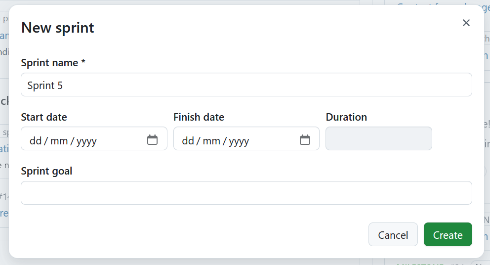

### Sprint goals

The sprint goal helps communicate the primary objective of the sprint to the team. It can be entered when creating or editing a sprint.

For shared sprints, sprint goals are project-specific. This means each project using the shared sprint can define its own goal without affecting other projects.

When editing a shared sprint, OpenProject indicates which fields are shared across projects and which are project-specific. Depending on your permissions in the sharing project and the current project, some fields may be read-only.

### Start or complete a sprint

Your sprint is set in motion by clicking the **Start sprint** button in the sprint header. Clicking it will open the sprint board. 

> [!NOTE]
> If your project is not configured to allow multiple active sprints (Enterprise add-on), you cannot start a new sprint while another sprint is already in progress. In this case, the **Start sprint** button is disabled. To allow multiple active sprints, see [project backlog settings](../projects/project-settings/backlogs-settings).

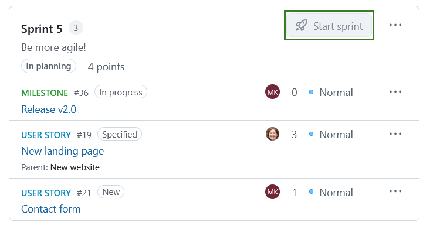

Once a sprint has started, it is considered active. The sprint header displays the current sprint status and allows you to complete the sprint directly from the header. To complete a sprint, click the **Complete sprint** button in the sprint header.

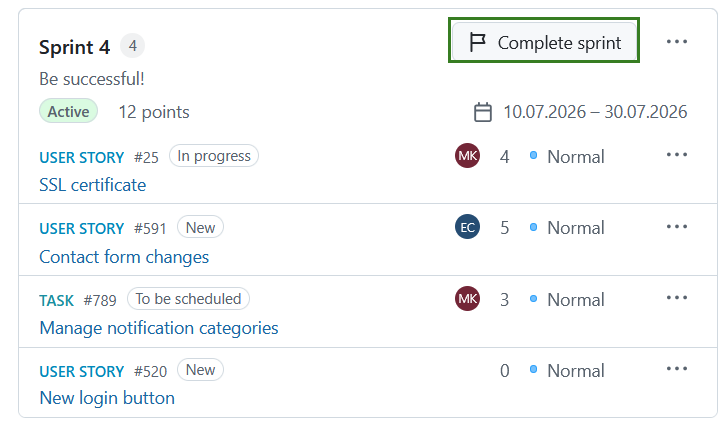

If there are still unfinished work packages in the sprint, a dialog will open prompting you to decide what should happen to them. You can choose to:

- Move them to the top of the Inbox backlog
- Move them to the bottom of the Inbox backlog
- Move them to another sprint

Work packages in statuses configured as closed under [project backlog settings](../projects/project-settings/backlogs-settings) are not moved when a sprint is completed.

If you choose to move work packages to another sprint, you will need to select the target sprint from the list. After making your selection, click the **Complete sprint** button to finish the sprint. The sprint will then be marked as completed, and other sprints can be started.

> [!NOTE]
> Work packages moved to the Inbox backlog may not be displayed if their type or status is excluded from backlog views.

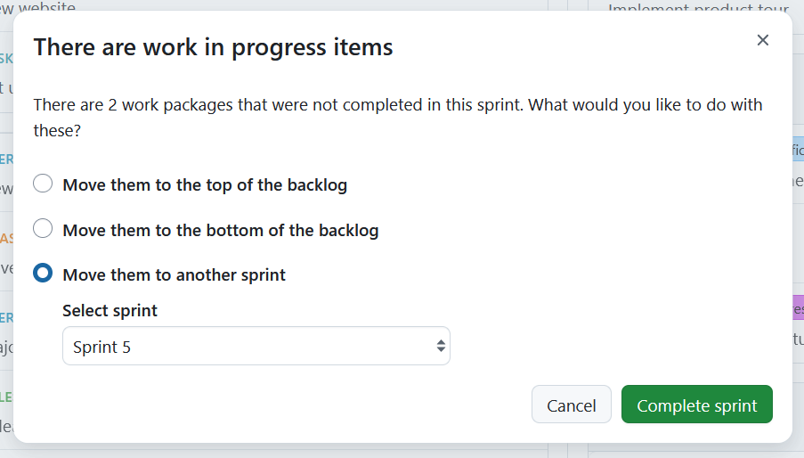

Additional sprint actions are available through the **Sprint menu**, including:

- Edit sprint
- Add new work package
- Add existing work package
- Sprint board
- Burndown chart

Sprint details, including the sprint goal, can also be edited through the **Edit sprint** dialog.

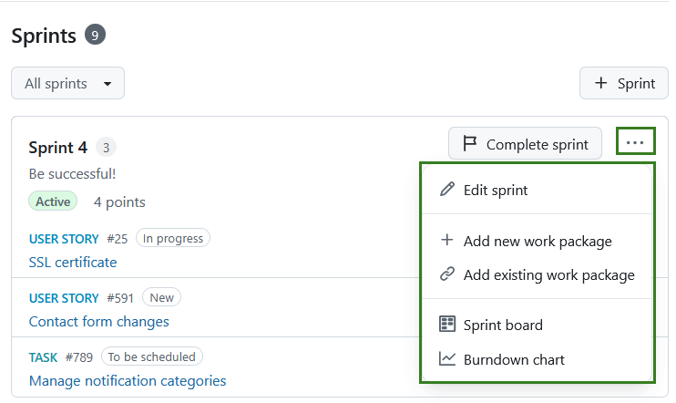

#### All sprints filter

The all sprints button is a multi-select dropdown that allows you to filter for sprints. Click on **All sprints**. Select the specific sprint container(s) you want displayed or type in the search box to filter the list. Click **Apply** to save your changes. 

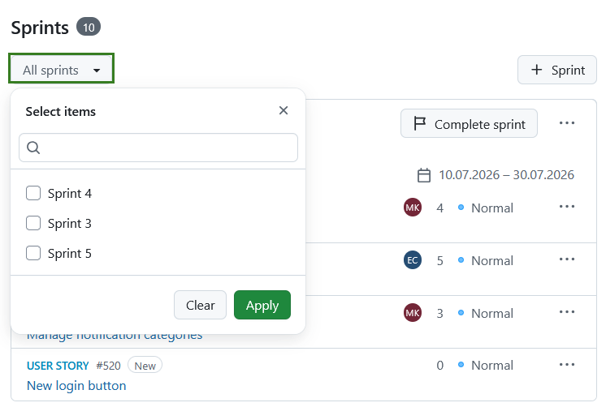

### Add a new work package

In order to create a new work package in the Backlogs module, click on the More (three dots) icon in the top right corner of a Sprint, Backlog bucket or Inbox backlog and choose **+ Add new work package** from the drop-down menu. A form dialog will appear to create a new work package. Here, you directly specify the work package type, subject, and description. Click **Create** to proceed.

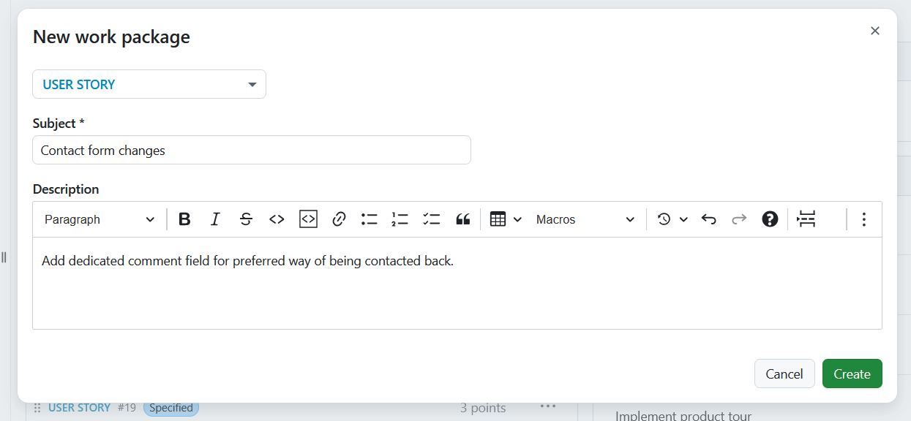

A new item will be added to the backlog to display the newly created story.

### Add existing work package

In order to add an existing work package in the Backlogs module, click on the More (three dots) icon in the top right corner of a Sprint, Backlog bucket or Inbox backlog and choose **Add existing work package** from the drop-down menu. A form dialog will appear to add work packages already in the backlog. 

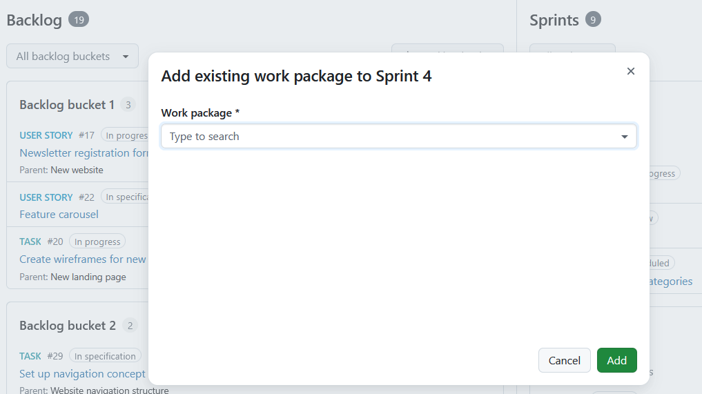

In the search panel, enter the work package type, subject or ID. Select the displayed work package and click **Add** to proceed. The items in the Sprint becomes updated.

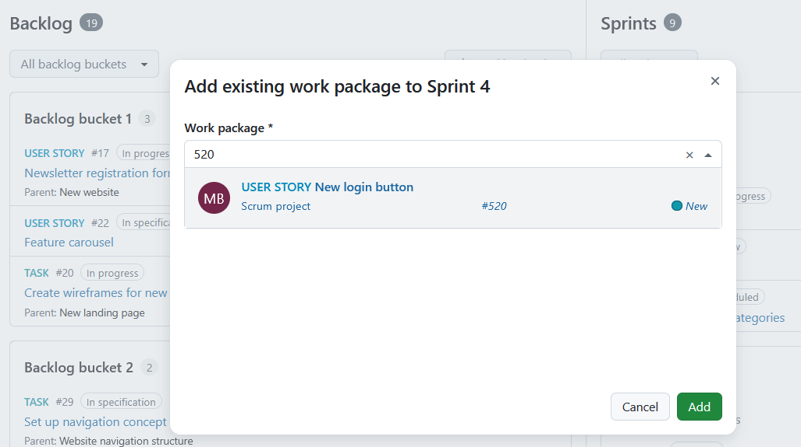

### Prioritize stories

You can prioritize different work packages within the Inbox backlog, a backlog bucket, or a sprint by dragging and dropping them or by using **Move to position** from the **More** menu. This allows you to assign work packages to a specific sprint or backlog bucket, return them to the Inbox backlog, or re-order them within a sprint or bucket.

### Story points

In a sprint, you can directly document necessary effort as story points.

Story points are defined as numbers assigned to a work package used to estimate (relatively) the size of the work.

The sprint header displays the total number of story points currently assigned to work packages in the sprint.

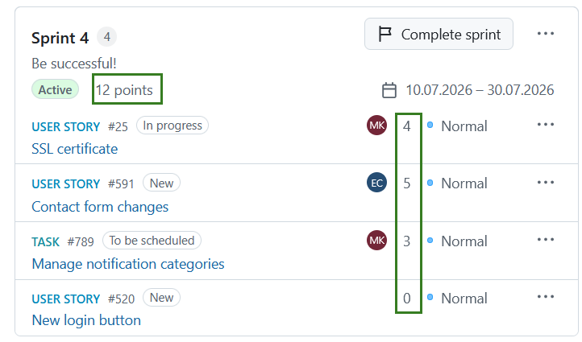

You can edit story points directly from the backlogs view. In order to do so, simply click the work package you want to edit and make the desired changes in the detailed view of the work package that will open on the right.

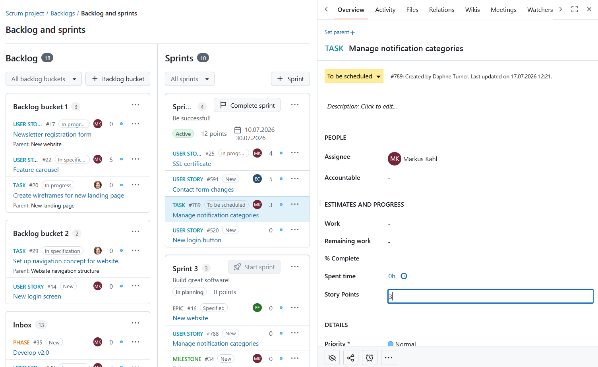

### Sprint boards

Sprint boards are especially helpful for teams to track and visualize progress from the start.

When you click the **Start sprint** button in a sprint header, a dedicated sprint board is automatically created and you are forwarded to the active sprint board. Boards are named using this pattern: [Project name: Sprint name]. As an example: **Scrum project: Sprint 1**.

The sprint board inherits project permissions automatically, which means it is accessible to all project members by default.

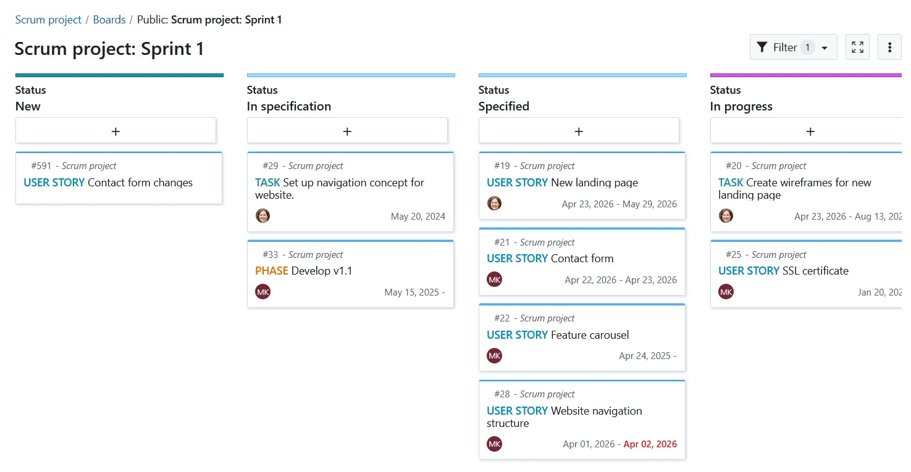

> [!NOTE]
> The sprint board and burndown chart are only visible on the menu when a sprint is active.

### Sprint field in work package tables

The Sprint property can also be used in work package tables. You can:

- display the Sprint column,
- sort by Sprint,
- group work packages by Sprint.

> [!NOTE]
> Viewing Sprint information in work package tables requires the appropriate project permissions.

You can also change the Sprint or Backlog assignment of multiple work packages at once using [bulk edit](../work-packages/edit-work-package/#bulk-edit-work-packages).

### Burndown charts

**Burndown charts** are a helpful tool to visualize a sprint's progress. With OpenProject, you can generate sprint and task burndown charts automatically.

> [!TIP]
> As a precondition, the sprint's start and end date must be defined and the information on story points should be well maintained.

The sprint burndown is calculated from the sum of estimated story points. If a user story is set to "closed" (or another status configured as closed in the [project backlog settings](../projects/project-settings/backlogs-settings)), it counts towards the burndown. The task burndown is calculated from the estimated number of hours necessary to complete a task. If a task is set to "closed", the burndown is adjusted.

The remaining story points per sprint are displayed in the chart. Optionally, the ideal burn-down can be displayed for reference. The ideal burndown assumes a linear completion of story points from the beginning to the end of a sprint.

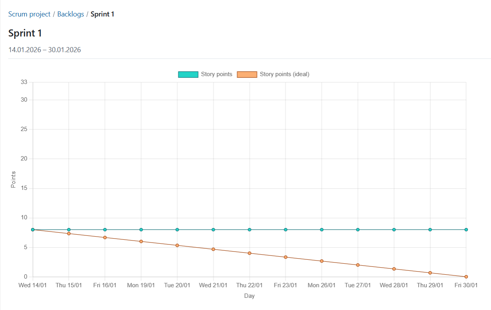

### Sprint sharing

[feature: sprint_sharing ]

Sprint sharing allows multiple projects to use the same sprint structure. A sprint can be shared with other projects, subprojects, or not shared. This is configured under [project settings](../projects/project-settings/backlogs-settings). 

Shared sprints can help teams coordinate planning across projects and support scaled agile frameworks such as SAFe.

### Multiple active sprints

[feature: multiple_active_sprints ]

You can have more than one sprint active at the same time. This setting needs to be activated under [project settings](../projects/project-settings/backlogs-settings/#multiple-active-sprints).

## All sprints

The **All sprints** view provides a simple overview of every sprint in the project, including planning, active, and completed sprints.

The table displays the sprint name, status, start date, finish date, and number of work packages. The list of sprints is sorted by sprint dates and then by sprint name.

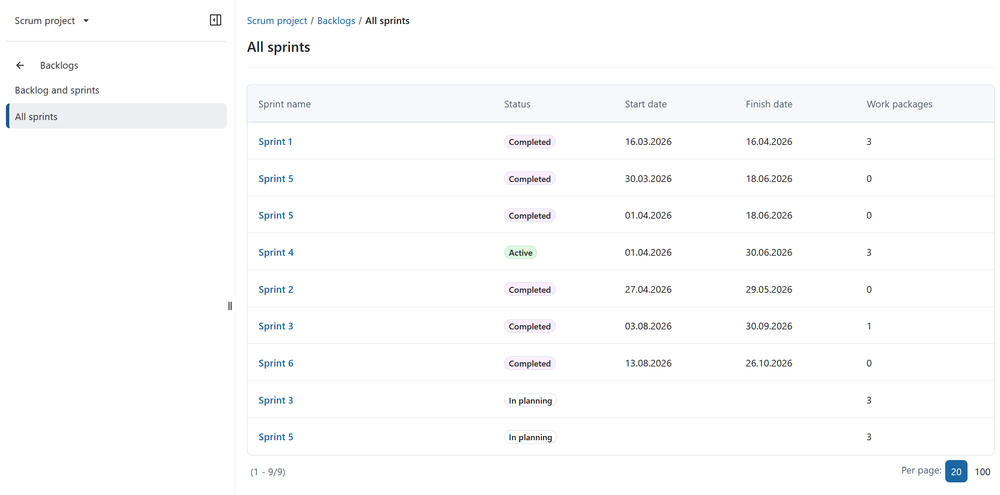

Selecting a sprint opens the appropriate destination depending on its status:

- **Active** sprints open the sprint board.
- **Planning** sprints open the sprint planning view.
- **Completed** sprints open a work package table filtered to that sprint.
