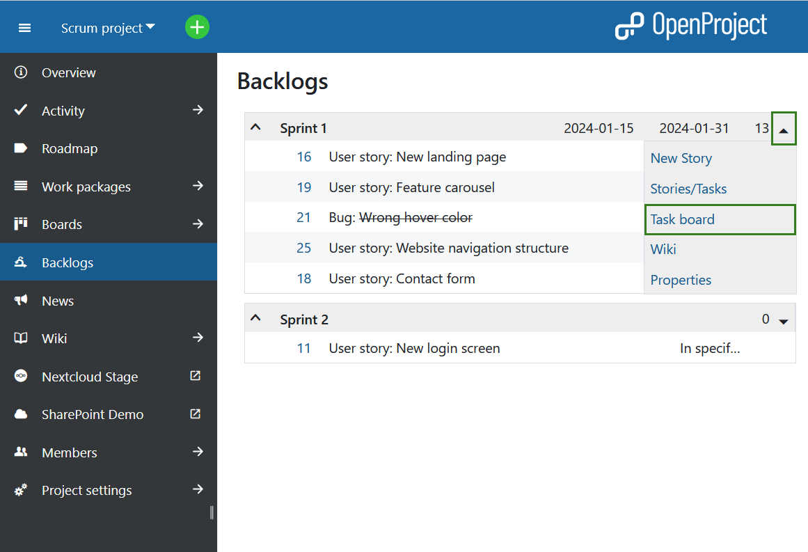
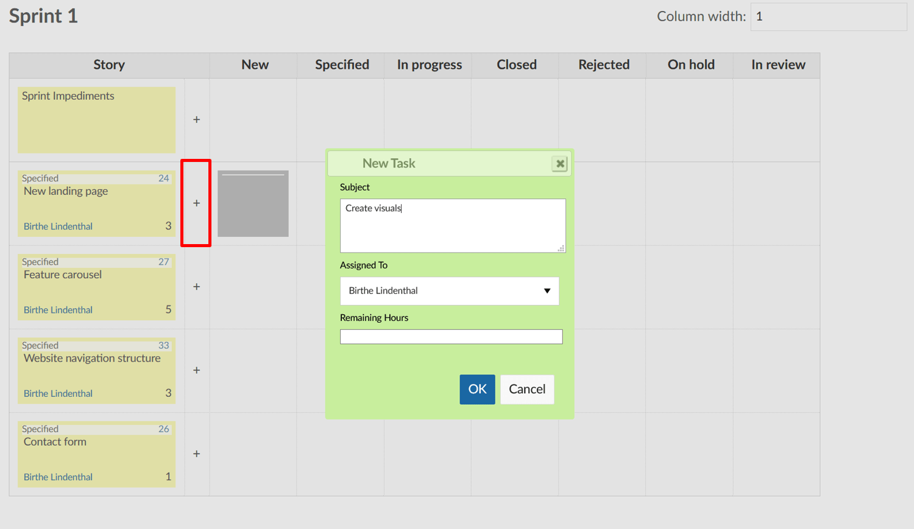
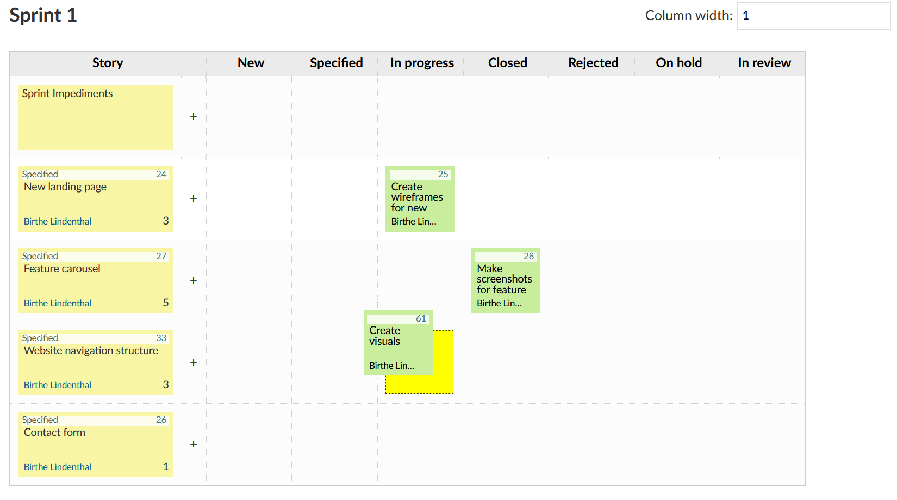
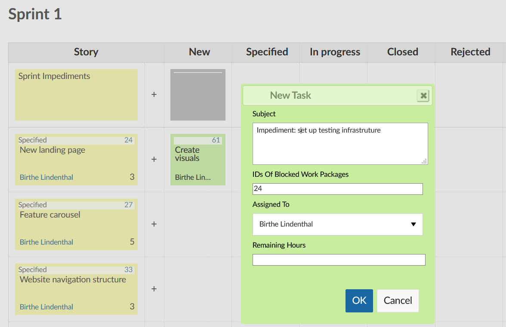
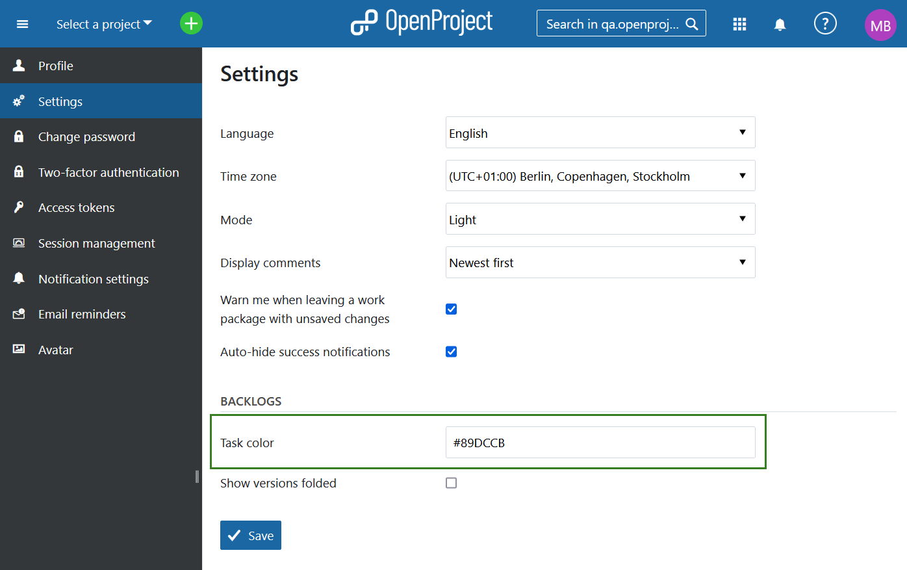

---
sidebar_navigation:
  title: Taskboard view
  priority: 850
description: Taskboard in OpenProject.
robots: index, follow
keywords: taskboard
---

# Working with the Task Board

To support daily scrum meetings, all of a team’s tasks and sprint impediments are recorded in a digital task board. The digital task board thus allows team members to get a fast overview of the current state of a sprint.

To open the task board view, click on the small arrow next to the respective sprint, and select *Task board* in the drop-down menu.

You will find user stories in the left column, followed by their individual tasks (as child work packages) which are sorted by status. Therefore, you can  immediately see the status of a user story and its associated tasks.  Clicking on the *+*-icon next to a user story opens a window to create a new task.

Here, you can set the fields *Subject*, *Assigned To*, and *Remaining Hours*. The new task will be created as a child element of the user story in the same row.

If a task is updated or completed, it can be moved to the respective column by a team member using drag&drop.
In the background, the  status of the work package will be adjusted accordingly. Clicking on the work package number opens the work package’s detail view.

On the very top of the table, sprint impediments are documented and assigned to the scrum master for removal.

**Note**: If you add an impediment and type the work package number into the field Blocked (ID), the respective work package will be linked to the impediment. As long as the impediment remains, the work package cannot be closed.

The task colors are different for every team member, making it easy  to associate tasks with their respective assignees.

## Configure Backlogs settings under My Account

If needed, the coloring can be adjusted in the personal user account settings (-> *My Account*). Use hex codes to specify the desired color.

        

Here, you can also specify whether the versions in the Backlogs view should be displayed folded.  You can choose whether backlogs are to be displayed folded or collapsed by default. In *My account*, select *Settings* from the side menu and check or uncheck the respective box next to the field *Show versions folded*. 