---
sidebar_navigation:
  title: Backlogs view
  priority: 990
description: Working with backlogs (scrum)
robots: index, follow
keywords: backlogs, scrum
---

# Working with Backlogs

The starting point for effective work in Scrum teams is a well-maintained and prioritized product backlog as well as the creation of sprint backlogs. In OpenProject, you can easily record and specify requirements represented by user stories. Moreover, you can respond to  inquiries and sort them by priority for implementation.

Moreover, please note that the backlogs module is not available in the accessibility mode, since it uses drag&drop functionalities which are not accessible. If you use the accessibility mode you can however perform the same actions (like viewing and editing work packages such as user stories and epics) from the work package list view.

| Feature                                             | Documentation for                                            |
| --------------------------------------------------- | ------------------------------------------------------------ |
| [Create a new backlog](#create-a-new-backlog)       | How to create a new product backlog or sprint?               |
| [Create a new user story](#create-a-new-user-story) | How to create a new user story, epic, bug in the backlogs view? |
| [Prioritize user stories](#prioritize-user-stories) | How to prioritize user stories in the backlogs view?         |
| [Story points](#working-with-story-points)          | Estimate user stories and document story points.             |
| [Sprint duration](#editing-sprint-duration)         | How to edit sprint duration?                                 |
| [Burndown chart](#burndown-chart)                   | How to view the burndown chart?                              |
| [Print story cards](#print-story-cards)             | How to print story cards for a physical task board?          |
| [Sprint wiki](#sprint-wiki)                         | How to create a sprint wiki to document sprint information?  |

## Create a new backlog

The first thing you will do is to **create a new backlog version** (product backlog or sprints). Read here on [creating a new backlogs version or a sprint](../manage-sprints). You can always manage the backlog versions under project settings, if you have the necessary administrator rights.

The versions (product backlog or sprint) will then appear in the module Backlogs either on the left or on the right side.

The Sprint 1, Sprint 2, Bug Backlog, Product Backlog in the example below are all versions in a project, displayed in the Backlogs view. You can create a new version with the green + Version button at the top of the backlogs view.

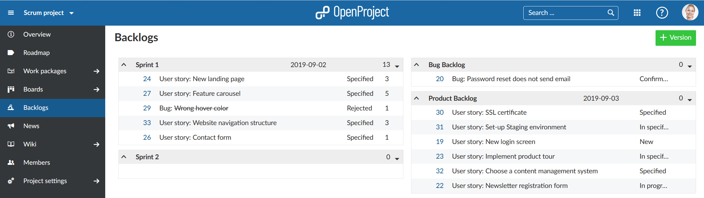

## Create a new user story

In order to create a new work package in the product backlog, click on the arrow on the left of the product backlog and choose *New Story* from the drop-down menu.

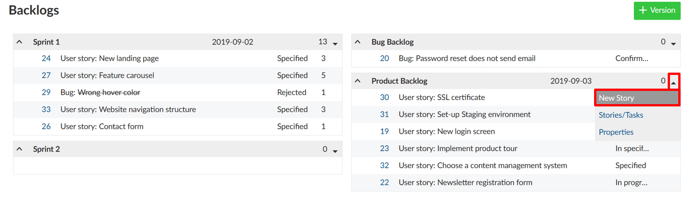

Here, you directly specify the work package type, title, status and story points. The list contains those work package types that are activated in the System -> *Administration* -> *Backlogs*.

A new line will be added in the backlogs to enter work package information.

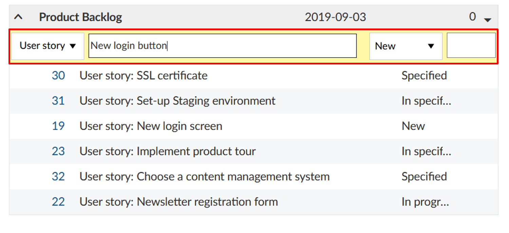

Clicking on the work package ID opens the work package full screen in a  separate tab, where you can specify additional work package attributes.

Of course, new user stories can also be directly created following the usual procedure of [creating a new work package](../../work-packages/create-work-package/). In order to do so, choose a work package type and target version which are activated in the [backlogs settings in the Administration](../../../system-admin-guide/backlogs) – such as feature or bug, and  product or sprint backlog, respectively.

**Displaying of all user stories and tasks for a sprint** is also possible by selecting *Stories/Tasks* in the drop-down menu next to the sprint title.

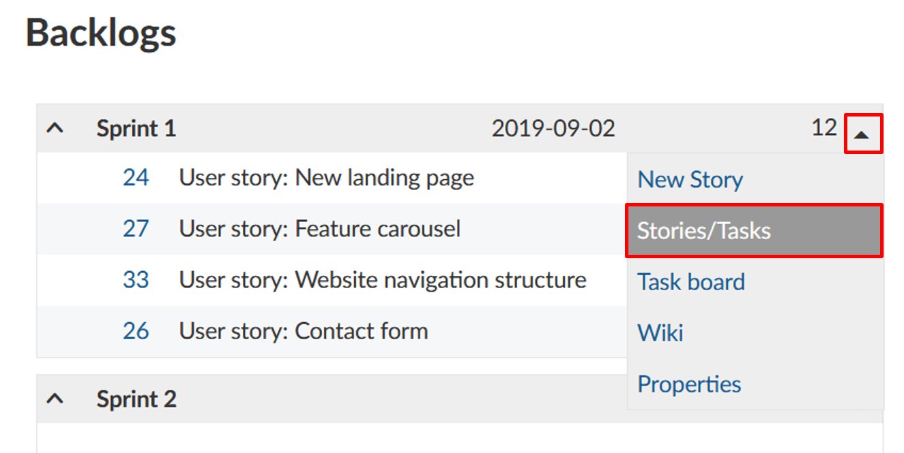

This will take you to the filtered work package view of all user stories and tasks in a sprint.

**Note**: All tasks created for a user story via the task board view  are automatically configured as child work packages of a user story. The task is thus always automatically assigned to the target version of the parent work package  (i.e. the user story).

## Prioritize user stories

You can prioritize different work packages within the product backlog using drag & drop and you can assign them to a specific sprint backlog or re-order them within a sprint.

**Note**: If you move a work package into the backlogs view, the target version will automatically be adapted in the background.

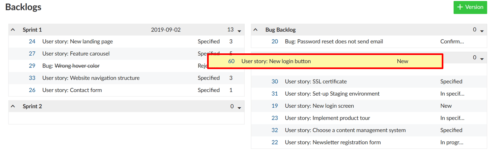

## Working with story points

In a sprint, you can directly document necessary effort as story points. The overall effort for a sprint is automatically calculated,  whereby the sum of story points is displayed in the top row.

**Story points** are definded as numbers assigned to a work package used to estimate (relatively) the size of the work.

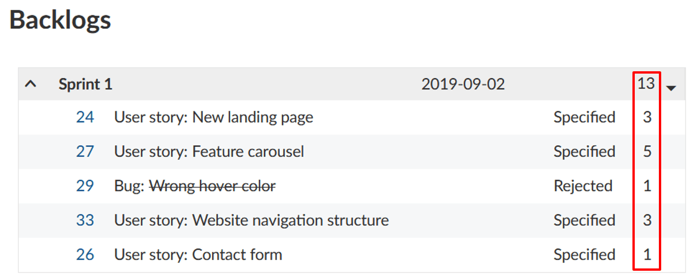

You can easily edit story points directly from the backlogs view. In order to do so, simply click in the line of the work package you want to edit, and make the desired changes.

In the same way, you can also edit the name, start and end date and status of a work package. To confirm your  changes, press “*Enter*” on your keyboard. To cancel your changes, press  “*Escape*”.

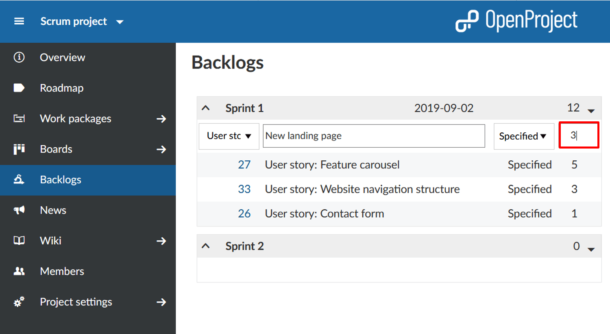

## Editing sprint duration

Moreover, you can adjust the start and end date of a backlog in the backlogs view. Clicking on the date opens a calendar where you can make your changes.

**Note**: Apart from start and end date, you can also adjust the sprint name. To do so, you have to be a project administrator.

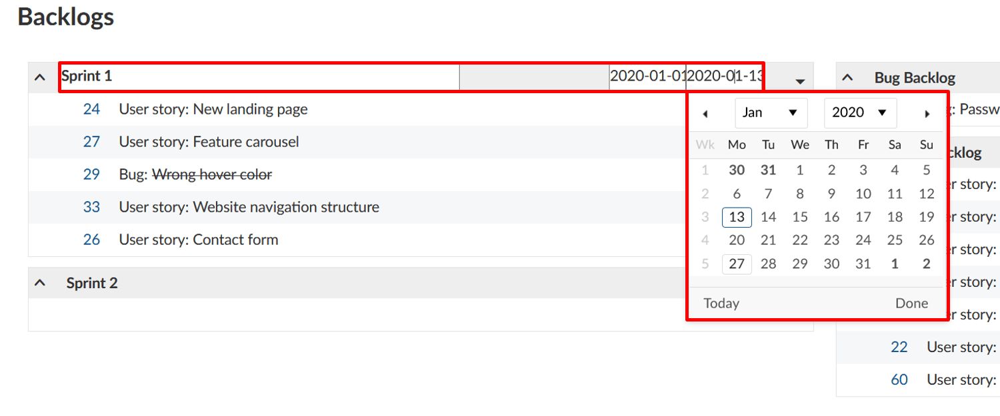

**Note**: a backlog version will be shown under [Roadmap](../../roadmap/), but not in a [Gantt chart](../../gantt-chart). If you want to display a sprint in a timeline, you can create a new work package, select a phase as a work package type, give it the same  name as to a specific version (for example Sprint 1) and assign the same start and end date.

## Burndown chart

**Burndown charts** are a helpful tool to visualize a sprint’s progress. With OpenProject, you can generate sprint and task burndown charts  automatically. As a precondition, the sprint’s start and end date must be entered in the title and the information on story points is well maintained.

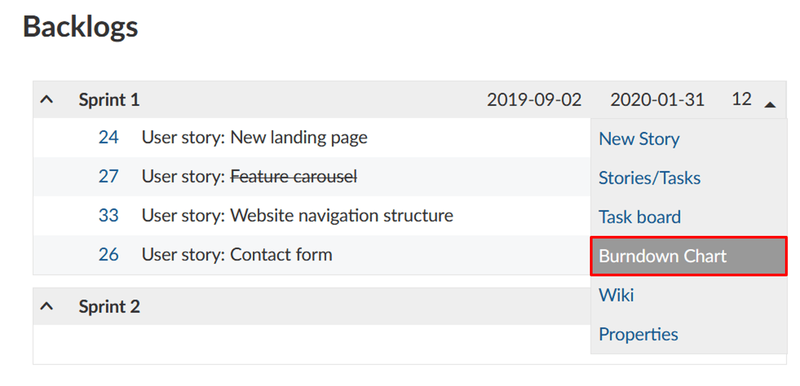

The sprint burndown is calculated from the sum of estimated story  points. If a user story is set to “closed“ (or another status which is  defined as closed (see admin settings)), it counts for the burndown.

The task burndown is calculated from the estimated number of hours  necessary to complete a task. If a task is set to “closed“, the burndown is adjusted.

The remaining story points per sprint are displayed in the chart.  Optionally, the ideal burndown can be displayed for reference. The ideal burndown assumes a linear completion of story points from the beginning to the end of a sprint.

​    

## Print story cards

If you do not want to do without the real project pin board in your project management, OpenProject offers the option to print the user stories and tasks.

In order to so, select the *Export* option from the sprint drop-down menu in the backlogs view.

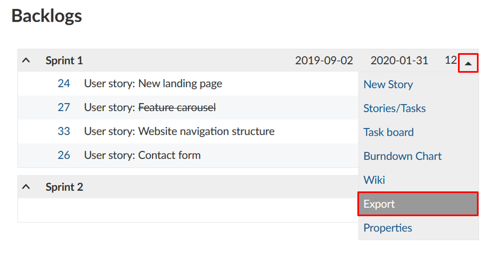

Choose a story card format from the list that will open. The format  selection can only be adjusted by a system admin  in the -> *Administration* -> *Backlogs* and applies to all projects in OpenProject.

Now, a PDF file is created which displays one or several stories or tasks per page (listing the work packages of the selected sprint),  depending on the selected settings.

## Sprint wiki

OpenProject also allows you to create a wiki page associated with a sprint directly from the backlog. You can document sprint information, e.g. ratios, sprint meetings, retrospecitve, sprint planning or sprint review meetings.

In order to do so, click on the arrow on the left of the respective Sprint title to open the drop-down menu. A click on *Wiki* will take you to the Wiki editing page.

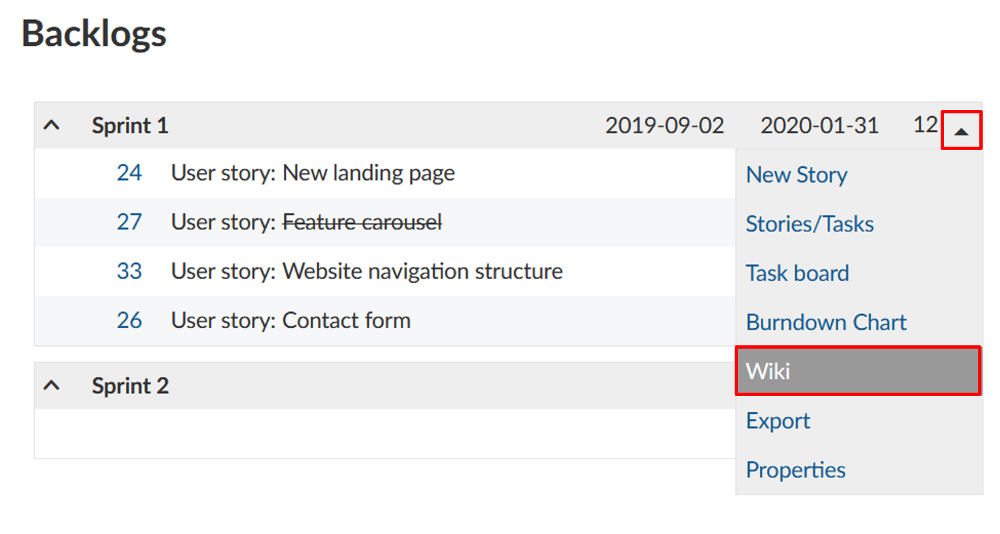

Here, you have all the tools for creating wiki pages at your disposal, with the title already pre-set and related to the selected sprint. You can insert and edit content using the text field and make  changes to the formatting using the navigation pane above. You can also  add comments and files from your hard drive. Once you have configured  the wiki page according to your preferences, click *Save.*

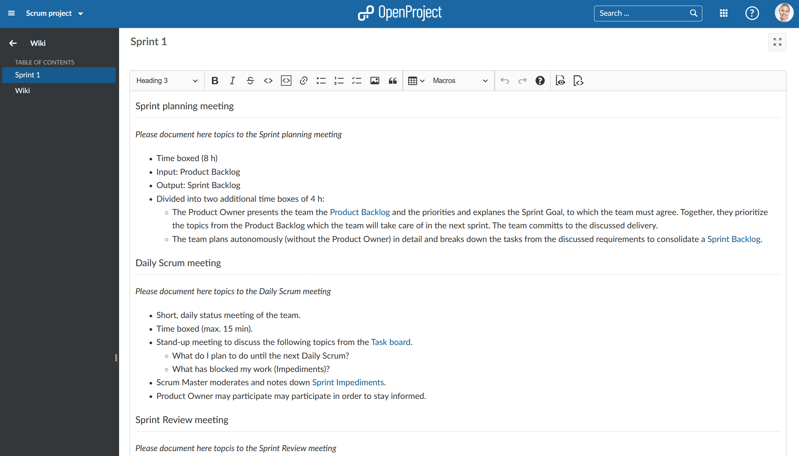

**Note**: You can configure the sprint wiki template in the -> Administration -> Backlogs. If you create a wiki page with the respective name, e.g. sprintwiki, all sprint wikis will use this wiki page as a template.

