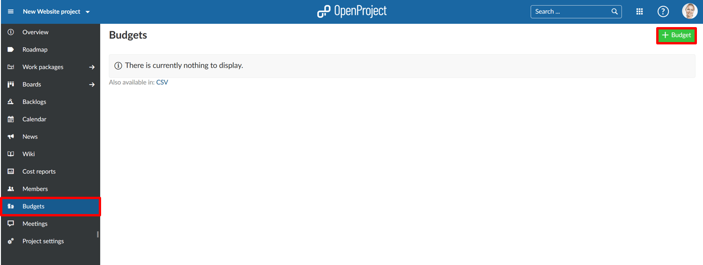
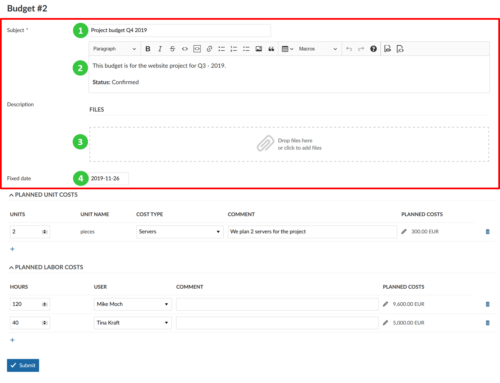
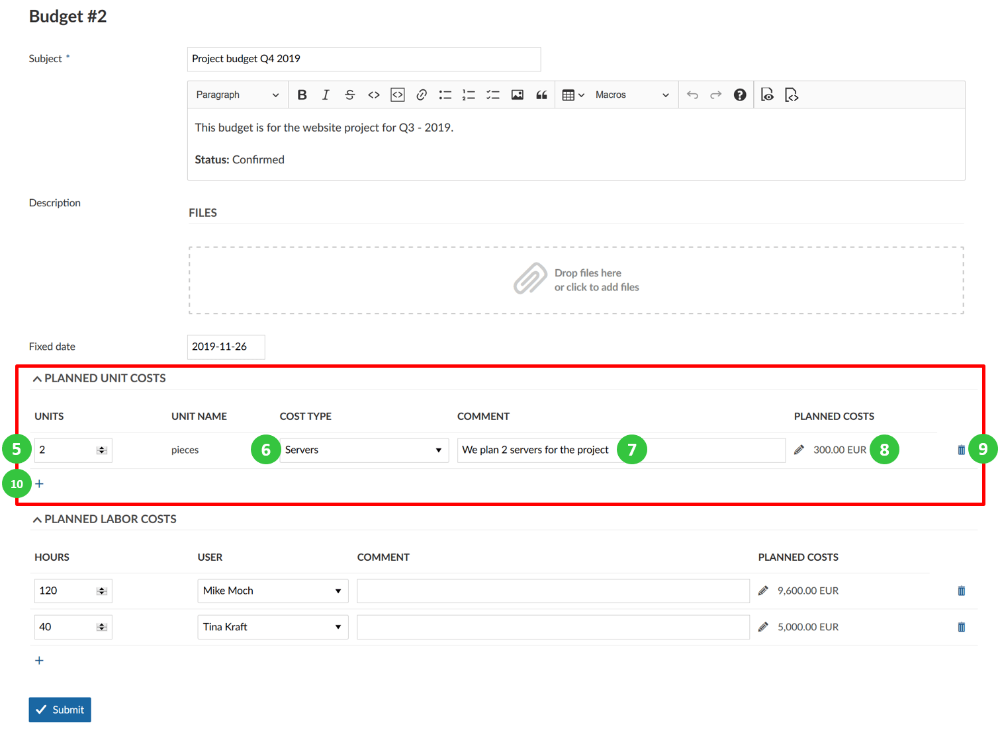
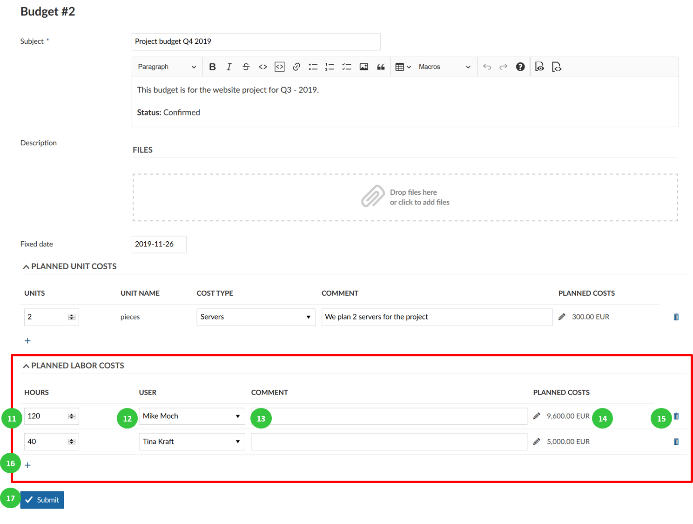
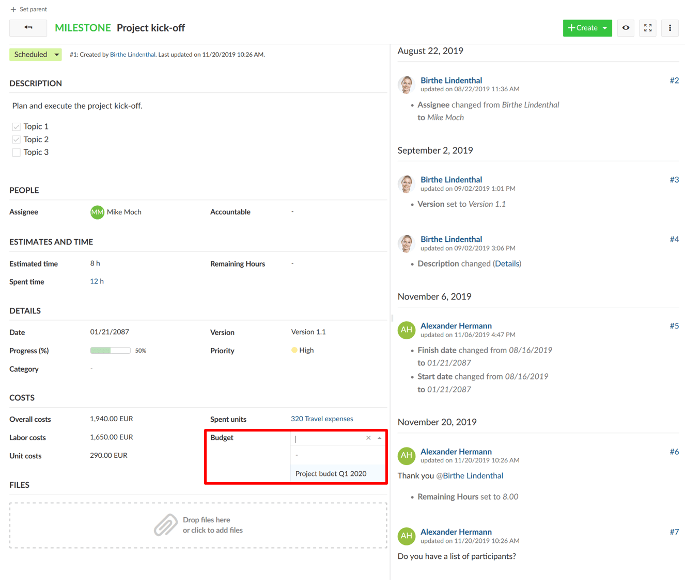
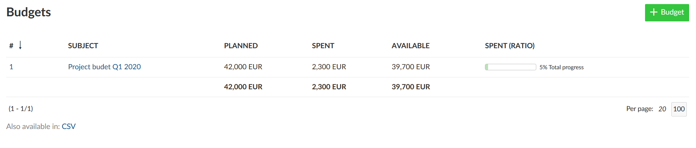
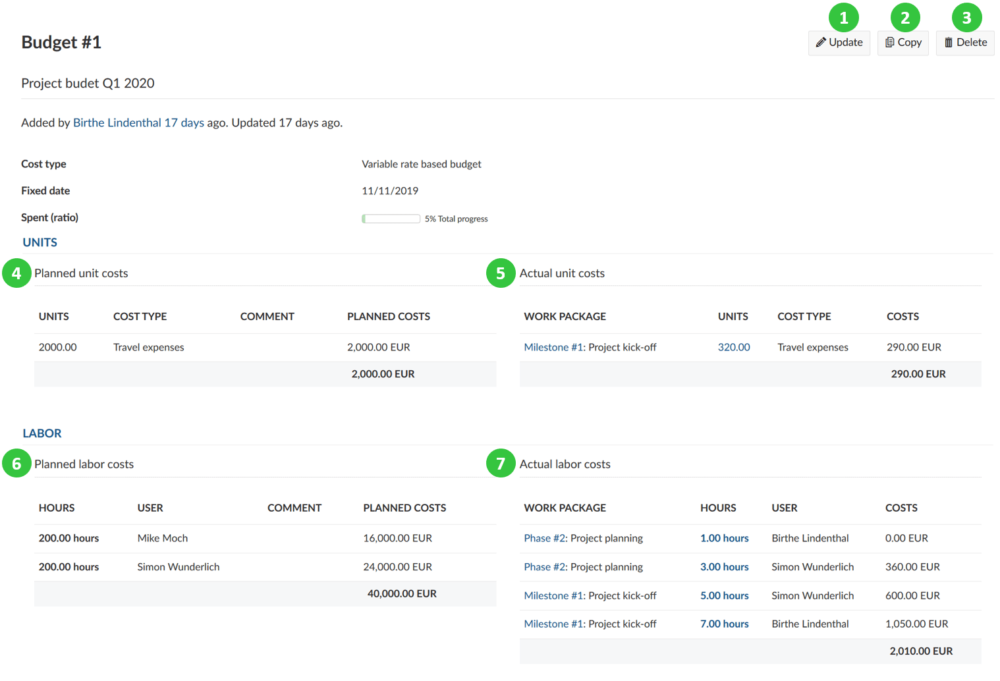

---
sidebar_navigation:
  title: Budgets
  priority: 780
description: Find out how to create and manage budgets for a project in OpenProject.
robots: index, follow
keywords: budgets
---

# Budgets

You can create and manage a **project budget** in OpenProject to keep track of your available and spent costs in a project.

You can add planned **unit costs** as well as **labor costs** for the project.

Then, you will assign work packages to a budgets. If you log time or costs to this work package the costs will booked to this budget and show the percentage spent for a project budget.

| Feature                                                      | Documentation for                                            |
| ------------------------------------------------------------ | ------------------------------------------------------------ |
| [Create a project budget](#create-a-project-budget)          | How to set up a project budget in OpenProject?               |
| [Add planned unit costs](#add-planned-unit-costs)            | How to add planned unit costs to a budget?                   |
| [Add planned labor costs](#add-planned-labor-costs)          | How to add planned labor costs to a budget?                  |
| [Assign a work package to a budget](#assign-work-package-to-a-budget) | How to assign a work package to book time and costs to a project budget? |
| [View details and update budget](#view-details-and-update-budget) | How to display the details, update, copy or delete a project budget? |
|                                                              |                                                              |

## Create a project budget

In order to create a budget in your project, please activate the **Budgets module** in the [project settings](../projects/).

To create your first budget in OpenProject, click the green **+ Budget** button on the top right of the page.

In the detailed view you can enter the details for your project budget, add planned unit costs and planned labor costs.

1. Enter a **subject** for your budget so you can identify it easily.
2. Enter a detailed **description** to add further information to your budget, e.g. budget owner, status and more.
3. Upload more **files** to your budgets with drag and drop or by clicking on the field and choosing a file from the explorer.
4. Enter a **fixed date**: this date is the basis for the budget to calculate the planned costs based on the [configured hourly rate](../time-and-costs/cost-tracking#define-hourly-rate-for-labor-costs) in the user's profile or the [cost types](../../system-admin-guide). The rates can be configured for different date ranges, therefore, you need to set a fixed date for a budget for which the costs will be calculated.

### Add planned unit costs

You can add planned unit costs to a budget in your project. These [unit costs first need to be configured in the system's administration](../../system-admin-guide).

5. Enter the number of **units** of the cost type to add to your project budgets.

6. Choose the **cost type** you would like to plan for your budget from the drop-down list. The [cost types first need to be configured in the system administration](../../system-admin-guide).

   The **unit name** will be set automatically according to the configuration of the cost types in your system administration. 

7. Add a **comment** to specify the unit costs.

8. The **planned costs** for this cost type will be calculated automatically based on the configuration of the cost per unit for this cost type. The cost rate will be taken from the fixed date you have configured for your budget.
   You can click the **edit icon** (small pen) if you want to manually overwrite the calculated costs for this cost type.

9. Click the **delete** icon if you want to drop the planned unit costs.

10. The **+ icon** will add a new unit cost type for this budget.

### Add planned labor costs

You can also add planned labor costs to a budget.

11. Set the **hours** that will be planned for a user on this budget.
12. Add a **user** from the drop-down list.
13. You can include a **comment** for your planned labor costs if needed.
14. The total amount of planned costs will be calculated based on the entered hours and the [hourly rate configured](../time-and-costs/cost-tracking/#define-hourly-rate-for-labor-costs) for this user in the user profile.
    You can manually overwrite the calculated planned labor costs by clicking the edit icon (pen) next to the calculated amount.
    The costs will be calculated based on the hourly rate taken from the fixed date for your budget.
15. With the **delete** icon you can remove the planned labor costs from the budget.
16. Add more planned labor costs for different users to your budget with the **+ icon**.
17. Save and submit your changes by pressing the blue button.

## Assign a work package to a budget

To add a work package to a project budget to book time and costs to a budget, navigate to the respective work package detailed view.

In the Costs section, select the **budget** which you want to assign this work package to. You will see a [list of budgets configured](#create-a-project-budget) in your project in the drop-down list.

Now, all [time and costs booked to this work package](../time-and-costs) will be booked against the corresponding budget.

## View details and update budget

You can view the details of a budget and make changes to your budget by selecting it from the list of budgets.

Click on the subject to open the details view of the budget.

You will get and overview of planned as well as spent costs and the available costs for your variable rate budget. Also, the total progress of the budget (ratio spent) is displayed. Furthermore the fixed rate is shown from which the costs for labor and unit costs are being calculated.

1. **Update** the budget and make changes to e.g. planned unit costs or planned labor costs.
2. **Copy** the budget to use it to create a new budget based on the configurations for this budget.
3. **Delete** the budget.
4. In the budget details you will see all **planned unit costs**.
5. The work packages assigned to this budget that have **actual unit costs** booked.
6. The **planned labor costs** are displayed for this budget.
7. The **actual labor costs** list all work packages that are [assigned to this budget](#assign-a-work-package-to-a-budget) and have logged time on it.

**Note**: The costs are calculated based on the [configuration for cost types](../../system-admin-guide) and the [configured hourly rate](../time-and-costs/#define-hourly-rate-for-labor-costs) in the user profile.

## Frequently asked questions (FAQ)

### How do I prepare a budget in OpenProject?

Budgets are currently limited to a single project. They cannot be shared across multiple projects.
This means that you would have to set up a separate budget for the different main and sub projects.
You can however use cost reports to analyze the time (and cost) spent across multiple projects. For details, you can take a look at our [time and cost reports user guide](../time-and-costs/reporting/).
