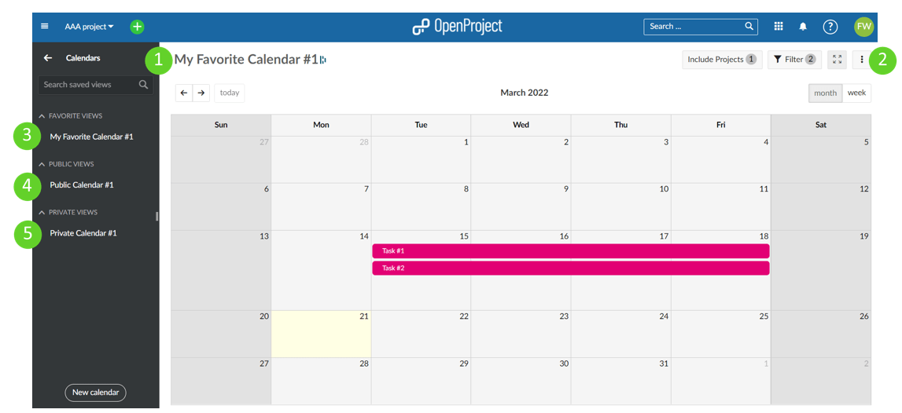
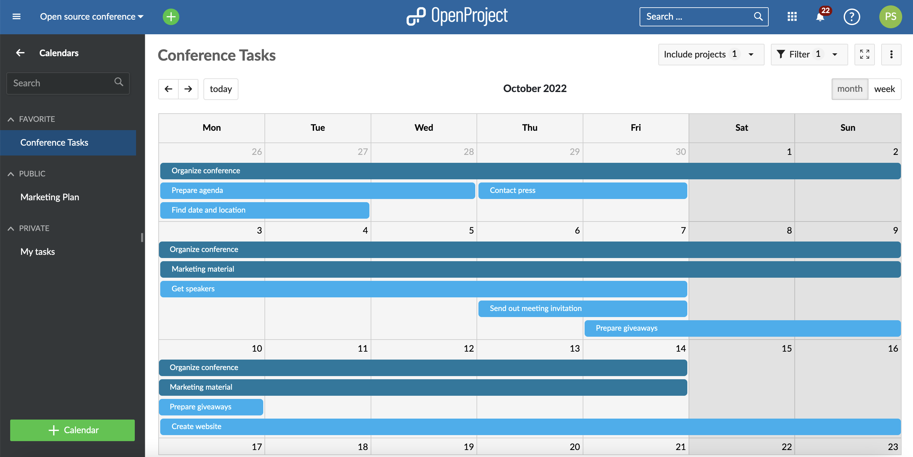
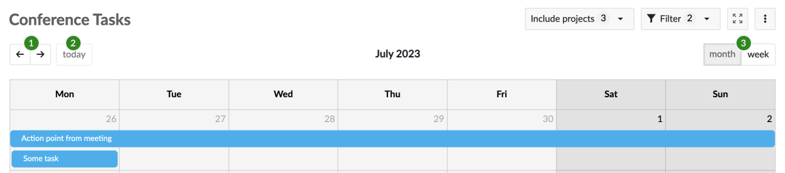
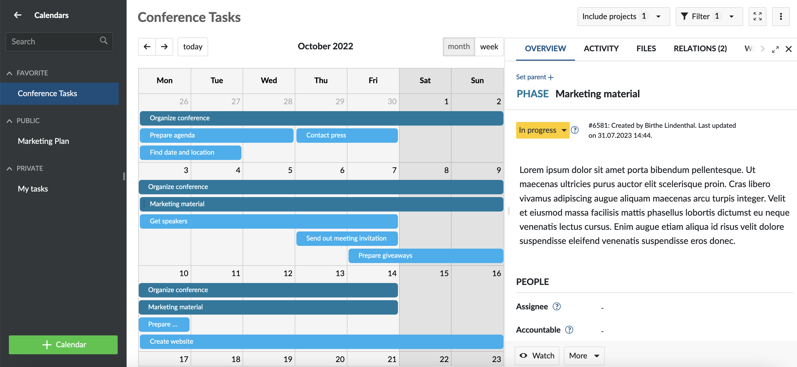
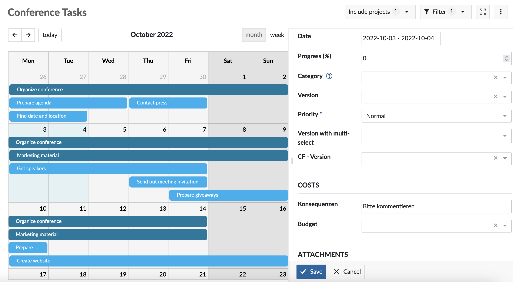
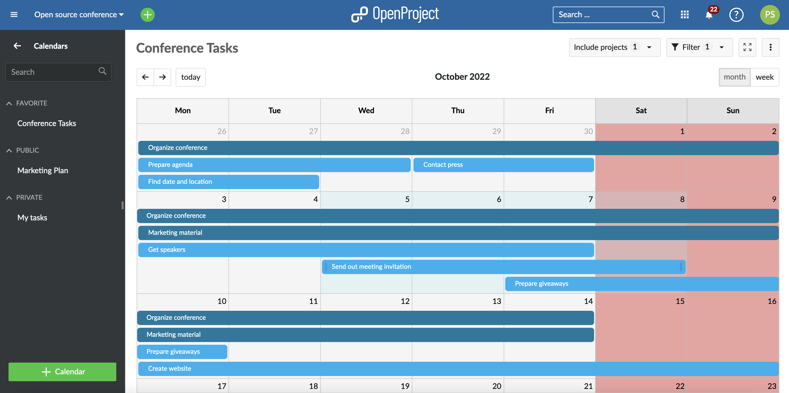
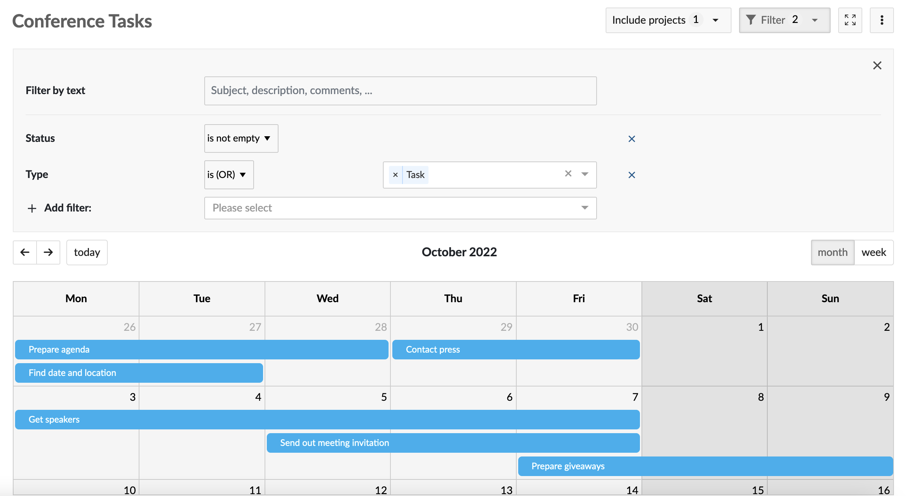
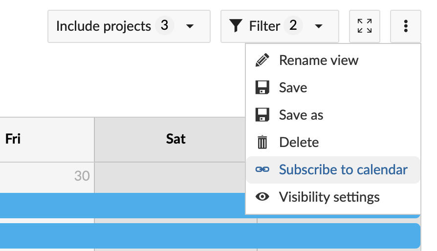
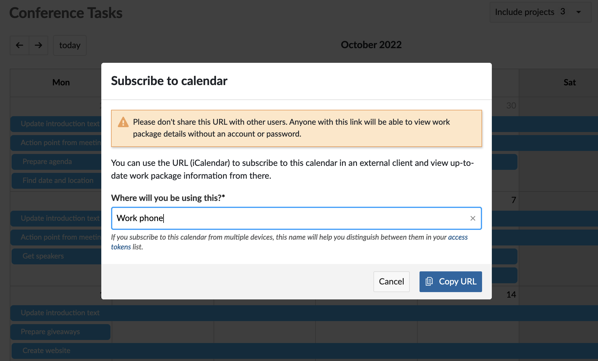

---
sidebar_navigation:
  title: Calendar
  priority: 840
description: How to create, use and subscribe to a calendar in OpenProject.
keywords: calendar, ical, month, week, view
---

# Calendar

The Calendar module gives you an overview of work packages scheduled in a particular month or week. This makes it easier to track and follow multiple parallel tasks and get a sense of how a project will evolve (or has evolved) over time.

You must first enable the Calendar module in your [project settings](../projects/project-settings/modules) to use it.

| Topic                                               | Content                                                      |
| --------------------------------------------------- | ------------------------------------------------------------ |
| [Create a new calendar](#create-a-new-calendar)     | How to create a new calendar and manage visibility settings. |
| [Use the calendar](#use-the-calendar)               | How to view, modify, create and filter work packages in the calendar. |
| [Subscribe to a calendar](#subscribe-to-a-calendar) | How to subscribe to and access a calendar from an external client. |

## Create a new calendar

Once enabled, clicking on the **Calendars** entry on the left sidebar takes you to the Calendar module with a list of all existing calendars. Initially, it will be empty.

- You can create a new calendar by clicking on either the **+ Calendar** button at the top right corner near your avatar or at the bottom of the sidebar on the left.
- Click on an existing (saved) calendar to view it.
- You can change the visibility settings of any calendar by clicking on **\[⋮\] (more)** -> **Visibility settings.**
  - Any calendar that has the **Favored** option checked will be displayed under the **Favorite** heading in the sidebar to the left.
  - Any calendar that has the **Public** option checked will be visible to all members of the current project and listed under the **Public** heading in the sidebar to the left.
  - Any calendar that has the **Public** option unchecked will be considered **private** and displayed under the **Private** heading in the menu bar to the left.

## Use the calendar

### View work packages

When you open a new calendar, all work packages within the current project are displayed as horizontal strips that span all dates between the start and finish dates (inclusive). The color represents the [work package type](../../system-admin-guide/manage-work-packages/work-package-types). The subject or title displayed on the strip (insomuch as the length allows).

The current month is automatically selected.

1. You can use the previews/next arrow controls (←, →) in the top left corner to move forwards or backwards in time.
2. The **today** button brings you back to the current date.
3. You can use the month/week toggle on the top right corner to switch between either a month view or a week view.

If multiple work packages are scheduled on the same day, they are displayed in a vertical stack.

Click on a work package strip to view the work package in split screen mode.

### Create work packages

You can create new work packages directly on the calendar. To do so, either click on a single date or click and drag across a date range. A new work package form will open in a split screen with the selected date(s) pre-filled.

### Modify work packages

You can make basic date modifications simply by manipulating the work package strips:

- Change the start date by grabbing the drag handle on the left edge of the strip and extending or shortening it.
- Change the finish date by grabbing the drag handle on the right edge of the strip and extending or shortening it.
- Drag an entire strip to move the work package forwards or backwards in time whilst preserving duration.

> **Note**: The calendar will highlight non-working days with a darker background color. By default, a work package cannot be dragged or resized such that it begins or ends on these days unless the “Working days only” switch is turned off for that work package. To learn how to do this, refer to the documentation on [Working days and duration](../work-packages/set-change-dates/#working-days-and-duration).
>
> Work packages can also expand and retract in width depending on how many non-working days are spanned. For example, a 3-day task starting on Thursday and ending on Monday will spread across 5 calendar days. Dragging that same work package so that it starts on a Tuesday and ends on a Thursday means that it will spread across 3 calendar days. In both cases, the duration remains 3 days.

### Filters

You can filter the work packages displayed in a calendar by adding any number of [filters](../work-packages/work-package-table-configuration/#filter-work-packages "Learn more about work package filters"), e.g. *Author*, *Due Date*, *Priority*, *Assignee*, etc. This allows you to create a custom calendar showing only relevant work packages, either for yourself (as a private calendar) or for your team (as a public calendar visible to all project members).

Click the **Filter** button on the top right above the calendar to open the filter details.To add another filter criteria, select the drop down next to **+ Add filter** and choose a filter criteria.The number of different filter criteria is displayed on the filter button.

> **Note:** OpenProject also offers a module called **Team planner** that allows you to view modules in a calendar by assignee. [Learn more about Team planner](../team-planner "Documentation about Team planner").

### Include other projects

Much like with work package tables, it is possible to display work packages from other projects. Use the **Include projects** dialog, where you can select/unselect from a list of projects and sub-projects. To automatically include all sub-projects for each project you chose to select, check the **Include all sub-projects** box at the bottom of the dialog.

### Embed a calendar in the project overview

You can also display the calendar on the dashboard in the [project overview](../project-overview/#calendar-widget).

### Zen mode

You can display the calendar in full screen mode by hiding the navigation bar  and sidebar to work free of distractions. Click the **Activate zen mode** button on the top of the calendar. Press the escape key (**Esc**) to exist Zen mode.

## Subscribe to a calendar

OpenProject allows you to subscribe to and access any of your calendars using an external client that supports the iCalendar format (such as Thunderbird, Open-Xchange, Apple Calendar or Google Calendar).

This makes it possible for you to keep an eye on your project schedule from any compatible device (including mobile devices) without having to connect to your OpenProject instance and always remain up to date with relevant work packages.

> **Note:** You can only subscribe to saved calendars. If you are creating a new calendar, please save it before you are able to create a calendar subscription.

To subscribe to a calendar:

1. Click on the **\[⋮\] (more) button** on the toolbar and select **Subscribe to calendar**.
2. In the modal that appears, give this calendar a unique name (you can only use it once). We recommend naming it based on where you will be subscribing to this calendar from ("personal phone" or "work tablet" for example).  
3. Click on **Copy URL**. This creates the a [calendar token](../../user-guide/my-account/#access-tokens) and copies the calendar URL to your clipboard.
4. Paste this URL in your desired calendar client to subscribe.

> **Important:** Please don't share this URL with other users. Anyone with this link will be able to view work package details without an account or password.
