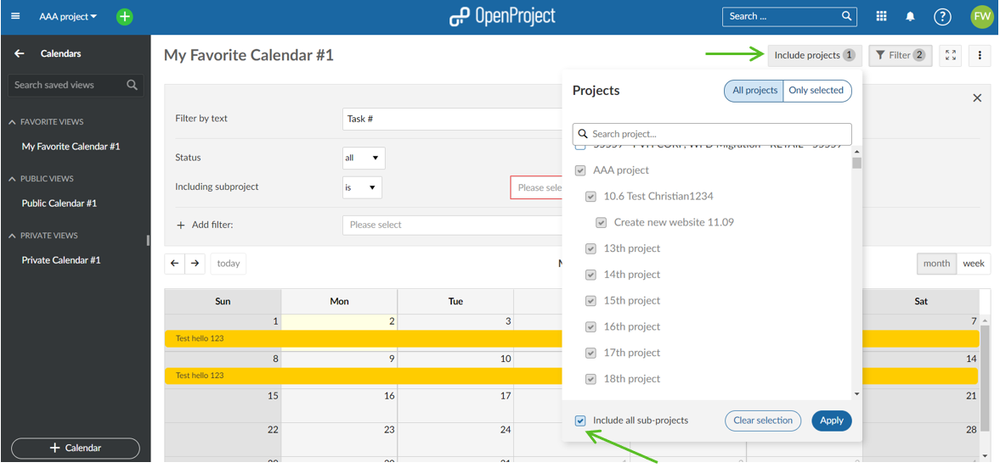

---
sidebar_navigation:
  title: Calendar
  priority: 840
description: Create a calendar in OpenProject.
keywords: calendar
---

# Calendar

The calendar shows all of the project's work packages in calendar form.

| Topic                                                        | Content                                               |
| ------------------------------------------------------------ | ----------------------------------------------------- |
| [Calendar overview](#calendar-overview)                      | How to use the calendar in OpenProject.               |
| [Filters in calendar](#filters-in-calendar)                  | How to filter in the calendar view.                   |
| [Zen mode](#zen-mode)                                        | How to work distraction free in a calendar view.      |
| [Project overarching calendar](#project-overarching-calendar) | How to display more than one project in the calendar. |

## Calendar overview

To display a calendar in a project, the module **calendar** needs to be activated in the [project settings](../projects/#project-settings).

When you open the calendar, all work packages within the current project are displayed on the calendar, displaying the title of the work package. The colors represent the different [work package types](../../system-admin-guide/manage-work-packages/work-package-types).

The current month is automatically selected. You can change the  date range between month or week and navigate through the views with the arrows on the left. The **today** button brings you back to the current date.

Hovering over one item displays more information to a work package, such as the type, status, start and finish date, assignee and priority, as well as the project to which the work package belongs.

Click on any item to open the work package details or to edit an item.

The numbers in the instruction below correspond to the numbers in the image above:

1. Edit/change the name of your calendar or add additional calendars. Each calendar can be customized to display work packages from specific project(s). You can further fine-tune the information displayed using the filters.

2. Change your calendar to be private to you or public to your organization: Select the **[⋮] button** -> **Visibility settings**

   a. Check the **Public** box to make the calendar visible to your entire organization.

   b. Check the **Favored** box to save the calendar to your favorites.

3. Any calendar that has the **Favored** box checked in the "Visibility settings" will be displayed under the **Favorite Views** heading in the menu bar to the left.

4. Any calendar that has the **Public** box checked in the "Visibility settings" will be displayed under the **Public Views** heading in the menu bar to the left.

5. Any calendar that has the **Public** box unchecked in the **Visibility settings** will be considered **Private**, and hence displayed under the **Private Views** heading in the menu bar to the left.

> **Note**: The calendar will highlight non-working days with a darker background colour. By default, a work package cannot be dragged or resized such that it begins or ends on these days unless the "Working days only" switch is turned off for that work package. To learn how to do this, refer to the documentation on [Working days and duration](../work-packages/set-change-dates/#working-days-and-duration).
>
> Work packages can also expand and retract in width depending on how many non-working days are spanned (for example, a 3-day task starting on Thursday and ending on Monday will spread across 5 calendar days;  dragging that same work package so that it starts on a Tuesday and ends on a Thursday means that it will spread across 3 calendar days. In both cases, the duration remains 3 days.

## Filters in calendar

You can filter the work packages in the calendar view by adding any number of filters, e.g. *Author*, *Due Date*, *Priority*, *Assignee*, etc.

Click the **Filter** button on the top right above the calendar to open the filter details.

To add another filter criteria, select the drop down next to **+ Add filter** and choose a filter criteria.

The number of different filter criteria is displayed on the filter button.

You can also display the calendar on the dashboard in the [project overview](../project-overview/#calendar-widget).

## Zen mode

You can display the calendar in a full screen view to eliminate header and project menu and work distraction free.

Click the **Activate zen mode** button on the top of the calendar.

Click Escape (**Esc**) to leave the Zen mode.

## Project overarching calendar

It is possible to display the work packages from more than one project in the calendar. To include, or exclude such work packages, use the **Include projects** dialog, where you can select/unselect the appropriate projects and sub-projects. To automatically include all subprojects for each project you chose to select, check the **Include all sub-projects** box at the bottom of the dialog.

