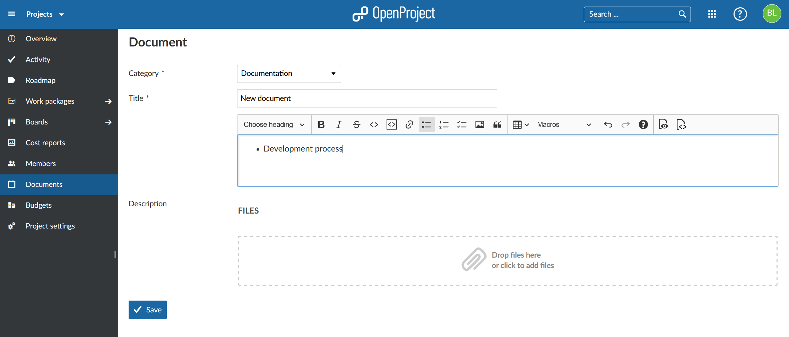
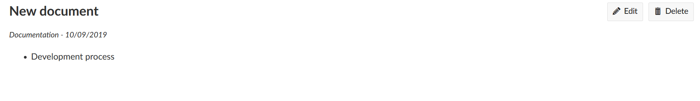

---
sidebar_navigation:
  title: Documents
  priority: 770
description: Upload documents in OpenProject.
robots: index, follow
keywords: documents
---

# Documents

This module allows uploading documents directly to the project under project menu item *Documents* and categorizing documents.

## Add a new document to the project

To upload a document select Documents from the project menu and click *New Document*. You can select the document category from the ones that you have  created under project administration settings. See in the Admin Guide  how to create a new document category.

Name the document and add a short description. After you have uploaded the file, do not forget to click Save.

The uploaded documents are visible to all project members who have the necessary permission.

**Note**: There is no versioning of documents. It is simply and upload of documents to the respective project.

## Edit or delete a project document

You can edit or delete documents anytime. To do that, navigate to the Documents overview and select the document you want to edit. By  selecting *Edit* or *Delete* respectively you can either  adjust the document file and related information or remove the file  permanently. You can add the file again at a later point.

      

## Frequently asked questions (FAQ)

### Is there a size limit for uploading documents to the OpenProject Cloud Edition?

There is no limit in OpenProject in terms of the number of files that you can upload and work with in OpenProject. There is only a restriction in terms of the maximum file size: A file can have a size up to 256 MB.
