---
sidebar_navigation:
  title: OneDrive/SharePoint integration
  priority: 800
description: Using the OneDrive/SharePoint integration to link/unlink files and folders to work packages, viewing and downloading files
keywords: integration, apps, OneDrive, SharePoint, user
---

# OneDrive/SharePoint integration (Enterprise add-on)

You can use **OneDrive/SharePoint** as an integrated file storage in OpenProject.

> **Note**: OneDrive/SharePoint integration is an Enterprise add-on and can only be used with [Enterprise cloud](../../../enterprise-guide/enterprise-cloud-guide/) or [Enterprise on-premises](../../../enterprise-guide/enterprise-on-premises-guide/). An upgrade from the free Community edition is easy and helps support OpenProject.

This integration makes it possible for you to:

- Link files and folders stored in OneDrive/SharePoint with work packages in OpenProject
- View, open and download files and folders linked to a work package via the **Files** tab

> **Important note**: To be able to use OneDrive/SharePoint as a file storage in your project, the administrator of your instance should first have completed the [OneDrive/SharePoint integration setup](../../../system-admin-guide/integrations/one-drive). Then a project administrator can activate the integrated storage in the [File storages](../../projects/project-settings/files/) for a project.

| Topic                                                        | Description                                                  |
| ------------------------------------------------------------ | :----------------------------------------------------------- |
| [Connect OpenProject to OneDrive/SharePoint](#connect-your-openproject-and-onedrivesharepoint-accounts) | How to connect your OpenProject project and OneDrive/SharePoint |
| [Link files and folders to work packages](#link-files-and-folders-to-work-packages) | How to link your files and folders to work packages in OpenProject |
| [Upload files from OpenProject](#upload-files-from-openproject) | How to upload files to OneDrive/SharePoint from OpenProject  |
| [Download, open folders and remove links](#download-open-folders-and-remove-links) | How to download and open files and folders and remove links  |
| [Permissions and access control](#permissions-and-access-control) | Permissions and access control in OneDrive/SharePoint file storage |
| [Possible errors and troubleshooting](#possible-errors-and-troubleshooting) | Common errors in OneDrive/SharePoint integration and how to troubleshoot them |

## Connect your OpenProject and OneDrive/SharePoint accounts

To begin using this integration, you will need to first connect your OpenProject and Microsoft accounts. To do this, open any work package in a project where a OneDrive/SharePoint file storage has been added and enabled by an administrator and follow these steps:

1. Select any work package. Go to the **Files tab** and, within the correct file storage section, click on **Storage login** button.

   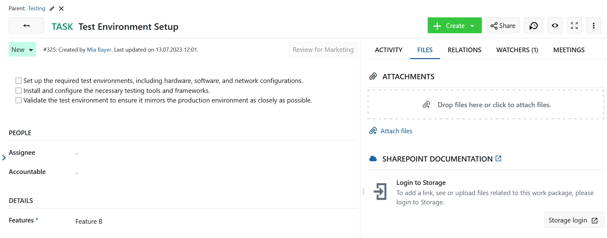

2. You will see a Microsoft login prompt asking you to log in. Enter your credentials and log in.
3. Once you have logged in, you will automatically return to the work package in OpenProject and see that you can now start uploading and linking files.

   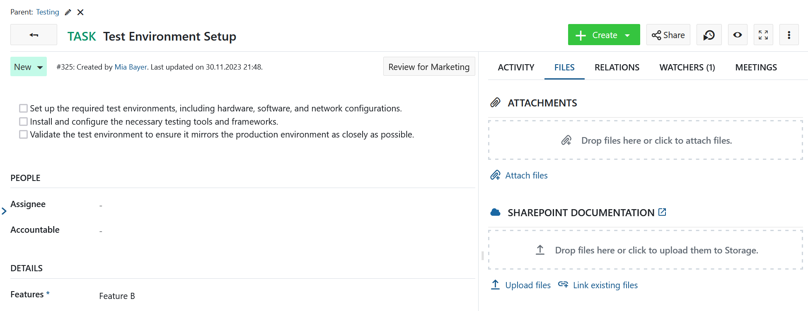

## Link files and folders to work packages

In addition to listing files directly attached to a work package, the **Files** tab shows the OneDrive/SharePoint files that are linked to the current work package. Hovering on any linked file with your mouse will give you options to open or download the file, show the containing folder in SharePoint or remove the link.

To link a SharePoint file to the current work package, you can either:

- select a local file, which  will be uploaded to OneDrive/SharePoint storage and linked to this work package
- select an existing file in OneDrive/SharePoint to link to

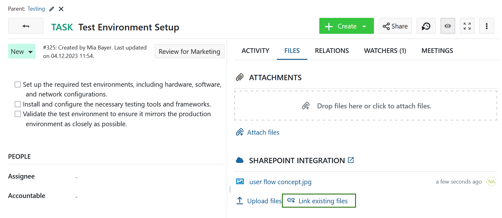

> **Info**: The default location that opens in the file picker is the file root of the configured OneDrive/SharePoint drive.

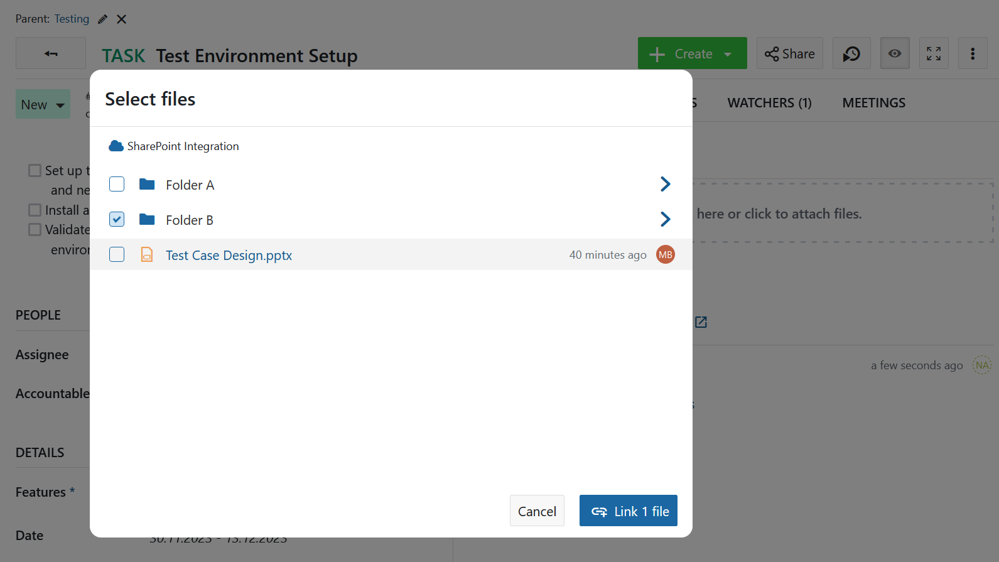

## Upload files from OpenProject

If the file you want to link has not yet been uploaded to SharePoint, you can do so by clicking on the **Upload files** link.

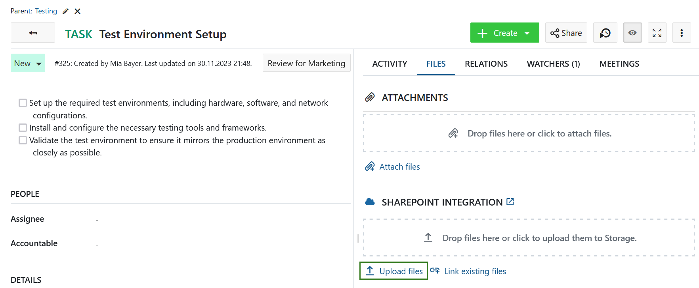

You will then be prompted to select a file (or multiple files) on your computer that you want to upload to OneDrive/SharePoint.

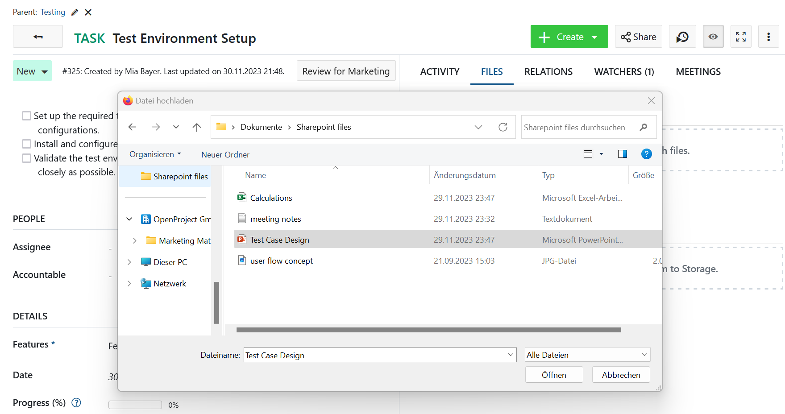

Alternatively, you can also simply drag a file or folder from your computer to the drag zone that will appear under the name of your OneDrive/SharePoint file storage.

Once you have selected or dropped the files you would like to upload, you will need to select the location on OneDrive/SharePoint to which they should be stored.

> **Info**: The default location that opens in the file picker is the file root of the configured OneDrive/SharePoint drive.

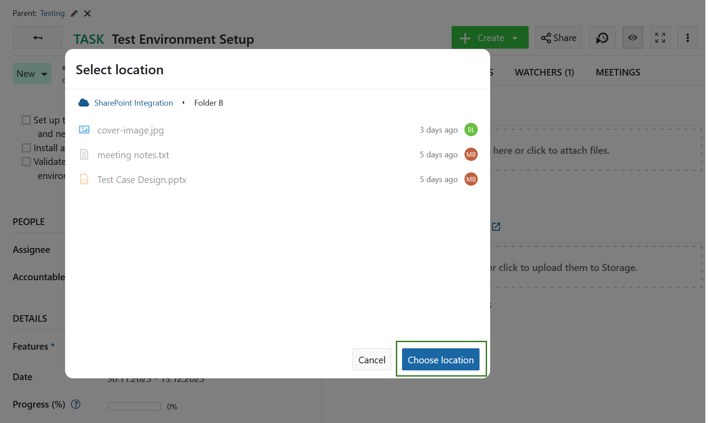

You can click on folders you see to navigate to them. Helpful breadcrumbs show you where you are in the folder hierarchy.

To navigate one level up or to go back to the root, simply click on the relevant parent in the breadcrumbs.

> **Info**: If you have navigated particularly deep (over 4 levels), intermediate levels might be collapsed to save space, but you’ll always be able to navigate back to the immediate parent or the root to go backwards.

To save the files you uploaded to the currently open folder, click on the **Choose location** button.

The selected file is uploaded to your OneDrive/SharePoint instance and linked to the current work package. It appears under the name of the file storage.

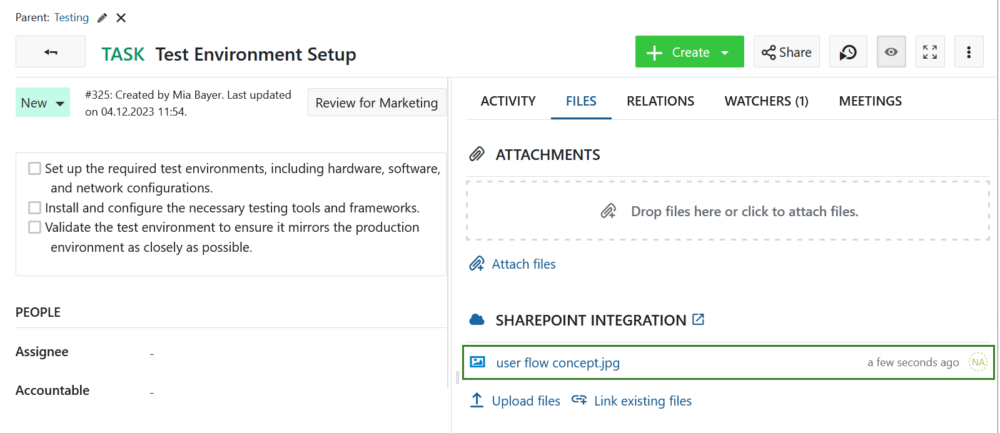

If a file has been deleted on the OneDrive/SharePoint file storage it will still be displayed under the **Files** tab. However it will not be selectable. If you hover over a deleted file you will see the message indicating that the file could not be found.

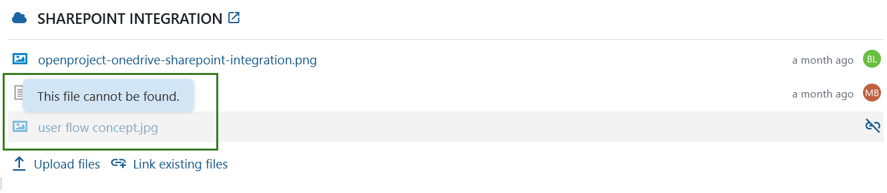

## Download, open folders and remove links

If you wish to unlink any linked file or folder, hover it in the list of linked files and click on the **Unlink** icon.

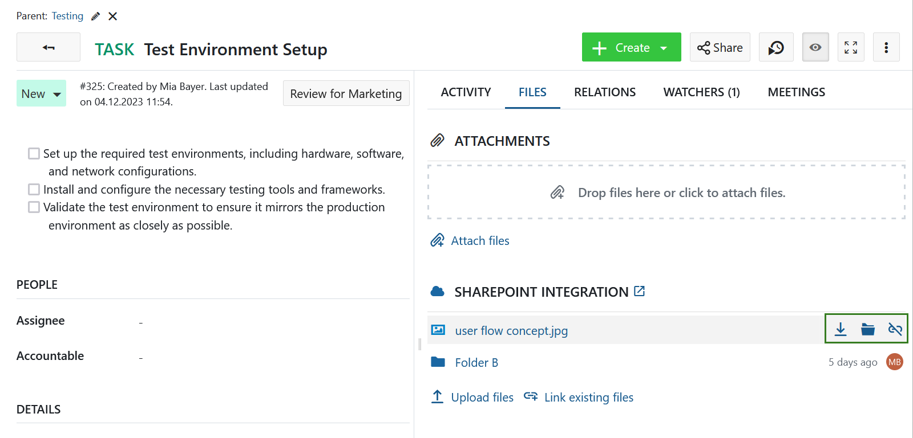

Respectively in order to download a file, click on the **Download icon** in the context menu of the file link in the list of the linked files.

If you click the **Folder icon**, the OneDrive/SharePoint folder containing this file will open in a separate tab.

## Permissions and access control

When a file or folder from OneDrive/SharePoint is linked to a work package, an OpenProject user who has access to that work package will be able to:

- See the name of the linked file or folder
- See when it was last modified (or created, if it has not yet been modified)
- See who last modified it (or who created it, if it has not yet been modified)

However, all available actions depend on permissions the OpenProject user (or more precisely, the OneDrive/SharePoint account tied to that user) has in OneDrive/SharePoint. In other words, a user who does not have the permission to access the file in OneDrive/SharePoint will also *not* be able to open, download, or modify the file in OpenProject.

Please note, that with automatically managed project folders these permissions are set by OpenProject based on user permissions in OpenProject.

## Possible errors and troubleshooting 

### No permission to see this file

If you are unable to see the details of a file or are unable to open some of the files linked to a work package, it could be related to your OneDrive/SharePoint account not having the necessary permissions. In such a case, you will be able to see the name of file, time of last modification and the name of the modifier but you will not be able to perform any further actions. To open or access these files, please contact your OneDrive/SharePoint administrator or the creator of the file so that they can grant you the necessary permissions.

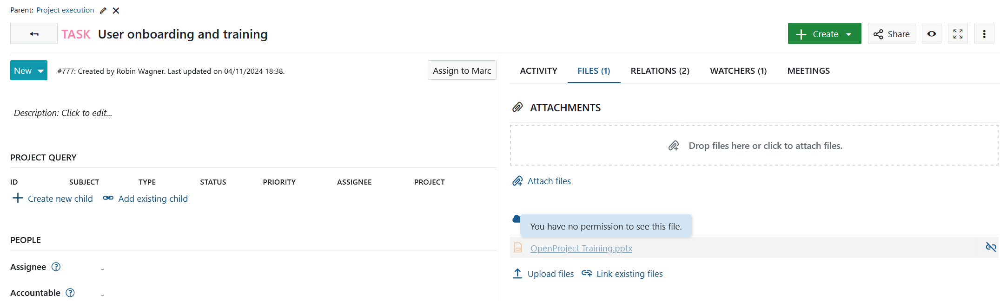
