---
sidebar_navigation:
  title: Forums
  priority: 820
description: Create and manage a forum in OpenProject
robots: index, follow
keywords: forum
---

# Forums

In the forum in OpenProject you can discuss topics in a project with the team: post questions, comment on it and document answers.

 **Forum** is defined as a module used to display forums and forum entries. The module has to be activated in the project settings and a forum has to be created in the forums tab in the project settings to be displayed in the side navigation.
 
| Feature                                                  | Documentation for                                            |
| -------------------------------------------------------- | ------------------------------------------------------------ |
| [Open a forum](#open-a-forum)                            | How to open an existing forum?                               |
| [Create a new message](#create-a-new-message-in-a-forum) | How to create a new message in a forum?                      |
| [Reply to a message](#reply-to-a-forum-message)          | How to add a reply to an existing forum message?             |
| [Watch a forum](#watch-a-frum)                           | How to keep informed about changes in a forum, e.g. new messages or replies? |
| [Edit a forum message](#edit-a-forum-message)            | How to edit a message in a forum?                            |
| [Delete a forum message](#delete-a-forum-message)        | How to delete a message within a forum?                      |
| [Create a new forum](#create-a-new-forum)                | How to create a new forum?                                   |
| Manage forums                                            | How to sort, edit or delete a forum?                         |

## Open a forum

To work in the forum in OpenProject, select the menu item **Forums** in the project navigation.

You will get a list of all existing forums within a project as well as a short description for it, the number of topics, messages as well as the last message within one forum.

Click on the Forum title to open an existing forum.

## Create a new message in a forum

To **add a new message** within an existing forum, click the green **+ Message** button on the top right of the selected forum.

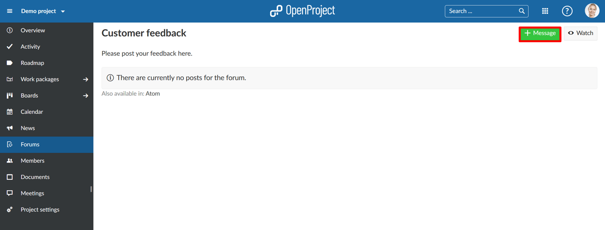

Enter the **subject of the message**.

You can choose whether the message should be **Sticky**. A sticky message always appears on top of the selected forum.

Select if a message should be **Locked**. Then it can no longer be edited or commented by the project team.

Enter a description which will then appears next to the message title in the forum. You can add a file if needed.

Click the blue **Create** button to create the new message for this forum.

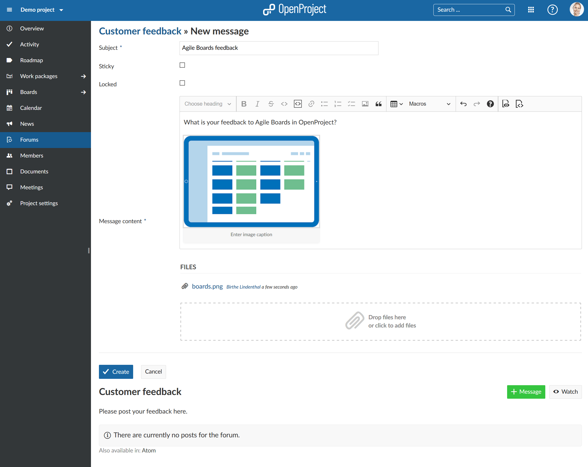

The **new forum message has been created**.

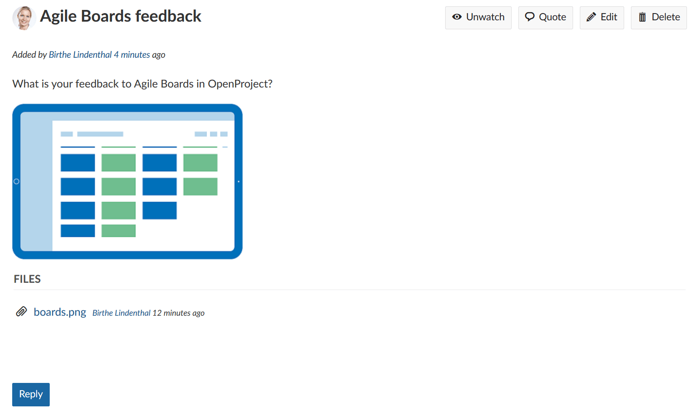

## Reply to a forum message

To add a **reply to an existing message** in a forum, click on the Subject in order to open the message.

Click the blue **Reply** button underneath the forum message.

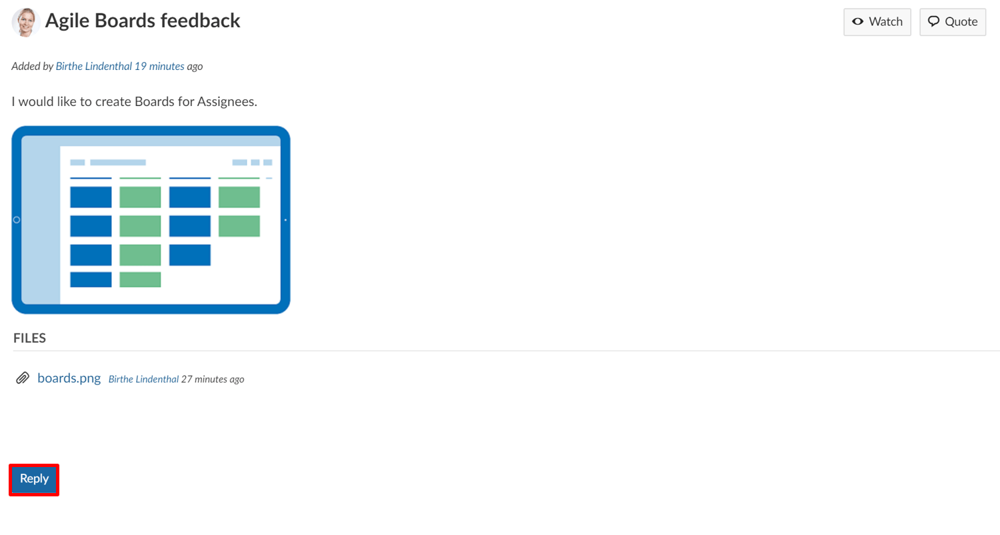Enter your **Message content** what you want to add as a reply to the existing message.

You can choose to also **add a file** if needed.

Click the blue **Submit** button in order to save your reply message.

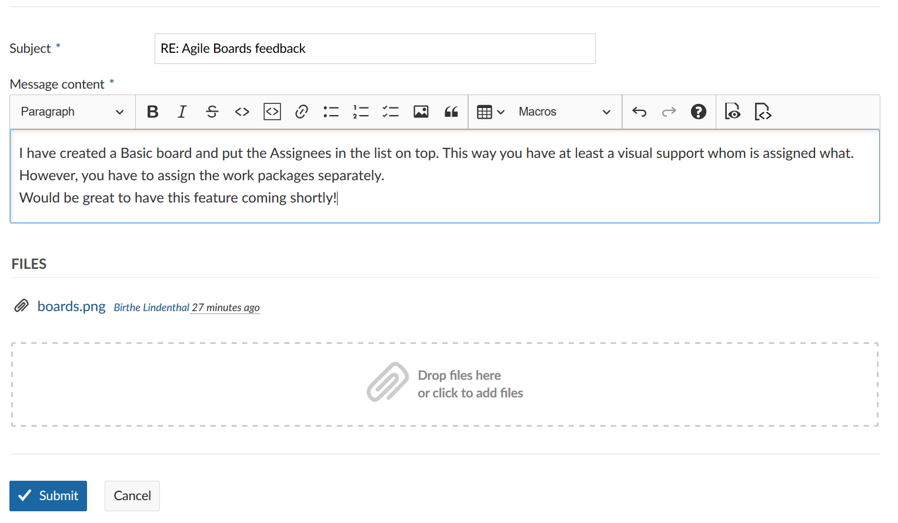

The reply has been added under the existing forum message.

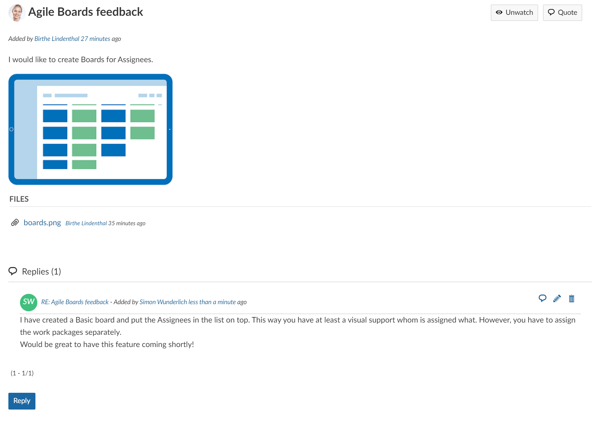

## Watch a forum

To keep informed about changes in a forum, e.g. new messages or new replies, you can add yourself as a **Watcher** of a forum.

[Open an existing forum](#open-a-forum) from the list.

You will get a list of all messages within this forum.

Click the **Watch** icon in the top right corner of the forum.

You will then be notified via e-mail according to your [e-mail notifications](/getting-started/my-account/#email-notifications) about new massages and replies in a forum.

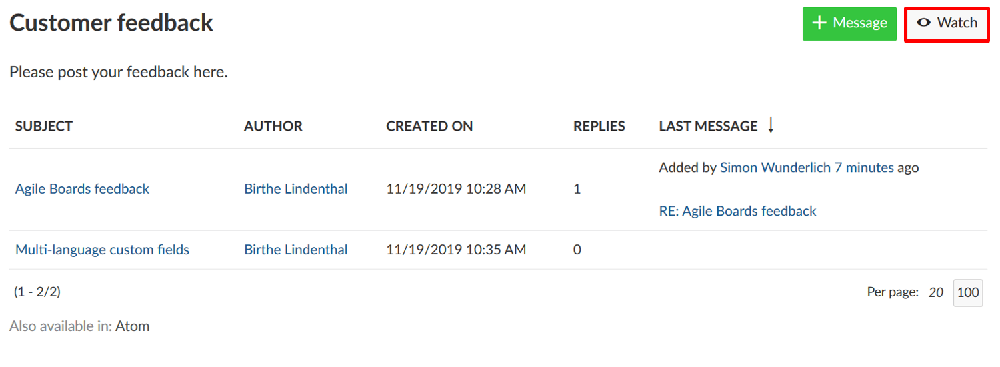

The icon will then change to Unwatch.

### Watch a message

If you watch a forum you will automatically watch all messages within this forum. Alternatively, you can also **watch only certain messages** within a forum where you want to be informed about changes.

This way, you select the message first by clicking on the subject, and then click the Watch button on the top right corner in the message details.

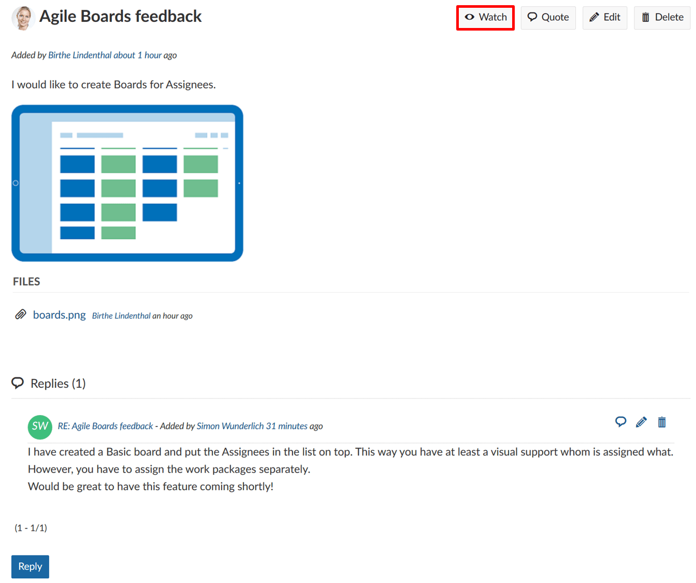

## Unwatch a forum

To unwatch a forum in order to not be informed via e-mail about new messages and replies in a forum, click the **Unwatch button** on the top right of the forum.

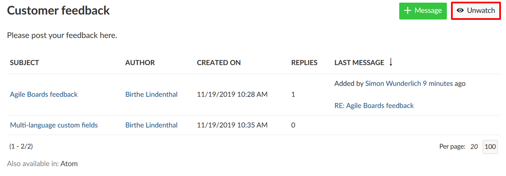

### Unwatch a message

The same applys to **unwatch a message**. Just select the message first which you do not want to watch any longerand click the **Unwatch** button.

## Edit a forum message

To **edit a message in a forum** select the message from the forum and in the message details click the **Edit** button in the top right corner of the message.

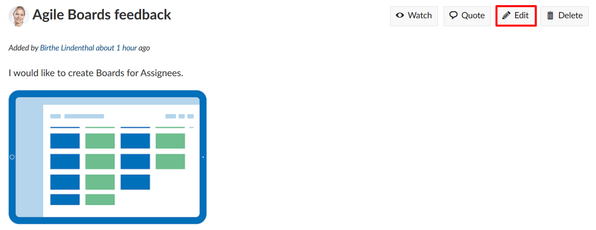

The message details will then be opened. You can make your changes  and click the **blue Save button**.

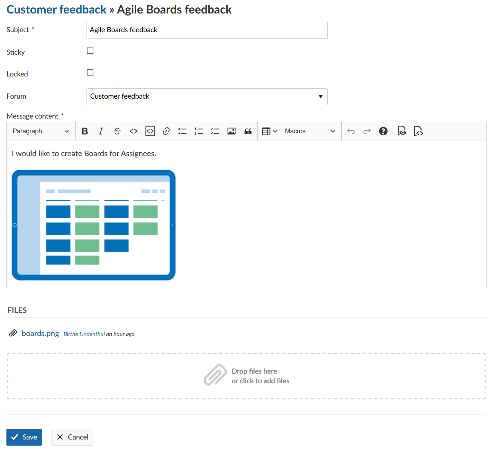

## Delete a forum message

To **delete a message in a forum**, select the message which you want to delete and press the **Delete** button in the top right corner of the message details.

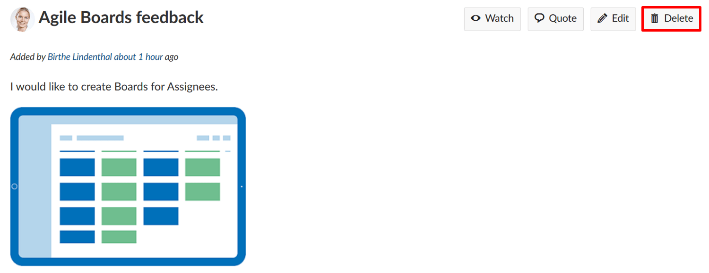

## Create a new forum

To create a new forum in your project, navigate to -> *Forums* and click the green **+ Forum** button.

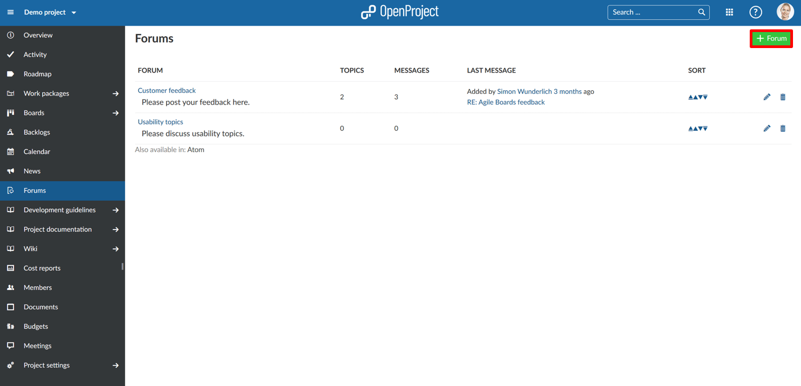

Enter a name and description for the new forum. Press the blue **Create** button so save the new forum.

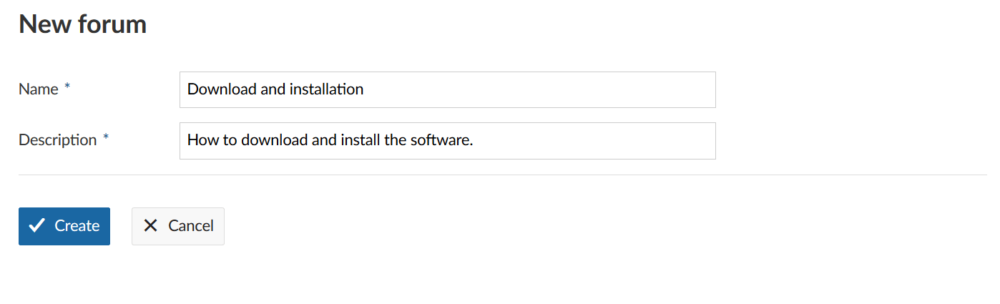

## Manage forums

If you wan to change the order of the forums in your project, want to edit a forum, or delete a form, go to the -> *Forums* overview list in your project.

1. Click the **arrows (up or down) to change the order** of the forums and sort them differently in the forum list in your project.
2. Click the **edit icon to change the name or description** of your form.
3. Click the delete icon to **delete a forum** from your project.

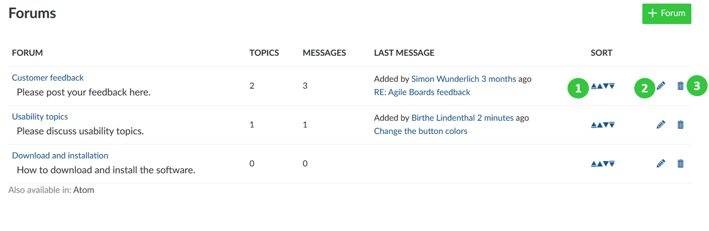