---
sidebar_navigation:
  title: Gantt charts
  priority: 865
description: Create project timelines with Gantt charts in OpenProject
keywords: gantt chart, timeline, project plan
---

# Gantt charts

The **Gantt charts** module in OpenProject displays the work packages in a timeline. You can collaboratively create and manage your project plan, have your project timelines available to all team members, and share up-to-date information with stakeholders. You can add start and finish dates and adapt them via drag and drop directly in the Gantt chart. Also, you can add dependencies, predecessors, or followers within the Gantt chart.

| Topic                                                                                                           | Content                                                                   |
|-----------------------------------------------------------------------------------------------------------------|---------------------------------------------------------------------------|
| [Activate the Gantt chart](#activate-the-gantt-chart)                                                           | How to activate the Gantt chart in OpenProject.                           |
| [Create a new element](#create-a-new-element-in-the-gantt-chart)                                                | How to add a new item to the Gantt chart.                                 |
| [Relations in the Gantt chart](#relations-in-the-gantt-chart)                                                   | Create and display dependencies in the Gantt chart.                       |
| [Understanding the colors and lines in the Gantt chart](#understanding-the-colors-and-lines-in-the-gantt-chart) | What do the clamps, lines and symbols in the Gantt chart mean?            |
| [Gantt chart configuration](#gantt-chart-configuration)                                                         | How to configure the view of your Gantt chart, e.g. add labels.           |
| [Gantt chart views](#gantt-chart-views)                                                                         | How to zoom in and out and activate the Zen mode.                         |
| [Multi project views](#multi-project-views)                                                                     | Create project overarching timelines.                                     |
| [Aggregation by project](#aggregation-by-project)                                                               | How to display an aggregated view of all milestones of multiple projects. |

<video src="https://openproject-docs.s3.eu-central-1.amazonaws.com/videos/OpenProject-Project-Plan-and-Timelines-Gantt-charts.mp4" type="video/mp4" controls="" style="width:100%"></video>

## Activate the Gantt chart

A Gantt chart view can be activated either for a specific project or on the project overarching level if you need to view the timeline for multiple projects.

For a specific project, select the **Gantt charts** module from the project module menu on the left side.

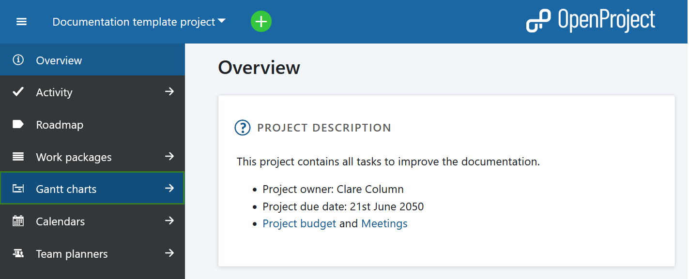

To view multiple projects in a single timeline, select **Gantt charts** from the **Global Modules** menu.

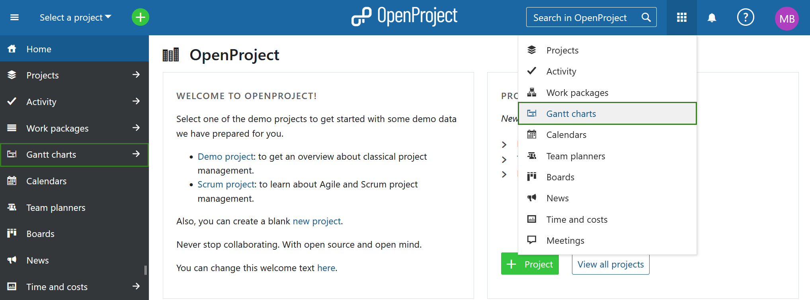

Alternatively, you can also use the **Include projects** filter.

## Gantt chart views

Once you open the Gantt charts module, the default view will show all open work packages. You can search for a specific Gantt chart using the search bar on the left. You can adjust the view using the filters or select one of the following view options:

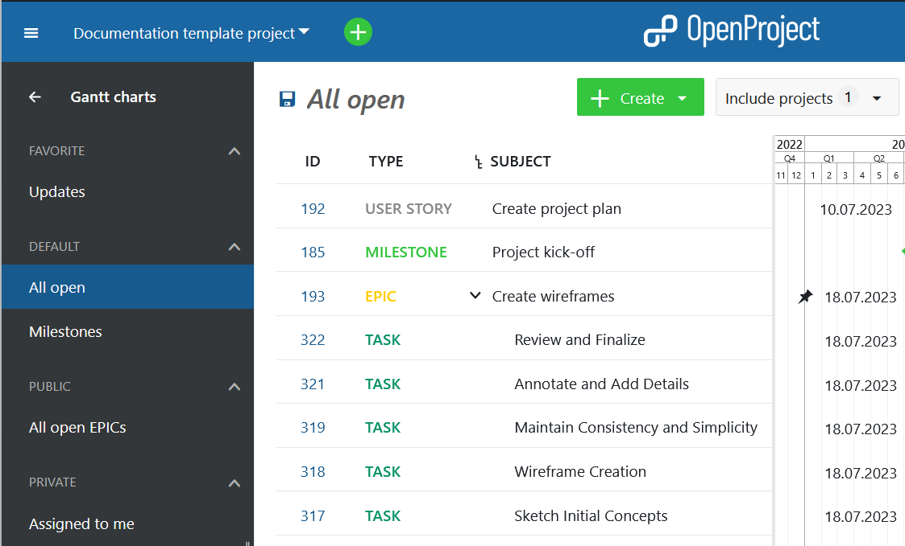

**Favorite**: lists all saved Gantt chart views that are marked as favorite

**Default**: lists pre-defined Gantt chart views and includes the following:

- **All open**: shows all work packages with the status open
- **Milestones**: shows all work packages with the work package type Milestones (or other types that are set to be recognized as milestones)

**Public**: lists all Gantt chart views set to be public

**Private**: lists all your personal saved Gantt chart views

## Quick context menu in Gantt chart view

Once you have selected the Gantt chart view, you can use the quick context menu. To do that, right-click on any of the work packages.

> [!TIP]
> If you use the [work packages view](../work-packages/edit-work-package#update-a-work-package-in-a-work-package-table-view) in the **Work packages** module, the options in the quick context menu will differ slightly from the ones in the Gantt chart view.

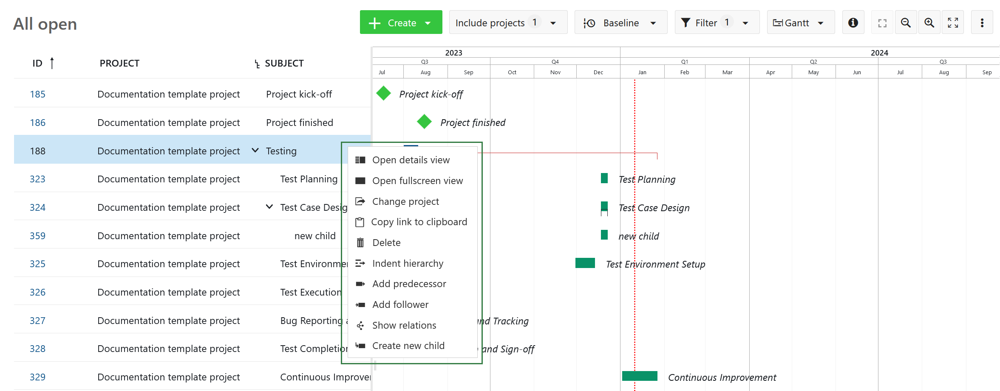

You can use any of the following options.

- **Open details view** - opens the details view of a work package on the right side of the screen.
- **Open fullscreen view** - opens the detailed view of a work package across the entire screen.
- **Copy link to clipboard** - copies a short link to the selected work package to your clipboard.
- **Change project** - allows moving the selected work package to a different project.
- **Delete** - deletes a work package. You will need to confirm the deletion.
- **Indent hierarchy** - creates a child-parent relationship with the work package directly above. The work package you selected becomes the child work package. The work package directly above becomes the parent work package.
- **Add predecessor** - adds a predecessor (it will prompt you to select a work package in Gantt view).
- **Add follower** - adds a follower (it will prompt you to select a work package in Gantt view).
- **Show relations** - opens the details view of a work package and displays the **Relations** tab.
- **Create new child** - opens a new work package on the right side of the screen. This new work package already has a child relationship to the work package you selected. **This option will not be available if the work package type is a milestone**.

## Create a new element in the Gantt chart

To add a work package (e.g. phase, milestone or task) to a Gantt chart, click the **+ Create new work package** link at the bottom of the work package table view.

You can add a subject and make changes to type, status or more fields.

In the **Gantt chart**, you can schedule the work package with drag and drop and change the duration.

To **change the order of an item** in the Gantt chart, click the **drag and drop** icon (6 dots) on the left-hand side of the work package row. Drag the item to the new position. The blue horizontal line indicates the new position to drop the element.

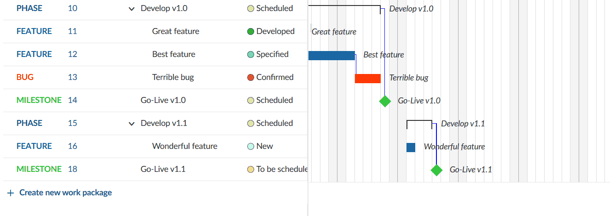

### How to change the duration of an element in the Gantt chart

To change the duration of a work package in the Gantt chart view, hover over the work package in the Gantt chart and use the little arrows on its ends to adjust the start date or finish date. This will shorten or prolong its duration. To move a work package on the timeline, just click on it and drag and drop it to the desired point in time. This will change its start and finish date.

> [!NOTE]
> The Gantt chart will highlight non-working days with a darker background color when you are zoomed in to a level that shows individual days. By default, a work package cannot be dragged or resized such that it begins or ends on these days unless the "Working days only" switch is turned off for that work package. To learn how to do this, refer to the documentation on [Working days and duration](../work-packages/set-change-dates/#working-days-and-duration).
>
> Work packages can also expand and retract in width depending on how many non-working days are spanned (for example, a 3-day task starting on Thursday and ending on Monday will spread across 5 calendar days; dragging that same work package so that it starts on a Tuesday and ends on a Thursday means that it will spread across 3 calendar days. In both cases, the duration remains 3 days).

## Relations in the Gantt chart

You can track dependencies of work packages (e.g. phases, milestones, tasks) in the Gantt chart. This way, you can get an easy overview of what needs to be done in which order, e.g. what tasks need to be completed to achieve a milestone.

To add a dependency, right-click on an element in the Gantt chart, which will open a quick context menu.

In the menu, choose **Add predecessor** or **Add follower**.

Select the item to which you want to create a dependency. The precede and follow relation is marked with a small blue line in the Gantt chart.

The quickest way to remove a relation is to select **Show relations** from the quick context menu and remove the relation in the work package details view.

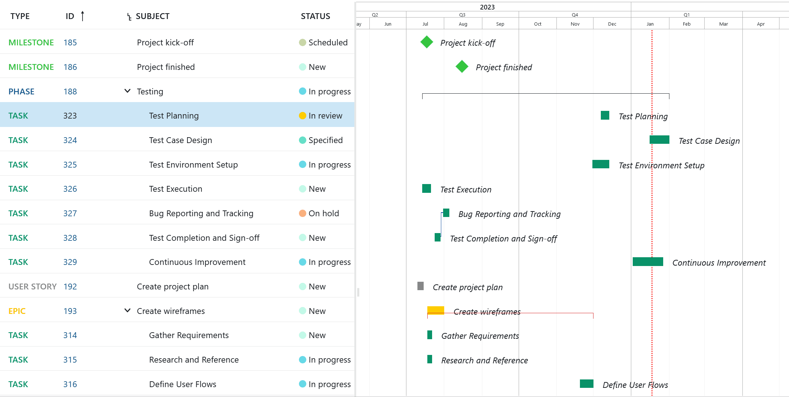

When work packages have a precedes/follows relationship:

- A follower cannot be moved to start earlier than the finish date of its predecessor.
- Moving a predecessor past the start date of the follower will automatically push the follower into the future (such that it starts the next working day).
- If there is a gap between the predecessor and the follower, either one can be moved forward or backward without affecting the other as long as the dates do not overlap.

Scheduling modes can also affect work package relations. Read about [automatic and manual scheduling](scheduling) to find out more.

> [!NOTE]
> Relations other than predecessor/follower and parent/child (such as related to, blocked by, includes, duplicates) are not displayed in the Gantt chart. To find out more, read our guide on [work package relations](../work-packages/work-package-relations-hierarchies).

## Understanding the colors and lines in the Gantt chart

- A **blue line** connects two work packages; they are predecessor and follower.
- The **vertical red dotted line** indicates today's date.
- A **black clamp** indicates the duration from the start date of a work package's earliest starting child until the finish date of a work package's latest ending child.
- A **red clamp** indicates the same as the black clamp, with an important difference: The clamp turns red if the dates derived from the children are before or after the manually scheduled dates (of this parent work package).
  The clamps are black in case the derived dates are within the set dates (of this parent).
- A **diamond symbol** stands for a milestone.
- A **bar** stands for work packages like phases and tasks.

## Gantt chart configuration

To open the Gantt chart configuration, please open the **settings** icon with the three dots on the upper right of the work package module.
Choose **Configure view ...** and select the tab **Gantt chart**.

Here you can **adapt the Zoom level**, or choose Auto zoom which will select a Zoom level that best fits your browser size to have optimal results on a page.

Also, you have **Label Configuration** for your Gantt chart. You can add up to three additional labels within the chart: On the left, on the right and on the far right. Just select which additional information you would need to have in the Gantt chart. This can be especially relevant if you want to print your Gantt chart.

Click the **Apply** button to save your changes.

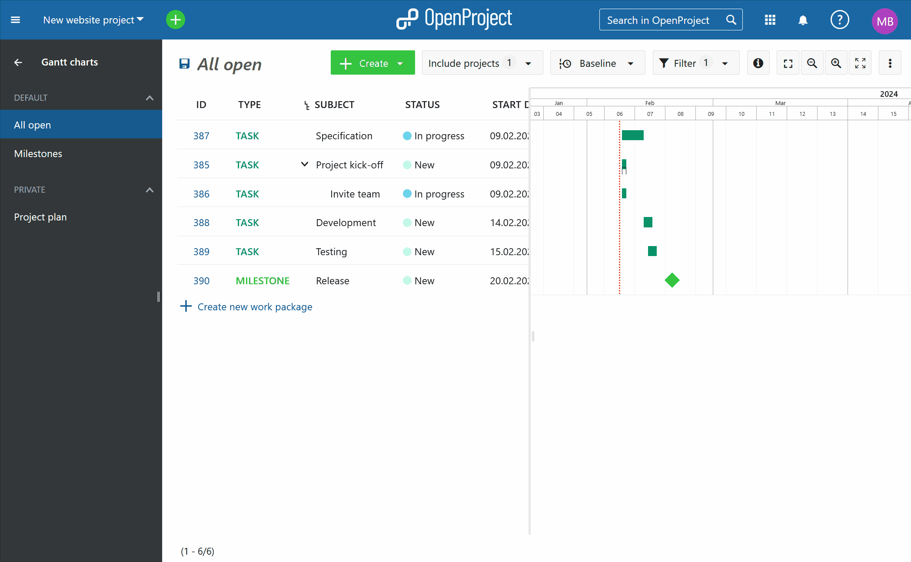

### How to export data from a Gantt diagram

To export the data from your Gantt chart, there are several possibilities:

* [Export via the work package view](../work-packages/edit-work-package/#export-work-packages)
* [Print (e.g., to PDF)](#how-to-print-a-gantt-chart)
* [Synchronize data from OpenProject to Excel](../../system-admin-guide/integrations/excel-synchronization/) ←→ MS Project

### How to print a Gantt chart

The Gantt chart can be printed via the browser's printing function. It is optimized for Chrome.

First, make sure to **add the labels** you will need in the Gantt chart, e.g. Start date, Finish date, Subject, in the [Gantt chart configuration](#gantt-chart-configuration).

Choose the **Auto zoom** by clicking on the Auto zoom button on top of the Gantt chart.

Optimize the screen by dragging the Gantt chart to the far left so that only the Gantt chart is seen.

Then, **press CTRL + P** to print the Gantt chart view.

Make sure you select **Landscape** as a print layout.

In the settings, enable the **Background graphics** for printing.

Press the **Print** button.

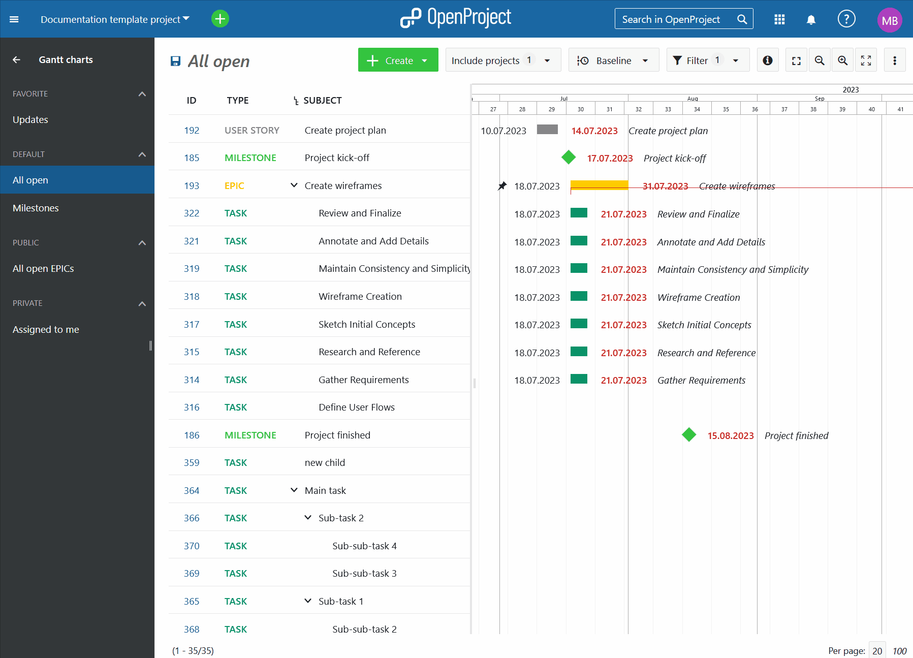

For other browsers, please simply follow the browser's printing instruction to optimize results.

To synchronize your work package data between OpenProject and Excel (two-way synchronization), please have a look at [this instruction](../../system-admin-guide/integrations/excel-synchronization/).

### Gantt chart PDF Export (Enterprise add-on)

> [!NOTE]
> Gantt chart PDF export is an Enterprise add-on and can only be used with [Enterprise cloud](../../enterprise-guide/enterprise-cloud-guide) or [Enterprise on-premises](../../enterprise-guide/enterprise-on-premises-guide). An upgrade from the free Community edition is easy and helps support OpenProject.

To export a Gantt chart in a PDF format, click the **More** (three dots) icon in the top right corner and select *Export*.

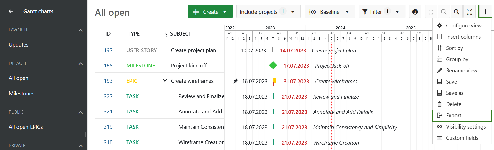

Then select the **PDF Gantt** option under PDF export type. Configure the parameters of the PDF export, such as zoom level for the dates, column width and paper size. Then click the green **Export** button.

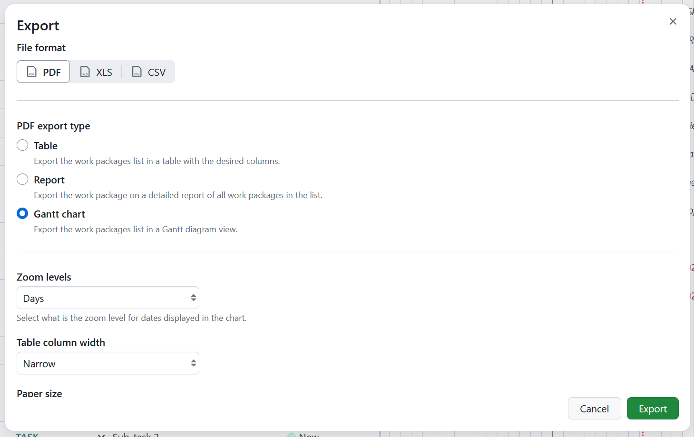

Configure the parameters of the PDF export, such as zoom level for the dates, column width and paper size. Then click the green **Export** button.

You can then save the Gantt chart in PDF form to share with your project stakeholders or print it directly.

> [!TIP]
> You can also export Gantt charts in PDF format from the [work packages module](../work-packages/exporting/#gantt-chart-pdf).

## Gantt chart views

### Zoom in the Gantt chart

To zoom in and zoom out in the Gantt chart view, click on the button with the **+** and **- icon** on top of the chart.

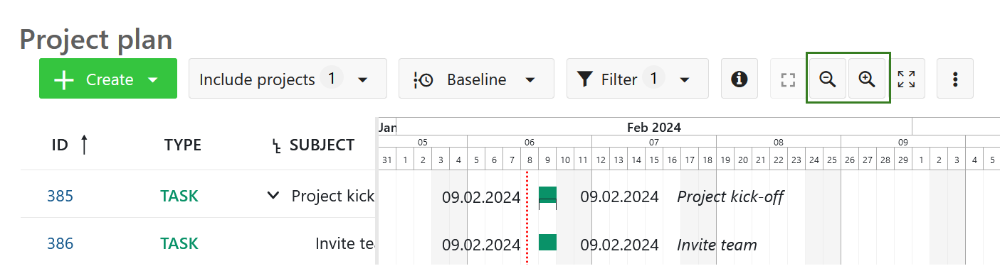

### Auto zoom

Select the **auto zoom button** on top of the Gantt chart to have the best view of your Gantt chart.

Please note that the **auto zoom button** may not be selectable if it has been pre-selected in the [Gantt charts configuration](#gantt-chart-configuration).

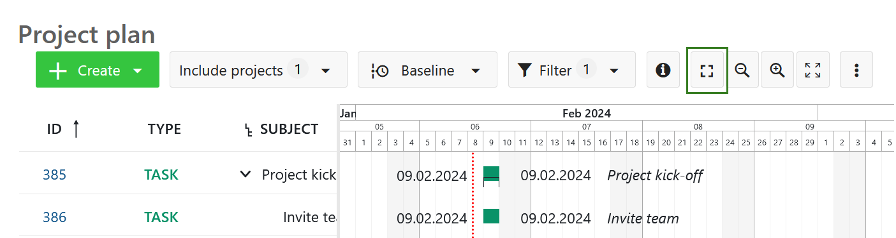

### Zen mode

The zen mode gives you more space to focus on the tasks at hand. It's almost like activating the full screen view in your browser. To exit, press the *Esc* key or click on the **zen mode** symbol again.

## Multi project views

With the Gantt charts in OpenProject, you can create project overarching timelines.

Create multi-project timelines and display all activities, phases and milestones within your project and sub-projects. Also, you can create project overarching timelines by filtering and including respective projects in one joint plan.

To include sub-projects: within the parent project, click on the Filter button and select the subproject(s) you want to have included in your project plan. You can also choose an [aggregation by project](#aggregation-by-project).

Use the filter and grouping options as for the [work packages table configuration](../work-packages/work-package-table-configuration/) to customize your timeline. Do not forget to [save your timeline](../work-packages/work-package-table-configuration/#save-work-package-views).

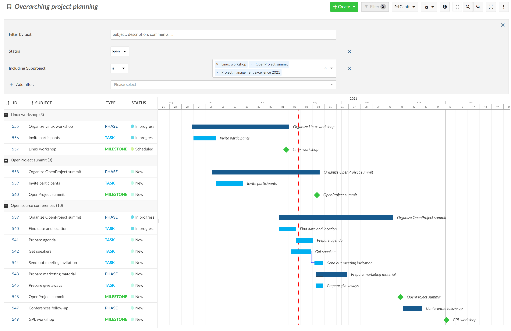

If you want to adjust your work package table and filter, sort or order your work packages to have a better overview in your Gantt chart, please refer to the section [work package table configuration](../work-packages/work-package-table-configuration/).

## Aggregation by project

You can get a **quick overview of multiple projects** in the Gantt chart. To accomplish this, navigate to the Gantt charts module of a project or the [project overarching Gantt charts module](../projects/project-lists/#project-overarching-reports).

**Group the work packages** by project by using the [work packages table configuration](../work-packages/work-package-table-configuration/#flat-list-hierarchy-mode-and-group-by) (accessible in the upper right corner) or by clicking on the small triangle next to "Project" in the table header.

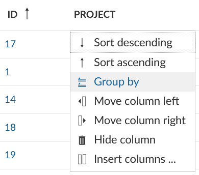

Use the minus next to the project's name or the **collapse button** in the upper right corner to collapse some or all projects.

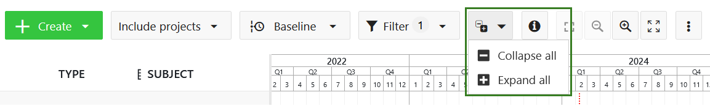

This will give you an **aggregated view of the projects' work packages**. You can further adjust this view by using the Filter functionality, for example, display work package type Bugs.

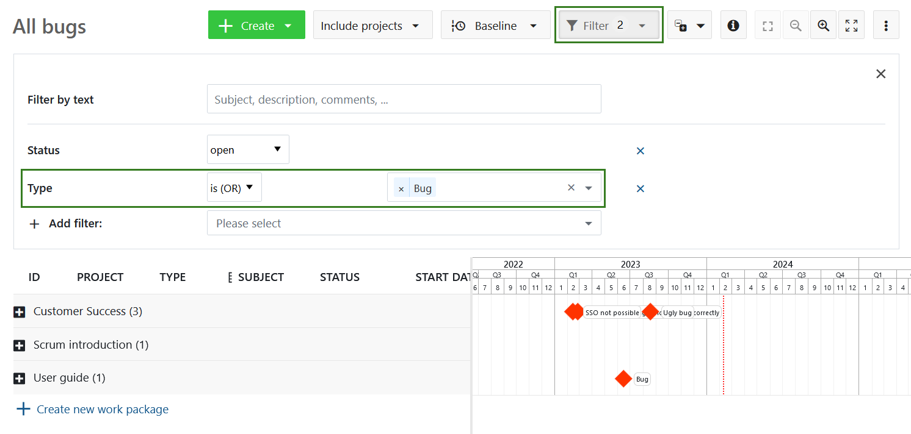

> [!TIP]
> If you want the work packages to be displayed when the projects are folded, it is necessary to set the selected work package type to be recognized as a milestone under [work package type settings](../../system-admin-guide/manage-work-packages/work-package-types/). Otherwise, you will need to unfold the projects to view all of the work packages.

Apart from the set filters, the list of displayed projects depends on your [permissions](../../system-admin-guide/users-permissions/roles-permissions/). You can only see private projects that you are a member of and public projects.
In some cases (many work packages per project), you will have to increase the objects per page in the bottom right corner to display multiple projects. Change the available options in the [system settings](../../system-admin-guide/system-settings/general-settings/) if necessary.

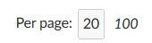
