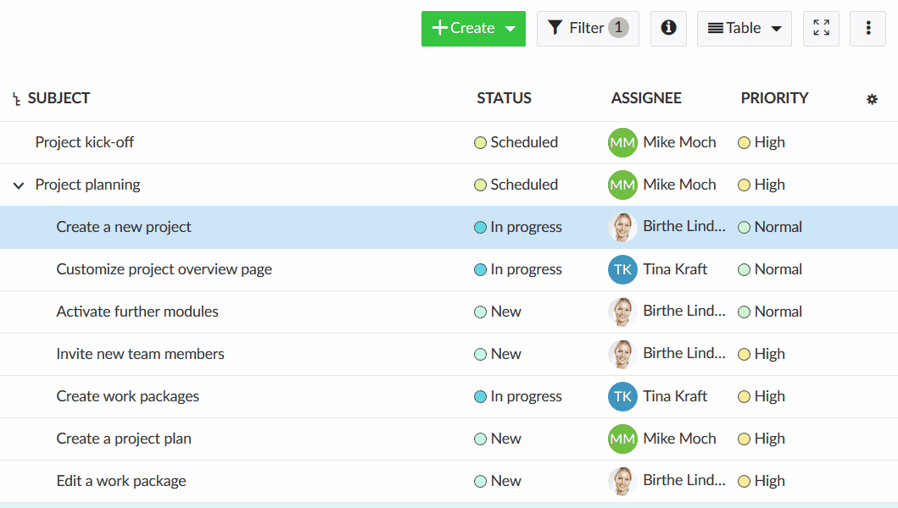
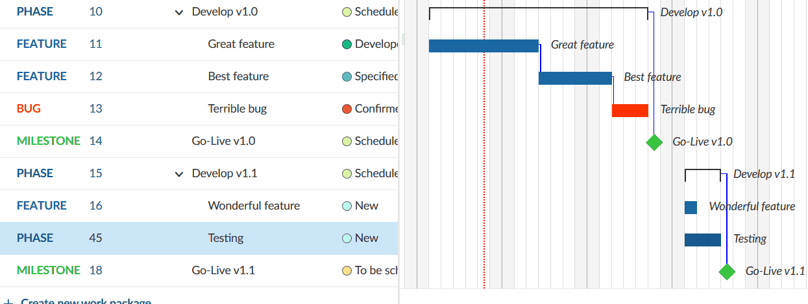
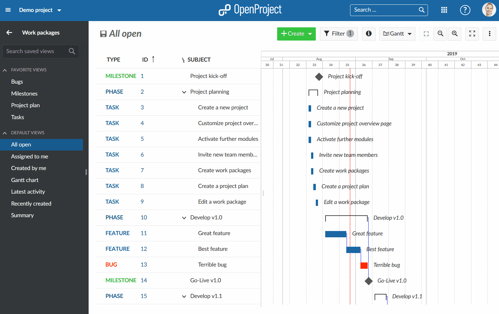
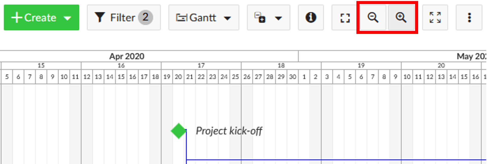
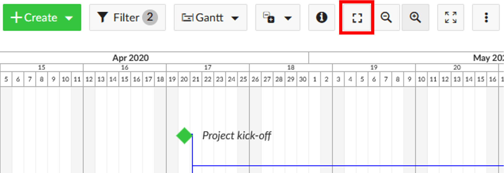
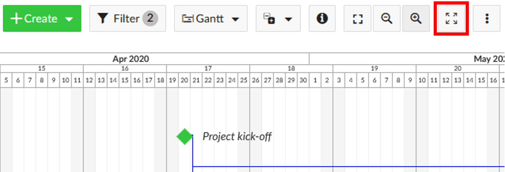
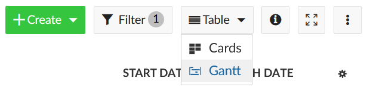
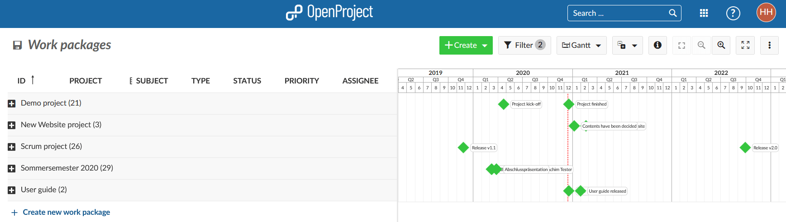

---
sidebar_navigation:
  title: Gantt charts
  priority: 865
description: Create project timelines with Gantt charts in OpenProject
robots: index, follow
keywords: gantt chart, timeline, project plan, gantchart
---

# Gantt charts

The **Gantt chart** in OpenProject displays the work packages in a timeline. You can collaboratively create and manage your project plan. Have your project timelines available for all team members and share up-to-date information with stakeholders. You can add start and finish dates and adapt it with drag and drop in the Gantt chart. Also, you can add dependencies, predecessor or follower within the Gantt chart.

| Topic                                                        | Content                                                      |
| ------------------------------------------------------------ | ------------------------------------------------------------ |
| [Activate the Gantt chart](#activate-the-gantt-chart)        | How to activate the Gantt chart in OpenProject?              |
| [Create a new element](#create-a-new-element-in-the-gantt-chart) | How to add a new item to the Gantt chart?                    |
| [Relations in the Gantt chart](#relations-in-the-gantt-chart) | Create and display dependencies in the Gantt chart.          |
| [Understanding the colors and lines in the Gantt chart](#understanding-the-colors-and-lines-in-the-gantt-chart) | What do the clamps, lines and symbols in the Gantt chart mean? |
| [Gantt chart configuration](#gantt-chart-configuration)      | How to configure the view of your Gantt chart, e.g. add labels? |
| [Gantt chart views](#gantt-chart-views)                      | How to zoom in and out and activate the Zen mode?            |
| [Multi project views](#multi-project-views)                  | Create project overarching timelines.                        |
| [Aggregation by project](#aggregation-by-project)            | How to display an aggregated view of all milestones of multiple projects? |

<video src="https://openproject-docs.s3.eu-central-1.amazonaws.com/videos/OpenProject-Project-Plan-and-Timelines-Gantt-charts.mp4" type="video/mp4" controls="" style="width:100%"></video>

## Activate the Gantt chart

A Gantt chart can be activated in any work package list, to display the work packages in a timeline view.

To activate the Gantt chart, select the **Gantt** icon at the top right of the work package list.

## Create a new element in the Gantt chart

To add a work package (e.g. phase, milestone or task) to a Gantt chart, click the **+ Create new work package** link at the bottom of the work package list view.

You can add a subject and make changes to type, status or more fields.

In the **Gantt chart** you can schedule the work package with drag and drop and change the duration.

To **change the order of an item** in the Gantt chart, click the **drag and drop** icon (6 dots) at the left hand side of the work package row. Drag the item to the new position. The blue horizontal line indicates the new position to drop the element.

### How to change the duration of an element in the Gantt chart?

To change the duration of a work package in the Gantt chart view, hover over the work package in the Gantt chart and use the little arrows on its ends to adjust the start date or finish date. This will shorten or prolong its duration.
To move a work package on the time line just click on it and drag and drop it to the desired point of time. This will change its start and finish date.

## Relations in the Gantt chart

In the Gantt chart you can track dependencies of work packages (e.g. phases, milestones, tasks). This way you can get an easy overview of what needs to be done in which order, e.g. what tasks need to be completed to achieve a milestone.

To add a dependency right-click on an element in the Gantt chart.

In the menu, choose **Add predecessor** or **Add follower**.

Select the item to which you want to create a dependency. The precede and follow relation is marked with a small blue line in the Gantt chart.

*OpenProject does not yet include a baseline feature to compare scheduled versions. However, we are aware of the need for it and documented it. Please check here https://community.openproject.com/projects/openproject/work_packages/26448/activity for an update.*

To find out about **how work packages behave**, when you move their predecessor or follower or change the date of a child work package please read our guide for the [Automatic and manual scheduling mode](scheduling).

Relations between work packages that are not predecessor/follower or parent/child relations won't be displayed in the Gantt chart. Find out more about other work package relations [here](../work-packages/work-package-relations-hierarchies).

## Understanding the colors and lines in the Gantt chart

- A **blue line** connects two work packages, they are predecessor and follower.
- The **vertical red dotted line** indicates today's date.
- A **black clamp** indicates the duration from the start date of a work packages earliest starting child until the end date of a work packages latest ending child.
- A **red clamp** indicates the same as the black clamp, with an important difference: The clamp turns red if the dates derived from the children are before or after the manually scheduled dates (of this parent work package).
  The clamps are black in case the derived dates are within the set dates (of this parent).
- A **diamond symbol** stands for a milestone.
- A **bar** stands for work packages like phases and tasks.

## Gantt chart configuration

To open the Gantt chart configuration, please open the **settings** icon with the three dots on the upper right of the work package module.
Choose **Configure view ...** and select the tab **Gantt chart**.

Here you can **adapt the Zoom level**, or choose Auto zoom which will select a Zoom level which best fits to your browser size to have optimal results on a page.

Also, you have **Label Configuration** for your Gantt chart. You can add up to three additional labels within the chart: On the left, on the right and on the far right. Just select which additional information you would need to have in the Gantt chart. This can be especially relevant if you want to print your Gantt chart.

Click the **Apply** button to save your changes.

### How to export data from a Gantt diagram?

To export the data from your Gantt chart there are several possibilities:

* [Export via the work package view](../work-packages/edit-work-package/#export-work-packages)
* [Print (e.g. to PDF)](#how-to-print-a-gantt-chart)
* [Synchronize data from OpenProject to Excel](../../system-admin-guide/integrations/excel-synchronization/) <-> MS Project

### How to print a Gantt chart?

The Gantt chart can be printed via the browser's printing function. It is optimized for Chrome.

First, make sure to **add the labels** you will need in the Gantt chart, e.g. Start date, Finish date, Subject, in the [Gantt chart configuration](#gantt-chart-configuration).

Choose the **Auto zoom** by clicking on the Auto zoom button on top of the Gantt chart.

Optimize the screen by dragging the Gantt chart to the far left so that only the Gantt chart is seen.

Then, **press CTRL + P** to print the Gantt chart view.

Make sure you select **Landscape** as a print layout.

In the settings, enable the **Background graphics** for printing.

Press the **Print** button.

For other browsers, please simply follow the browser's printing instruction to optimize results.

To synchronize your work package data between OpenProject and Excel (two-way synchronization) please have a look at [this instruction](../../system-admin-guide/integrations/excel-synchronization/).

## Gantt chart views

### Zoom in the Gantt chart

To zoom in and zoom out in the Gantt chart view, click on the button with the **+** and **- icon** on top of the chart.

### Auto zoom

Select the **auto zoom button** on top of the Gantt chart to have the best view of your Gantt chart.

### Zen mode

The zen mode gives you more space to focus on the tasks at hand. It's almost like activating the full screen view in your browser. To exit press the *Esc* key or click on the **zen mode** symbol again.

## Multi project views

With the Gantt charts in OpenProject you can create project overarching timelines.

Create multi project timelines  and display all activities, phases and milestones within your project and sub-projects. Also, you can create project overarching timelines by filtering and including respective projects in one joint plan.

To include sub-projects: within the parent project, click on the Filter button and select the subproject(s) you want to have included in your project plan. You can also choose an [aggregation by project](#aggregation-by-project).

Use the filter and grouping options as for the [work packages table configuration](../work-packages/work-package-table-configuration/) to customize your timeline. Do not forget to [save your timeline](../work-packages/work-package-table-configuration/#save-work-package-views).

If you want to adjust your work package table and filter, sort or order your work packages to have a better overview in your Gantt chart, please refer to the section [work package table configuration](../work-packages/work-package-table-configuration/).

## Aggregation by project

You can get a **quick overview of multiple projects** in the Gantt chart. To accomplish this navigate to the Work packages module of a project or the [project overarching work packages list](../projects/#project-overarching-reports).

**Group the list** by project by using the [work packages table configuration](../work-packages/work-package-table-configuration/#flat-list-hierarchy-mode-and-group-by) (accessible in the upper right corner) or by clicking on the small triangle next to "Project" in the table header.
 

**Display the Gantt chart** by clicking on the button in the upper right corner.

Use the minus next to the project's name or the **collapse button** in the upper right corner to collapse some or all projects.

This will give you an **aggregated view of the projects' milestones**.

**Please note**: If you want to make use of this feature, it is necessary to add milestones for the most important dates to your projects. At the moment this feature is not available for other [work package types](../../getting-started/work-packages-introduction/#what-is-a-work-package). 
Apart from the set filters the list of displayed projects depends on your [permissions](../../system-admin-guide/users-permissions/roles-permissions/). You can only see private projects that you are a member of and public projects.
In some cases (many work packages per project) you will have to increase the objects per page in bottom right corner to display multiple projects. Change the available options in the [system settings](../../system-admin-guide/system-settings/general-settings/) if necessary.
 
