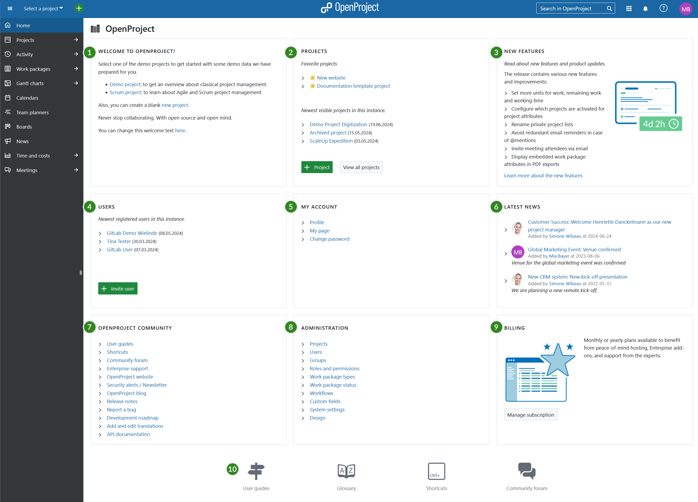

---
sidebar_navigation:
  title: Home page
  priority: 990
description: What do I see on the application start page?
keywords: application start page
---

# Application Home page

On the **application home page** (start page) you will get an overview about important information. From here you can access all [global modules](./global-modules) in the left hand navigation.

To get to the application home page, click on the logo in the header of the application.

1. **Welcome text block** to welcome your team members, share important project information, or any other information. You can configure the [welcome text](../../system-admin-guide/system-settings/general-settings/#welcome-block-text) block under -> *Administration* -> *System settings* -> *General*.
2. The **Projects block** displays your latest project. You can [create a new project](../../getting-started/projects/#create-a-new-project) or [view all projects](../../user-guide/projects/project-lists/).
3. The **New features block** displays feature announcements and developments of the latest releases of OpenProject.
4. The **Users block** displays latest registered users on the instance. You can [invite new users](../../getting-started/invite-members/) with the green **+ Invite users** button.
5. The **My Account block** links to important account settings, such as the [user profile](../../user-guide/my-account/#edit-your-user-information), the [My page](../../getting-started/my-page/), and the [change password](../../getting-started/sign-in-registration/#reset-your-password) section.
6. The **Latest news block** displays latest news from all your projects. Click on the link of the news to read the details.
7. The **OpenProject Community block** displays links to important community information, such as release notes, forum, or the API documentation.
8. **Administration block** displays links to important system administration resources. Also, the [application security badge](../../system-admin-guide/system-settings/general-settings/) will be displayed when activated.
9. The **Billing block** will be displayed for the [OpenProject Enterprise cloud](../../enterprise-guide/enterprise-cloud-guide). The **Enterprise edition** block will be displayed for the [OpenProject Enterprise on-premises edition](../../enterprise-guide/enterprise-on-premises-guide). You will get links to the respective section.
10. At the bottom of the page, you will get links to **User guides, Glossary, Shortcuts, and the Community forum**.
