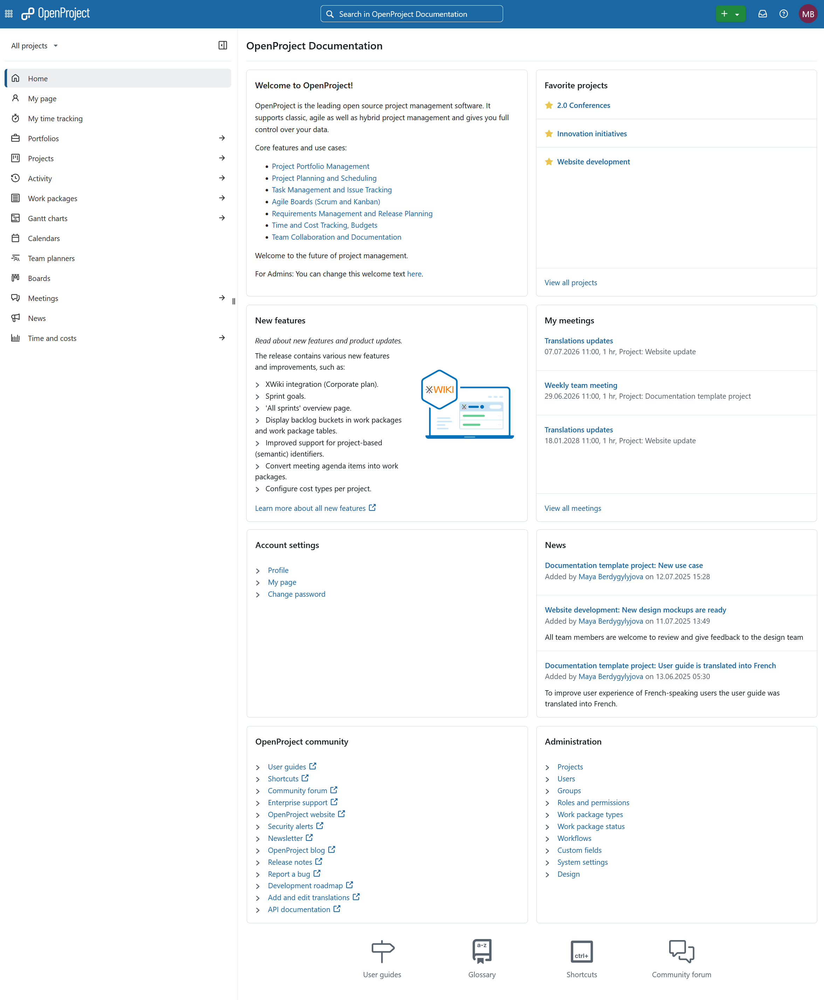

---
sidebar_navigation:
  title: Home page
  priority: 990
description: What do I see on the application start page?
keywords: application start page
---

# Application Home page

On the **application home page** (start page) you will get an overview about important information. From here you can access all [global modules](./global-modules) in the left hand navigation.

To get to the application home page, click on the logo in the header of the application.

## Header navigation overview

The header navigation in OpenProject is divided into **three sections**:

**Left corner**: 

- **Global Modules (grid icon):** Opens the menu to access all global modules.
- **Instance Logo:** Displays the logo of your current instance.

**Center**

- **Search Console:** Enables quick search for projects, users, work packages, or other resources within the application.

**Right corner**

- **+ Button:** Creates new projects, users, or work packages.
- **Notifications icon:** Shows the number of new or unread notifications.
- **Help (question mark icon):** Provides quick access to tutorials, guides, videos, and other help resources.
- **Account avatar:** Opens links to personal page, activity overview, account settings, administration (if you have sufficient rights), and signing out.

## Home page overview

1. **Welcome text block** to welcome your team members, share important project information, or any other information. You can configure the [welcome text](../../system-admin-guide/system-settings/general-settings/#welcome-block-text) block under -> *Administration* -> *System settings* -> *General*.
2. The **Favorite projects widget** displays your favorite projects.
3. The **New features widget** displays feature announcements and developments of the latest releases of OpenProject.
4. The **My meetings widget** displays all scheduled meetings in which you are a participant.
5. The **Account settings widget** links to important account settings, such as the [user profile](../../user-guide/account-settings/#edit-your-user-information), the [My page](../../getting-started/my-page/), and the [change password](../../getting-started/sign-in-registration/#reset-your-password) section.
6. The **News widget** displays latest news from all your projects. Click on the link of the news to read the details.
7. The **OpenProject Community widget** displays links to important community information, such as release notes, forum, or the API documentation.
8. **Administration widget** displays links to important system administration resources. Also, the [application security badge](../../system-admin-guide/system-settings/general-settings/) will be displayed when activated.
9. At the bottom of the page, there are links to additional resources: **User guides, Glossary, Shortcuts, and the Community forum**.
