---
sidebar_navigation:
  title: Global modules
  priority: 999
description: Global modules in OpenProject
keywords: global modules, project overarching modules, global index pages
---
# Global modules

Global modules present an overview of the projects of which you are a member or have permissions to see. On this page, you will find a summary of all the sidebar menu entries for module across all your projects, such as **Activity, Work packages, Calendars, Boards**, etc.

To access the **Global modules** side menu, simply click on the logo in the header.

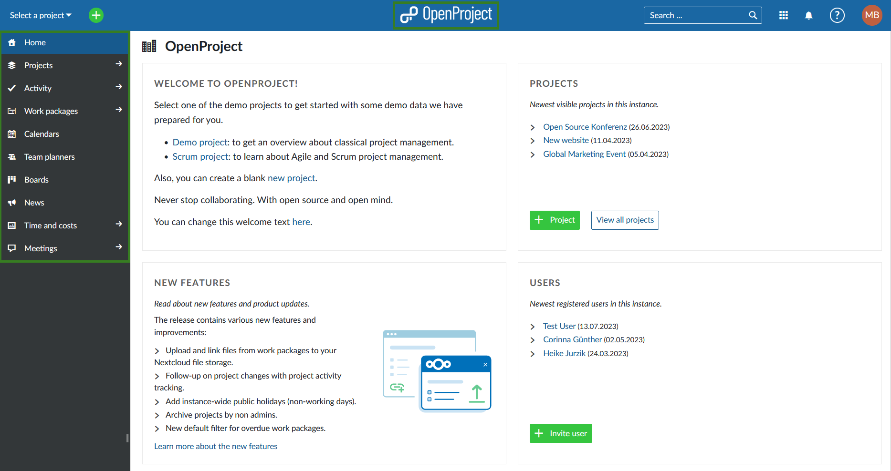

You can also use the grid icon in the top right corner to access the **Global modules** side menu.

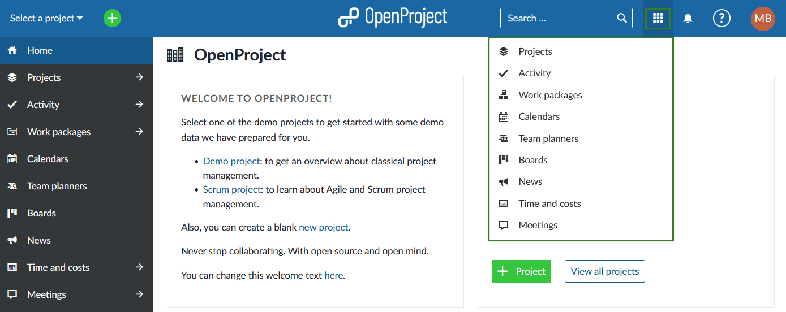

> It is possible that some of the global modules are not visible to you. This will be the case if said module is not activated in the [Project settings](../../projects/project-settings/) in any of the active projects in you instance. If, for example, the **News** module is not enabled in any of the active projects, you will not see it in the **Global modules** menu.

You can also use the grid icon in the top right corner to access the **Global modules** side menu.

If you navigate within a specific project, you can also return to the global modules by unselecting your project in the project selector menu. The project you are currently in will be indicated by the grey background. Click the **x** icon to unselect it and return to global modules. The module selection will be kept, i.e. if you were viewing Meetings module in the project, you will see the global Meetings module. 

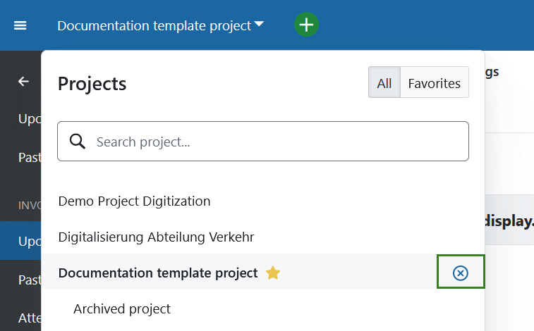

## Projects

The **Projects** global module will display all projects in your OpenProject instance of which you are a member and/or have the right to see (for example as an administrator), including public projects.

You can create a new project here directly by using the  **+ Project** button.

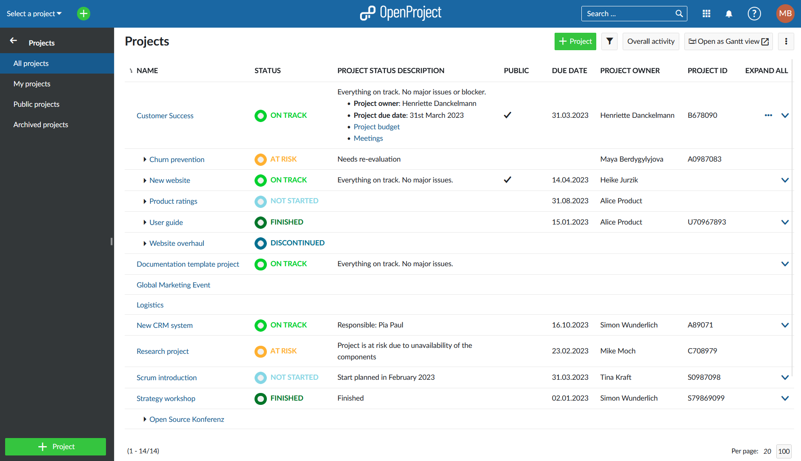

**Active projects** is the default view and shows only active projects. If you do not have administrator rights, this view will be the same as **My projects**.

Read more on [Project lists filters](../../../user-guide/projects/project-lists/#project-lists-filters).

>**Note:** You can also access the **Projects** global module by opening the [Select a project dropdown menu](../../../user-guide/projects/project-lists/) and by clicking the **Project lists** button, or by clicking on the **Modules** button in the header next to the search bar and the selecting **Projects** in the menu that appears.

## Activity

The **Activity** global module provides an overview of all project activities across all projects of which you are a member or have the rights to see (including public projects).

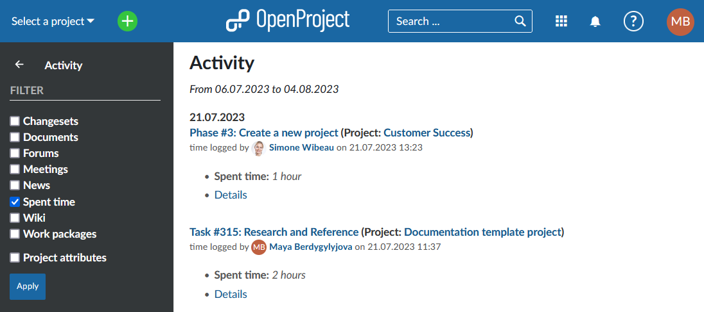

The timeframe for tracing and displaying activities starts with the current date. You can adjust how far back the activities should be traced by adjusting [System settings](../../../system-admin-guide/system-settings/general-settings/).

You can adjust the view by using the filters on the left menu and clicking the **Apply** button.

>Note: **Changesets** filter comes from repositories that are managed by OpenProject. For example, if you make a commit to a GIT or SVN repository, these changes will be displayed here. At the moment this filter is only relevant for self-hosted editions.

## Work packages

The **Work packages** global module will show a work packages table from the projects of which you are a member or have the right to view, including public projects. You can select your **Favorite** and **Default** work package filters in the left side menu. Please note that if a view is marked as favorite it will be shown in the **Favorite** section, whether it is also saved as public or private or not.

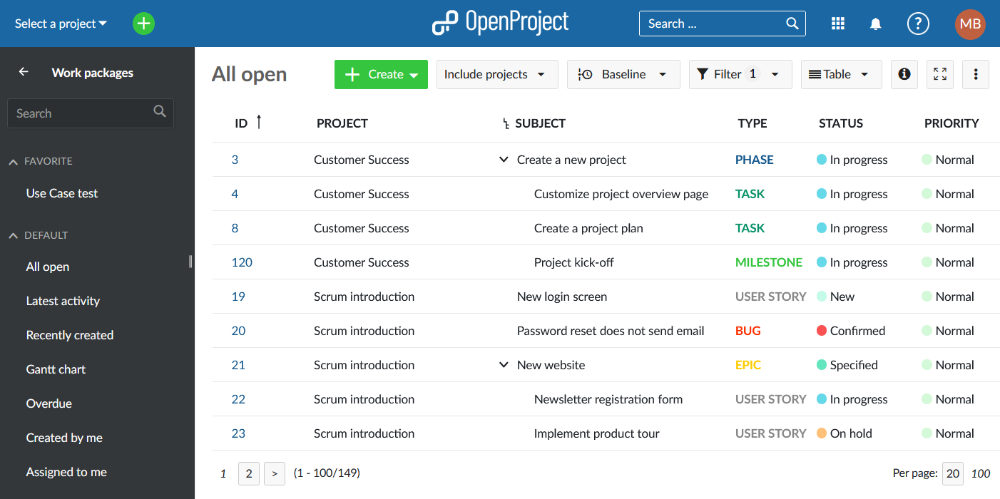

If you double-click to open one of the work packages in full screen view, the work package will highlight which project it belongs to at the top of the page.

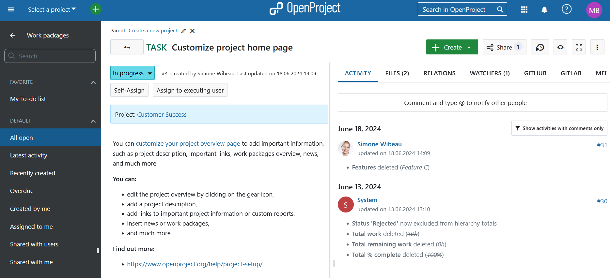

## Gantt charts

The **Gantt charts** global module displays work packages in a timeline.

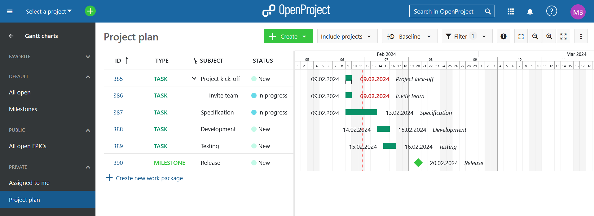

Find out more about [**Gantt charts** module](../../gantt-chart/).

## Calendars

The **Calendars** global module displays all calendars to which you have access, across all projects.

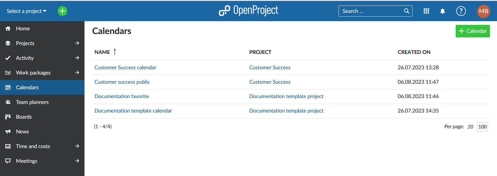

You can also create a new calendar directly from the global modules menu by clicking the green **+ Calendar** button.

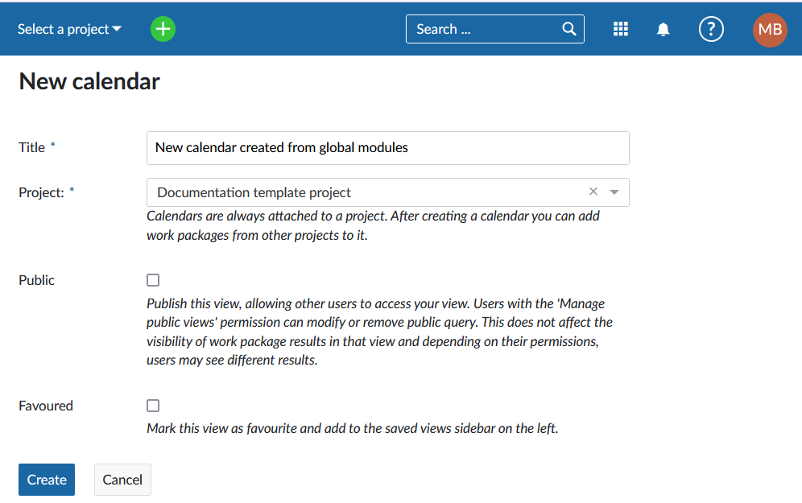

Here you can name the calendar, select a project to which the calendar should belong  and set it to be public or favored. Find out more about editing calendars [here](../../calendar).

## Team planners

The **Team planners** global module will display all team planners from the projects you are a member of, have administrative privileges to see and the public ones.

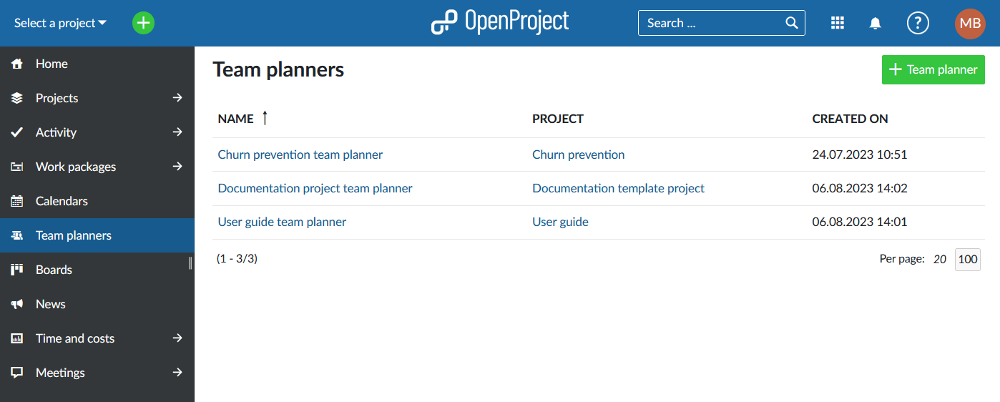

You can also create a new team planner directly from the global modules menu by clicking the green **+ Team planner** button:

You can name the new team planner, select a project to which it should belong and set to be public or favored. Find out more about editing team planners [here](../../team-planner).

## Boards

The **Boards** global module will list all boards to which you have access across all projects, including public projects.

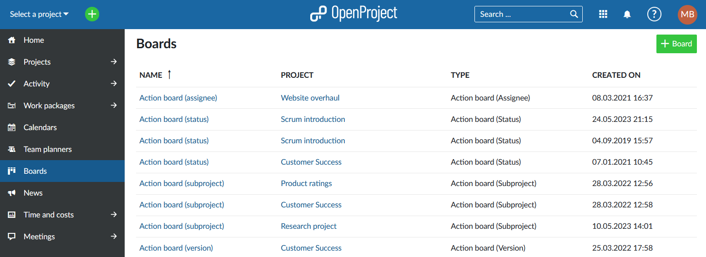

You can also create a board directly from the global modules menu by clicking the green **+ Board** button:

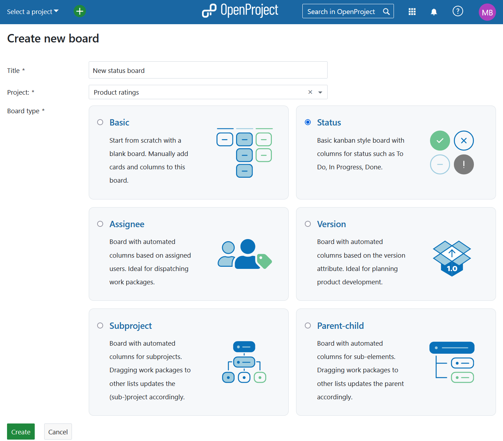

You can name the board, select a project to which the new board should belong and choose the board type. Find out more about editing boards [here](../../agile-boards).

## News

The **News** global module will display all news that have been published in projects of which you are a member, have the administrative privileges to view and public projects.

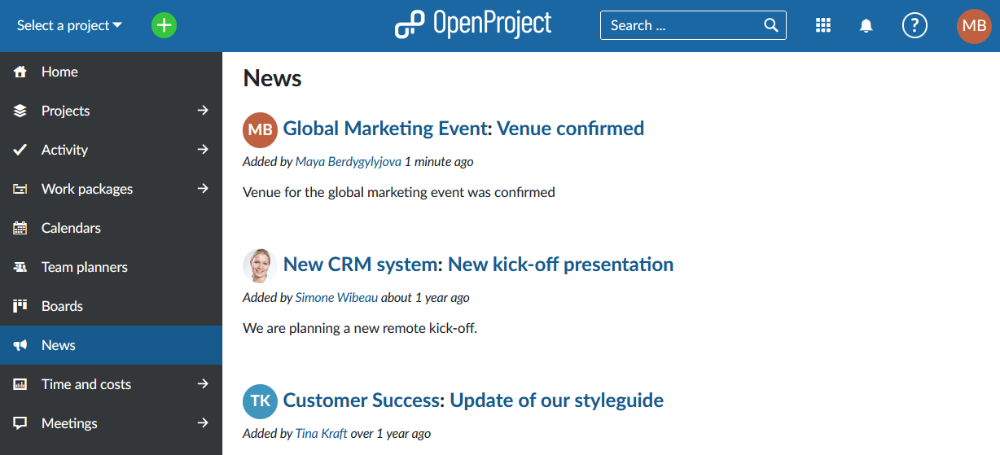

Read more about writing, editing and commenting on **News** in OpenProject [here](../../news).

## Time and costs

The **Time and costs** global module will list time and cost reports created by you and the ones set to be public in the left hand menu. The filters you see initially will be pre-filled based on the values you used for filtering during your last session, or the default ones if you have never used them.

You can create new time and cost reports by adjusting filters, grouping criteria and units accordingly and clicking the **Apply** button. Do not forget to **Save** your report.

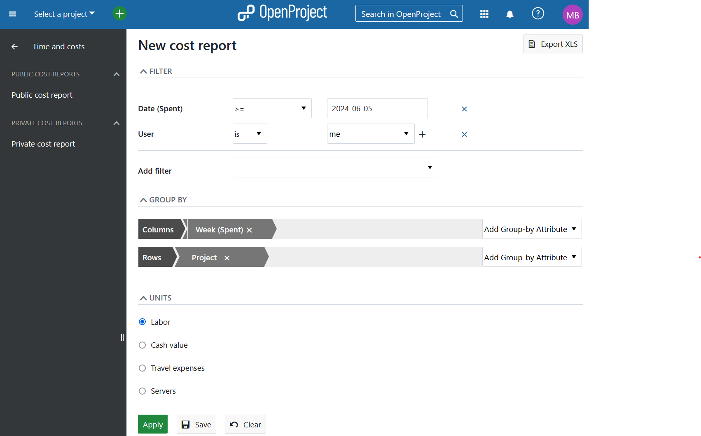

Read more about creating and editing **Time and cost reports** [here](../../time-and-costs/reporting/).

## Meetings

**The Meetings** global module will provide a list of all upcoming and past meetings you have created, been invited to, attended or have administrative privileges to see. The default view will show the **Upcoming invitations**, in chronological order (earliest first).

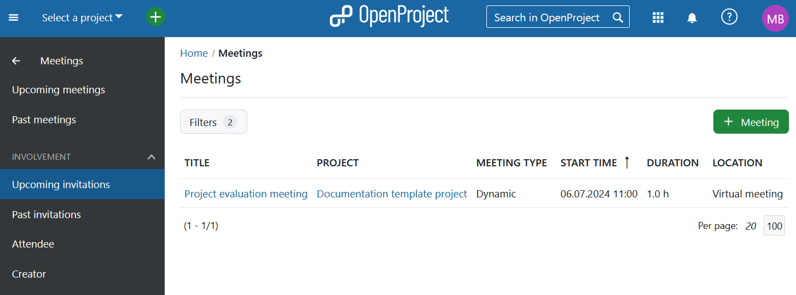

You can also choose to view all **Past meetings** or apply one of the filters based on your **Involvement** in a meeting.

You can create a new meeting directly from within the global modules menu by clicking a green **+ Meeting** button either in the top right corner at the bottom of the sidebar:

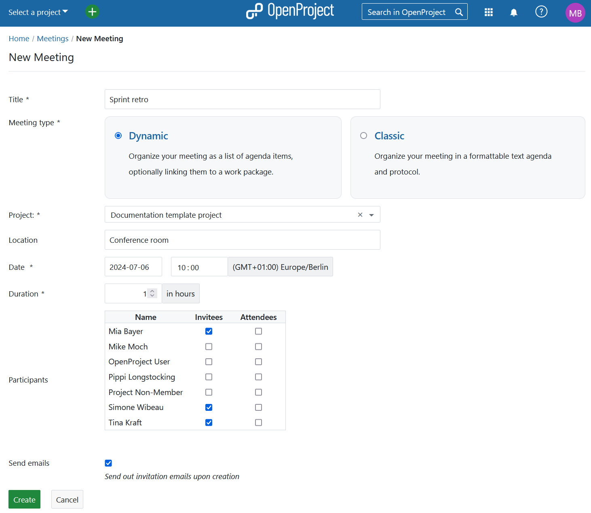

On this page, you can set the title and select the participants, location, time and the date of the meeting. Depending on the selected project, the page will show you a list of project members to invite as participants. Once you click on the **Create** button, you will be able to edit the **Meeting agenda**.

Read more about creating and editing **Meetings** [here](../../meetings).
