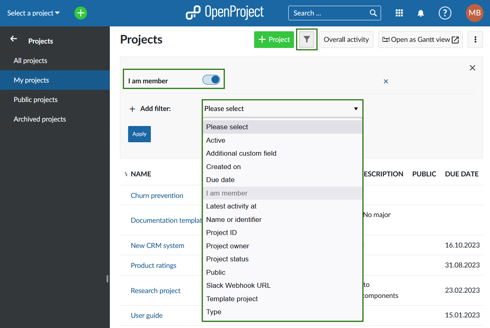

---
sidebar_navigation:
  title: Global modules
  priority: 999
description: Global modules in OpenProject
keywords: global modules, project overarching modules, global index pages
---
# Global modules

Global modules presents an overview the projects that you are a member of or have administrative privileges to view. Here you will find a summary of all the entries in the respective module accross your projects, such as **Activity, Work packages, Calendars, Boards**, etc.

To find **Global modules** menu simply click on the logo in the header of the aplication, it will be displayed on the left side. 

> It is possible that some of the global modules are not displayed for you. This will be the case if said module is not activated in the Project settings (LINK) of any of the projects in you instance. If for example **News** module is not enabled for any of the projects, you will not see it in the **Global modules** menu. 

## Projects

**Projects** global module will display a list of the projects that exist in your OpenProject instance, which you are a member of and/or have the right to see (for example as an admin) and public projects.

You can create a new project here directly by using the  **+ Project** button at the bottom of the sidebar.

On the left you will have the following options:

**All projects** is the default view and shows only active projects. If you do not have admin rights, this view will be the same as **My projects** for you.

**My projects** is the view that will show projects you are a member of and public projects you are not a member of. When this menu entry is selected, an **I am member** filter will be activated under Filters. You can then add various other filters to adjust the view.

**Public projects** will list all projects that have been set to be public.

**Archived projects**  will list all archived projects that you were a member of or have the right to see.

>Note: you can also navigate to the **Projects** through [**Select a project** dropdown menu](https://www.openproject.org/docs/user-guide/projects/#projects-list ) and by clicking on **View all projects** button in the **Projects** block on the home page.

## Activity

Second level navigation with the same filter options that apply to the activity tab inside of a project.

## Work packages

## Calendars

## Team planners

## Boards

## News

## Time and costs

## Meetings
