---
sidebar_navigation:
  title: Dynamic meetings
  priority: 800
description: Manage meetings with agenda and meeting minutes in OpenProject.
keywords: meetings, dynamic meetings, agenda, minutes
---

# Dynamic meetings management

Introduced in OpenProject 13.1, dynamic meetings offer easier meeting management, improved agenda creation and the ability to link work packages to meetings and vice-versa.

> [!NOTE]
> The **Meetings module needs to be activated** in the [Project Settings](../../projects/project-settings/modules/) to be able to create and edit meetings.

| Topic                                                        | Content                                                    |
| ------------------------------------------------------------ | ---------------------------------------------------------- |
| [Meetings in OpenProject](#meetings-in-openproject)          | How to open meetings in OpenProject.                       |
| [Create a new meeting](#create-a-new-meeting)                | How to create a new meeting in OpenProject.                |
| [Edit a meeting](#edit-a-meeting)                            | How to edit an existing meeting.                           |
| [Add a work package to the agenda](#add-a-work-package-to-the-agenda) | How to add a work package to a meeting agenda.             |
| [Create or edit the meeting agenda](#create-or-edit-the-meeting-agenda) | How to create or edit the agenda.                          |
| [Add meeting participants](#add-meeting-participants)        | How to invite people to a meeting.                         |
| [Add meeting attachments](#meeting-attachments)              | How to add attachments to a meeting.                       |
| [Send email to all participants](#send-email-to-all-participants) | How to send an email to all meeting participants.          |
| [Download a meeting as an iCalendar event](#download-a-meeting-as-an-icalendar-event) | How to download a meeting as an iCalendar event.           |
| [Close a meeting](#close-a-meeting)                          | How to close a meeting in OpenProject.                     |
| [Re-open a meeting](#re-open-a-meeting)                      | How to re-open a meeting in OpenProject.                   |
| [Copy a meeting](#copy-a-meeting)                            | How to copy a meeting in OpenProject (recurring meetings). |
| [Delete a meeting](#delete-a-meeting)                        | How to delete a meeting in OpenProject.                    |

## Meetings in OpenProject

By selecting **Meetings** in the project menu on the left, you get an overview of all the meetings you have been invited to within a specific project sorted by date. By clicking on a meeting name you can view further details of the meeting.

To get an overview of the meetings across multiple projects, you can select **Meetings** in the [global modules menu](../../../user-guide/home/global-modules/).

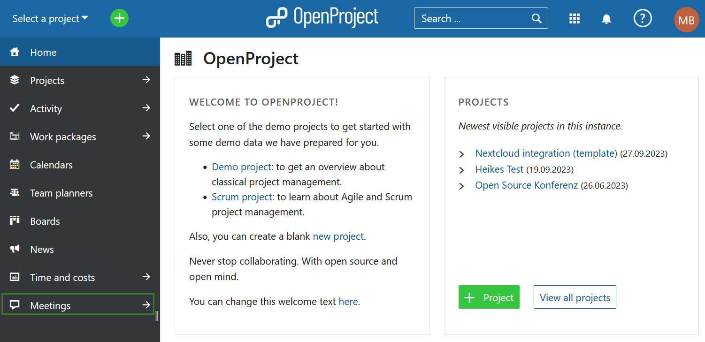

The menu on the left will allow you to filter for upcoming or past meetings. You can also filter the list of the meetings based on your involvement.

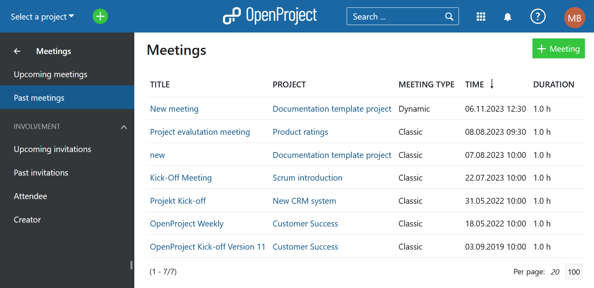

## Create and edit dynamic meetings

### Create a new meeting

You can either create a meeting from within a project or from the global **Meetings** module.

> [!NOTE]
> Dynamic meetings were introduced in OpenProject 13.1. At the moment, the Meetings module lets you create [classic](../classic-meetings) or dynamic meetings but please keep in mind that the ability to create [classic meetings](../classic-meetings) will eventually be removed from OpenProject.

To create a new meeting, click the green **+ Meeting** button in the upper right corner.

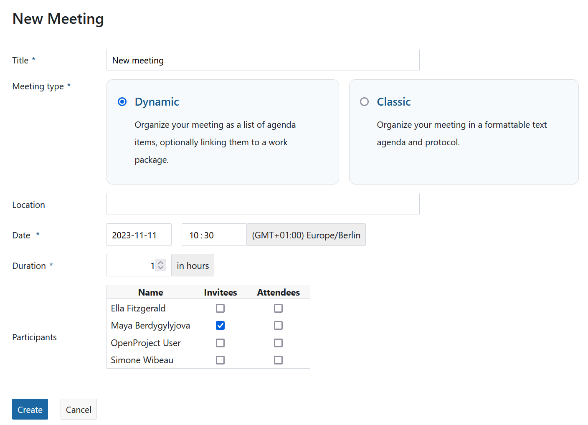

Enter your meeting's title, type, location, start date and duration. You can also choose if you want to invite meeting participants via email after the meeting has been created (this option is activated by default). 

If you are creating a meeting from a global module you will first need to select a project to which the meeting is attributed. After you have selected a project, the list of potential participants (project members) will appear for you to select who to invite. After the meeting you can note who attended the meeting.

Click the blue **Create** button to save your changes.

### Edit a meeting

If you want to change the details of a meeting, for example its time or location, open the meetings details view by clicking on pencil icon next to the **Meeting details**.

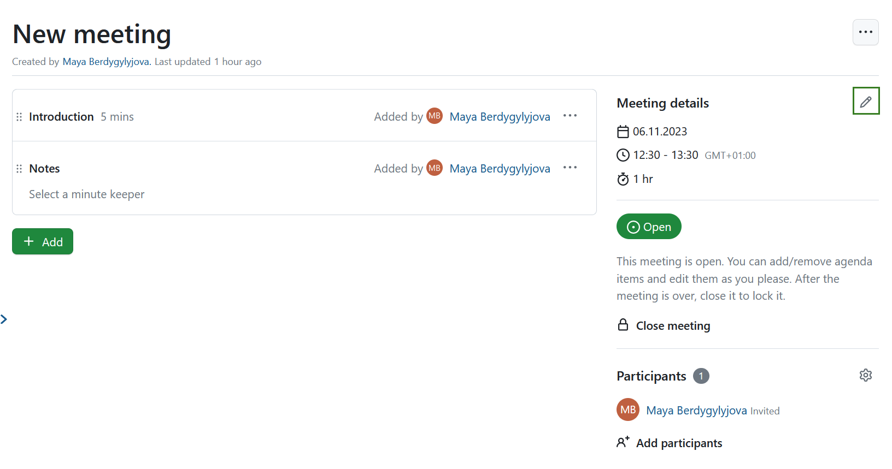

An edit screen will be displayed, where you can adjust the date, time, duration and location of the meeting.

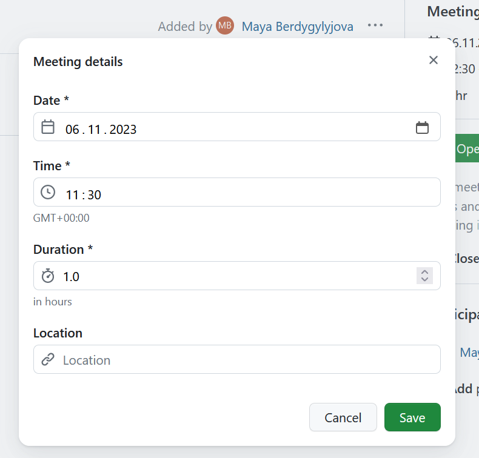

Do not forget to save the changes by clicking the green **Save** button. Cancel will bring you back to the details view.

In order to edit the title of the meeting select the dropdown menu behind the three dots and select the **Edit meeting title**.

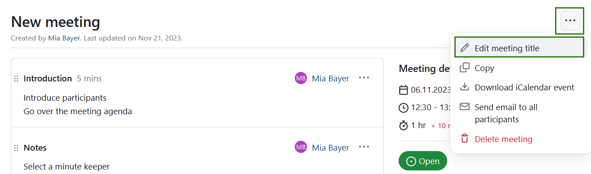

### Create or edit the meeting agenda

After creating a meeting, you can set up a **meeting agenda**.

You do this by adding sections, agenda items or existing work packages by selecting the desired option under the green **+ Add** button. You can then add notes to each agenda item.

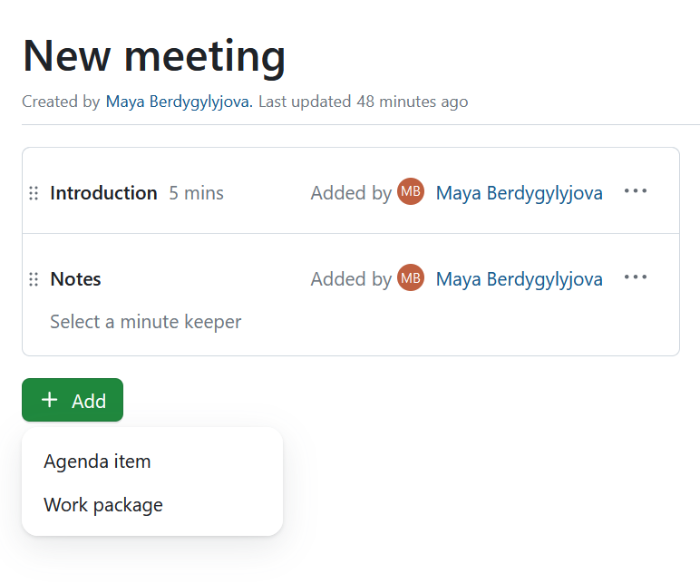

#### Add an agenda section 

Sections allow you to group agenda items into blocks for better organization.

To add a section, click on the **+ Add** button at the bottom of the agenda items and select the **Section** option. 

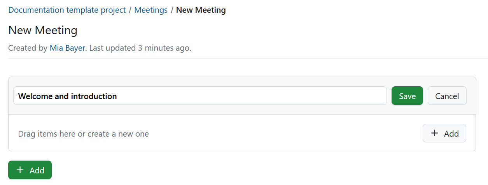

If, prior to creating your first section, your meeting already had existing [agenda items](#add-an-agenda-item), they will automatically be contained in a section called **Unnamed section**. You can rename this if you wish. 

> [!NOTE]
> If you use sections, all agenda items must have sections.

 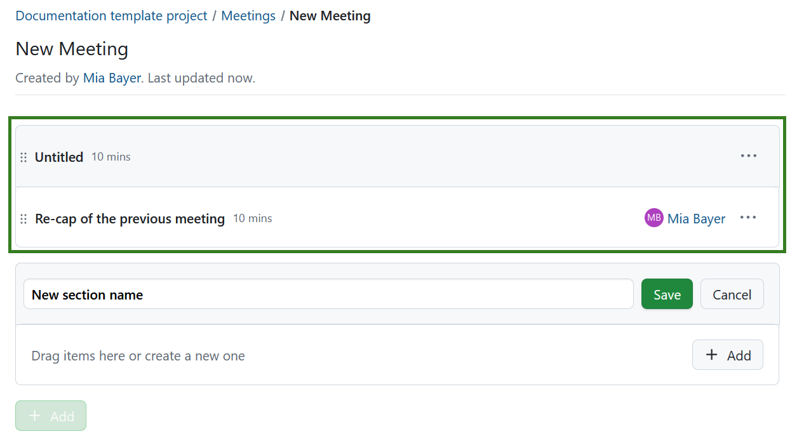

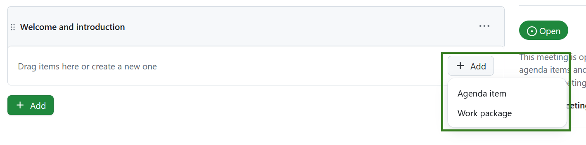

Sections will show the sum of all the duration of all containing items (or at least, those that have a duration specified).

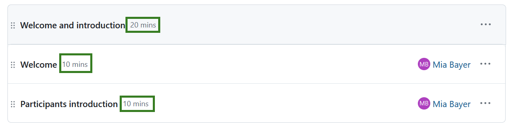

You can then add agenda items to specific sections by either dragging and dropping items into each, or by clicking on the **More** button (⋯) and choosing your desired action.

This menu also lets you rename a section, move it or delete the entire section by selecting the respective option from the dropdown menu behind the **More** (⋯) icon on the right side. 

> [!IMPORTANT]
> Deleting a section will delete all containing agenda items. If a section contains agenda items, you will asked for confirmation before deletion.

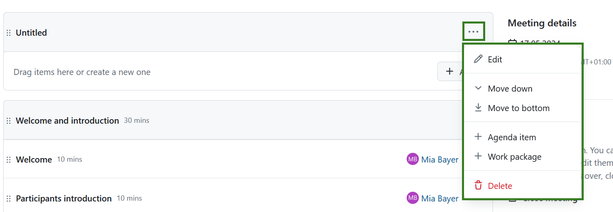

You can also re-arrange sections by dragging and dropping sections up and down. If a section is moved, the agenda items will move along with it. 

#### Add an agenda item
If you select the **Agenda item** option, you can name that item, add notes, set the anticipated duration in minutes and select a user to be displayed next to the agenda item.  This could for example be a meeting or a project member that is accountable for the item or someone who will present that particular topic. 

By default, when creating an agenda item, this will be pre-filled with the name of the user adding the agenda item, but it can either be removed or replaced by one of the other meeting participants.

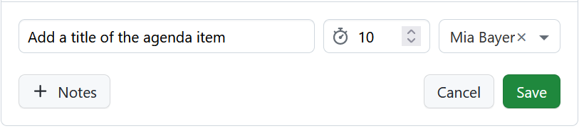

#### Link a work package to a meeting

If you select the **Work package** option, you can link a work package by entering either a work package ID, or starting to type in a keyword, which will open a list of possible options.

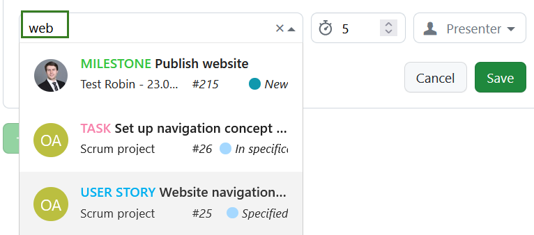

After you have finalized the agenda, you can always edit the agenda items, add notes, move an item up or down or delete it. Clicking on the three dots on the right edge of each agenda item will display a menu of available options, including editing, copying link to clipboard, moving the agenda item within the agenda or deleting it.

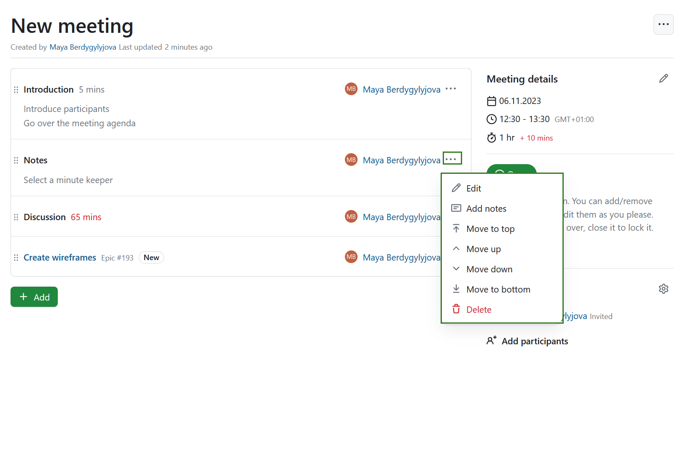

You may also re-order agenda items by clicking on the drag handle (the icon with six dots) on the left edge of each agenda item and dragging that item above or below.

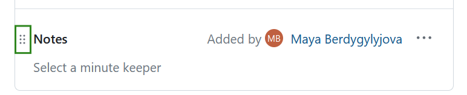

The durations of each agenda item are automatically summed up. If that sum exceeds the planned duration entered in *Meeting Details*, the duration of those agenda times that exceed the planned duration will appear in red to warn you of the fact.

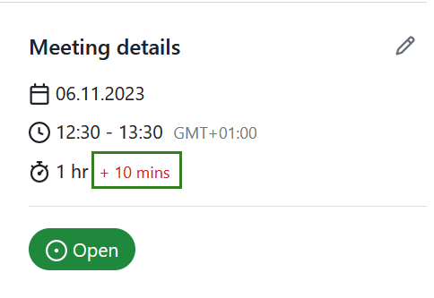

### Add a work package to the agenda

There are two ways to add a work package to a meeting agenda.

- **From the Meetings module**: using the **+ Add** button [add a work package agenda item](#create-or-edit-the-meeting-agenda) or
- **From a particular work package**: using the **+ Add to meeting** button on the [Meetings tab](../../work-packages/add-work-packages-to-meetings)

You can add a work package to both upcoming or past meetings as long as the work package is marked **open**.

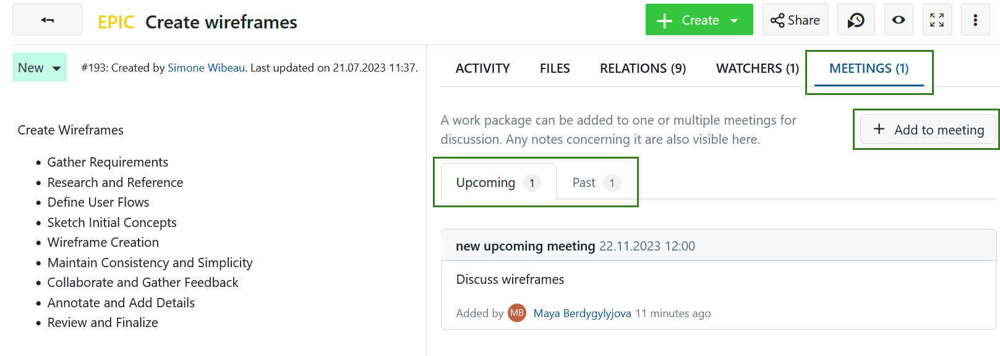

>  [!TIP]
> The upcoming meetings are displayed in chronological order, from the nearest meeting to the most distant. 
> The past meetings are displayed in reverse chronological order, from the most recent meeting to the oldest.

## Meeting participants

### Add meeting participants

You will see the list of all the invited project members under **Participants**. You can **add participants** (Invitees and Attendees) to a meeting in [edit mode](#edit-a-meeting). The process is the same whether you are creating a new meeting or editing an existing one.

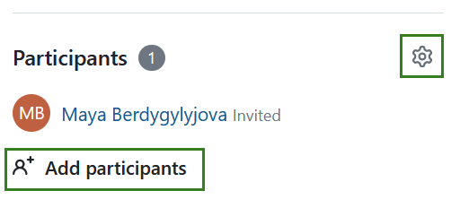

You will see the list of all the project members and be able to tell, based on the check marks next to the name under the *Invited* column, who was invited. After the meeting, you can record who actually took part using the checkmarks under the Attended column.

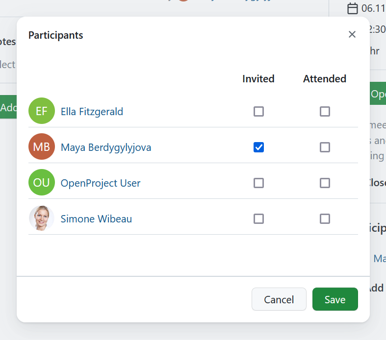

To remove an invited project member from a meeting, simply uncheck both check marks.

Click on the **Save** button to confirm the changes.

### Send email to all participants

You can send an email reminder to all the meeting participants. Select the dropdown by clicking on the three dots in the top right corner and select **Send email to all participants**. An email reminder with the meeting details (including a link to the meeting) is immediately sent to all invitees and attendees.

## Meeting attachments

You can attachments in the meetings in the **Attachments** section in the right bottom corner. You can either user the **+Attach files** link to select files from your computer or drag and drop them.

Added attachments can be added to the Notes section of agenda packages by dragging and dropping them from the Attachments section.

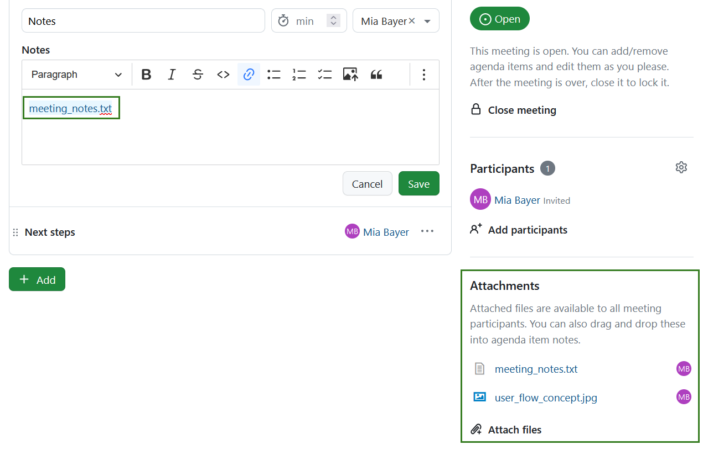

## Meeting history

You can track what changes were made to a meeting and by which user. Select the dropdown by clicking on the three dots in the top right corner and select **Meeting history**.

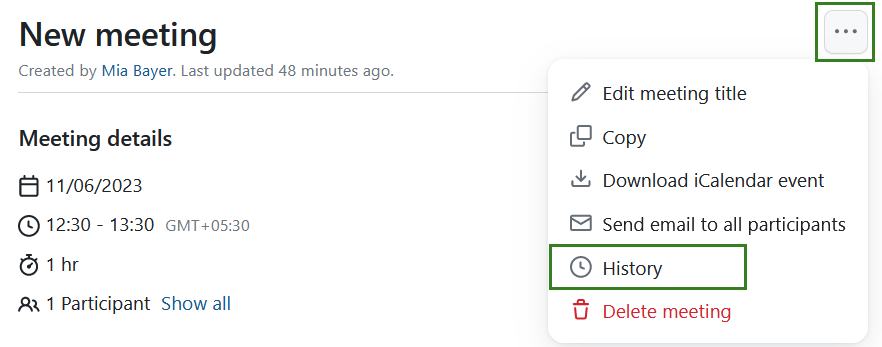

This will display meeting history details.

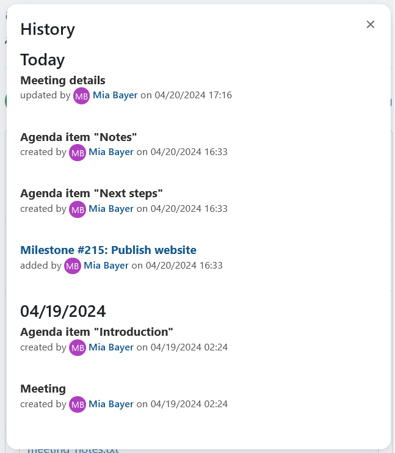

## Download a meeting as an iCalendar event

You can download a meeting as an iCalendar event. Select the dropdown by clicking on the three dots in the top right corner and select the **Download iCalendar event**.

Read more about [subscribing to a calendar](../../calendar/#subscribe-to-a-calendar).

## Close a meeting

Clicking on the **Close meeting** after the meeting is completed with lock the current state and make render it read-only.

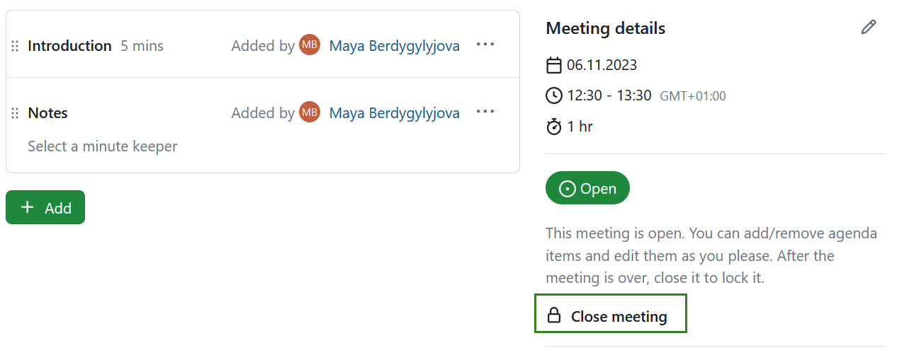

## Re-open a meeting

Once a meeting has been closed, it can no longer be edited. Project members with the permission to edit and close meetings will, however, see a **Re-open meeting** option. Clicking on this re-opens a meeting and allows further editing.

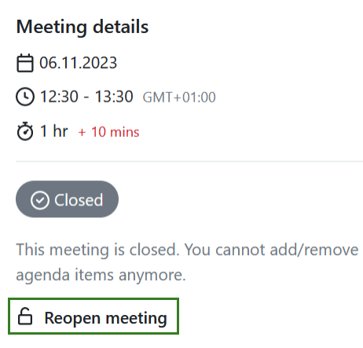

## Copy a meeting

You can copy an existing meeting. This is useful if you have recurring meetings. To copy a meeting, click on the three dots in the top right corner and select **Copy**.

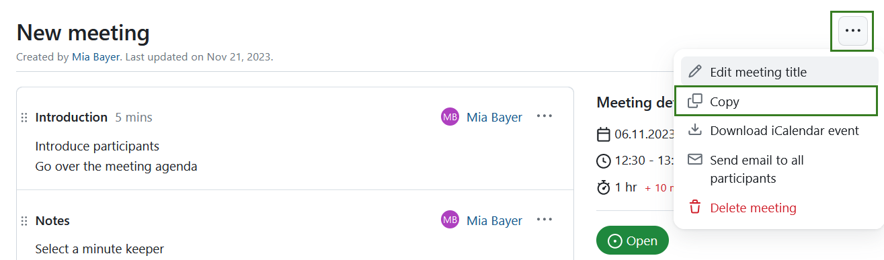

A screen will open, which will allow you adjust the name, time, location and further details of the copied meeting. By default, the date for the copied meeting will be moved forward by one week from the original meeting's date. You also have an option of copying the agenda and attachments. If you copy a closed meeting, the new meeting status will automatically be set to open. Don't forget to **Save** the copied meeting by clicking the green **Create** button.

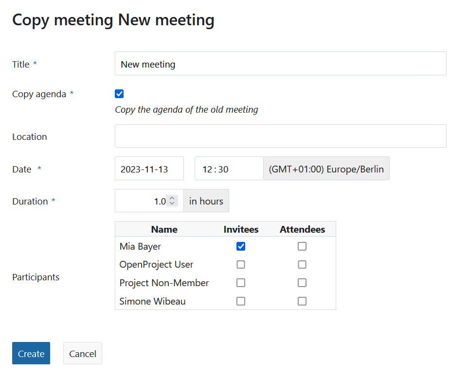

## Delete a meeting

You can delete a meeting. To do so, click on the three dots in the top right corner, select **Delete meeting** and confirm your choice.

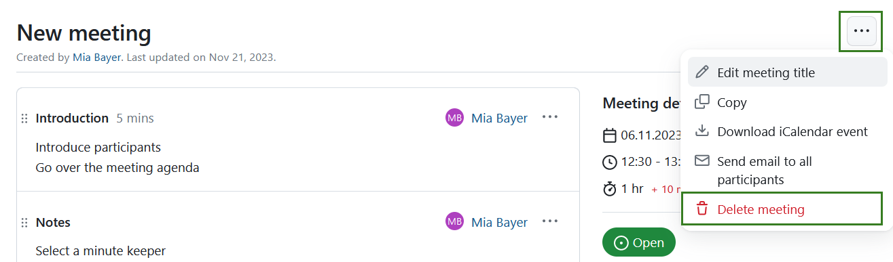
