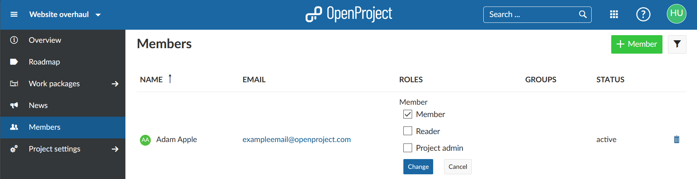
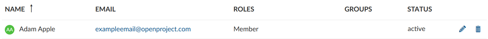

---
sidebar_navigation:
  title: Members
  priority: 650
description: Manage members in OpenProject.
robots: index, follow
keywords: members, project participants
---

# Manage members

| Topic                                           | Content                                                      |
| ----------------------------------------------- | ------------------------------------------------------------ |
| [Add members](#add-members)                     | How to add existing members or invite new members to a project? |
| [Edit members](#edit-members)                   | How to change the role of a member in a project?             |
| [Remove members](#remove-members)               | How to remove members from a project?                        |
| [Roles and permissions](#roles-and-permissions) | How to manage roles and permissions for members?             |
| [Groups](#groups)                               | How to add members to a groups and add groups to a project?  |

<video src="https://openproject-docs.s3.eu-central-1.amazonaws.com/videos/OpenProject-Invite-and-Manage-Members.mp4" type="video/mp4" controls="" style="width:100%"></video>

## Add members

Find out [here](../../getting-started/invite-members/#add-existing-users) how to add existing users to a project and [here](../../getting-started/invite-members/#invite-new-members) how to invite new users to join a project.

## Edit members

To change the role of a member within a project, select the corresponding project and open the Members module.

To edit an existing member of a project, click the **Edit icon** in the list next to the member on the right. Choose the new role and press the blue **Change button** so save your changes.

## Remove members

To remove members from a project, [select the project](../../getting-started/projects/#open-an-existing-project) for which you want to remove the members. In the project menu on the left, select the **Members** module. In the members list, click the trash can icon at the right end of the row with the corresponding member name.

## Roles and permissions

Members will have different roles with different permissions in a project. To find out how to configure roles and permissions click [here](../../system-admin-guide/users-permissions/roles-permissions).

A **role** is defined as a set of permissions defined by a unique name. Project members are assigned to a project by specifying a user's, group's or placeholder user's name and the role(s) they should assume in the project.

To assign work packages to a project member, the respective user's or placeholder user's role needs to be able to be assigned work packages. This is the default setting for default roles. You can check this setting in the [Roles and Permissions section](../../system-admin-guide/users-permissions/roles-permissions/#create-a-new-role) of the system administration.

## Groups

Users can be added to groups. A group can be added to a project. With this, all users within a group will have the corresponding role in this project. 
Find out how to create and manage groups in OpenProject [here](../../system-admin-guide/users-permissions/groups).