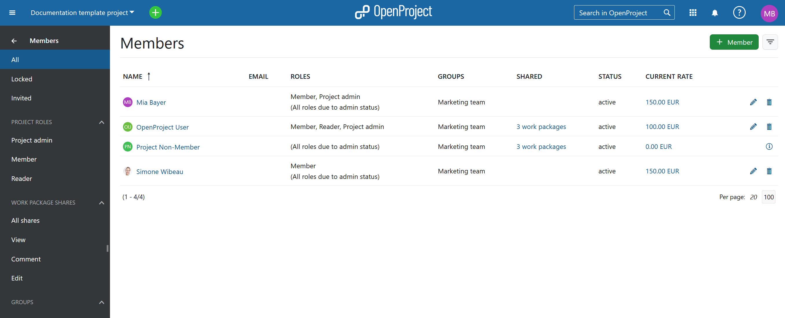
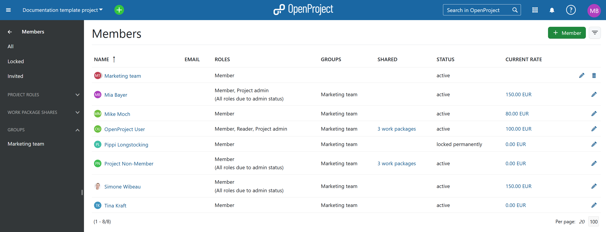
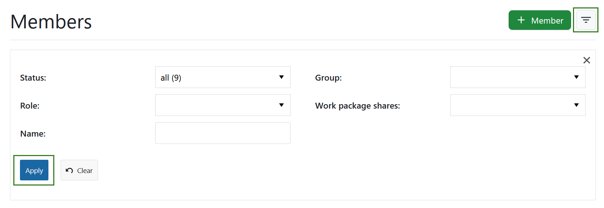
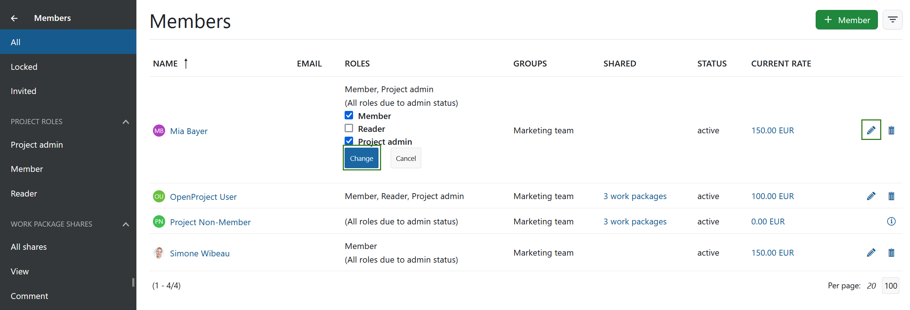
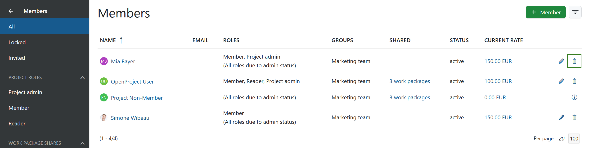
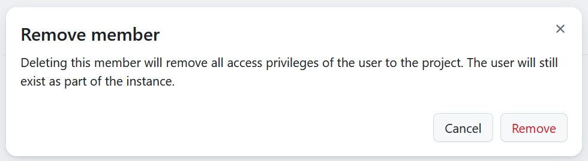
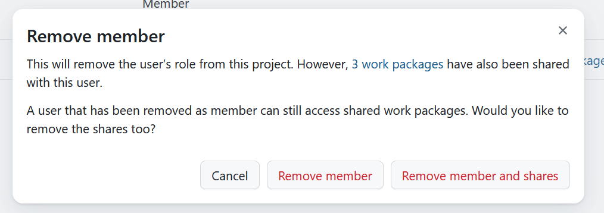
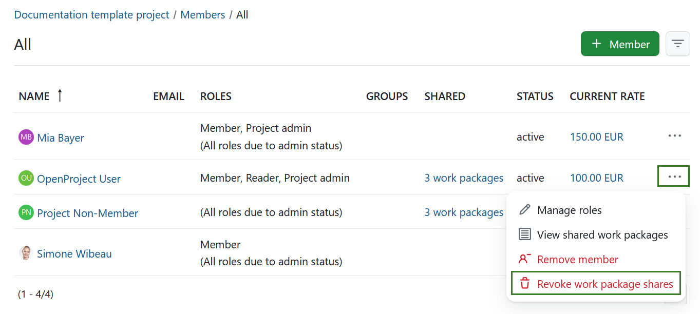

---
sidebar_navigation:
  title: Members
  priority: 650
description: Manage members in OpenProject.
keywords: members, project participants
---

# Manage members

| Topic                                                 | Content                                                      |
| ----------------------------------------------------- | ------------------------------------------------------------ |
| [Project members overview](#project-members-overview) | How to get an overview of all project members.               |
| [Add members](#add-members)                           | How to add existing members or invite new members to a project. |
| [Edit members](#edit-members)                         | How to change the role of a member in a project.             |
| [Remove members](#remove-members)                     | How to remove members from a project.                        |
| [Roles and permissions](#roles-and-permissions)       | How to manage roles and permissions for members.             |
| [Groups](#groups)                                     | How to add members to a group and add groups to a project.   |

## Project members overview

On the left side menu you will see **Members**. When selected, it will show a list of project members, project groups, as well as the users with whom work packages from this project have been shared. You can **edit** or **delete** a user or a group by clicking the respective icon at the end of the line listing the user or group.

Standard filters on the left side menu include the following:

- **All** - returns all members and groups of the project, as well as non-members, with whom one or more work packages from this project have been shared

- **Locked** - returns all locked users that are members of this project, as well as locked non-members, with whom one or more work packages from this project have been shared

- **Invited** - returns all users that have been invited, but have not yet registered

- **Project roles** provides filters based on all the member roles that have been assigned to users in that specific project.

- **Work package shares** provides filters based on all the roles available for sharing work packages. They include:
  - **All shares** - returns all users that a work package in this project has been shared with
  - **View** - returns all users that can view, but not edit or comment on a work package that has been shared with them

  - **Comment** - returns all users that are allowed to add comments to a work package that has been shared with them

  - **Edit** - returns all users that are permitted to edit a work package that has been shared with them

> Note: users, with whom work packages from a given project have been shared, can not be edited or deleted under **Members**. To edit or revoke their viewing rights you can click on the "Number of work package(s) in the column "Shared" (3 work packages in the example above). This will open an already filtered work package list of all  work packages shared with that user.
>
> Another way is to navigate to **Work packages**, select the **Shared with users** filter and adjust the privileges accordingly. [Read more here](../work-packages/share-work-packages/#remove-sharing-privileges).

- **Groups** lists all the groups that have been added to this project (this filter will only be visible if a group has been added to the project).

> Note: members that are part of a group will also be displayed as members individually. In that case you can only edit the roles assigned to the users, but not delete him or her. If you want to delete a user that is a member of a group (also added to this project) you will have to delete the entire group and add group members individually if needed.

You can adjust the displayed members by clicking on the **filter icon** in the top right corner next to **+ Member** button. Once you are done adjusting your preferences, click the green **Apply** button.

You can adjust the project member overview based on following filters:

- **Status** - allows filtering based on the user status, such as active, invited, locked or registered.
- **Group** - allows filtering for project members that are part of an existing group (all groups available in your instance will be listed as options), even if the group itself has not been added to the project.
- **Role** - allows filtering based on all the user roles that have been assigned to users in that specific project. The options of this filters are the same as in the left side menu.
- **Work package shares** - provides same filters as listed in the left side menu, based on all the roles available for sharing work packages. They include all shares, view, comment, edit.
- **Name** - allows searching for a specific user or group by typing in a user or group name.

## Add members

Find out [here](../../getting-started/invite-members/#add-existing-users) how to add existing users to a project and [here](../../getting-started/invite-members/#invite-new-members) how to invite new users to join a project.

## Edit members

To change the role of a member within a project, select the corresponding project and open the Members module.

To edit an existing member of a project, click the **More** icon in the list next to the member on the right and select **Manage roles**. Add and remove roles, then press the green **Change** button so save your changes.

## Remove members

To remove members from a project, [select the project](../../getting-started/projects/#open-an-existing-project) for which you want to remove the members. In the project menu on the left, select the **Members** module. In the members list, click the **More** icon at the right end of the row with the corresponding member name and select Remove member.

You will be asked to confirm your decision.

If the project member you are removing has shared work packages, you will also be asked whether these sharing rights also need to be removed.

> Note: please keep in mind that removing  project members can only be done if you have correct permissions.

> Note: a project member can be a part of the project either individually, as a member of a group, or both. The role removal will only affect the member's individual roles. All those roles obtained via a group will not be removed. To remove those group roles you can either remove the member from the group or remove the entire group from the project.

## Revoke sharing privileges

If a work package has been [shared](../work-packages/share-work-packages), you may need to revoke sharing privileges at a later stage in the project. To do that select the **More** icon at the right end of the row with the corresponding member name and select **Revoke work package shares**. You can also choose the **View shared work packages** option to see the list of all  work packages shared with the user.

> Note: a project member can be a part of the project either individually, as a member of a group, or both. The revoking action will only affect the individual work packages shares. All work package shares with the user as part of a group will not be revoked. To revoke those group shares you can either remove the member from the group or revoke the privileges from the entire group.

## Roles and permissions

Members will have different roles with different permissions in a project. To find out how to configure roles and permissions click [here](../../system-admin-guide/users-permissions/roles-permissions).

A **role** is defined as a set of permissions defined by a unique name. Project members are assigned to a project by specifying a user's, group's or placeholder user's name and the role(s) they should assume in the project.

To assign work packages to a project member, the respective user's or placeholder user's role needs to be able to be assigned work packages. This is the default setting for default roles. You can check this setting in the [Roles and Permissions section](../../system-admin-guide/users-permissions/roles-permissions/) of the system administration.

## Groups

Users can be added to groups. A group can be added to a project. With this, all users within a group will have the corresponding role in this project.
Find out how to create and manage groups in OpenProject [here](../../system-admin-guide/users-permissions/groups).
