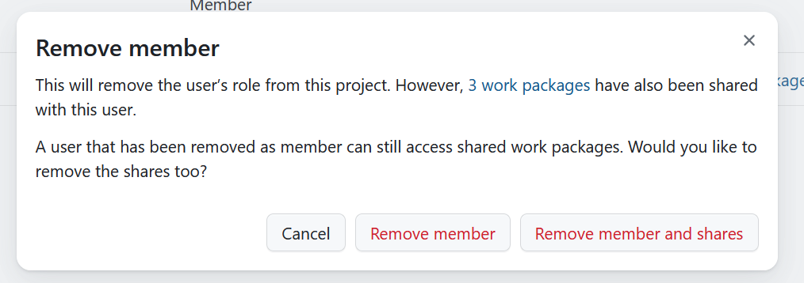
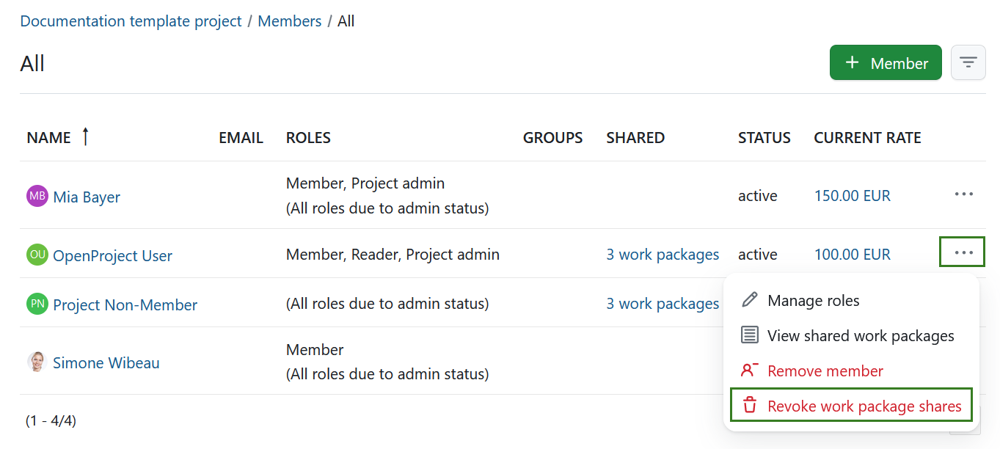

---
sidebar_navigation:
  title: Members
  priority: 650
description: Manage members in OpenProject.
keywords: members, project participants
---

# Manage members

| Topic                                                 | Content                                                      |
| ----------------------------------------------------- | ------------------------------------------------------------ |
| [Project members overview](#project-members-overview) | How to get an overview of all project members.               |
| [Add members](#add-members)                           | How to add existing members or invite new members to a project. |
| [Edit members](#edit-members)                         | How to change the role of a member in a project.             |
| [Remove members](#remove-members)                     | How to remove members from a project.                        |
| [Roles and permissions](#roles-and-permissions)       | How to manage roles and permissions for members.             |
| [Groups](#groups)                                     | How to add members to a group and add groups to a project.   |
| [Visibility of users](#visibility-of-users)           | Which users and groups you are able to see.                  |

## Project members overview

On the left side menu you will see **Members**. When selected, it will show a list of project members, project groups, as well as the users with whom work packages from this project have been shared. You can **edit** or **delete** a user or a group by clicking the respective icon at the end of the line listing the user or group.

> [!IMPORTANT]
> If you do not have a global permission to **View all users and groups**, you may not see all project members.  The selection is limited to users who you share a project with or are in the same group with. 

Standard filters on the left-side menu include the following:

- **All** - returns all members and groups of the project, as well as non-members, with whom one or more work packages from this project have been shared

- **Locked** - returns all locked users that are members of this project, as well as locked non-members, with whom one or more work packages from this project have been shared

- **Invited** - returns all users that have been invited, but have not yet registered

- **Project roles** provides filters based on all the member roles that have been assigned to users in that specific project.

- **Work package shares** provides filters based on all the roles available for sharing work packages. They include:
  - **All shares** - returns all users that a work package in this project has been shared with
  - **View** - returns all users that can view, but not edit or comment on a work package that has been shared with them

  - **Comment** - returns all users that are allowed to add comments to a work package that has been shared with them

  - **Edit** - returns all users that are permitted to edit a work package that has been shared with them

> [!NOTE]
> Users, with whom work packages from a given project have been shared,  be edited or deleted under **Members**. To edit or revoke their viewing rights you can click on the "Number of work package(s) in the column "Shared" (3 work packages in the example above). This will open an already filtered work package list of all  work packages shared with that user.
>
> Another way is to navigate to **Work packages**, select the **Shared with users** filter and adjust the privileges accordingly. [Read more here](../work-packages/share-work-packages/#remove-sharing-privileges).

- **Groups** lists all groups that have been added to this project (this filter will only be visible if a group has been added to the project).

> [!NOTE]
> Members that are part of a group will also be displayed as members individually. In that case you can only edit the roles assigned to the users, but not delete them. If you want to delete a user that is a member of a group (also added to this project) you will have to delete the entire group and add group members individually if needed.

You can adjust the displayed members by clicking on the **Filter**  button in the left corner under the module name. Once you are done adjusting your preferences, click the green **Apply** button.

You can adjust the project member overview based on the following filters:

- **Status** - allows filtering based on the user status, such as active, invited, locked or registered.
- **Group** - allows filtering for project members that are part of an existing group (all groups available in your instance will be listed as options), even if the group itself has not been added to the project.
- **Role** - allows filtering based on all the user roles that have been assigned to users in that specific project. The options of these filters are the same as in the left side menu.
- **Work package shares** - provides the same filters as listed in the left side menu, based on all the roles available for sharing work packages. They include all shares, view, comment, edit.
- **Name** - allows searching for a specific user or group by typing in a user or group name.

## Visibility of users

Not every user can see every other user or group in OpenProject. When you pick members, use filters, or search for people, the list is limited to the users and groups that are visible to you.

You can see another user or group if **any** of the following applies:

- **You are an administrator.** Administrators can see all users and groups.
- **You have the global permission "View all users and groups".** This grants the same full visibility without being an administrator.
- **You are in the same group.** If you and another user belong to a common group, you can see each other regardless of any shared projects.
- **You share a project.** If you are both members of the same project, you can see each other. This also covers users who are not project members but have a work package in that project [shared](../work-packages/share-work-packages) with them.
- **You have access to a project the other user belongs to.** A project is accessible to you when it is a **public** project, when you are a member of it, or when a work package in it has been shared with you. In each of these cases you can see all members of that project, as well as everyone who has a work package shared with them there.

It is important to keep in mind that:

- Members of a **public** project are visible to everyone, since public projects are accessible to all users.
- Visibility is evaluated **per project**, not per work package. Once you can see a project, you can see all of its members, not only the people involved in the specific work package that was shared with you.
- Being able to see a user does not grant any additional permissions on their data. It only determines whether they appear in member lists, filters, and user search.

> [!NOTE]
> If you do not have the global permission **View all users and groups**, some project members added through other means (for example via a group you are not part of) may not appear to you, even though they participate in the project.

## Add members

Find out [here](../../getting-started/invite-members/#add-existing-users) how to add existing users to a project and [here](../../getting-started/invite-members/#invite-new-members) how to invite new users to join a project.

## Edit members

To change the role of a member within a project, select the corresponding project and open the Members module.

To edit an existing member of a project, click the **More** icon in the list next to the member on the right and select **Manage roles**. Add and remove roles, then press the green **Change** button to save your changes.

## Remove members

To remove members from a project, [select the project](../../getting-started/projects/#open-an-existing-project) for which you want to remove the members. In the project menu on the left, select the **Members** module. In the members list, click the **More** icon at the right end of the row with the corresponding member name and select **Remove member**.

You will be asked to confirm your decision.

> [!NOTE]
>
> A project member can be a part of the project either individually, as a member of a group, or both. The role removal will only affect the member's individual roles. All those roles obtained via a group will not be removed. To remove those group roles you can either remove the member from the group or remove the entire group from the project.

If the project member you are removing is also part of a group that is also a member of the project, you will be notified that they will keep the access to the project as a member of the group.

If the project member you are removing has shared work packages, you will also be asked whether these sharing rights also need to be removed.

> [!IMPORTANT]
> Please keep in mind that removing project members can only be done if you have the correct permissions.  

## Revoke sharing privileges

If a work package has been [shared](../work-packages/share-work-packages), you may need to revoke sharing privileges at a later stage in the project. To do that select the **More** icon at the right end of the row with the corresponding member name and select **Revoke work package shares**. You can also choose the **View shared work packages** option to see the list of all work packages shared with the user.

> [!NOTE]
> A project member can be a part of the project either individually, as a member of a group, or both. The revoking action will only affect the individual work package shares. All work package shares with the user as part of a group will not be revoked. To revoke those group shares you can either remove the member from the group or revoke the privileges from the entire group.

## Roles and permissions

Members will have different roles with different permissions in a project. To find out how to configure roles and permissions click [here](../../system-admin-guide/users-permissions/roles-permissions).

A **role** is defined as a set of permissions defined by a unique name. Project members are assigned to a project by specifying a user's, group's or placeholder user's name and the role(s) they should assume in the project.

To assign work packages to a project member, the respective user's or placeholder user's role needs to be able to be assigned work packages. This is the default setting for default roles. You can check this setting in the [Roles and Permissions section](../../system-admin-guide/users-permissions/roles-permissions/) of the system administration.

## Groups

Users can be added to groups. A group can be added to a project. With this, all users within a group will have the corresponding role in this project.
Find out how to create and manage groups in OpenProject [here](../../system-admin-guide/users-permissions/groups).
