---
sidebar_navigation:
  title: My account
  priority: 999
description: Learn how to configure account settings.
keywords: my account, account settings, change language
---

# My account

Change your personal settings in My account. Here you can adapt, e.g. the language, edit notifications, or add an avatar. Moreover you can manage access tokens and sessions.

| Topic                                                                                         | Content                                                      |
|-----------------------------------------------------------------------------------------------| ------------------------------------------------------------ |
| [Open My account settings](#open-my-account-settings)                                         | How to open your personal settings in OpenProject            |
| [Edit your user information](#edit-your-user-information)                                     | How to change the name or email address in OpenProject       |
| [Profile settings: change your language, time zone or display of comments](#profile-settings) | How to change the language, time zone or display of comments in OpenProject |
| [Change password](#change-password)                                                           | How to change my password                                    |
| [Two-factor authentication](#two-factor-authentication)                                       | How to set up a two-factor authentication                    |
| [Access tokens](#access-tokens)                                                               | How to set up access tokens in OpenProject                   |
| [Session management](#sessions-management)                                                    | How to manage your OpenProject sessions                      |
| [Notifications settings](#notifications-settings)                                             | How to change in-app notifications in OpenProject            |
| [Email reminders](#email-reminders)                                                           | How to change email reminders sent by OpenProject            |
| [Set an Avatar](#set-an-avatar)                                                               | How to set an avatar in OpenProject and change the profile picture |
| [Delete account](#delete-account)                                                             | How to delete my own account                                 |

## Open My account settings

To open your personal settings in OpenProject, click on your user icon in the top right corner in the header of the application.

Choose **My account**.

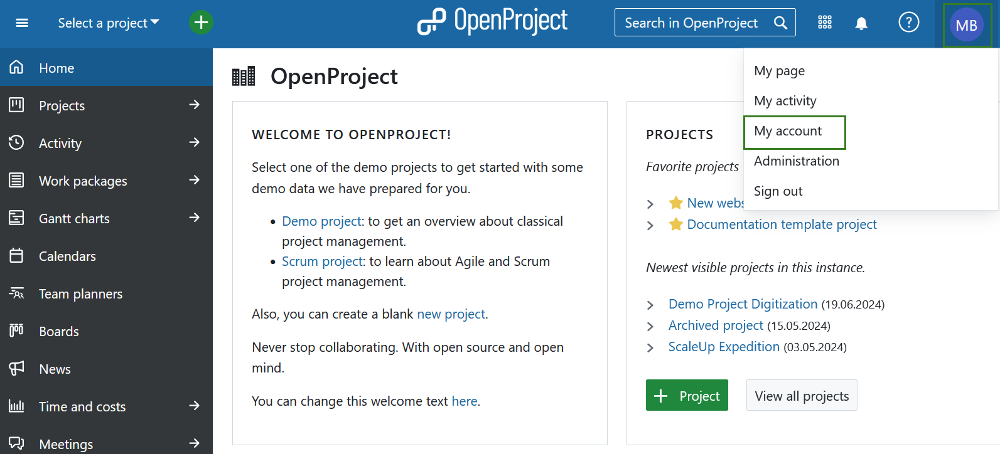

## Edit your user information

To change your email address or your name, navigate to **Profile** on the left side menu of **My account** page.

Here you can update the information and **save** your changes. If you're changing the email address of your account, you will be requested to confirm your account password before you can continue. (Note: This applies only to internal accounts where OpenProject can verify the password).

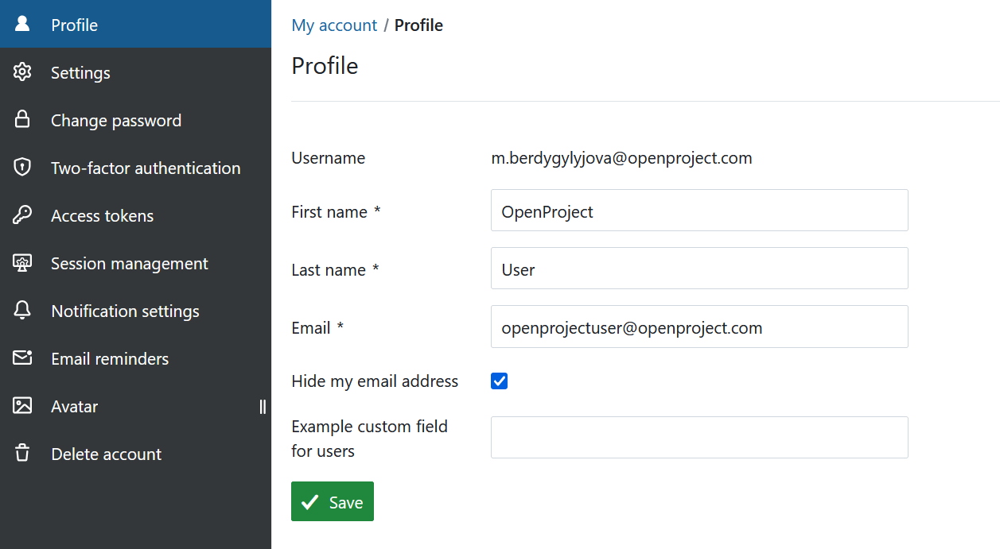

## Profile settings

Within the **Settings** on **My Account** page you can change the language of OpenProject, adapt the time zone, select which display mode you would like activate and change the order in which comments are displayed in the **Activity list** for work packages.

Also, you can activate a **warning if you are leaving a work package with unsaved changes**.

Additionally, you can activate to **auto-hide success notifications** from the system. This (only) means that the green pop-up success notifications will be removed automatically after five seconds.

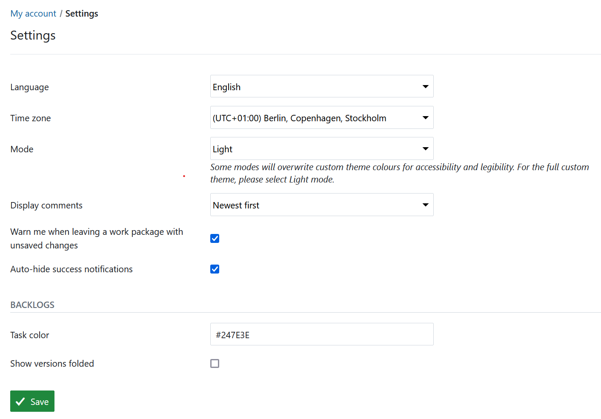

### Change your language

To change the language in OpenProject, navigate to the **My account** and choose the menu point **Settings**.

Here you can choose between multiple languages.

OpenProject is translated to more than 30 languages, like German, Chinese, French, Italian, Korean, Latvian, Lithuanian, Polish, Portuguese, Russian, Spanish, Turkish and many more. If you do not see your preferred language in the My account settings, the language needs to be activated by your system administrator in the [system's settings](../../system-admin-guide/system-settings/languages/).

Pressing the blue **Save** button will save your changes.

If you want to help us to add further languages or to add the translations in your language, you can contribute to the CrowdIn translations project [here](https://crowdin.com/project/openproject).

### Change your time zone

You can choose a time zone in which you work and how the comments and changes will be saved.

Pressing the blue **Save** button will save your changes.

### Select the high contrast color mode

In the dropdown menu **Mode** you can pick the color mode. The default setting is the **Light mode**. You can also select the **Light high contrast mode**, which will significantly increase the contrast and override the color theme of the OpenProject instance for you.

This mode is recommended for users with visuals impairment.

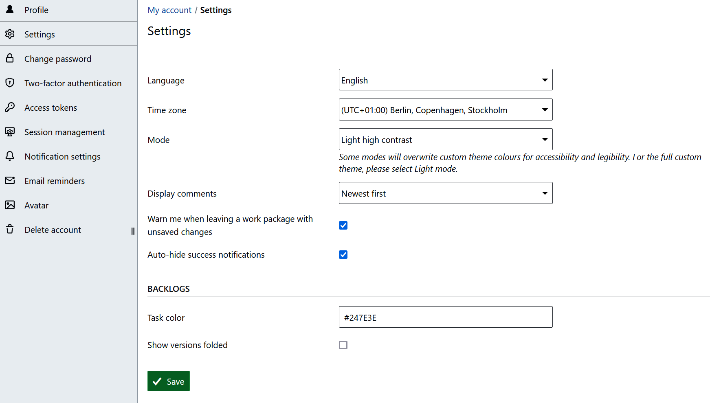

### Select the dark mode

In the dropdown menu **Mode** you can pick the color mode. The default setting is the **Light mode**. You can also select the **Dark mode**, which will change the color theme of the OpenProject instance for you.

> [!NOTE]
> The dark mode ignores parts of the configured design. Top header and side menu colors are entirely overridden for this  mode. Only the accent color and the primary button color are kept, but are calculated to brighter variants.

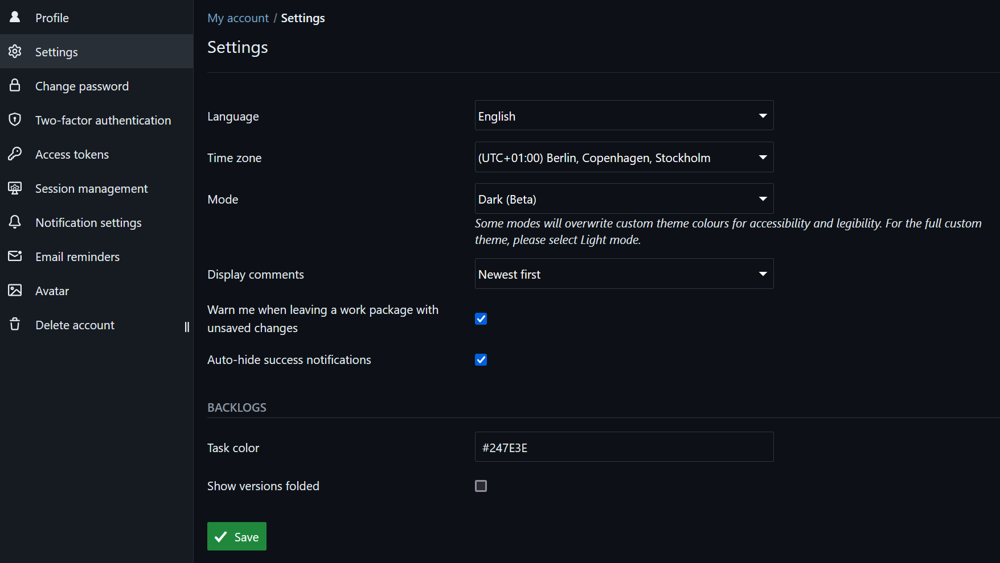

### Change the order to display comments

You can select the order of the comments (for example of the comments for a work package which appear in the Activity tab). You can select the **newest at the bottom** or **newest on top** to display the comments.

If you choose newest on top, the latest comment will appear on top in the Activity list.

### Backlogs settings

There are two personal settings available for the [Backlogs module](../../user-guide/backlogs-scrum/):
**Task color**: Here you can enter the color in which your tasks on the task board (on the Backlogs page) are displayed. Tasks on the task board are color-coded based on who they are assigned to. Every user has a default color assigned but if you prefer a different color, you can change it.
**Show versions folded**: When you navigate to the "Backlogs" module in a project, the available versions (e.g. Product backlog, Sprints) are displayed. By default they are expanded, i.e. all work packages included in those versions are shown right away. If you have a large number of versions that are shown on the "Backlogs" page, you may opt to collapse them by default. This way you see all the versions on a page and can then choose to expand those versions for which you want to see details.

## Change password

In order to reset your password, navigate to  **My account** and choose **Change password** in the menu.

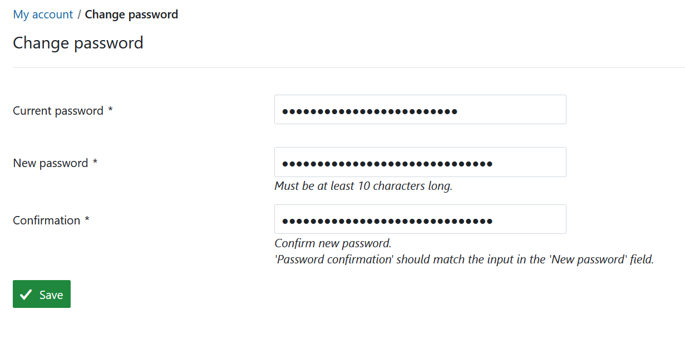

Enter your current password.

Enter your new password and confirm it a second time.

Press the blue **Save** button in order to confirm the password changes.

> [!NOTE]
> You cannot reset your Google password in OpenProject. If you authenticate with a Google/Gmail account, please go to your Google account administration in order to change your password.

## Two-factor authentication

In order to activate the two-factor authentication for your OpenProject installation, navigate to your **My account** and choose the **Two-factor authentication** in the menu. If you have not added any device yet, this list will be empty.

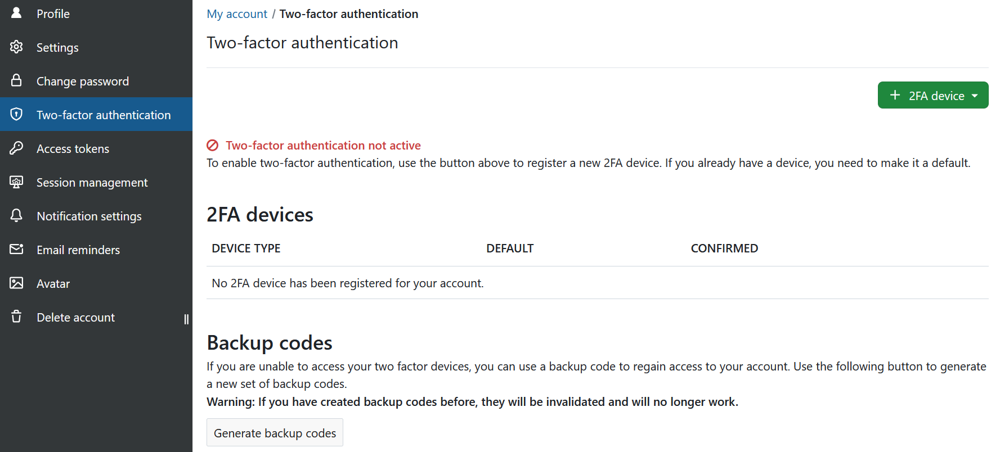

If you have already registered one or multiple 2FA devices, you will see the list of all activated 2FA devices here. You can change, which of them you prefer to have set a a default option.

In order to register a new device for two-factor authentication, click the green button to add a **new 2FA device** and select one of the options. The options you see will depend on what your system administrator has [activated for your instance](../../system-admin-guide/authentication/two-factor-authentication/):

- Mobile phone
- App-based authenticator
- WebAuthn

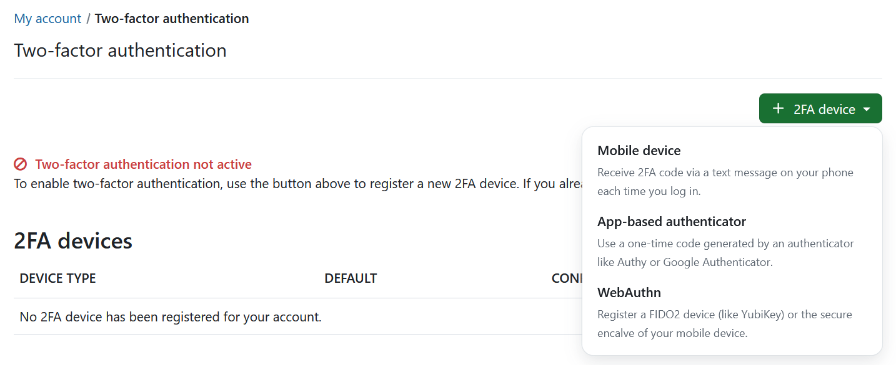

To receive the second factor, you can use an authentication app on your mobile phone, such as Google Authenticator or Authy. You have to enter the code that is displayed in the authentication app to your login.

You can remove or approve 2FA applications by confirming your password. Note that this applies only to internally authenticated users.

### Use your mobile phone

You can use your mobile phone as a 2FA device. The field *Identifier* will be pre-filled out, you will need to add your phone number and click the green **Continue** button.

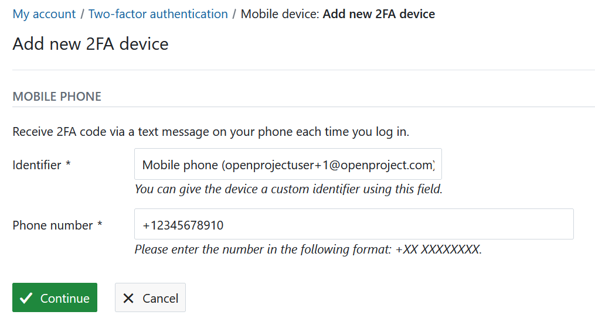

### Use your app-based authenticator

Register an application authenticator for use with OpenProject using the time-based one-time password authentication standard. Common examples are Google Authenticator or Authy.

Click the grey **Register device** button to register an authentication app. Open your app and follow the instructions to add a new application. The easiest way is to scan the QR code. Otherwise, you can register the application manually by entering the displayed details.

Click the green **Continue** button to finish the registration.

### Use the WebAuth authentication

Use Web Authentication to register a FIDO2 device (like a YubiKey) or  the secure enclave of your mobile device as a second factor. After you have chosen a name, you can click the green **Continue**  button.

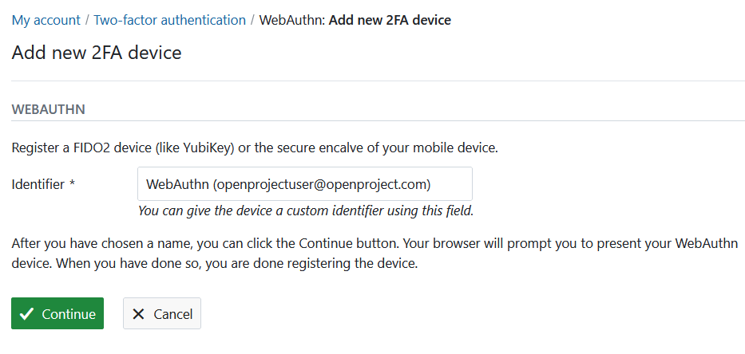

Your browser will prompt you to present your WebAuthn device (depending on your operational system and your browser, your options may vary). When you have  done so, you are done registering the device.

### Backup codes

If you are unable to access your two-factor devices, you can use a backup code to regain access to your account. Use the grey button **Generate backup codes** to generate a new set of backup codes.

If you have created backup codes before, they will be invalidated and will no longer work.

## Access tokens

To view and manage your OpenProject access tokens navigate to **My account** and choose **Access tokens** from the menu.
Access tokens allow you to grant external applications access to resources in OpenProject.

### API

API tokens allow third-party applications to communicate with this OpenProject instance via REST APIs. If you have not yet created an API token, this list will be empty. You may need admin privileges to be able to create an API token.

You can enable an API token under [*Administration -> API and webhooks*](../../system-admin-guide/api-and-webhooks/).

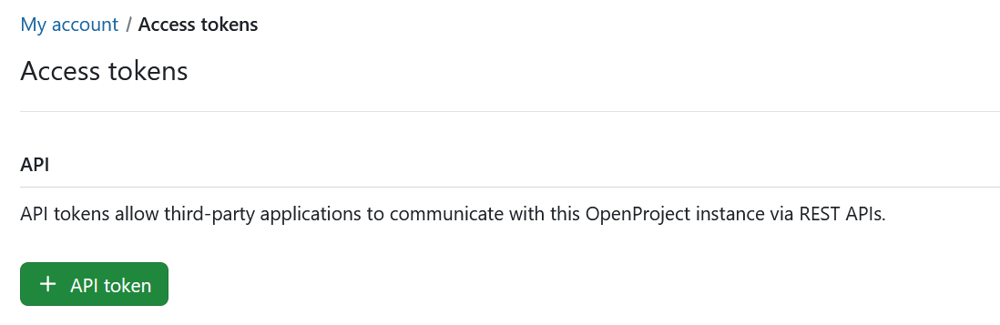

### iCalendar

iCalendar tokens allow users to subscribe to OpenProject calendars and view up-to-date work package information from external clients.
This list will be empty if you have no calendar subscriptions yet. Once you [subscribe to a calendar](../../user-guide/calendar/#subscribe-to-a-calendar), a list of all the calendars that you have subscribed to will appear here. The name of the calendar is clickable and will lead you directly to the respective calendar in OpenProject.

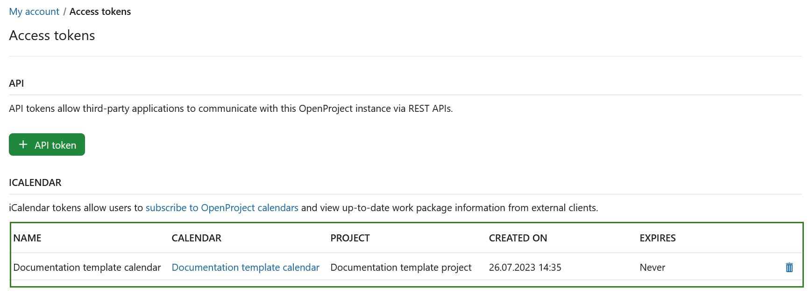

You can delete an entry in the iCalendar list by clicking on the **Delete** icon. This will trigger a warning message asking you to confirm the decision to delete.  By deleting this token you will no longer have access to OpenProject information in all the linked clients using this token.

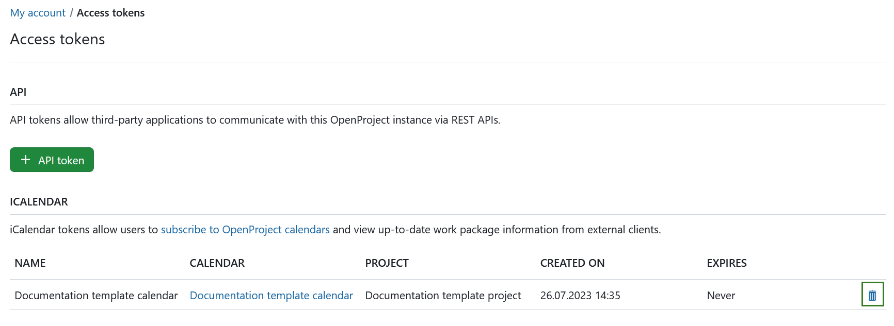

You will then see a message informing you that the the token und the iCal URL are now invalid.

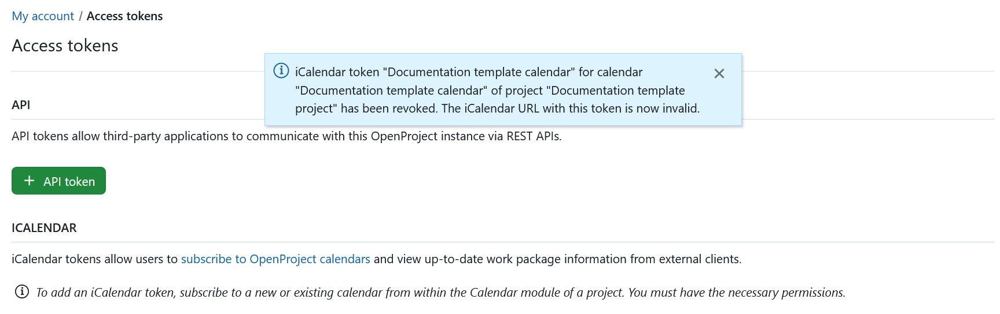

### OAUTH

OAuth tokens allow third-party applications to connect with this OpenProject instance, for example Nextcloud (see [here](../../user-guide/file-management/nextcloud-integration/) how to set up Nextcloud integration).  OAuth tokens can be created under [*Administration-> Authentication*](../../system-admin-guide/authentication/).

If no third-party application integration has been activated yet, this list will be empty. Please contact your administrator to help you set it up. Once an integration has been set up, you will see the details here and will be able to delete any OAuth tokens by clicking on the **Delete** icon.

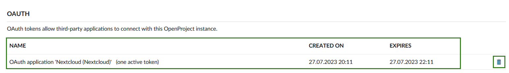

### RSS

RSS tokens allow users to keep up with the latest changes in this OpenProject instance via an external RSS reader.  You can only have one active RSS token.

Create a new token by clicking the **+RSS token** button. This will create your token and trigger a message showing you the access token.

> [!IMPORTANT]
> You will only be able to see the RSS access token once, directly after you create it. Make sure to copy it.

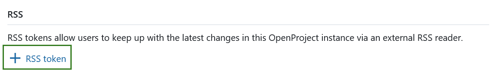

## Sessions management

To view and manage your OpenProject sessions navigate to **My account** and choose **Sessions management** from the menu.

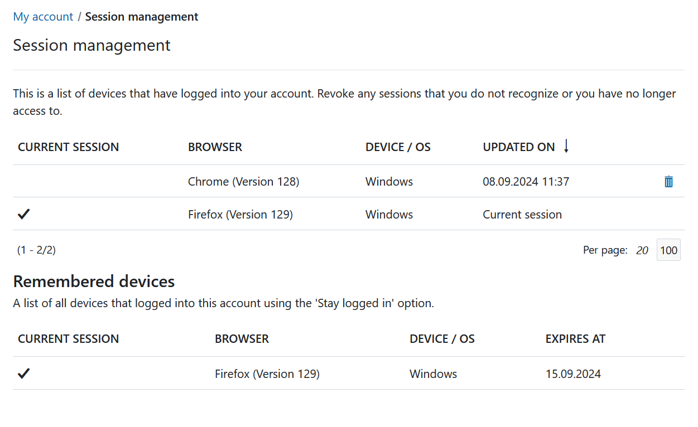

- **Current sessions**: here you can see all of your sessions. If for example you are logged into OpenProject from different browsers or devices, all will be shown in the list. Current session is the one you are currently using. You can terminate the sessions that are no longer in use. Inactive sessions will be removed from the list after 7 days (depending on the authentication settings they may become invalid earlier).
- **Remembered devices**: here you can see a list of all devices that you are logged into using the "Stay logged in" option. You will have selected that option when [logging in](../../getting-started/sign-in-registration/). Whether or not that option is available and the duration of time for which you can stay logged in depends on the authentication settings of your instance.

> [!NOTE]
> Closing a browser does not necessarily terminate the session. It might still be displayed in the list and will be reactivated if you open the browser. This depends on both your browser's and the OpenProject instance's settings.

## Notifications settings

To configure the notification settings which you receive from the system, navigate to **My account** and choose **Notifications settings** in the menu.

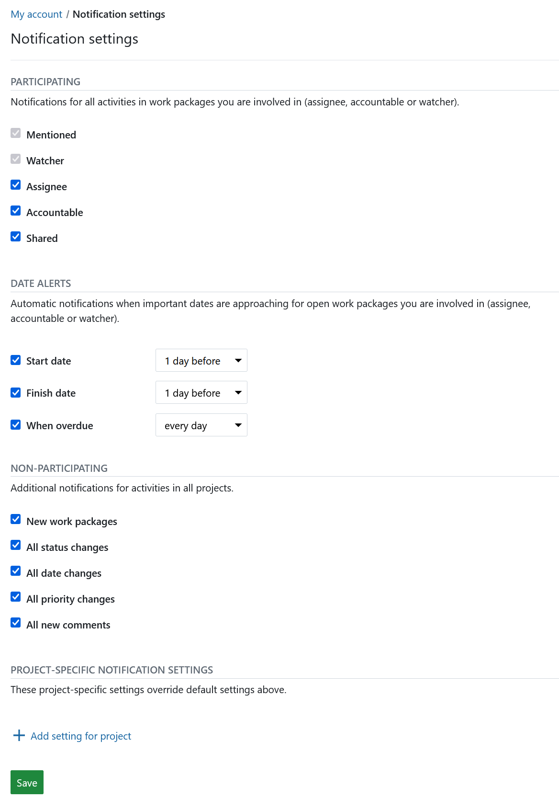

In-app notifications can be configured and customized various ways. For a detailed guide, [click here](../../user-guide/notifications/notification-settings/).

Please also see our detailed [in-app notifications](../../user-guide/notifications/) guide to gain a general understanding.

## Email reminders

To configure the email reminders which you receive from the system, navigate to **My account** and choose **Email reminders** in the menu. Your system administrator can also set them for you or change the global default settings.

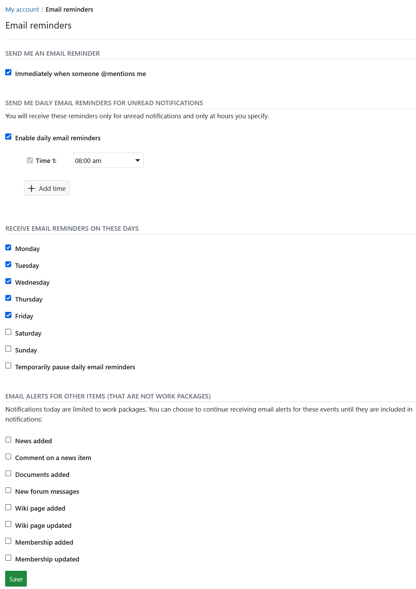

You can choose between several email reminders.

Default: Enable daily email reminders: 2am, Monday - Friday.

You can choose to receive emails immediately, or only on certain days and times, temporarily pause reminder emails, or opt for no reminders at all.

> [!IMPORTANT]
> If you have selected the *immediately when someone mentions me* option, you will only be notified once, i.e. this reminder will not be duplicated in a daily reminder.

You can also opt-in to receive **email alerts for other items (that are not work packages)** whenever one of your project members:

- **News added** - ...adds or updates news in the [News Page](../../user-guide/news/)
- **Comment on a news item** - ...adds a comment on a news item
- **Documents added** - ...adds a document somewhere in the project (i.e. a work package)
- **New forum message** - ...sends a new message into the [Forum](../../user-guide/forums/)
- **Wiki page added** - ...adds a new [Wiki page](../../user-guide/wiki/)
- **Wiki page updated** - ...updates a [Wiki page](../../user-guide/wiki/)
- **Membership added** - ...adds you to a new [Work package](../../getting-started/work-packages-introduction/)
- **Membership updates** - ...updates your membership associations

## Set an avatar

To change your profile picture in OpenProject you can set an avatar in your **My account** settings. Navigate to **Avatar** in the menu.

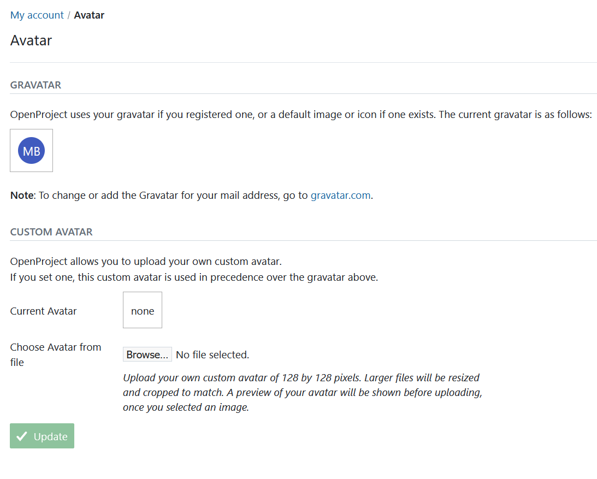

OpenProject uses Gravatar as default profile image. It displays a preview of your avatar.

Also, you can upload a **Custom Avatar** by choosing a Avatar to be uploaded from a file. Press the blue **Update** button to change your profile picture.

> [!TIP]
> The optimum size to upload a new profile picture is 128 by 128 pixel. Larger files will be cropped.

## Delete account

You can delete your own account in **My account**.

To delete your account, select **Delete account** from the side menu and enter your login to confirm the deletion.

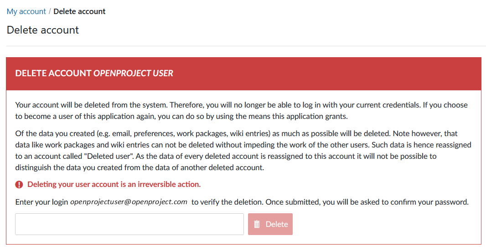

> [!WARNING]
> Deleting a user account is permanent and cannot be reversed.

If you cannot see the entry **Delete account** in the **My account** side menu, make sure the option "Users allowed to delete their account" is [activated in the administration](../../system-admin-guide/users-permissions/settings/#user-deletion).
