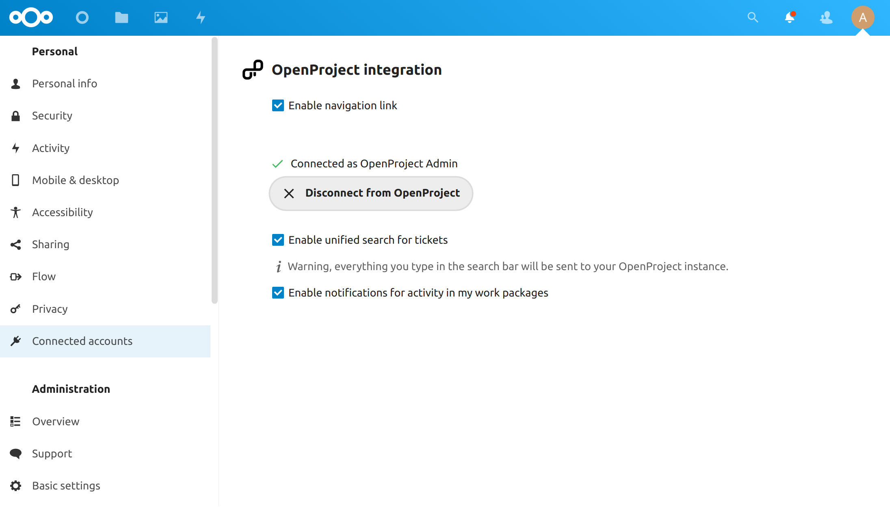

---
sidebar_navigation:
  title: Nextcloud integration
  priority: 600
description: Nextcloud integration
keywords: integrations, apps, Nextcloud

---

# Nextcloud integration

Starting with OpenProject 12.2, you can now use [Nextcloud](https://nextcloud.com/), the world’s most-deployed on-premises collaborative file storage platform, together with [OpenProject](https://www.openproject.org/), the leading free and open source project management and collaboration software. **Data sovereignty** and **open source** are important core values to both OpenProject and Nextcloud, and form the foundational common ground for this integration.

This integration allows you to link files and folders in Nextcloud with work packages in OpenProject, which makes it possible see all files related to a work package (in Open Project) and all work packages related to a file (in Nextcloud). As a project member, you no longer need to lose time time trying to find the right files to be able to complete your tasks, and the integration of OpenProject-specific notifications on Nextcloud dashboard ensures that no change goes unnoticed. 

The integration is available starting with Nextcloud 22 and OpenProject 12.2. To be able to use this integration, the administrator of your instance should have completed the [Nextcloud integration setup](../../system-admin-guide/integrations/nextcloud).

## Benefits of the integration

The integration enables you to perform multiple actions in both Nextcloud and OpenProject:

- Link your Nextcloud files to OpenProject work packages (on Nextcloud)
- Check which work packages are related to linked files
- Keep an eye on relevant project updates related to linked files via the Nextcloud Dashboard
- View all files linked to a specific work package (on OpenProject)
- Retain close control of content to avoid risk of non-compliance or data leaks

## How to use this integration

As a user of both Nextcloud and OpenProject, you can benefit from this integration in both platforms:

- **In OpenProject:**
  In addition to listing files attached to a work package, the _Files_ tab now also shows you Nextcloud files that are linked to the current work package. Secondary actions on each file allow you to directly **open or download the file, show the containing folder in Nextcloud or remove the link**.
  

  

  > **Note:** In this version of the integration, you can only link files to work packages on Nextcloud; adding a new link to a Nextcloud file via the OpenProject interface is not yet possible, but will be possible in the near future.
  

- **In Nextcloud:**
  On the file or folder that you want to link to a work package click on the three dots and then click on _Details_.
  
  
  
  In the _Details_ side panel, click on the the _OpenProject_ tab. This tab lets you link work packages in OpenProject to the current file, and will list all linked work packages. When nothing is yet linked, the list will be empty. To link the file to work package for the first time, use the search bar to search for the work packages in your OpenProject instance, and click on one to link it. 
  
  This linked file will then appear underneath the search bar, and will appear on the Files tab of the work package in OpenProject.
  
  Once a work package is linked to a file, you can always unlink it by clicking on the **unlink** icon.

  

  

  In addition to actions related to individual files, can also choose to display the OpenProject widget on your Nextcloud dashboard in order to keep an eye on the the latest changes and updates to linked work packages:
  

  

  Additionally, there are find three additional features related to the integration that you can enable in Nextcloud. In your personal settings page, under *Connected accounts* you will find these options:
  
  - **Enable navigation link** displays a link to your OpenProject instance in the Nextcloud header 
  - **Enable unified search for tickets** allows you to access OpenProject work packages via the universal search bar 
  - **Enable notifications for activity in my work packages** sends you notifications when there are updates to linked OpenProject work packages

  

  

  

## **Next steps for the integration**

Further integration efforts are under way. In the near future, you will be able to link and upload files to Nextcloud directly from the OpenProject interface.

## Possible errors and troubleshooting

- **OpenProject - No permissions to see the file:** If you are unable to see the details of a file or are unable to open some of the linked files due to issues with permissions, you will be able to see the name, time of last modification and the name of the modifier but you will not be able to perform any further actions. To open or access these files, you will need to contact your Nextcloud administrator or the creator of the file so that they can grant you the necessary permissions.
  

- **OpenProject - User not logged in to Nextcloud:** You might see this error if you are not logged in to Nextcloud. You will still be able to see the list of linked files, but not perform any actions. To remedy this, simply log in to your Nextcloud account to restore full functionality.
  

- **OpenProject - Connection error:** You will see this error when your OpenProject instance is unable to connect to your Nextcloud instance for any number of reasons. Your best course of action is to get in touch with the administrator of your OpenProject and Nextcloud instances to identify and to resolve the issue.
  

- **OpenProject - File fetching error:** In rare ocassions, it is possible for the integration to not be able to fetch all the details of all linked files. A simple page refresh should solve the issue, but should the error persist, please contact administrator of your OpenProject and Nextcloud instances.

  

- **Nextcloud - Project notifications are not displayed:** If the notifications are not properly displayed, please ensure that _Cron_ is activated in the background jobs section of Nextcloud settings.
  
