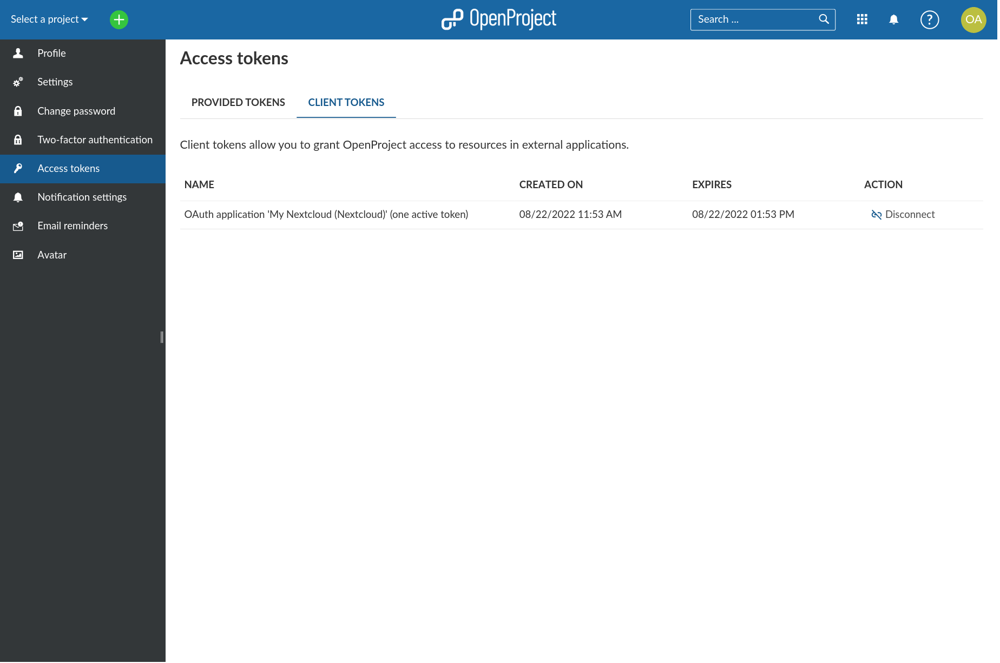

---
sidebar_navigation:
  title: Nextcloud integration user guide
  priority: 600
description: Using the Nextcloud integration to link/unlink files and folders to work packages, viewing and downloading files and troubleshooting common errors
keywords: integration, apps, Nextcloud, user

---

# Nextcloud integration user guide

Starting with OpenProject 12.2, you can now use [Nextcloud](https://nextcloud.com/) as an integrated file storage in OpenProject.

This integration makes it possible for you to:

- Link files and folders stored in Nextcloud with work packages in OpenProject
- View, open and download files and folder linked to a work package via the Files tab
- View all work packages linked to a file
- View OpenProject notifications via the Nextcloud dashboard

> Note: The the minimum requirements for this integration are Nextcloud version 22 (or above) and OpenProject version  12.2 (or above). To be able to use Nextcloud as a file storage in your project, the administrator of your instance should first have completed the [Nextcloud integration setup](../../system-admin-guide/integrations/nextcloud).

| Topic                                                                                                     | Description                                                                               |
|-----------------------------------------------------------------------------------------------------------|:------------------------------------------------------------------------------------------|
| [Connecting your OpenProject and Nextcloud accounts](#connecting-your-openproject-and-nextcloud-accounts) | How to connect your Nextcloud and OpenProject accounts to be able to use this integration |
| [Using the Nextcloud integration](#using-the-nextcloud-integration)                                       | How to link/unlink files and folders to work packages and view and download linked files  |
| [Next steps for the integration](#next-steps-for-the-integration)                                         | What is planned in future releases                                                        |
| [Possible errors and troubleshooting](#possible-errors-and-troubleshooting)                               | Common errors and how to troubleshoot them                                                |

## Connecting your OpenProject and Nextcloud accounts

To begin using this integration, you will need to first connect your OpenProject and Nextcloud accounts. To do this, open any work package in a project where a Nextcloud file storage has been added and enabled by an administrator and follow these steps:

1. Go to the Files tab and click on **Nextcloud login**.
   

2. You will see a Nextcloud screen asking you to log in before granting OpenProject access to your Nextcloud account. You will also see a security warning, but since you are indeed trying to connect the two accounts, you can safely ignore it. Click on **Log in** and enter your Nextcloud credentials.
   

   

3. Once you are logged in to Nextcloud, click on **Grant access** to confirm you want to give OpenProject access to your Nextcloud account.
   

4. You will now will be redirected back to OpenProject, where you will be asked to grant Nextcloud read and write access to your OpenProject account via the API. This is necessary for the integration to function. Click on**Authorize**.
   

5. You have now completed the one-time process to connect your two accounts and will be directed back to the original work package, where you can now view and open any Nextcloud files that are already linked, or start linking new ones.

> **Note:** To disconnect the link between your OpenProject and Nextcloud accounts, head on over to Nextcloud and navigate to _Settings → Connected accounts_. There, clicking **Disconnect from OpenProject** button. To re-link the two accounts, simply follow the above instructions again.

## Disconnecting your OpenProject account from Nextcloud

You can disconnect you OpenProject account from the logged-in Nextcloud account if you wish. It might be that you were
logged in with the wrong OpenProject account and accidentally connected it to you Nextcloud account. In order to do that
there is an option within the settings page of your OpenProject account called **Client Tokens**:

Here you can see all connection to any Nextcloud storages that are active at the current time. Click the **disconnect**
link next to the storage you want to disconnect.

Now you can had back to your project and log in again.

## Using the Nextcloud integration

The following video gives you a short overview of how to use this integration:

As a user of both Nextcloud and OpenProject, you can benefit from this integration in both platforms:

- **In OpenProject:**
  In addition to listing files attached to a work package, the **Files** tab now also shows you Nextcloud files that are linked to the current work package. Secondary actions on each file allow you to directly **open or download the file, show the containing folder in Nextcloud or remove the link**.
  

  

  > **Note:** In this version of the integration, you can only link files to work packages on Nextcloud; adding a new link to a Nextcloud file via the OpenProject interface is not yet possible, but will be possible in the near future.
  
- **In Nextcloud:**
  On the file or folder that you want to link to a work package click on the three dots and then click on **Details**.
  
  
  
  In the **Details** side panel, click on the the **OpenProject** tab. This tab lets you link work packages in OpenProject to the current file, and will list all linked work packages. When nothing is yet linked, the list will be empty. To link the file to work package for the first time, use the search bar to search for the work packages in your OpenProject instance, and click on one to link it.
  
  
  
  

  This linked file will then appear underneath the search bar, and will appear on the Files tab of the work package in OpenProject.

  

  Once a work package is linked to a file, you can always unlink it by clicking on the **unlink** icon.
  
  
  
  In addition to actions related to individual files, you can also choose to display the OpenProject widget on your Nextcloud dashboard in order to keep an eye on the the latest changes and updates to linked work packages:
  
  
  
  
  Additionally, there are three additional features related to the integration that you can enable in Nextcloud. In your personal settings page, under *Connected accounts*, you will find these options:

  - **Enable navigation link** displays a link to your OpenProject instance in the Nextcloud header 
  - **Enable unified search for tickets** allows you to access OpenProject work packages via the universal search bar 
  - **Enable notifications for activity in my work packages** sends you notifications when there are updates to linked OpenProject work packages

  
  
  
  
  

## **Next steps for the integration**

Further integration efforts are under way. In the near future, you will be able to link and upload files to Nextcloud directly from the OpenProject interface.

## Possible errors and troubleshooting

- **OpenProject - No permissions to see the file:** If you are unable to see the details of a file or are unable to open some of the linked files due to issues with permissions, you will be able to see the name, time of last modification and the name of the modifier but you will not be able to perform any further actions. To open or access these files, you will need to contact your Nextcloud administrator or the creator of the file so that they can grant you the necessary permissions.
  

- **OpenProject - User not logged in to Nextcloud:** You might see this error if you are not logged in to Nextcloud. You will still be able to see the list of linked files, but not perform any actions. To remedy this, simply log in to your Nextcloud account to restore full functionality.
  

- **OpenProject - Connection error:** You will see this error when your OpenProject instance is unable to connect to your Nextcloud instance for any number of reasons. Your best course of action is to get in touch with the administrator of your OpenProject and Nextcloud instances to identify and to resolve the issue.
  

- **OpenProject - File fetching error:** In rare occasions, it is possible for the integration to not be able to fetch all the details of all linked files. A simple page refresh should solve the issue, but should the error persist, please contact administrator of your OpenProject and Nextcloud instances.

  

- **Nextcloud - Project notifications are not displayed:** If the notifications are not properly displayed, please ensure that _Cron_ is activated in the background jobs section of Nextcloud settings.
  
