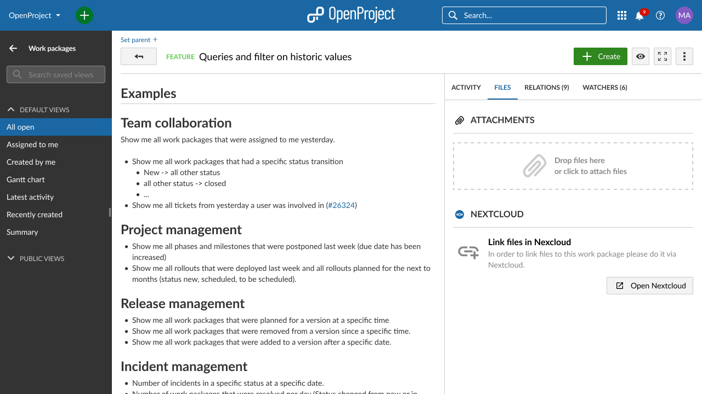
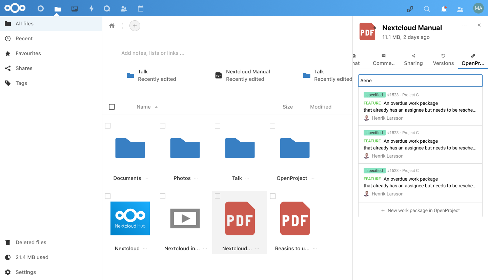
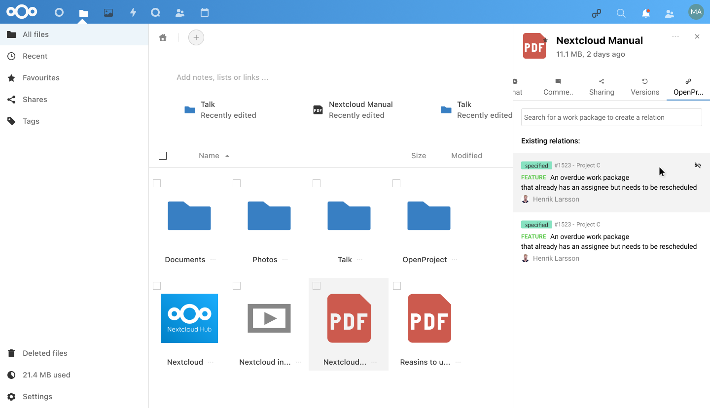
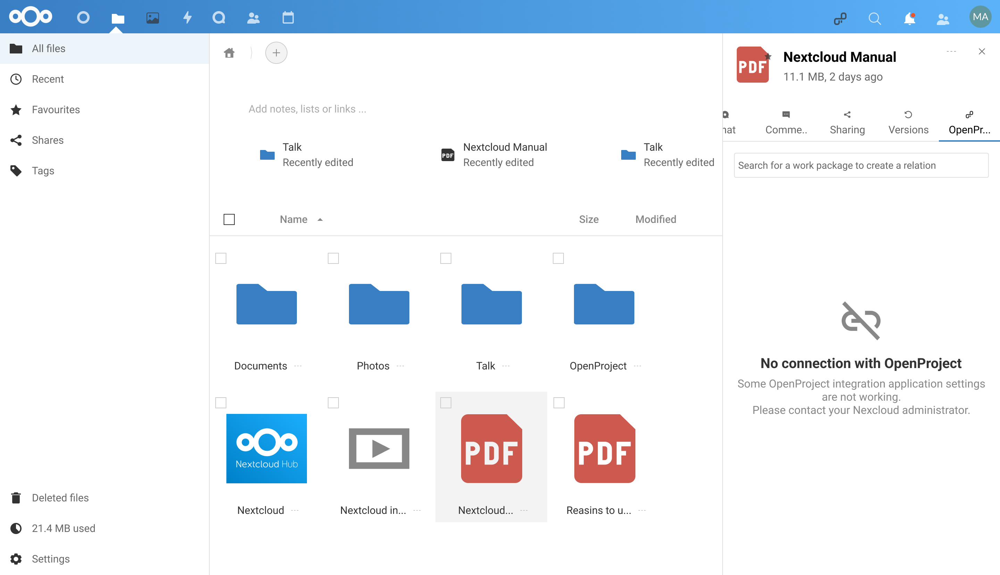

---
sidebar_navigation:
  title: Nextcloud integration
  priority: 600
description: Nextcloud integration
keywords: integrations, apps, Nextcloud

---

# Nextcloud integration

[Nextcloud](https://nextcloud.com/), the worlds’ most deployed on-premises content collaboration platform, and [OpenProject](https://www.openproject.org/), the leading free and open source project management software, join forces. For both Nextcloud and OpenProject **data sovereignty** and **open source** are an integral part of their business strategy and thus the foundation for their alliance.

OpenProject and Nextcloud together combine project management and content collaboration and complement each other’s services.
The collaboration of these two communities allows the users to link files and folders in Nextcloud with work packages in OpenProject: in OpenProject you can see all files related to a work package, and in Nextcloud you can find all work packages related to a file. Your project teams gain productivity as they clearly know where to find and store the files that they need for finishing a work package. Further it extends the Nextcloud dashboard with a widget for personal notifications from OpenProject. The app can also extend the search function in Nextcloud to find work packages in OpenProject. Also, users will not risk compliance and data leaks by losing control over their content and can now even easily combine both systems.

The integration is available starting with Nextcloud 22 and OpenProject 12.2. To be able to use this integration the administrator of your instance should have completed the [Nextcloud integration setup](../../system-admin-guide/integrations/nextcloud) configuration.

## Top benefits of the integration

The integration enables users to perform multiple actions in both Nextcloud and OpenProject:

- Link their Nextcloud files to OpenProject work packages via the Nextcloud interface.
- Check which work packages are related to each file in Nextcloud.
- Keep an eye on ongoing project activities directly in their Nextcloud instance 
- Have a clear list view of the files linked to a specific work package in OpenProject.
- Avoid losing control of your content so there is no compliance risks or data leaks.

## How can I use this integration?

As a user of both Nextcloud and OpenProject you can use this integration now in the two platforms:

- **In OpenProject:**
  Using the files tab you can see the attachments to a work package but also the files that had been linked from Nextcloud to OpenProject. On top of that you are able to perform four different actions to the specific files: open, download, open location and remove link.
  

  

  **IMPORTANT NOTE:** In this version of the integration linking Nextcloud files in OpenProject is not possible. In the near future users will be able to link their documents directly from the files tab.

  - **In Nextcloud:**
    By opening the information split screen of any file you will be able to access the OpenProject tab in Nextcloud. In this tab, you will be able to search for the specific work package you want to link to that file. Once a work package is linked you can always unlink using the action on hover **unlink** icon.

    

    

    

    On top of the file related actions, you can also display the widget of OpenProject in the Nextcloud dashboard in order to control the latest changes and updates to your work packages:
    

    

    Also, in your personal settings in Connected accounts, you can activate three extra features for your Nextcloud and OpenProject integration: **Enable navigation link** to display a link to your OpenProject instance in the header navigation, **Enable unified search for tickets** to include OpenProject information in the the built-in universal search and **Enable notifications for activity in my work packages** to receive Nextcloud notifications related with your OpenProject work packages.

    

    

    

## **Next steps for the integration**

Further integration efforts are under way. The next steps will be allowing the users to perform the actions of linking and uploading files to Nextcloud directly from OpenProject.

## Possible error cases

- **OpenProject - No permissions to see the file:** There is a possibility that the users doesn't have permissions to see the details or open some of the files linked to this work packages. In that case, the user will still be able to see the name, last modification time and modifier but will not be able to perform any action related to that file. If you need to open that file please contact your Nextcloud administrator or the creator of the file so they can give you access to it.
  

- **OpenProject - User not logged in Nextcloud:** Please open the login page of Nextcloud instance and log in. In this case you will still be able to see the files linked to this work package but not performing actions to them.
  

- **OpenProject - Connection error:** In case there is a technical error with the connection that is not allowing OpenProject to connect to Nextcloud, in that case please contact your instance administrator.
  

- **OpenProject - Files fetching error:** Sometimes it could happen that there is an error fetching all the details of the files linked to the work package. In this case you can try to reload and if the error persist please contact your instance administrator.

  

- **Nextcloud - Connection error:** In case there is a technical error with the connection that is not allowing Nextcloud to connect to OpenProject, in that case please contact your instance administrator.**
  

- **Nextcloud - Project notifications are not displayed:** Please check the following in your Nextcloud basic settings: in the background jobs, Cron must be activated.
  