---
sidebar_navigation:
  title: Nextcloud integration
  priority: 600
description: Using the Nextcloud integration to link/unlink files and folders to work packages, viewing and downloading files and troubleshooting common errors
keywords: integration, apps, Nextcloud, user
---

# Using the Nextcloud integration

Starting with OpenProject 12.2, you can use [Nextcloud](https://nextcloud.com/) as an integrated file storage in OpenProject.

This integration makes it possible for you to:

- Link files and folders stored in Nextcloud with work packages in OpenProject
- View, open and download files and folder linked to a work package via the Files tab
- View all work packages linked to a file
- View OpenProject notifications via the Nextcloud dashboard

> Note: The minimum requirements for this integration are Nextcloud version 22 (or above) and OpenProject version  12.2 (or above). To be able to use Nextcloud as a file storage in your project, the administrator of your instance should first have completed the [Nextcloud integration setup](../../system-admin-guide/integrations/nextcloud).

| Topic                                                        | Description                                                  |
| ------------------------------------------------------------ | :----------------------------------------------------------- |
| [Connecting your OpenProject and Nextcloud accounts](#connecting-your-openproject-and-nextcloud-accounts) | How to connect your Nextcloud and OpenProject accounts to be able to use this integration |
| [Linking files and folders to work packages](#linking-files-and-folders-to-work-packages) | How to link files and folders to work packages and view and download linked files |
| [Unlinking files and folders](#unlinking-files-and-folders)  | How to remove the link between a work package and a Nextcloud file or folder |
| [Permissions and access control](#permissions-and-access-control) | Who has access to linked files and who doesn't               |
| [Possible errors and troubleshooting](#possible-errors-and-troubleshooting) | Common errors and how to troubleshoot them                   |

## Connecting your OpenProject and Nextcloud accounts

To begin using this integration, you will need to first connect your OpenProject and Nextcloud accounts. To do this, open any work package in a project where a Nextcloud file storage has been added and enabled by an administrator and follow these steps:

1. Go to the Files tab and, under the "Nextcloud" header, click on **Nextcloud login**.
   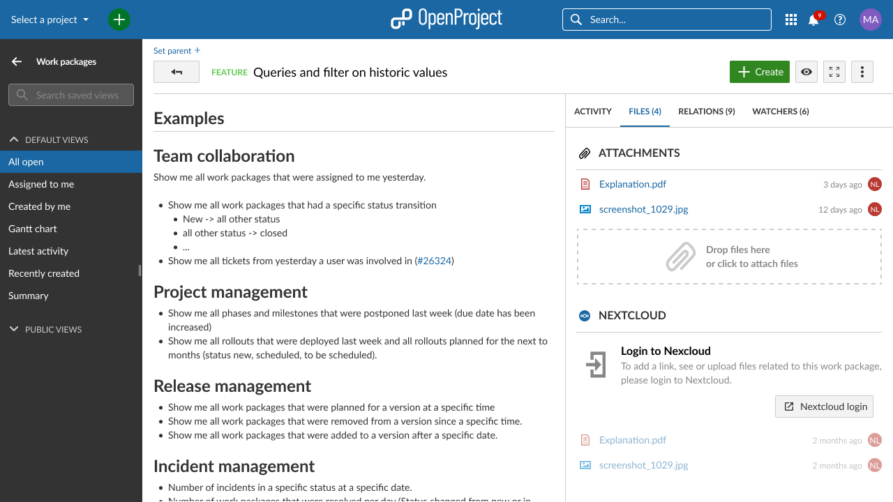

2. You will see a Nextcloud screen asking you to log in before granting OpenProject access to your Nextcloud account. You will also see a security warning, but since you are indeed trying to connect the two accounts, you can safely ignore it. Click on **Log in** and enter your Nextcloud credentials.

   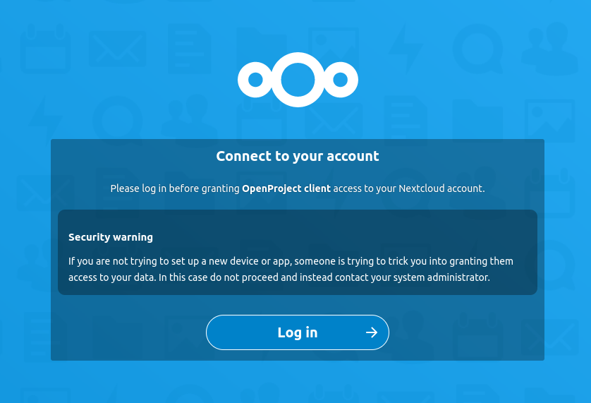
   
   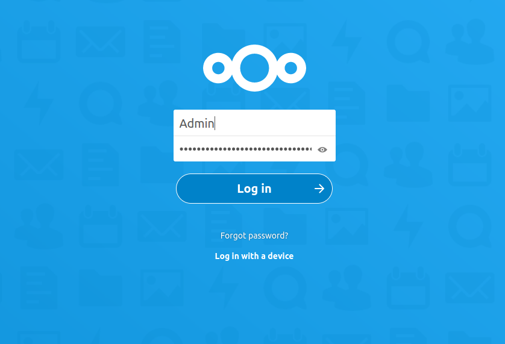

3. Once you are logged in to Nextcloud, click on **Grant access** to confirm you want to give OpenProject access to your Nextcloud account.

   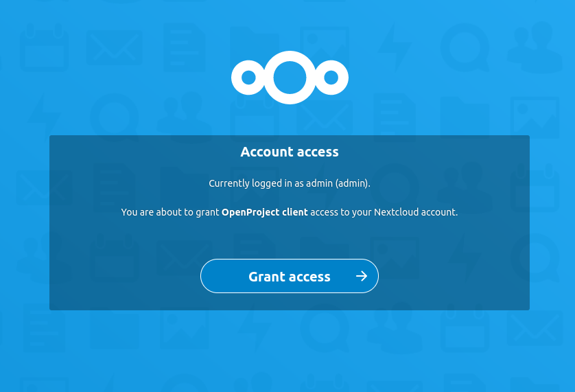

4. You will now will be redirected back to OpenProject, where you will also be asked to grant Nextcloud read and write access to your OpenProject account via the API. This is necessary for the integration to function. Click on **Authorize**.

   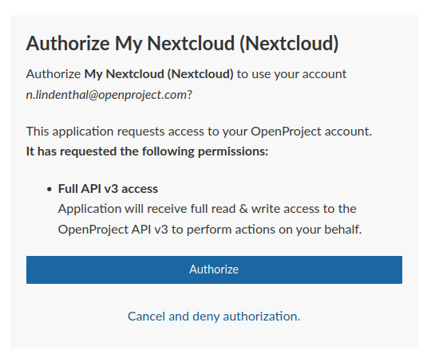

5. The one-time process to connect your two accounts is complete. You will now be directed back to the original work package, where you can view and open any Nextcloud files that are already linked, or start linking new ones.

> **Note**: To disconnect the link between your OpenProject and Nextcloud accounts, head on over to Nextcloud and navigate to _Settings → Connected accounts_. There, click *Disconnect from OpenProject* button. To re-link the two accounts, simply follow [the above instructions](#connecting-your-openproject-and-nextcloud-accounts) again.

## Linking files and folders to work packages

### In OpenProject

This video will give you an overview of how to link existing files and upload new files from OpenProject to Nextcloud (English only):

In addition to listing files directly attached to a work package, the **Files** tab shows your Nextcloud files that are linked to the current work package. Hovering on any linked file with your mouse will give you options to  **open or download the file, show the containing folder in Nextcloud or remove the link**.

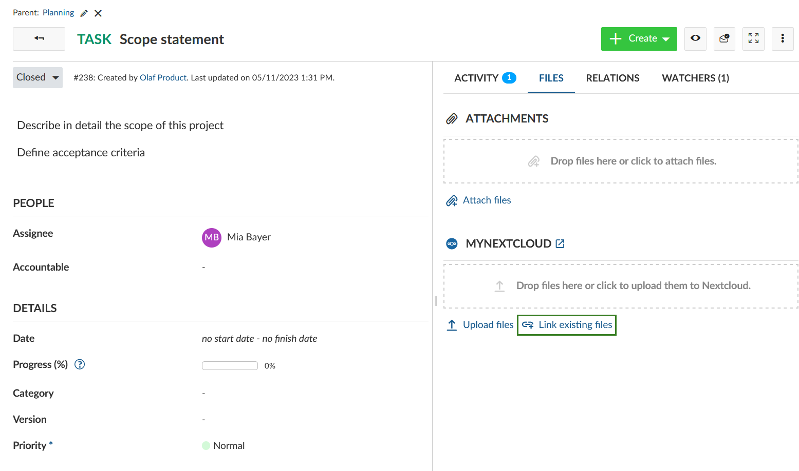

To link a Nextcloud file to the current work package, you can either:

- select a file from your computer, which will be uploaded to Nextcloud and linked to this work package
- select an existing file in Nextcloud to link to

#### Upload and link file(s)

If the file you want to link has not yet been uploaded to Nextcloud, you can do so by clicking on the **Upload files** link. 

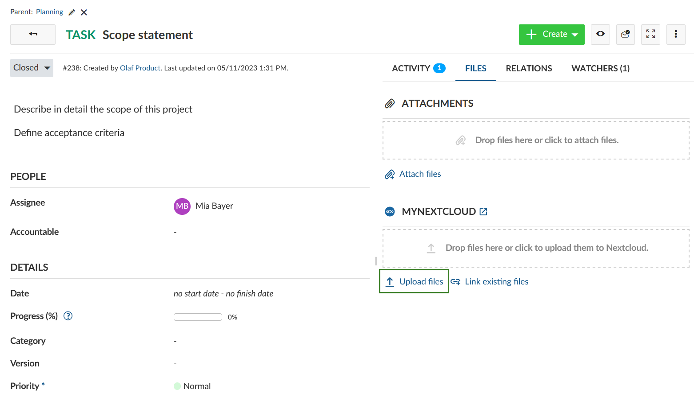

You will then be prompted to select a file (or multiple files) on your computer that you want to upload to Nextcloud. 

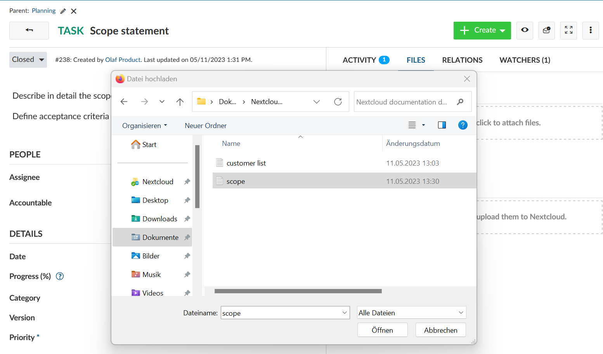

Alternatively, you can also simply drag a file or folder on your computer to this area (under the name of your Nextcloud file storage) and drop it in the drop zone that appears.

Once you have selected or dropped the files you would like to upload, you will need to select a folder on Nextcloud to which they should be stored. 

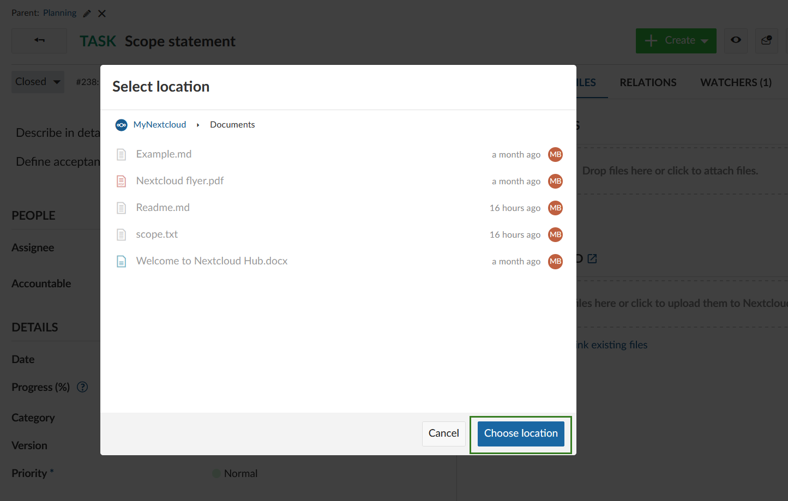

You can click on folders you see to navigate to them. A helpful breadcrumb shows you where you are in the folder hierarchy. 

To navigate one level up or to go back to the root, simply click on the relevant parent in the breadcrumb. 

> **Info**: If you have navigated particularly deep (over 4 levels), intermediate levels might be collapsed to save space, but you'll always be able to navigate back to the immediate parent or the root to go backwards.

To save the files you uploaded to the currently open folder, click on the **Choose location** button.

The selected file is uploaded to your Nextcloud instance and linked to the current work package. It appears under the name of the file storage.

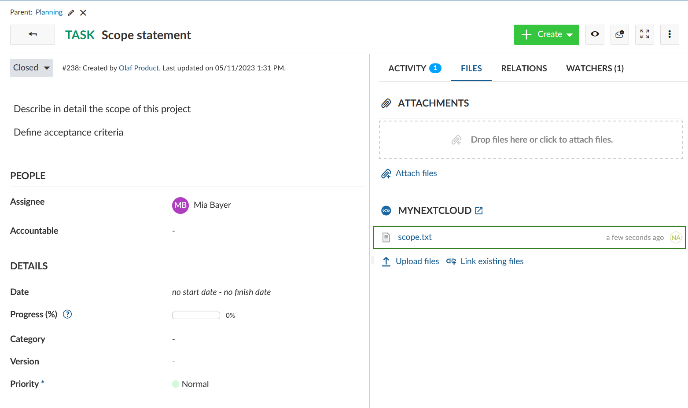

#### Link existing files

If the file you want to link already exists on Nextcloud, you simply have to create the link.

To do so, start by clicking on **Link existing file**.

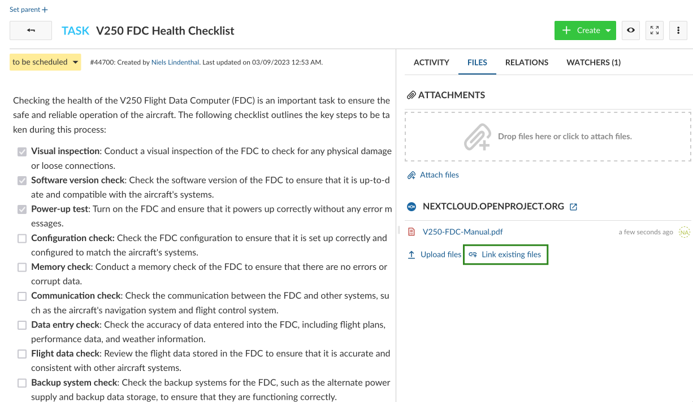

A file picker will appear, displaying all the files and folders on your Nextcloud instance that you have permission to see.

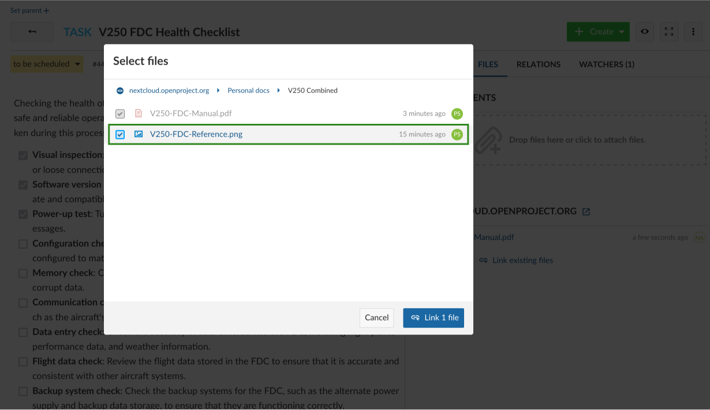

To link a certain file or folder with this work package, click on the file or folder so the checkmark to the left of it is checked.

If the file you're looking for is inside a folder or multiple levels of folders, you can click on each one to navigate to it. A helpful breadcrumb shows you where you are in the folder hierarchy. 

To navigate one level up or to go back to the root, simply click on the relevant parent in the breadcrumb. 

> **Info**: If you have navigated particularly deep (over 4 levels), intermediate levels might be collapsed to save space, but you'll always be able to navigate back to the immediate parent or the root to go backwards.

Once you have selected the file(s) or folder(s) you wish to link to the work package, click on the **Link # files** button. The number on the button will represent the number of files/folders you have selected.

> **Info**: To avoid the button being too long, it will say "Link 3 files" even if you have selected 2 files and 1 folder.

The file is now linked to this work package and is visible in the list:

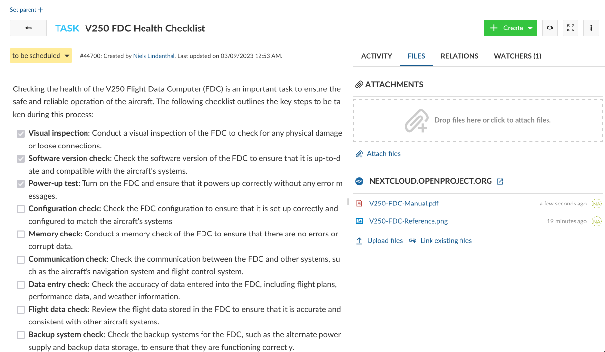

### In Nextcloud

This video will give you an overview how to link files and folder from Nextcloud to OpenProject (English only).

On the file or folder that you want to link to a work package, click on the *three dots → **Details**.*

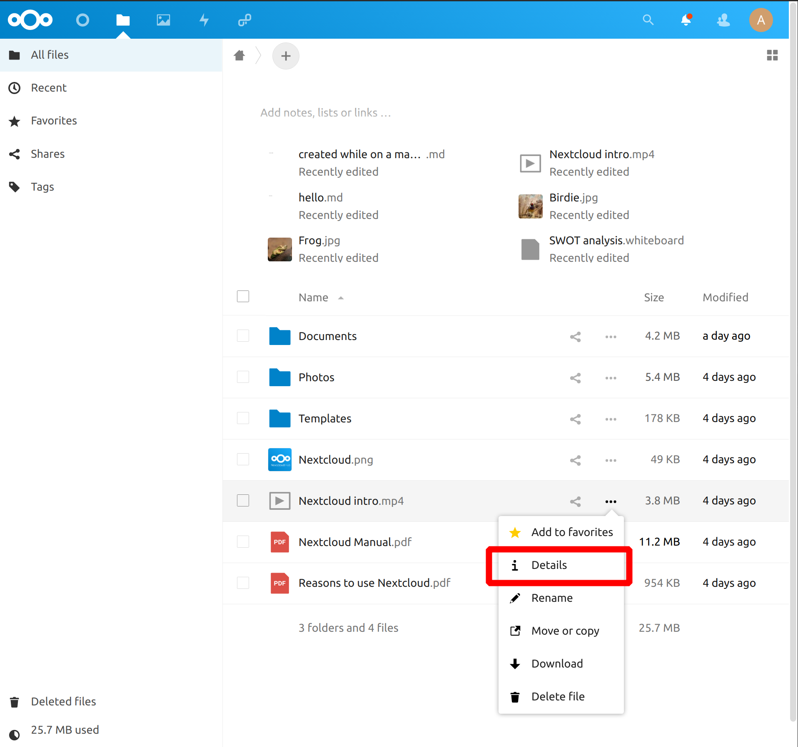

In the **Details** side panel, click on the the **OpenProject** tab. This tab lets you link work packages in OpenProject to the current file, and will list all linked work packages. When nothing is yet linked, the list will be empty. To link this file to a work package in OpenProject for the first time, use the search bar to find the correct work package (you can search either using a word in the title of the work package, or simply enter the work package ID) and click on it.

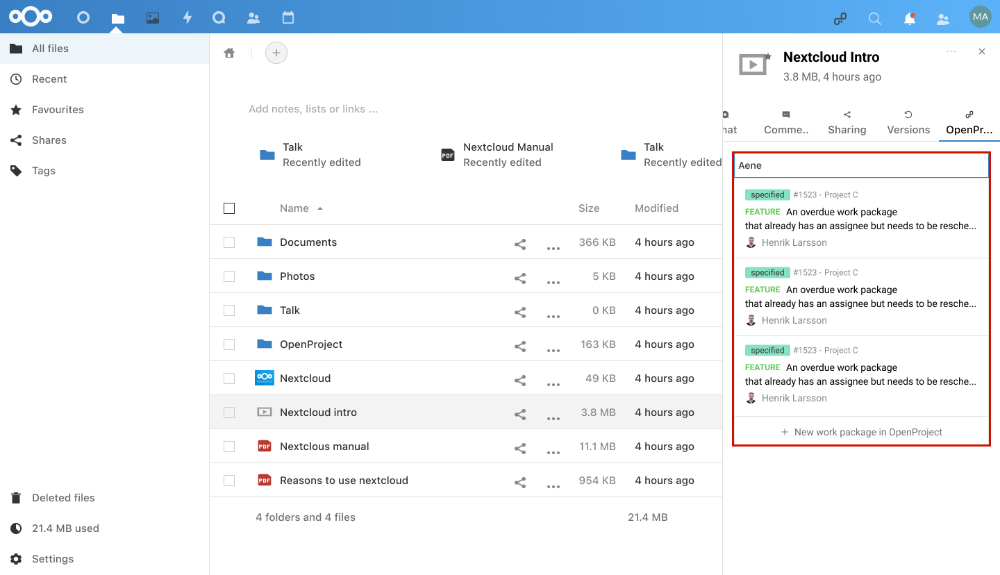

This linked file will then appear underneath the search bar. Doing so will also automatically add the file to the Files tab of the corresponding work package(s) in OpenProject.

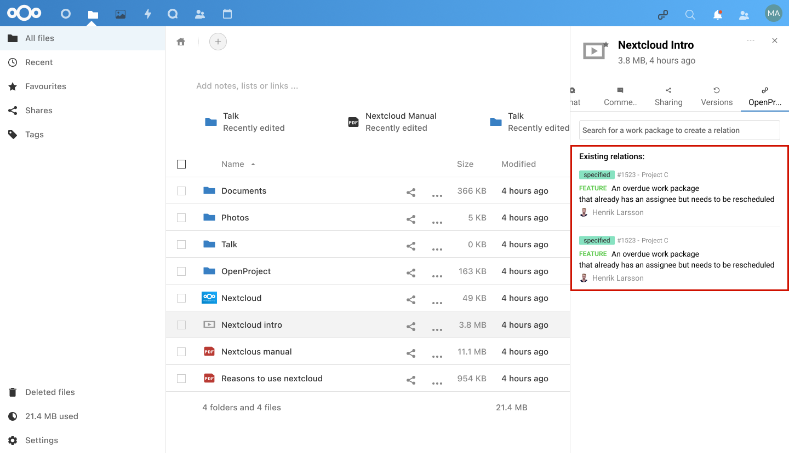

Once a work package is linked to a file, you can always unlink it by clicking on the **unlink** icon.

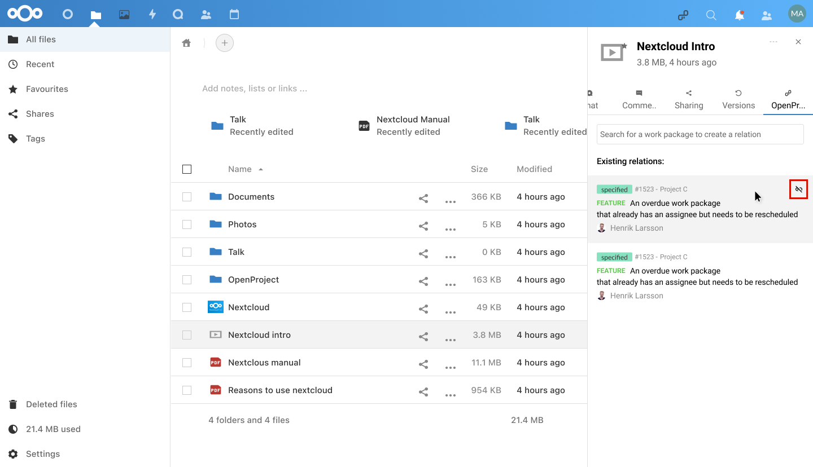

In addition to actions related to individual files, you can also choose to display the OpenProject widget on your Nextcloud dashboard in order to keep an eye on your OpenProject notifications.

There are two additional features related to the integration that you can enable in Nextcloud. In your personal settings page, under **OpenProject**, you will find these options:

- **Enable navigation link** displays a link to your OpenProject instance in the Nextcloud header 
- **Enable unified search for tickets** allows you to search OpenProject work packages via the universal search bar in Nextcloud

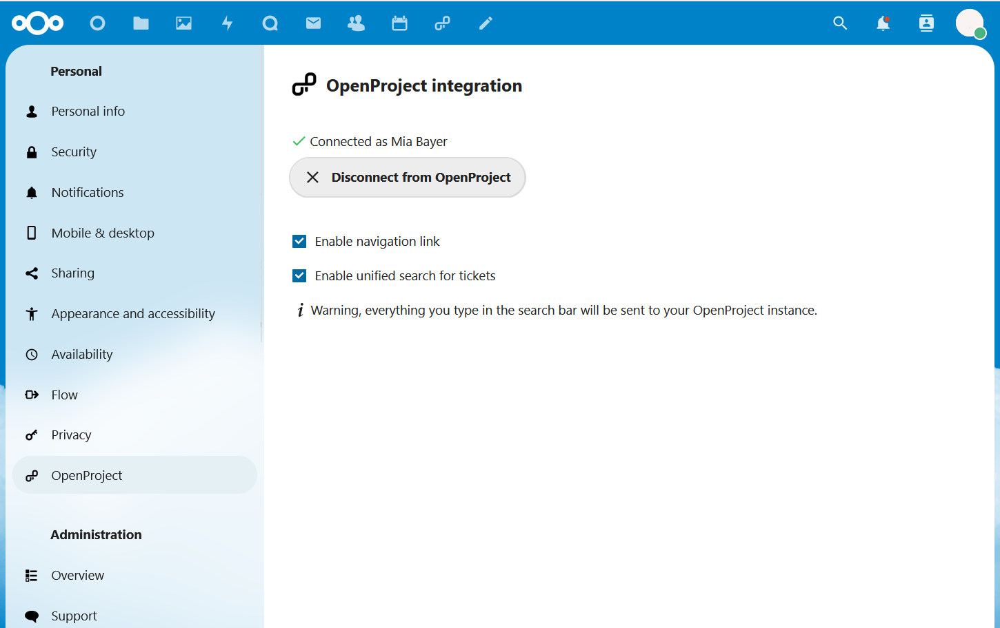

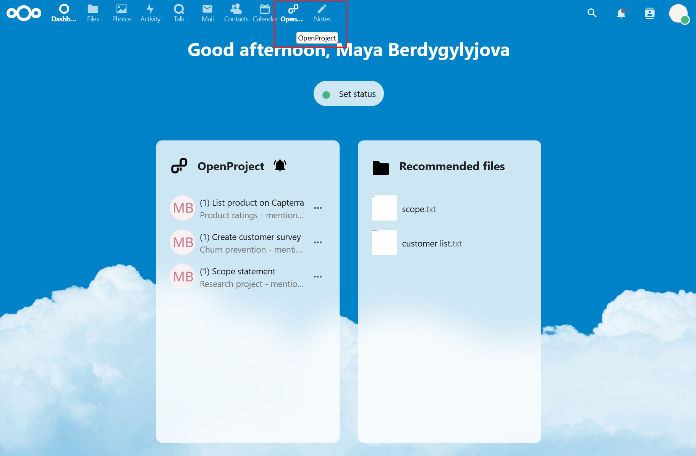

> **Note:** In this version of the integration, you can only link files to work packages on Nextcloud; adding a new link to a Nextcloud file via the OpenProject interface is not yet possible, but will be possible in the near future.

## Unlinking files and folders

If you wish to unlink any linked file or folder, hover to it in the list of linked Files and click on the **Unlink** icon next to the _Delete_ icon.

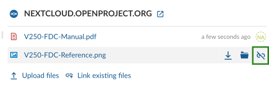

You will be asked to confirm that you want to unlink. Click on **Remove link** to do so.

> **Info**: Unlinking a file or folder simply removes the connection with this work package; the original file or folder will _not_ be deleted or affected in any way. The only change is it will no longer appear in the Files tab on OpenProject, and the work package will no longer be listed in the "OpenProject" tab for that file on Nextcloud.

## Permissions and access control

When a Nextcloud file or folder is linked to a work package, an OpenProject user who has access to that work package will be able to:

- See the name of the linked file or folder
- See when it was last modified (or created, if it it has not yet been modified)
- See who last modified it (or who created it, if it has not yet been modified)

However, all available actions depend on permissions the OpenProject user (or more precisely, the Nextcloud account tied to that user) has in Nextcloud. In other words, a user who does not have the permission to access the file in Nextcloud will also *not* be able to open, download, modify or unlink the file in OpenProject.

## Possible errors and troubleshooting

#### No permission to see this file 

If you are unable to see the details of a file or are unable to open some of the files linked to a work package, it could be related to your Nextcloud account not having the necessary permissions. In such a case, you will be able to see the name, time of last modification and the name of the modifier but you will not be able to perform any further actions. To open or access these files, please contact your Nextcloud administrator or the creator of the file so that they can grant you the necessary permissions.

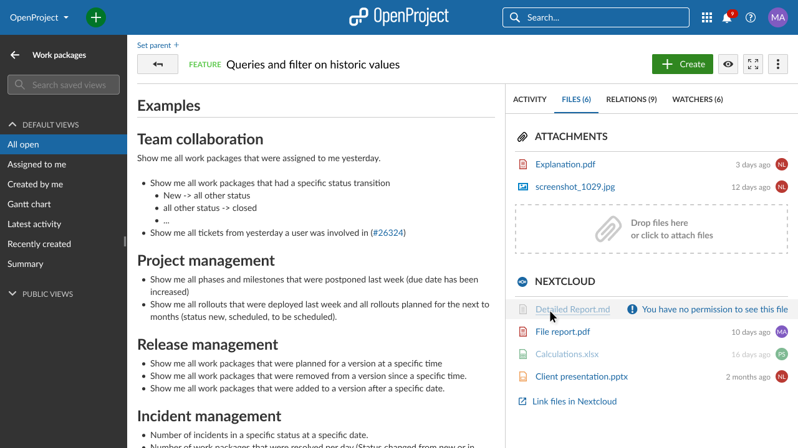

#### User not logged in to Nextcloud

If you see the words "Login to Nextcloud" where you would normally see a list of linked files in in the Files tab in OpenProject, it is because you have logged out of (or have been automatically logged out of) Nextcloud. Alternatively, you could be logged in with a different account than the one you set up to use with OpenProject. 

In this case, you will still be able to see the list of linked files, but not perform any actions. To restore full functionality, simply log back in to your Nextcloud account.

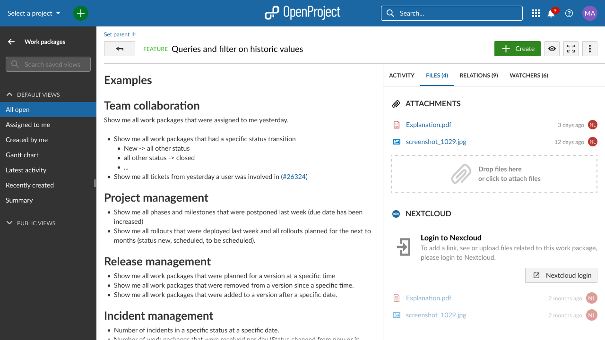

#### Connection error

If you see the words "No Nextcloud connection" in the Files tab in OpenProject, your OpenProject instance is having trouble connecting to your Nextcloud instance. This could be due to a number of different reasons. Your best course of action is to get in touch with the administrator of your OpenProject and Nextcloud instances to identify and to resolve the issue.

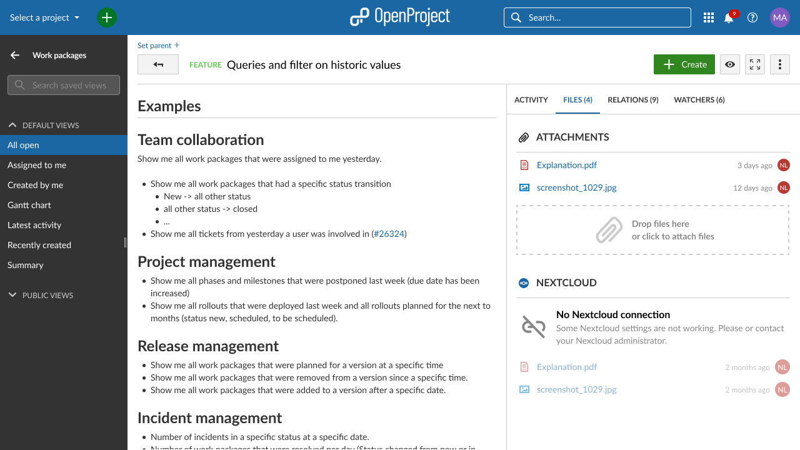

#### File fetching error

In rare occasions, it is possible for the integration to not be able to fetch all the details of all linked files. A simple page refresh should solve the issue. Should the error persist, please contact administrator of your OpenProject and Nextcloud instances.

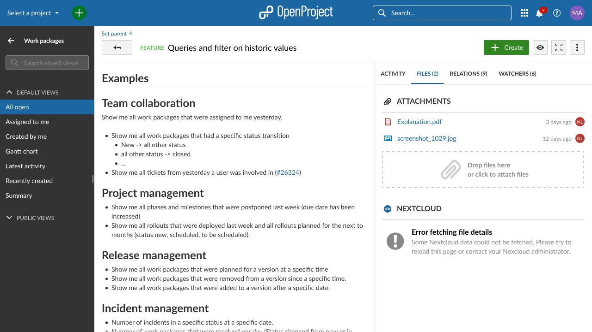

#### Project notifications are not displayed in Nextcloud

If OpenProject notifications are not properly displayed in Nextcloud, navigate to *Nextcloud settings → Basic settings → Background jobs* and ensure that _Cron_ is selected.

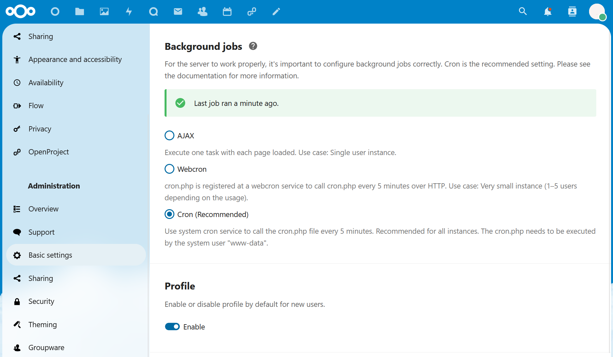
