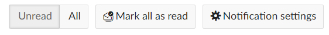

---
sidebar_navigation:
  title: In-app Notifications
  priority: 990
description: Notifications
robots: index, follow
keywords: notifications
---
# In-App Notifications

This section will introduce in-app notifications and explain how to work with them. 

## Overview of In-App Notifications in OpenProject

In-app notifications are a tool to get notified about requests, changes and new assignments in OpenProject. The notifications can work as an alternative to email notification, or be used in parallel. This feature is enabled by default.

## Accessing In-App Notifications

Whenever you are getting in-app notification, a red elliptical with the number of notifications is displayed on the bell symbol on the upper right side of the OpenProject screen between the module button and the help button. (Please note, if there are more than 99 notifications, the elliptical will simply be red without a number in it )

To view the notifications, please left-click on the bell symbol. Here you can view all notifications, filter for "Unread" or "All" (Read and Unread) notifications, and "Mark all as read". Please note that the "Mark all as read" button only marks notifications that are currently in view. You may have to ultimately press "Mark all as read" multiple times to mark all of your notifications as read if you have a lot of them. The red elliptical will update the number of unread messages in real-time, and eventually disappear when there are no more unread notifications.

## In-App Notifications Settings

To access the in-app notification settings. Please left-click the "Notification settings" button in the upper right side.

In the "Notification settings" you can fine-tune what you are notified about:

- **I am @mentioned**: You can switch notification on/off  when somebody tags you in a comment (i.e. @YOU)
- **Assigned to me or accountable:** You can switch notification on/off when you are either assigned or made accountable for a task, for example.
- **Also notify me for:** Here you can further finetune under what circumstances you would like to be notified, or not:
  - Updates on watched items:
  - New work packages
  - All status changes
  - All date changes
  - All priority changes
  - All new comments

In addition to the in-app notifications, you will also get a once-a-day summary of all notifications by email. To finetune Email Reminders, [click here](../../getting-started/my-account#email-reminders)

___

