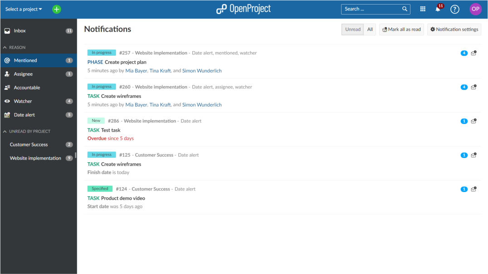
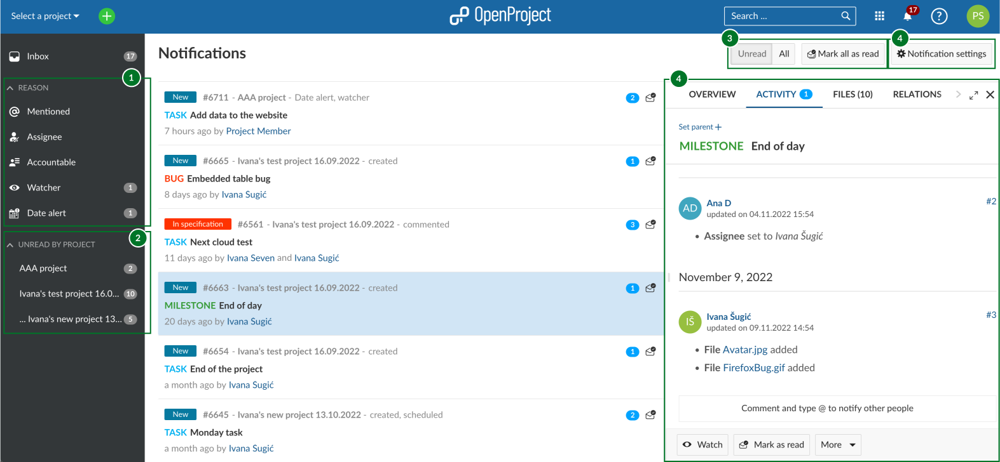
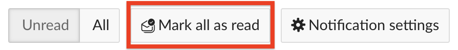

---
sidebar_navigation:
  title: Notifications
  priority: 590
<<<<<<< HEAD
description: In-app notifications in OpenProject
keywords: notifications
=======
description: An over view of how in-app notifications work in OpenProject and how to manage them.
keywords: notifications, alert, activity, updates
>>>>>>> e3ea00ec0acf8e00d05bfa0e5901527320d5d26f
---
# In-app notifications

This page will explain how in-app notifications work and how to use them.

| Topic                                                        | Description                                                  |
| ------------------------------------------------------------ | :----------------------------------------------------------- |
| [An overview of in-app notifications](#an-overview-of-in-app-notifications) | What notifications are and how they work in OpenProject      |
| [Access in-app notifications](#access-in-app-notifications)  | How to view your notifications and find the relevant update  |
| [Manage notifications](#manage-notifications)                | How to filter notifications and set your notification preferences |
| [Mark notifications as read](#mark-notifications-as-read)    | How to mark notifications as read                            |
| [Notifications outside of Notification Center](#notifications-outside-of-notification-center) | How to tell when there are unread notifications for a work package you are viewing |

<<<<<<< HEAD
In-app notifications are a tool to get notified about requests, changes and new assignments in OpenProject. The notifications can work as an alternative to email notification, or be used in parallel. This feature is enabled by default.

<video src="https://openproject-docs.s3.eu-central-1.amazonaws.com/videos/OpenProject-In-app-notifications.mp4" type="video/mp4" controls="" style="width:100%"></video>

## Accessing in-app notifications
=======
## An overview of in-app notifications

With in-app notifications, you will be notified about important changes that are relevant to you, whether they are new comments that mention you, updates to status, type or dates or new assignments. The in-app notifications can work as an alternative to email notifications or be used in parallel. This feature is enabled by default.

<video src="https://openproject-docs.s3.eu-central-1.amazonaws.com/videos/OpenProject-In-app-notifications.mp4" type="video/mp4" controls="" style="width:100%"></video>
>>>>>>> e3ea00ec0acf8e00d05bfa0e5901527320d5d26f

## Access in-app notifications

When there are notifications that require your attention, you will see a red badge on the notification bell icon on the right edge of the top header. The number on the badge indicates the number of total unread notifications (up to 99, after which the badge will simply indicate "99+").

To view the notifications, click on this bell icon. 

This will take you to **Notification center**. 

Each row in Notification center is a work package that has generated a notification. It is possible that you have received multiple notifications for the same work package (if, for example, the date of a work package you are watching was changed by one person and then the status later change by another, that would generate two notifications). A blue badge on the right edge of each row displays the number of unread notifications concerning that particular work package.

The work packages are listed in order of freshness. The work packages on top of the list have the "newest" notifications. This means if there is a new update to a work package that was further down in your notification list, it will be moved to the top since that is now the newest notification.

You can **click on a notification row** to view the Activity tab of that work package in split screen:

The activity tab will auto-scroll to the last event that generated a notification. 

<<<<<<< HEAD
1. You can filter by your **involvement**, for example filter for notifications that originated from mentions (@mentioned), from work packages you were assigned to or were accountable for or are simply watching.
=======
> **Info:** Not all work package activity generate notifications. For example, if you received a notification because you were mentioned, there might be other activities on that work package after that, even though the *Activity* tab will auto-scroll to highlight the mention when you click on the notification, since the mention was originally what triggered the notification.
>>>>>>> e3ea00ec0acf8e00d05bfa0e5901527320d5d26f

## Manage notifications

<<<<<<< HEAD
3. You can also filter notifications for **Unread** or **All** (Read and Unread) notifications. There you can also mark all messages as read.

4. The [**Notification settings**](./notification-settings) button will bring you to your personal notification settings to configure your notification preferences.
=======
This section explains the various ways that Notification center lets you manage your notifications.

>>>>>>> e3ea00ec0acf8e00d05bfa0e5901527320d5d26f

You can filter or group notifications by using the two sets of predefined filters on the left-hand menu:

<<<<<<< HEAD
In addition to the in-app notifications, you will also get a once-a-day summary of all notifications by email. To fine-tune Email Reminders, [click here](../../getting-started/my-account/#email-reminders).

## Mark in-app notifications as read

To mark in-app notifications as read, there are several options in the notification center:

- To mark a notification as read, click on the envelope icon on the right side of the message line. Please note that if there are several updates to one work package, the blue bubble displays the total number of updates. The **Mark as read** icon next to a work package will mark all updates of a work package as read.

- You can also use the **Mark as Read** button at the bottom of the split-screen view of a work package in the notification center to mark a single message as read.

   

- Also, you can set the notifications as read in the work package full screen view by clicking on the envelope icon in the upper right corner of the details view.

- To mark all messages as read click on the **Mark all as read** button in the header navigation of the notification center. Please note that the **Mark all as read** button only marks notifications as read that are currently in view. You may have to ultimately press **Mark all as read** multiple times to mark all of your notifications as read if you have a lot of them. The red elliptical will update the number of unread messages in real-time, and eventually disappears when there are no more unread notifications.

  

## In-app notifications outside the notification center

Besides controlling all your notifications in the notification center, the in-app notifications are also visible in the a work packages module. If a work package has some notification related with it, the total count of notifications will be displayed in the Activity tab. 

In the work packages module you can also perform the individual mark as read actions as explained above:

- In the split screen view of the work package, you can mark all notifications of a work package as read in the bottom bar:

  

- In the work package full screen view, the action to mark all the notifications of a work package as read is placed in the header bar of the work package: 

  
=======
1. You can filter by the **reason** (area 1) you were notified: because you were mentioned (*@mention*), because you are either the assignee or accountable for that work package, because it concerns a work package you are watching or because you have an active date alert.
2. You can filter by **project** (area 2), for example to filter for notifications that originated from a specific project.

You can also affect which notifications are visible on the screen (area 3): 

- You can also choose to view either only **Unread** notification or **All**, which will also display notifications previously marked as read.
- You can also **Mark all as read** if you want to clean your notification inbox in one click.

> **Info:** The **Mark all as read** button clears all _visible_ notification rows. If you have a very large number unread notifications, the oldest ones might not be visible on the page. In this case, you might have to click the button multiple times to clear your inbox completely.

If you would like to view your current notification preferences or modify them, click on the [**Notification settings**](./notification-settings) button (area 4). You can also access your settings via your Avatar in the top right corner > *My account* > *Notification settings*.

The split screen view (area 5) lets you not only view work package activity as previously described, but also lets you access all other work package tabs, including overview, files, relations and watchers.

In addition to the in-app notifications, you will also get a once-a-day summary of all notifications by email. To learn more about Email reminders, [click here](../../getting-started/my-account/#email-reminders).

## Mark notifications as read

Click on the **Mark as read** button represented by the envelope icon on the right side of the notification row. This will mark all the notifications for that work package (indicated by the number on the blue badge) as read.

- You can also use the **Mark as Read** button at the bottom of the split-screen view of a work package to achieve the same result.

  

- Additionally, you can mark notifications as read in the work package full screen view by clicking on the envelope icon in the upper right corner of the details view.

## 

## Notifications outside of Notification Center

In-app notifications are also visible directly on work packages, in both full screen and in split-screen views. If there are unread notifications related to the currently-open work package, a small blue badge next to the Activity tab will display indicate this, along with the number of unread notifications.

> **Info:** This number does not include notifications concerning **Date alerts**.
>>>>>>> e3ea00ec0acf8e00d05bfa0e5901527320d5d26f
