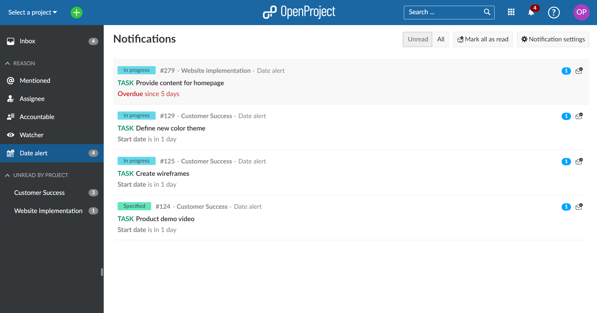
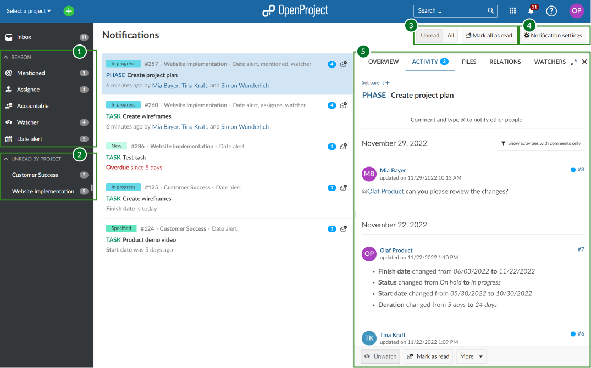
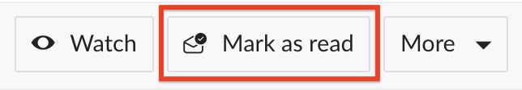
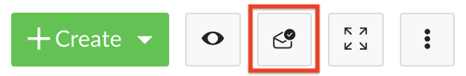
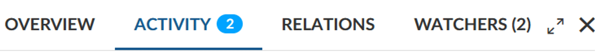

---
sidebar_navigation:
  title: Notifications
  priority: 590
description: An over view of how in-app notifications work in OpenProject and how to manage them.
keywords: notifications, alert, activity, updates
---
# Notifications

This page will explain how in-app notifications work and how to use them.

| Topic                                                        | Description                                                  |
| ------------------------------------------------------------ | :----------------------------------------------------------- |
| [An overview of in-app notifications](#an-overview-of-in-app-notifications) | What notifications are and how they work in OpenProject      |
| [Access in-app notifications](#access-in-app-notifications)  | How to view your notifications and find the relevant update  |
| [Manage notifications](#manage-notifications)                | How to filter notifications and set your notification preferences |
| [Mark notifications as read](#mark-notifications-as-read)    | How to mark notifications as read                            |
| [Notifications outside of Notification Center](#notifications-outside-of-notification-center) | How to tell when there are unread notifications for a work package you are viewing |

## An overview of in-app notifications

With in-app notifications, you will be notified about important changes that are relevant to you, whether they are new comments that mention you, updates to status, type or dates or new assignments. The in-app notifications can work as an alternative to email notifications or be used in parallel. This feature is enabled by default.

<video src="https://openproject-docs.s3.eu-central-1.amazonaws.com/videos/OpenProject-In-app-notifications.mp4" type="video/mp4" controls="" style="width:100%"></video>

## Access in-app notifications

When there are notifications that require your attention, you will see a red badge on the notification bell icon on the right edge of the top header. The number on the badge indicates the number of total unread notifications (up to 99, after which the badge will simply indicate "99+").

To view the notifications, click the bell icon at the top right of the header.  This will take you to **Notification center**.

Each row in Notification center is a work package that has generated a notification. It is possible that you have received multiple notifications for the same work package (if, for example, the date of a work package you are watching was changed by one person and then the status later change by another, that would generate two notifications). A blue badge on the right edge of each row displays the number of unread notifications concerning that particular work package.

The work packages are listed in order of freshness. The work packages on top of the list have the "newest" notifications. This means if there is a new update to a work package that was further down in your notification list, it will be moved to the top since that is now the newest notification.

## Manage notifications

Click on a notification to open the Activity tab of this work package in split screen. If you double click on a notification, it will open the full view of a work package. The Activity tab will auto-scroll to the last event that generated a notification.

> **Info:** Not all work package activity generate notifications. For example, if you received a notification because you were mentioned, there might be other activities on that work package after that, even though the *Activity* tab will auto-scroll to highlight the mention when you click on the notification, since the mention was originally what triggered the notification.

You can filter or group notifications by using the two sets of predefined filters on the left-hand menu:

(Area 1) You can filter by the **reason** you were notified: because you were mentioned (*@mention*), because you are either the assignee or accountable for that work package, because it concerns a work package you are watching or because you have an active date alert.

(Area 2) You can filter by **project** (area 2), for example to filter for notifications that originated from a specific project.

(Area 3) You can also affect which notifications are visible on the screen:

- You can also choose to view either only **Unread** notification or **All**, which will also display notifications previously marked as read.
- You can also **Mark all as read** if you want to clean your notification inbox in one click.

> **Info:** The **Mark all as read** button clears all _visible_ notification rows. If you have a very large number unread notifications, the oldest ones might not be visible on the page. In this case, you might have to click the button multiple times to clear your inbox completely.

(Area 4) If you would like to view your current notification preferences or modify them, click on the [Notification settings](./notification-settings) button. You can also access your settings via your Avatar in the top right corner > *My account* > *Notification settings*.

(Area 5) The split screen view lets you not only view work package activity as previously described, but also lets you access all other work package tabs, including overview, files, relations and watchers.

In addition to the in-app notifications, you will also get a once-a-day summary of all notifications by email. To learn more about Email reminders, [click here](../../getting-started/my-account/#email-reminders).

## Mark notifications as read

Click on the **Mark as read** button represented by the envelope icon on the right side of the notification row. This will mark all the notifications for that work package (indicated by the number on the blue badge) as read.

- You can also use the **Mark as Read** button at the bottom of the split-screen view of a work package to achieve the same result.

  

- Additionally, you can mark notifications as read in the work package full screen view by clicking on the envelope icon in the upper right corner of the details view.

## Notifications outside of Notification Center

In-app notifications are also visible directly on work packages, in both full screen and in split-screen views. If there are unread notifications related to the currently-open work package, a small blue badge next to the Activity tab will display indicate this, along with the number of unread notifications.

> **Info:** This number does not include notifications concerning **Date alerts**.
