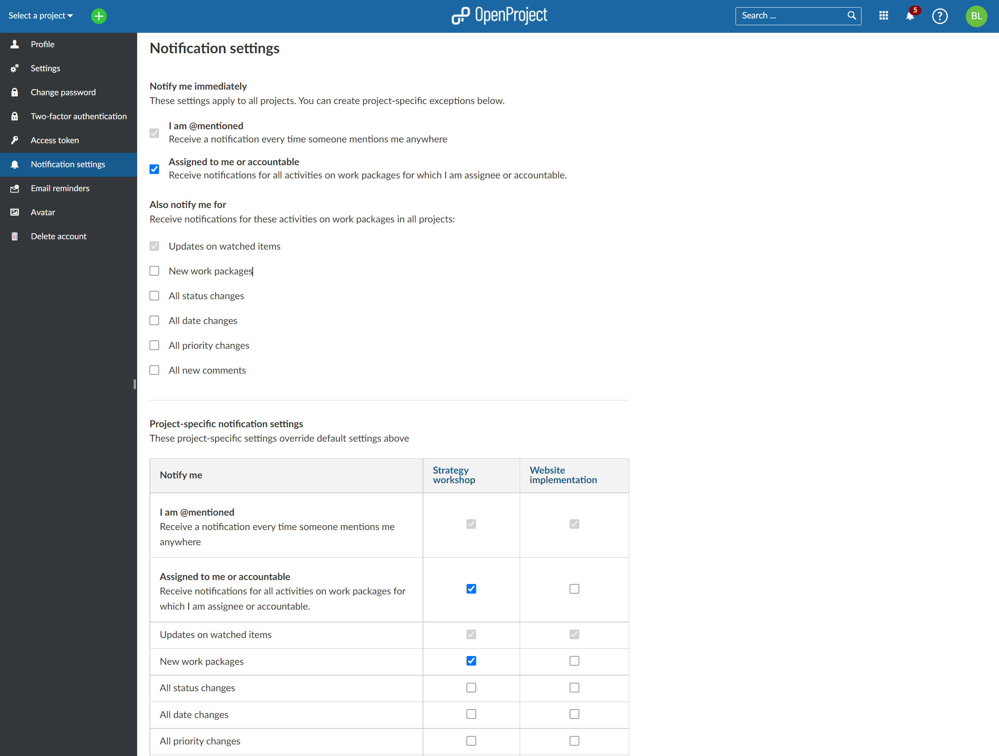

---
sidebar_navigation:
  title: Notifications settings
  priority: 580
description: In-app notification settings in OpenProject
robots: index, follow
keywords: notifications settings
---
## Notification settings

To access the in-app notification settings. Please left-click the **Notification settings** button in the upper right side of the [notification center](../notifications) or navigate via **My account > Notification settings**.

In the **Notification settings** you can fine-tune what you are notified about:

- **I am @mentioned**: You can switch notification on/off  when somebody tags you in a comment (i.e. @YOU)
- **Assigned to me or accountable:** You can switch notification on/off when you are either assigned or made accountable for a task, for example.
- **Also notify me for:** Here you can further finetune under what circumstances you would like to be notified, or not:
  - Updates on watched items:
  - New work packages
  - All status changes
  - All date changes
  - All priority changes
  - All new comments

When someone [mentions](../../user-guide/work-packages/edit-work-package/#-notification-mention) you (@xxx) in e.g. a work package description or comment you will receive an in-app notification.

Additionally, you can also add **project specific notification settings** by clicking on the link **Add settings for project**.

By default you do not receive any notifications about your own changes. In addition to the in-app notifications, you will also get a once-a-day summary of all notifications as **[Email reminders](../../../getting-started/my-account#email-reminders)**.
