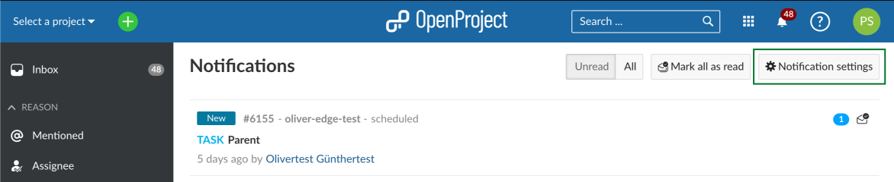
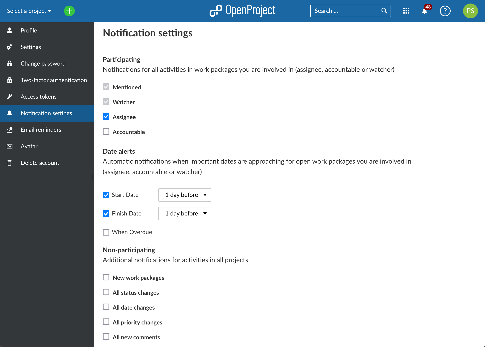
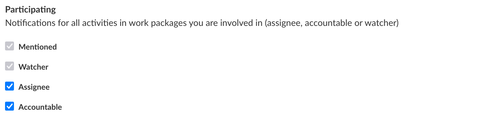
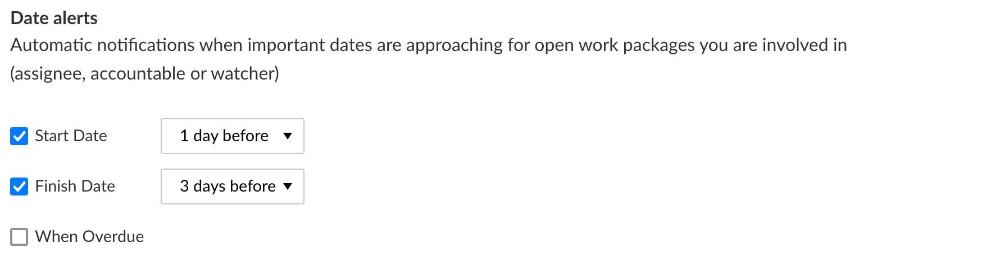
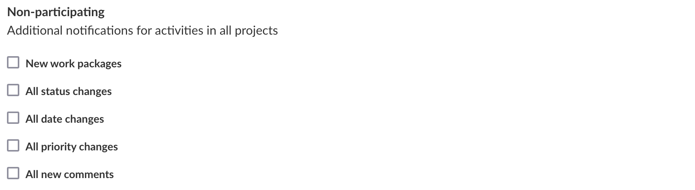
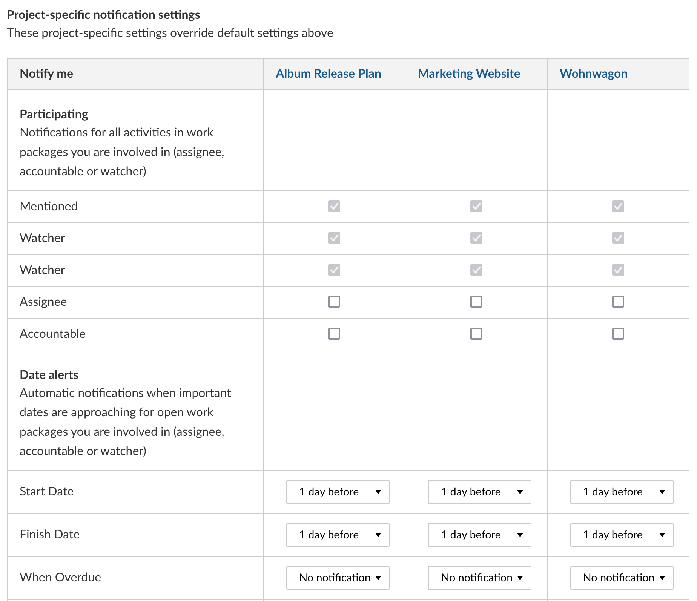

---
sidebar_navigation:
  title: Notifications settings
  priority: 580
description: In-app notification settings in OpenProject
keywords: notifications settings
---
# Notification settings

You can configure how and for what events you wish to be notified through Notifications. To access these settings, you can either click on your avatar on the top right corner > *My account* > *Notification settings* or click on **Notification settings** on the top right corner of the Notifications center.

Notification settings are divided into four sections:

| Topic                                               | Description                                                                                                                          |
|-----------------------------------------------------|:-------------------------------------------------------------------------------------------------------------------------------------|
| [Participating](#participating)                     | Be notified of activities on some or all of the work packages in which you are participating (as assignee, responsible or watcher).  |
| [Date alerts](#date-alerts-enterprise-add-on)       | Be notified of approaching start or end dates, and when things are overdue.                                                          |
| [Non-participating](#non-participating)             | Be notified of activities on work packages in which you are not participating.                                                       |
| [Project-specific](#project-specific-notifications) | Fine-tune your notification settings at the level of individual projects.                                                            |

## Participating

You participate in a work package by either being [mentioned](../../work-packages/edit-work-package/#-notification-mention), by watching it (being on the _Watchers_ list) or by being designated assignee or accountable.

By default, you will be notified of all activities in work packages in which you participate. However, you can choose to change these settings for work packages for which you are an assignee or accountable by checking or unchecking these options:

You cannot disable notifications for when you are mentioned since the goal of mentioning you is to get your attention. If you no longer wish to receive notifications for certain work packages you are watching, you can simply unwatch them.

> **Info**: Modifying these settings may cause you to miss updates and changes that are relevant to you. We do not recommend changing them unless you are absolutely certain of the consequences.

## Date alerts (Enterprise add-on)

Starting with 12.4, OpenProject offers notification for date alerts.

> **Note**: Date alerts are an Enterprise add-on and can only be used with [Enterprise cloud](../../../enterprise-guide/enterprise-cloud-guide/) or [Enterprise on-premises](../../../enterprise-guide/enterprise-on-premises-guide/). An upgrade from the free Community edition is easy and helps support OpenProject.

Date alerts allow you to receive a notification when a start date or a finish date is approaching for a work package you are participating in (that is, for which you are assignee, accountable or a watcher).

For **start** and **finish dates**, you can choose to be alerted the same day, 1 day before, 3 days before or a week before.

> **Info:** Please note that these are natural days and not working days. For a work package starting on a Monday, "3 days before" would be Friday.
> Date alerts are generated once a day at 1am local time.
> Please note that when you activate a date alert, work packages that are due earlier than the duration selected will not generate notifications (for example, if you choose to be notified "3 days before" the finish date, work packages that are due in 2 days at that point in time will not generate a date alert.

For **overdue dates**, you can also choose to receive a recurring notification (every day, every 3 days or every week).

> **Info:** A previously unread notification for an overdue date alert is marked as read and replaced by a new one with the updated due date (for example, if you choose to be alerted every day for an overdue work package, and ignore that alert for a week, you will still see only one notification for this work package). You can stop receiving these alerts by either unchecking this option, or changing or removing the dates of the work package.

Date alerts notifications appear in [Notification center](../#access-in-app-notifications), both in the _Inbox_ and the separate _Date alerts_ sections on the left menu.

## Non-participating

You can also chose to receive additional notifications for specific events in all projects concerning work packages in which you are not participating.

You can be notified of:

- New work packages
- Status changes
- Date changes
- Priority changes
- New comments

> **Info:** Please note that these apply to _all_ work packages in _all_ of your projects. If you enable many of them, you may receive too many irrelevant notifications. Please use this feature with parsimony.

## Project-specific notifications

In some cases, you may wish to fine-tune your notification settings at a project-level.

This might be because you are more active in certain projects than others or because certain activities (like date alerts or the creation of new work packages) might be more important to you than others.

To add project-specific notification settings, first click on **+ Add setting for project** and select a project.

Once you do so, you will see a table with a column for that project and and the same three sections (Participating, Date alerts, Non-participating) as your overall notification settings. You can now select and unselect any number of options from this list for more specific project-level notification settings.

> **Info**: These project-specific settings will override any global settings above. You can use these settings if you find that you receive too many or not enough notifications for a particular project.

## Email reminders

You can supplement these in-app notifications with email reminders, either at specific times of the day or immediately when someone mentions you. For more information, please read our guide on [Email reminders](../../../user-guide/my-account#email-reminders).
